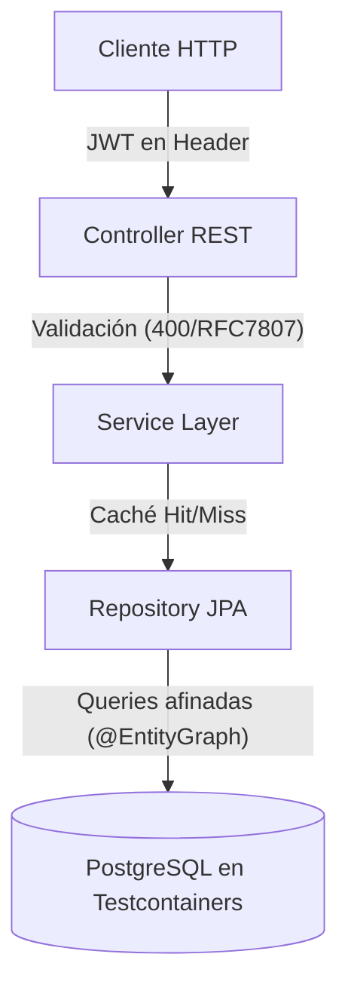

# Bloque XXIV · Boss Final (la API corporativa completa)

> Aquí no se aprende nada nuevo: se DEMUESTRA todo. Cada decisión de este bloque
> —UUID, EntityGraph, @Version, ProblemDetail, JWT, MDC, Testcontainers— es un
> bloque anterior puesto a trabajar junto a los demás. Si Spring te parecía magia
> en el b04, al cerrar este bloque te parecerá ingeniería.

## Cómo usar este documento

Igual que en todos los bloques: lee UNA sección → haz SU ejercicio → vuelve. Este
bloque tiene solo dos ejercicios, pero cada uno es un MONSTRUO de 10 retos que
recorre medio bootcamp. Cada sección cierra con el recuadro **"Lo practicas en…"**.

| Sección | Tema | Ejercicio |
|---|---|---|
| 24.1 | Núcleo: dominio JPA, consultas afinadas, validación e errores RFC 7807 | `Ej199TaskTrackerCoreApi` |
| 24.2 | Producción: seguridad JWT, observabilidad (MDC/Actuator) y Testcontainers | `Ej200TaskTrackerSecuredObservable` |

El dominio que construyes es un **Gestor de Proyectos y Tareas**: un `Proyecto`
tiene muchas `Tarea`s. Todo gira en torno a ese par.



---

## 24.1 El núcleo: dominio, persistencia, validación y errores

Este ejercicio es el fundamento sin fisuras de la API. Lo desglosamos en las
piezas que los retos van tocando una a una.

### Claves primarias con UUID

Las entidades NO usan `id` autoincremental secuencial, sino **UUID** aleatorios:

```java
@Entity
public class Proyecto {
    @Id @GeneratedValue
    private UUID id;            // aleatorio, no 1,2,3...
    @NotBlank private String nombre;
}
```

¿Por qué? Un id secuencial revela cuántas filas hay y permite **enumerar** recursos
(`/proyectos/1`, `/proyectos/2`…), que es el ataque IDOR que verás en seguridad. Un
UUID v4 es impredecible. El formato canónico es `8-4-4-4-12` hexadecimal:
`d3b07384-d113-4956-bc7e-aa3000b21234`. Validarlo es tan simple como una regex o un
`UUID.fromString(...)` envuelto en try/catch.

### La relación `@OneToMany` con `orphanRemoval`

```java
@OneToMany(mappedBy = "proyecto",
           cascade = CascadeType.ALL,
           orphanRemoval = true)
private List<Tarea> tareas = new ArrayList<>();
```

Tres palabras clave que cambian el comportamiento:

| Atributo | Qué hace |
|---|---|
| `mappedBy = "proyecto"` | El dueño de la FK es `Tarea`; `Proyecto` solo refleja |
| `cascade = ALL` | Guardar/borrar el proyecto propaga a sus tareas |
| `orphanRemoval = true` | Sacar una tarea de la lista la BORRA de la BD |

`orphanRemoval=true` es lo que convierte la relación en una **composición** (la tarea
no existe sin su proyecto), frente a una agregación. Si lo olvidas, quitar una tarea
de la lista solo la desvincula y queda huérfana en la tabla.

### El problema N+1 y `@EntityGraph`

Pides un proyecto y luego recorres sus tareas. Si la relación es perezosa (lazy),
JPA hace **1 consulta** del proyecto y luego **N consultas**, una por tarea: el temido
problema N+1 que satura la red (ya lo viste en el b21).

```java
public interface ProyectoRepository extends JpaRepository<Proyecto, UUID> {
    @EntityGraph(attributePaths = {"tareas"})   // fuerza LEFT JOIN
    Optional<Proyecto> findById(UUID id);
}
```

`@EntityGraph(attributePaths = {"tareas"})` le dice a JPA que traiga el proyecto Y sus
tareas en **una sola** consulta con un `LEFT OUTER JOIN`. Es la solución declarativa al
N+1, sin escribir el JPQL a mano.

### Paginación acotada (Pageable)

Nunca devuelvas "todas las filas". Un controlador serio recibe `Pageable` y **capa el
tamaño**:

```java
@GetMapping("/proyectos")
public Page<ProyectoDto> listar(@PageableDefault(size = 20) Pageable pageable) { ... }
```

Sin tope, una petición `?size=1000000` cargaría un millón de filas en memoria: es un
DoS trivial. La regla del bloque: `page >= 0` y `1 <= size <= 100`.

### Bloqueo optimista con `@Version`

Dos usuarios editan el mismo proyecto a la vez. Sin protección, el segundo pisa al
primero (lost update). La solución sin bloquear filas:

```java
@Entity
public class Proyecto {
    @Version private Long version;   // Hibernate la incrementa en cada UPDATE
}
```

Hibernate añade `WHERE version = ?` a cada `UPDATE`. Si la versión que tú leíste ya no
coincide con la de la BD (otro la cambió), lanza `OptimisticLockException` → tu handler
la traduce a **HTTP 409 Conflict**. Detectar la colisión es comparar versiones: si la
versión actual de BD difiere de la tuya, hay conflicto.

### Errores centralizados con ProblemDetail (RFC 7807)

Todos los errores se capturan en UN sitio y salen con un formato único y estándar:

```java
@RestControllerAdvice
class GlobalExceptionHandler {
    @ExceptionHandler(EntityNotFoundException.class)
    public ProblemDetail handleNotFound(EntityNotFoundException ex) {
        ProblemDetail problem = ProblemDetail.forStatusAndDetail(HttpStatus.NOT_FOUND, ex.getMessage());
        problem.setTitle("Recurso no encontrado");
        problem.setProperty("timestamp", Instant.now());
        return problem;
    }
}
```

RFC 7807 estandariza el cuerpo de error: `{"title": ..., "status": ..., "detail": ...}`.
El cliente siempre sabe dónde mirar, sea cual sea el endpoint que falló.

### Mapeo DTO ↔ Entidad e idempotencia HTTP

Nunca expongas la entidad JPA directamente: mapea a un **DTO** (un record, b01) en la
frontera. Y respeta la semántica HTTP: **PUT** reemplaza el recurso entero y es
*idempotente* (repetirlo deja el mismo estado); **PATCH** modifica parcialmente y NO lo
es. Verbos idempotentes: `GET`, `PUT`, `DELETE`. No idempotentes: `POST`, `PATCH`.

### Validación cross-field

`@NotNull` valida un campo aislado. Pero "si la tarea está COMPLETADA, debe tener
fechaResolucion" cruza DOS campos: eso va en un validador **a nivel de clase**
(`ConstraintValidator`, b08), no en una anotación de campo.

> **Lo practicas en `Ej199TaskTrackerCoreApi`**: validación de UUID, lectura de
> `orphanRemoval`/`@EntityGraph`, paginación acotada, detección de colisión de
> versiones, generación de ProblemDetail, mapeo a DTO, idempotencia y reglas
> cross-field. Los 10 retos son funciones puras que modelan cada decisión anterior.

---

## 24.2 Producción: seguridad, observabilidad y testing real

Una API no está terminada cuando funciona en tu máquina, sino cuando es
**enterprise-grade**. Este ejercicio cubre las tres patas que faltan.

### Seguridad de cero confianza (JWT stateless)

Todos los endpoints bloqueados por defecto. Un filtro `OncePerRequestFilter` lee el
token JWT de la cabecera `Authorization: Bearer <token>`, lo valida y monta el contexto
de seguridad. Sin sesión en servidor (*stateless*): el token lo lleva todo.

Un JWT real son tres segmentos `base64url` separados por puntos (`header.payload.firma`).
Los *claims* (incluido el rol) viajan **codificados en Base64**, no en claro: para leer
el rol hay que decodificar primero.

Sobre eso, refuerza la lógica **a nivel de método**, no solo de URL:

```java
@PreAuthorize("hasRole('ADMIN') or @proyectoSecurity.esDueño(#proyectoId, authentication.name)")
public void eliminarProyecto(UUID proyectoId) { ... }
```

Se lee: "pasa si eres ADMIN **o** si eres el dueño del proyecto". El `@proyectoSecurity`
es un bean tuyo que comprueba la propiedad contra la BD.

### CORS robusto (sin comodines)

CORS decide qué orígenes (otras webs) pueden llamar a tu API desde el navegador. La regla
de oro: **lista cerrada de orígenes HTTPS, nunca `*`**.

```java
config.setAllowedOrigins(List.of("https://app.empresa.com"));  // NO "*"
config.setAllowCredentials(true);
```

`allowedOrigins("*")` junto a `allowCredentials(true)` es un agujero clásico: cualquier
web podría llamar a tu API con las cookies del usuario.

### Caché con claves jerárquicas

Lecturas caras (paginación compleja) se cachean con `@Cacheable`; al insertar/borrar,
`@CacheEvict` invalida. La clave usa namespaces estilo Redis con `::`:

```
tasks::project-123::page-1
```

Meter `page-N` en la clave permite cachear cada página por separado y desalojar de forma
selectiva.

### Observabilidad: Actuator + traceId en el MDC

**Actuator** expone el estado de la app: `/actuator/health` (¿viva?, devuelve
`{"status":"UP"}`) y `/actuator/prometheus` (métricas). Kubernetes y los balanceadores
consultan `health` para decidir si te mandan tráfico.

**Trazabilidad**: inyecta un ID de correlación en cada petición y mételo en el *Mapped
Diagnostic Context* (MDC) de SLF4J:

```java
String traceId = UUID.randomUUID().toString();
MDC.put("traceId", traceId);
try {
    filterChain.doFilter(request, response);
} finally {
    MDC.remove("traceId");      // SIEMPRE limpiar: el hilo se reutiliza
}
```

Así, TODAS las líneas de log de esa petición comparten el mismo `traceId`. En
Kibana/Datadog filtras por él y reconstruyes la petición entera de punta a punta. El
`finally` es crítico: los hilos del pool se reutilizan, y un MDC sin limpiar contamina
la siguiente petición.

### Testing E2E con Testcontainers

Se acabó probar contra H2 en memoria: H2 no se comporta como PostgreSQL en lo específico.
Testcontainers levanta un **PostgreSQL real en Docker** al inicio de la suite y lo destruye
al final.

```java
@SpringBootTest(webEnvironment = SpringBootTest.WebEnvironment.RANDOM_PORT)
@AutoConfigureMockMvc
@Testcontainers
class TaskTrackerIntegrationTest {

    @Container
    static PostgreSQLContainer<?> postgres = new PostgreSQLContainer<>("postgres:15-alpine");

    @DynamicPropertySource
    static void setProperties(DynamicPropertyRegistry registry) {
        registry.add("spring.datasource.url", postgres::getJdbcUrl);
        registry.add("spring.datasource.username", postgres::getUsername);
        registry.add("spring.datasource.password", postgres::getPassword);
    }
}
```

Dos detalles que tocan los retos:

- La URL JDBC mágica de Testcontainers empieza por `jdbc:tc:postgresql` (el `tc` es de
  TestContainers): arranca el contenedor al abrir la conexión.
- Con `testcontainers.reuse.enable=true` el contenedor NO se destruye entre ejecuciones
  (ahorra arranque en local). En CI se deja en `false`.

### Calidad como gate (Checkstyle/Sonar)

El pipeline (b23) falla el build si Checkstyle encuentra violaciones. Su salida canónica
es `checkstyle-result.xml`, que Sonar importa para su panel.

> **Lo practicas en `Ej200TaskTrackerSecuredObservable`**: decodificar un rol de un JWT,
> la lógica "ADMIN o dueño" del `@PreAuthorize`, validar orígenes CORS, claves de caché,
> el `health` de Actuator, el formato del traceId, las URLs `jdbc:tc:`, el flag de reuso
> de Testcontainers y el nombre canónico de la clase Spring Boot.

---

## Errores comunes del bloque

| # | Error | Antídoto |
|---|---|---|
| 1 | Validar UUID con `contains` de hex en vez del patrón con guiones | Regex `8-4-4-4-12` o `UUID.fromString` en try/catch; el test pasa un UUID SIN guiones y exige false |
| 2 | Buscar `orphanRemoval` sin exigir `=true` | Normaliza espacios + minúsculas y comprueba `orphanremoval=true` (el test trae espacios) |
| 3 | `contains("Graph")` para detectar EntityGraph | `endsWith("EntityGraph")`: cubre el nombre simple y el calificado, rechaza "Query" |
| 4 | Permitir `size = 0` o `size > 100` | Rango `1..100` inclusive y `page >= 0` |
| 5 | Comparar versiones `Long` con `!=` | Usa `.equals`; con `!=` comparas referencias (autoboxing) — y `null` actual cuenta como colisión |
| 6 | ProblemDetail con espacios tras `:` | El test busca `"status":404` literal sin espacios; `titulo` null → exactamente `"{}"` |
| 7 | Tratar PATCH/POST como idempotentes | Solo GET, PUT y DELETE lo son |
| 8 | Cross-field: dar true a "COMPLETADA" sin fecha o con fecha futura | COMPLETADA exige fecha no nula y no futura; `estado` null → false |
| 9 | Buscar "ROLE_ADMIN" en el JWT crudo | El rol va en Base64: decodifica el payload y luego `contains` |
| 10 | No limpiar el MDC en `finally` | El hilo se reutiliza: `MDC.remove` siempre, o contaminas la siguiente petición |

## Chuleta final del bloque

```
UUID         = clave aleatoria · patrón 8-4-4-4-12 hex · evita enumeración (IDOR)
@OneToMany   = mappedBy (dueño FK) · cascade=ALL · orphanRemoval=true (composición)
@EntityGraph = attributePaths={"tareas"} → LEFT JOIN → mata el N+1
Pageable     = capa el size (1..100) · page>=0 · sin tope = DoS de memoria
@Version     = bloqueo optimista · versión distinta = colisión → 409 Conflict
ProblemDetail= RFC 7807 · {"title","status","detail"} · formato único de error
Idempotente  = GET, PUT, DELETE sí · POST, PATCH no
cross-field  = regla que cruza 2 campos → ConstraintValidator de CLASE
JWT          = Bearer + payload base64url · stateless · rol viaja CODIFICADO
@PreAuthorize= "hasRole('ADMIN') or esDueño(#id)" · seguridad a nivel de método
CORS         = lista cerrada HTTPS · jamás "*" con credentials
MDC          = MDC.put(traceId) en filtro · MDC.remove en finally SIEMPRE
Actuator     = /health ("UP") · /prometheus (métricas) · probes de K8s
Testcontainers= PostgreSQL real en Docker · jdbc:tc:postgresql · reuse.enable
```

## Autoevaluación (responde sin mirar; si fallas 2+, relee la sección)

1. ¿Por qué un UUID aleatorio es más seguro que un id autoincremental como clave
   primaria expuesta en la URL? *(24.1)*
2. ¿Qué diferencia hay entre `cascade=ALL` y `orphanRemoval=true`? *(24.1)*
3. ¿Qué problema resuelve `@EntityGraph(attributePaths={"tareas"})` y cómo lo hace por
   debajo? *(24.1)*
4. ¿Por qué hay que comparar versiones `@Version` con `.equals` y no con `!=`? *(24.1)*
5. ¿Qué tres campos lleva un ProblemDetail RFC 7807 y cuáles van entrecomillados? *(24.1)*
6. ¿Por qué PATCH no es idempotente pero PUT sí? *(24.1)*
7. ¿Por qué no puedes buscar "ROLE_ADMIN" directamente en el string del JWT? *(24.2)*
8. ¿Qué pasa si olvidas el `MDC.remove("traceId")` en el `finally` del filtro? *(24.2)*
