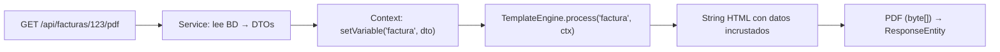
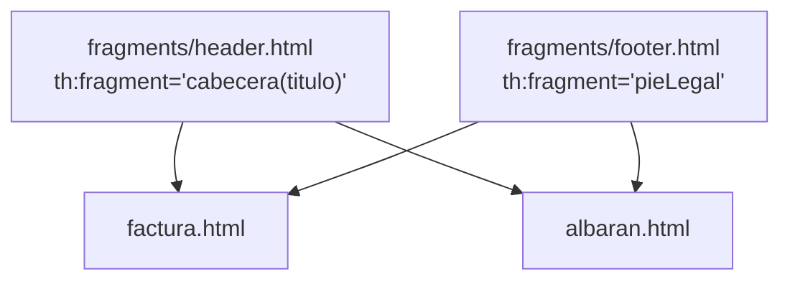
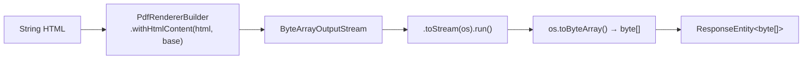

# Bloque XXV · Plantillas dinámicas: facturas y albaranes (Thymeleaf)

> Devolver JSON es el estándar de una API REST. Pero el mundo corporativo te
> pedirá tarde o temprano un **documento legal**: una factura, un albarán, un
> presupuesto en PDF. La API sigue siendo REST; por dentro usa un motor de
> plantillas como una "impresora en memoria" que rellena un HTML y lo convierte
> a PDF. Este es el bloque que cierra el máster: ensamblar ese pipeline.

## Cómo usar este documento

Igual que en todos los bloques: lee UNA sección → haz SU ejercicio → vuelve.
Cada ejercicio aquí son **10 pasos guiados** (`paso01…paso10`) que construyen el
pipeline de extremo a extremo; cada sección de teoría te da el porqué y la API
exacta de esos pasos. Cada sección termina con el recuadro **"Lo practicas en…"**.

> ⚠ Este bloque es **conceptual**: los `pasoNN()` son métodos vacíos con una guía
> en comentarios. No tienes que hacer que Thymeleaf renderice de verdad para que
> el test pase (el test solo comprueba que `ejecutar()` devuelve `true`). El
> valor está en **leer la guía, entender la API y saber escribirla** cuando montes
> el `@RestController` real. Si quieres, descomenta y prueba: las dependencias
> (`spring-boot-starter-thymeleaf`, `openhtmltopdf`) las añades tú al `pom.xml`.

| Sección | Tema | Ejercicio |
|---|---|---|
| 25.1 | El motor Thymeleaf en modo *standalone* | `Ej201ThymeleafStandalone` |
| 25.2 | Variables simples: `th:text`, fechas y dinero | `Ej202VariablesSimplesFactura` |
| 25.3 | Iteraciones y condicionales: tablas de albarán | `Ej203IteracionesCondicionales` |
| 25.4 | Fragmentos reutilizables: cabeceras y pies | `Ej204FragmentosReutilizables` |
| 25.5 | Internacionalización: facturas multi-idioma | `Ej205Internacionalizacion` |
| 25.6 | De HTML a PDF binario para la API | `Ej206HtmlToPdfGenerator` |

---

## 25.1 El motor Thymeleaf en modo *standalone*

Una API REST **no devuelve HTML para que un navegador lo pinte**. Entonces, ¿qué
pinta tiene Thymeleaf aquí? Lo usamos **aislado de la capa web MVC**: no como el
`@Controller` que devuelve el nombre de una vista, sino como un objeto Java que
recibe un mapa de datos y un nombre de plantilla y **devuelve un String**.



La diferencia clave con MVC: en MVC, Spring **inyecta y configura** el
`SpringTemplateEngine` por ti vía autoconfiguración. En *standalone* lo
**montas a mano**, y por eso este ejercicio existe: para que veas las piezas que
normalmente quedan ocultas.

Las cinco piezas que ensamblas:

```java
// 1. El resolver: ¿DÓNDE están las plantillas y qué pinta tienen?
var resolver = new ClassLoaderTemplateResolver();   // busca en el classpath (src/main/resources)
resolver.setPrefix("/templates/");                  // carpeta base
resolver.setSuffix(".html");                        // process("factura") → /templates/factura.html
resolver.setTemplateMode(TemplateMode.HTML);        // modo HTML5
resolver.setCharacterEncoding("UTF-8");             // tildes y € sin romperse
resolver.setCacheable(false);                       // en desarrollo: relee el fichero cada vez

// 2. El motor: orquesta el proceso
var engine = new SpringTemplateEngine();
engine.setTemplateResolver(resolver);               // le enchufas el resolver

// 3. El contexto: los datos de ESTA petición (vacío de momento)
var ctx = new Context();

// 4. Procesar: motor + plantilla + datos → String
String html = engine.process("plantilla", ctx);
```

| Pieza | Clase | Rol |
|---|---|---|
| Resolver | `ClassLoaderTemplateResolver` | localiza la plantilla (prefijo/sufijo/modo) |
| Motor | `SpringTemplateEngine` | procesa la plantilla con un contexto |
| Contexto | `org.thymeleaf.context.Context` | bolsa de variables de una petición |

¿Por qué `ClassLoaderTemplateResolver` y no `FileTemplateResolver`? Porque las
plantillas viven en `src/main/resources/templates/` y deben viajar **dentro del
JAR** al desplegar (bloque 22). El `ClassLoader` las encuentra en el classpath
estés donde estés; una ruta de fichero absoluta se rompería en el contenedor.

> **Lo practicas en `Ej201ThymeleafStandalone`**: montar a mano resolver + motor
> + contexto y procesar una plantilla de prueba sin que salte ninguna excepción.

---

## 25.2 Variables simples: `th:text`, fechas y dinero

El dato que metes en el contexto (`ctx.setVariable("factura", dto)`) se lee en la
plantilla con `${factura.numero}`. El atributo que lo escribe en la página es
`th:text`:

```html
<h2>Factura nº <span th:text="${factura.numero}">000-XYZ</span></h2>
```

El texto `000-XYZ` es un **placeholder de diseño**: lo ves al abrir el HTML
crudo en el navegador, pero Thymeleaf lo **sustituye** por el valor real al
procesar. Esa es la gracia de Thymeleaf frente a JSP: el HTML es válido y
previsualizable aun sin motor.

**`th:text` vs `th:utext` — la decisión de seguridad.** `th:text` **escapa** el
HTML: si el dato es `Acme & Hijos`, escribe `Acme &amp; Hijos` (seguro, evita
inyección). `th:utext` (*unescaped*) lo mete crudo. Regla: **usa siempre
`th:text`**; reserva `th:utext` solo para HTML que TÚ controlas (un texto con
`<strong>` que tú generas), nunca para datos de un cliente.

| Quieres mostrar… | Atributo | Resultado de `Acme & Hijos` |
|---|---|---|
| Texto plano (lo normal) | `th:text` | `Acme &amp; Hijos` (escapado, seguro) |
| HTML que controlas tú | `th:utext` | `Acme & Hijos` (crudo) |

**Fechas y dinero: los objetos de utilidad.** Thymeleaf trae "expression utility
objects" (empiezan por `#`) para formatear sin meter lógica en el DTO:

```html
<!-- Fecha: LocalDate/LocalDateTime → 'dd/MM/yyyy' -->
<p th:text="${#temporals.format(factura.fecha, 'dd/MM/yyyy')}">01/01/2026</p>

<!-- Dinero: 1234.5 → '1.234,50' (formato español) -->
<!-- formatDecimal(num, minEnteros, sepMiles, decimales, sepDecimal) -->
<p th:text="${#numbers.formatDecimal(factura.total, 1, 'POINT', 2, 'COMMA')} + ' €'">1.234,50 €</p>
```

- `#temporals` → tipos de `java.time` (lo que dominaste en el bloque 1).
- `#numbers.formatDecimal(x, 1, 'POINT', 2, 'COMMA')` → mínimo 1 dígito entero,
  punto como separador de miles, 2 decimales, coma decimal: el formato español.

**Nulos en la vista.** Si `factura` es `null`, `${factura.numero}` lanza un error
de evaluación. Defensa: el **operador de navegación segura** `?.`:

```html
<span th:text="${factura?.numero} ?: 'Sin número'">—</span>
```

`${factura?.numero}` devuelve `null` en vez de explotar si `factura` es null, y
el operador Elvis `?:` pone un valor por defecto. Mejor aún: **no metas nulos en
el contexto** — sanea en el Service.

> **Lo practicas en `Ej202VariablesSimplesFactura`**: diseñar el DTO de cabecera,
> cargarlo en el contexto e interpolar número, fecha formateada y total monetario.

---

## 25.3 Iteraciones y condicionales: tablas de albarán

Una factura tiene N líneas. No las escribes a mano: iteras con `th:each`, que
**clona su etiqueta host una vez por elemento**:

```html
<table>
  <thead>
    <tr><th>#</th><th>Concepto</th><th>Cant.</th><th>Precio</th><th>Subtotal</th></tr>
  </thead>
  <tbody>
    <!-- Genera un <tr> por cada línea de la lista -->
    <tr th:each="linea, stat : ${albaran.lineas}"
        th:classappend="${linea.cantidad == 0 ? 'agotado' : ''}">
      <td th:text="${stat.index + 1}">1</td>
      <td th:text="${linea.concepto}">Tornillos</td>
      <td th:text="${linea.cantidad}">50</td>
      <td th:text="${#numbers.formatDecimal(linea.precioUd, 1, 'POINT', 2, 'COMMA')}">1,50</td>
      <td th:text="${#numbers.formatDecimal(linea.subtotal, 1, 'POINT', 2, 'COMMA')}">75,00</td>
    </tr>
  </tbody>
</table>
```

**La variable de estado.** El segundo nombre en `th:each="linea, stat : …"` es el
*iteration status*. Te da metadatos de la iteración sin contadores manuales:

| Propiedad | Qué da |
|---|---|
| `stat.index` | índice base 0 |
| `stat.count` | contador base 1 |
| `stat.size` | total de elementos |
| `stat.first` / `stat.last` | `true` en la primera/última vuelta |
| `stat.even` / `stat.odd` | para pintar filas alternas (cebra) |

**Condicionales.** `th:if` renderiza la etiqueta solo si la condición es cierta;
`th:unless` es su inverso exacto (más legible que `th:if="${!cond}"`):

```html
<div th:if="${albaran.tieneDescuento}">Descuento aplicado: …</div>
<div th:unless="${albaran.tieneDescuento}">Sin descuento aplicado</div>
```

> ⚠ `th:if` **elimina la etiqueta del HTML** si es falso (no la oculta con CSS).
> Si cuentas `<tr>` en el resultado, las filas no renderizadas no aparecen.

**Clases CSS dinámicas.** `th:classappend` **añade** una clase sin borrar las
fijas del `class=""`. Ideal para resaltar filas (`agotado`, `fila-descuento`):

```html
<tr class="fila" th:classappend="${linea.cantidad == 0 ? 'agotado' : ''}">
```

**Regla de oro: la vista no calcula.** Los subtotales, el IVA y el total los
calculas en el **DTO o el Service**, nunca con expresiones aritméticas en el HTML.
La plantilla solo *muestra*. Lógica en la vista = bug invisible y no testeable.

> **Lo practicas en `Ej203IteracionesCondicionales`**: construir la lista de
> líneas, iterarla con `th:each` + `stat`, condicionar con `th:if`/`th:unless` y
> contar las `<tr>` generadas para validar la tabla.

---

## 25.4 Fragmentos reutilizables: cabeceras y pies

Generas facturas, albaranes y presupuestos. Los tres llevan el **mismo logo** y
el **mismo pie legal** (NIF, registro mercantil, IBAN). Copiar y pegar ese HTML
en tres plantillas es la receta para que el día que cambie el IBAN se te olvide
uno. Solución: **fragmentos**.



Defines un fragmento con `th:fragment` (puede recibir parámetros):

```html
<!-- fragments/header.html -->
<header th:fragment="cabecera(titulo)">
  
  <h1 th:text="${titulo}">Documento</h1>
</header>

<!-- fragments/footer.html -->
<footer th:fragment="pieLegal">
  <hr/><p>NIF: B-12345678 · IBAN: ES00 1234 5678 9012</p>
</footer>
```

Y lo invocas con la sintaxis `~{plantilla :: fragmento}`:

```html
<!-- factura.html -->
<div th:replace="~{fragments/header :: cabecera('Factura')}"></div>
...
<div th:insert="~{fragments/footer :: pieLegal}"></div>
```

**`th:replace` vs `th:insert` — la diferencia que confunde a todos:**

| Atributo | Qué hace con la etiqueta host (`<div>`) |
|---|---|
| `th:replace` | la **sustituye** entera por el fragmento (el `<div>` desaparece) |
| `th:insert` | **conserva** el `<div>` y mete el fragmento **dentro** |

Regla: `th:replace` cuando el fragmento ya es semántico (un `<header>`, un
`<footer>` completos); `th:insert` cuando necesitas el contenedor host por su
clase CSS o estructura.

El parámetro (`'Factura'`) sustituye a `titulo` dentro del fragmento: el mismo
header sirve para `cabecera('Factura')` y `cabecera('Albarán')`. **Aislamiento
de cambios**: tocas el NIF en `footer.html` una vez y se actualiza en todos los
documentos a la vez. Esto es exactamente el principio DRY aplicado a plantillas.

> **Lo practicas en `Ej204FragmentosReutilizables`**: definir header y footer con
> `th:fragment`, invocarlos con `th:replace`/`th:insert`, pasar parámetros y
> verificar que el HTML ensamblado contiene logo y pie legal.

---

## 25.5 Internacionalización: facturas multi-idioma

Vendes a Francia y Reino Unido: la misma factura debe decir "Factura" /
"Invoice" / "Facture" según el cliente. No dupliques plantillas: **externaliza
los textos** a ficheros `messages_<locale>.properties` y referéncialos con `#{…}`.

```properties
# messages_es.properties
invoice.title=Factura
invoice.greeting=Estimado cliente {0}

# messages_en.properties
invoice.title=Invoice
invoice.greeting=Dear customer {0}
```

```html
<!-- En la plantilla: # en vez de $ -->
<h1 th:text="#{invoice.title}">Factura</h1>
<p th:text="#{invoice.greeting(${cliente.nombre})}">Estimado cliente …</p>
```

**Las tres sintaxis de expresión que no debes confundir:**

| Sintaxis | Lee de… | Ejemplo |
|---|---|---|
| `${…}` | variables del contexto | `${factura.numero}` |
| `#{…}` | ficheros de mensajes (i18n) | `#{invoice.title}` |
| `@{…}` | URLs (re-escritura de rutas) | `@{/css/style.css}` |

**El idioma lo decide el `Locale` del contexto.** En *standalone* se lo pasas al
construir el `Context`:

```java
var ctxEs = new Context(Locale.of("es", "ES"));   // → messages_es.properties
var ctxEn = new Context(Locale.ENGLISH);          // → messages_en.properties
```

Thymeleaf elige el `.properties` cuyo sufijo casa con el `Locale`; si no hay,
cae al `messages.properties` por defecto. Necesitas un **message resolver**
enchufado al motor (en *standalone*, un `StandardMessageResolver` o, con
Spring, un `ResourceBundleMessageSource`).

**Parámetros `{0}`, `{1}`.** `invoice.greeting=Dear customer {0}` con
`#{invoice.greeting(${cliente.nombre})}` sustituye `{0}` por el nombre — es el
mismo `MessageFormat` del JDK.

> ⚠ **Codificación.** Históricamente los `.properties` se leían en ISO-8859-1 y
> las tildes salían como `Â`. En Spring Boot moderno el default ya es UTF-8, pero
> compruébalo: una "ó" rota en una factura legal es inaceptable.

> **Lo practicas en `Ej205Internacionalizacion`**: configurar el resolver de
> mensajes, crear los `.properties` ES/EN, fijar el `Locale` en el contexto y
> renderizar la misma plantilla en dos idiomas para comparar.

---

## 25.6 De HTML a PDF binario para la API

Tienes el String HTML con todos los datos incrustados. El último paso: PDF. Hay
varias librerías (`iText`, `Flying Saucer`, `OpenHTMLToPDF`); usamos
**OpenHTMLToPDF** (moderna, soporta HTML5/CSS3 y licencia permisiva).



El pipeline completo:

```java
String html = plantillaService.generarFacturaHtml(id);   // 25.1–25.5

try (var os = new ByteArrayOutputStream()) {              // PDF en memoria, no en disco
    var builder = new PdfRendererBuilder();
    builder.useFastMode();
    builder.withHtmlContent(html, "file:///ruta/base/para/imagenes/");  // base para src relativos
    // builder.useFont(new File("Roboto.ttf"), "Roboto");  // incrustar fuentes si exportas otros idiomas
    builder.toStream(os);
    builder.run();                                         // dispara el render
    byte[] pdf = os.toByteArray();                         // payload crudo
    ...
}
```

Y lo devuelves desde el `@RestController` como **binario**, no como JSON:

```java
@GetMapping(value = "/{id}/pdf", produces = MediaType.APPLICATION_PDF_VALUE)
public ResponseEntity<byte[]> descargarFacturaPdf(@PathVariable UUID id) {
    byte[] pdf = pdfService.generar(id);
    return ResponseEntity.ok()
            .contentType(MediaType.APPLICATION_PDF)
            .header(HttpHeaders.CONTENT_DISPOSITION,
                    "attachment; filename=factura_" + id + ".pdf")  // fuerza descarga
            .body(pdf);
}
```

Las dos cabeceras que importan:

| Cabecera | Valor | Efecto |
|---|---|---|
| `Content-Type` | `application/pdf` | el cliente sabe que es un PDF, no texto |
| `Content-Disposition` | `attachment; filename=…` | el navegador **descarga** en vez de mostrar |

`ByteArrayOutputStream` mantiene el PDF **en memoria**: no tocas disco, no dejas
ficheros temporales que limpiar, y es seguro en concurrencia (cada petición su
stream). El `try-with-resources` (bloque 1) cierra el stream solo. Esto es lo que
consumirá tu cliente de n8n o tu front cuando pulse "Descargar factura".

> **Lo practicas en `Ej206HtmlToPdfGenerator`**: ensamblar
> `PdfRendererBuilder` + `ByteArrayOutputStream`, obtener el `byte[]` y
> construir el `ResponseEntity<byte[]>` con las cabeceras de descarga.

---

## Errores comunes del bloque

| # | Error | Antídoto |
|---|---|---|
| 1 | Usar `@Controller` y devolver el nombre de vista | La API es REST: motor *standalone* que devuelve String/`byte[]` |
| 2 | `FileTemplateResolver` con rutas absolutas | `ClassLoaderTemplateResolver` + `/templates/`: viaja en el JAR |
| 3 | Tildes y € rotos en el render | `resolver.setCharacterEncoding("UTF-8")` |
| 4 | `th:utext` con datos del cliente | Usa `th:text` (escapa); `utext` solo para HTML propio |
| 5 | Calcular IVA/total con aritmética en el HTML | Calcula en el DTO/Service; la vista solo muestra |
| 6 | Contar `<tr>` y que falten: `th:if` falso borra la etiqueta | `th:if` elimina del DOM, no oculta con CSS |
| 7 | Confundir `th:replace` (sustituye) con `th:insert` (mete dentro) | Recuerda: replace = el host desaparece |
| 8 | `${invoice.title}` para un texto i18n | Es `#{invoice.title}` con almohadilla, no `$` |
| 9 | NPE en la vista por variable nula | Navegación segura `${x?.campo}` + Elvis `?:`, o sanear antes |
| 10 | Devolver el PDF como JSON / sin `Content-Disposition` | `produces=APPLICATION_PDF_VALUE` + cabecera `attachment` |

## Chuleta final del bloque

```
Standalone   = ClassLoaderTemplateResolver(prefijo /templates/, sufijo .html, UTF-8)
               + SpringTemplateEngine.setTemplateResolver(...) + Context
Variables    = ${ctxVar}  ·  th:text (escapa, por defecto)  ·  th:utext (crudo, peligroso)
Utilidades   = #temporals.format(fecha,'dd/MM/yyyy')  ·  #numbers.formatDecimal(n,1,'POINT',2,'COMMA')
Iteración    = th:each="x, stat : ${lista}"  ·  stat.index/count/first/last/even
Condición    = th:if (borra del DOM si falso)  ·  th:unless (inverso)  ·  th:classappend (añade clase)
Fragmentos   = th:fragment="cab(titulo)"  →  th:replace (sustituye)  ·  th:insert (mete dentro)
i18n         = #{clave}  +  messages_<locale>.properties  +  new Context(Locale.of("es","ES"))
Expresiones  = ${variable}  ·  #{mensaje i18n}  ·  @{/url}
PDF          = PdfRendererBuilder.withHtmlContent(html,base).toStream(os).run() → os.toByteArray()
Respuesta    = ResponseEntity<byte[]> · APPLICATION_PDF_VALUE · Content-Disposition: attachment
```

## Autoevaluación (responde sin mirar; si fallas 2+, relee la sección)

1. ¿Por qué usamos Thymeleaf *standalone* y no un `@Controller` MVC en una API
   REST? ¿Qué tipo devuelve el motor en lugar de una vista? *(25.1)*
2. ¿Qué diferencia hay entre `th:text` y `th:utext`, y cuál es el riesgo de usar
   el segundo con datos de un cliente? *(25.2)*
3. ¿Con qué objeto de utilidad formatearías un `LocalDate` y con cuál un importe
   monetario? Escribe la llamada para "1.234,50". *(25.2)*
4. ¿Qué te da la variable de estado de `th:each` y cómo la declaras? ¿Qué le pasa
   a una `<tr>` cuyo `th:if` es falso? *(25.3)*
5. ¿En qué se diferencian `th:replace` y `th:insert` respecto a la etiqueta host?
   *(25.4)*
6. ¿Cuándo usas `${…}`, `#{…}` y `@{…}`? ¿Cómo eliges el idioma en *standalone*?
   *(25.5)*
7. ¿Por qué guardas el PDF en un `ByteArrayOutputStream` y no en un fichero? *(25.6)*
8. ¿Qué dos cabeceras HTTP hacen que el navegador descargue el PDF como factura
   en vez de mostrarlo inline? *(25.6)*
