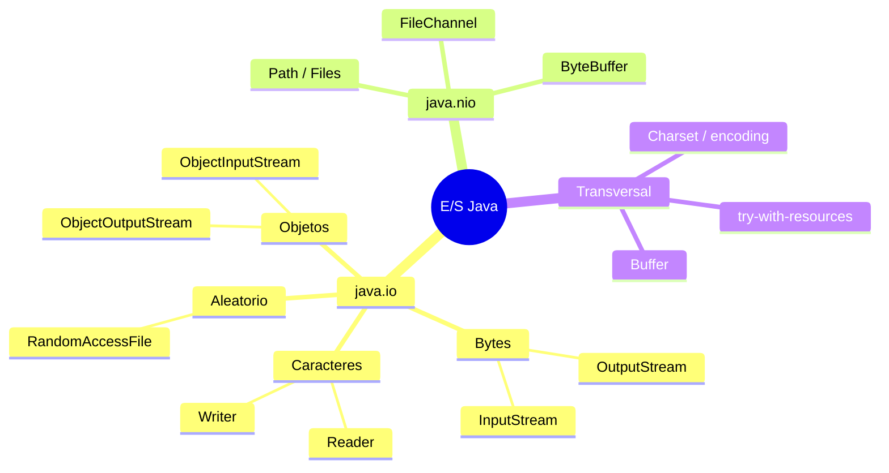
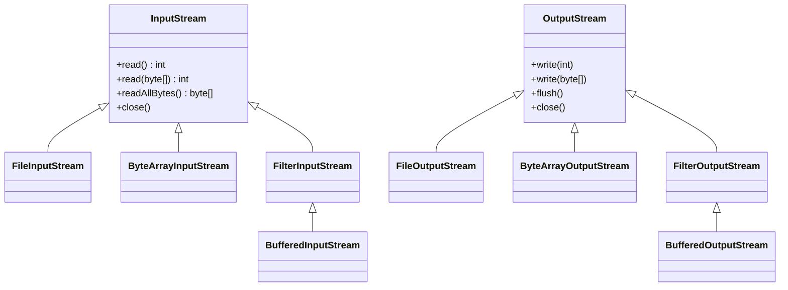
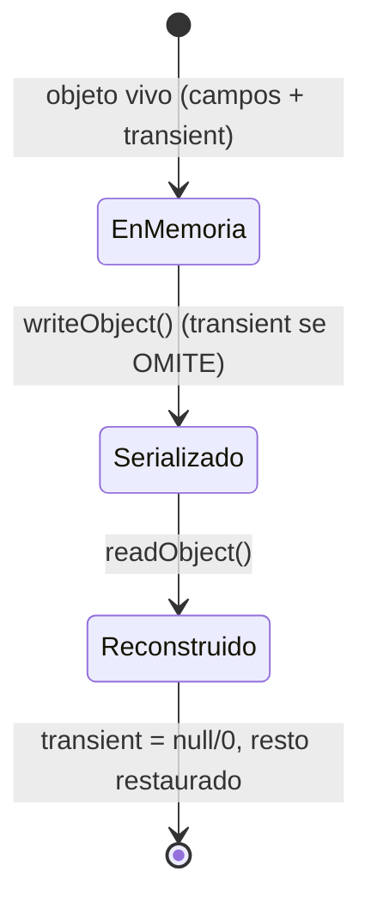

# Bloque XXVI · I/O de ficheros de bajo nivel y NIO.2

> Toda la masterclass ha leído y escrito datos: JSON por la red (b02), filas de BD (b11/b12),
> XML (b16). Pero siempre con una capa que hacía el trabajo sucio. Acceso a Datos (módulo 0486,
> RA1) te pide bajar al metal: abrir tú un fichero, leer bytes, escribir caracteres con el
> encoding correcto, saltar a una posición, serializar un objeto, recorrer un directorio. Es la
> base sobre la que se apoya TODO lo demás, y entra en el examen de AD.

> No es difícil, pero tiene trampas con nombre propio: el **mojibake** (charset mal puesto),
> el **buffer medio lleno**, el **flip() olvidado** y el **stream sin cerrar**. Este bloque te
> da el modelo mental de `java.io` (streams) y `java.nio.file` (NIO.2), y te entrena las trampas.

## Cómo usar este documento

Lee UNA sección → haz SU ejercicio → vuelve. Cada sección cierra con **"Lo practicas en…"**.

| Sección | Tema | Ejercicio |
|---|---|---|
| 26.1 | Flujos de bytes (`InputStream`/`OutputStream`) | `Ej207ByteStreams` |
| 26.2 | Flujos de caracteres y encodings | `Ej208CharStreams` |
| 26.3 | Acceso aleatorio (`RandomAccessFile`) | `Ej209RandomAccessFile` |
| 26.4 | Serialización de objetos | `Ej210ObjectSerialization` |
| 26.5 | NIO.2: `Path` y `Files` | `Ej211Nio2PathFiles` |
| 26.6 | NIO.2: recorrer árboles y atributos | `Ej212Nio2ReadWriteWalk` |
| 26.7 | Temporales, `FileChannel` y `ByteBuffer` | `Ej213TempFilesAndChannels` |
| 26.8 | Conversión entre formatos | `Ej214FormatConversion` |

### El mapa de la E/S en Java

Dos mundos conviven: el clásico **`java.io`** (streams, orientado a flujo) y el moderno
**`java.nio.file`** (NIO.2, orientado a rutas y operaciones de alto nivel).



**Regla práctica:** para código nuevo usa **NIO.2** (`Files.readString`, `Files.write`,
`Files.walk`) — es más conciso y seguro. Conoce `java.io` porque está en todas partes y en el
examen de AD, y porque los streams siguen siendo la base (sockets de b29, serialización, etc.).

---

## 26.1 Flujos de bytes: `InputStream` / `OutputStream`

La unidad mínima de E/S es el **byte**. Un `OutputStream` escribe bytes a un destino, un
`InputStream` los lee de una fuente. La jerarquía clásica de `java.io`:



Patrón canónico de copia con buffer y `try-with-resources`:

```java
try (InputStream in = new FileInputStream(origen);
     OutputStream out = new FileOutputStream(destino)) {
    byte[] buf = new byte[8192];
    int n;
    while ((n = in.read(buf)) != -1) {   // read devuelve nº de bytes leídos, o -1 en EOF
        out.write(buf, 0, n);            // ¡escribe SOLO n bytes, no buf entero!
    }
}                                        // close() automático (incluso si hay excepción)
```

Tres trampas:

- **`read()` sin args devuelve un `int` 0..255** (o `-1` en EOF), nunca un `byte`. Comparar con
  `-1` es la forma de detectar el fin de stream.
- **`out.write(buf, 0, n)`**, no `out.write(buf)`: el buffer puede ir medio lleno en la última
  vuelta; escribir el array entero metería basura.
- **El buffer importa por rendimiento:** envuelve en `BufferedInputStream`/`BufferedOutputStream`
  (o usa `transferTo`) para no llamar al SO byte a byte.

`ByteArrayOutputStream` escribe en memoria (un array que crece solo); útil para construir bytes
sin tocar disco.

> **Lo practicas en `Ej207ByteStreams`**: copias con buffer, detectas el EOF (-1), vuelcas a
> memoria con `ByteArrayOutputStream`, usas `transferTo` y `append`, y compruebas el cierre con
> `try-with-resources`.

---

## 26.2 Flujos de caracteres y encodings

Los bytes no son texto. Para pasar de bytes a caracteres hace falta una **codificación**
(`Charset`). Los **flujos de caracteres** (`Reader`/`Writer`) envuelven a los de bytes con un
charset:

```java
try (BufferedReader br = new BufferedReader(
         new InputStreamReader(new FileInputStream(f), StandardCharsets.UTF_8))) {
    String linea;
    while ((linea = br.readLine()) != null) {   // readLine quita el salto de línea
        // ...
    }
}
```

El **mojibake** es el bug nº1 del mundo real: escribir en UTF-8 y leer en ISO-8859-1 (o al
revés) destroza la ñ y los acentos.

```java
byte[] enUtf8 = "ñ".getBytes(StandardCharsets.UTF_8);        // 2 bytes: C3 B1
String mal = new String(enUtf8, StandardCharsets.ISO_8859_1); // "ñ"  ← mojibake
String bien = new String(enUtf8, StandardCharsets.UTF_8);     // "ñ"
```

| Idea | Detalle |
|---|---|
| **Especifica SIEMPRE el charset** | no te fíes del default; pásalo a `InputStreamReader`/`OutputStreamWriter` |
| **UTF-8 es el estándar** | codifica cualquier carácter Unicode (chino, emoji, acentos) |
| **Default JDK 18+** | `Charset.defaultCharset()` es UTF-8 (antes dependía del SO → mojibake entre máquinas) |
| **ISO-8859-1** | 1 byte por carácter (latino); "ñ" = 1 byte, pero no vale para chino/emoji |
| **BOM** | Java NO escribe BOM en UTF-8; algunos editores de Windows sí, y rompe parsers |

`BufferedReader.lines()` conecta la E/S con los Streams de `b01` (`br.lines().filter(...).count()`).

> **Lo practicas en `Ej208CharStreams`**: lees líneas con el charset correcto, reproduces el
> mojibake a propósito, cuentas palabras/líneas, usas `lines()` y compruebas el charset por defecto.

---

## 26.3 Acceso aleatorio: `RandomAccessFile`

Los streams son **secuenciales** (de principio a fin). `RandomAccessFile` permite **saltar** a
cualquier posición con `seek(offset)` y leer/escribir ahí, como un array en disco. Es la base de
los ficheros de **registros de tamaño fijo** y los índices (AD RA1.b, secuencial vs aleatorio).

```java
try (RandomAccessFile raf = new RandomAccessFile(f, "rw")) {  // modos: r, rw, rws, rwd
    raf.write(new byte[]{10, 20, 30, 40});
    raf.seek(2);                 // salta al byte de índice 2
    int b = raf.read();          // 30  (lee donde apunta el puntero)
    raf.seek(2);
    raf.write(99);               // sobrescribe EN SITIO solo ese byte
    long tam = raf.length();     // tamaño total
}
```

- Mantiene un **puntero de fichero** que avanza al leer/escribir (`getFilePointer()`); `seek` lo
  mueve a mano.
- **Registros de tamaño fijo:** posición = `índice * tamañoRegistro`. Así saltas al k-ésimo
  registro sin leer los anteriores.
- `writeInt/readInt`, `writeUTF/readUTF`, `writeDouble/readDouble` leen/escriben tipos en tamaño
  fijo (un `int` siempre 4 bytes), ideal para registros.
- `setLength()` trunca o extiende; `seek` más allá del final + write deja un "agujero" de ceros.

> **Lo practicas en `Ej209RandomAccessFile`**: lees/escribes en offsets, actualizas en sitio,
> truncas y extiendes, lees registros de tamaño fijo y recorres un fichero en orden inverso.

---

## 26.4 Serialización de objetos

`ObjectOutputStream.writeObject(obj)` convierte un objeto (y todo su grafo de referencias) en
bytes; `ObjectInputStream.readObject()` lo reconstruye. El objeto debe implementar
`Serializable` (interfaz marcadora, sin métodos).

```java
try (ObjectOutputStream oos = new ObjectOutputStream(new FileOutputStream(f))) {
    oos.writeObject(new Punto(3, 4));    // Punto implements Serializable
}
try (ObjectInputStream ois = new ObjectInputStream(new FileInputStream(f))) {
    Punto p = (Punto) ois.readObject();  // lanza ClassNotFoundException si la clase no está
}
```



Conceptos clave:

- **`transient`**: un campo `transient` NO se serializa; al reconstruir vuelve `null`/`0`. Justo
  para no persistir secretos, cachés o datos derivados.
- **`serialVersionUID`**: identifica la versión de la clase. Si cambia entre serializar y
  deserializar, salta `InvalidClassException`. Decláralo explícito (`private static final long`).
- **Grafo en cascada**: `writeObject` sigue todas las referencias; cuidado con grafos enormes o
  cíclicos.
- **Seguridad** ⚠️: NUNCA deserialices datos no confiables (ataques de *gadget chains*). En la
  práctica se prefiere JSON (b02) o Protobuf. Es la misma mecánica que enviabas por socket en
  `b29·Ej238`.

> **Lo practicas en `Ej210ObjectSerialization`**: serializas records y colecciones a fichero,
> compruebas que `transient` no persiste, serializas grafos, clonas por serialización y provocas
> `NotSerializableException`.

---

## 26.5 NIO.2: `Path` y `Files`

`java.nio.file` (desde Java 7) es la API **moderna**. Un `Path` representa una ruta (no el
fichero); la clase de utilidades `Files` hace casi todo en una línea.

```java
Path p = Path.of("datos", "informe.txt");        // construir rutas sin concatenar Strings
Files.writeString(p, "hola");                     // escribir texto (UTF-8 por defecto)
String s = Files.readString(p);                   // leer todo el texto
Files.copy(origen, destino, StandardCopyOption.REPLACE_EXISTING);
Files.move(origen, destino, StandardCopyOption.REPLACE_EXISTING);
Files.deleteIfExists(p);
boolean hay = Files.exists(p);
long tam = Files.size(p);
Files.createDirectories(base.resolve("a/b/c"));   // crea toda la jerarquía
```

| `java.io.File` (viejo) | `java.nio.file` (NIO.2) |
|---|---|
| `new File(...)`, métodos `boolean` que fallan en silencio | `Path` + `Files`, lanzan excepción con causa clara |
| `file.delete()` devuelve `false` si falla | `Files.delete()` lanza `NoSuchFileException` |
| concatenar rutas con `"/"` | `path.resolve(...)`, portable |
| leer ficheros = bucle manual de streams | `Files.readString`/`readAllBytes`/`lines` |

`resolve` es la forma correcta de unir un directorio con un hijo; `getFileName()` saca el nombre
sin la ruta. Usa NIO.2 por defecto en código nuevo.

> **Lo practicas en `Ej211Nio2PathFiles`**: creas/lees/copias/mueves/borras ficheros, creas
> directorios (anidados), consultas existencia y tamaño, y construyes rutas con `resolve`.

---

## 26.6 NIO.2: recorrer árboles y atributos

`Files` también recorre directorios y consulta metadatos, integrándose con los **Streams** de `b01`:

```java
try (Stream<Path> s = Files.walk(dir)) {                 // recorre TODO el subárbol (recursivo)
    long ficheros = s.filter(Files::isRegularFile).count();
}
try (Stream<Path> s = Files.find(dir, 5,
        (path, attrs) -> path.toString().endsWith(".txt"))) { ... }  // recorrer + filtrar
try (Stream<Path> s = Files.list(dir)) { ... }           // solo hijos directos (no recursivo)

List<String> lineas = Files.readAllLines(p);             // todas las líneas de golpe
Files.write(p, List.of("a", "b"), StandardOpenOption.APPEND);  // escribir/añadir líneas
```

⚠️ `Files.walk`, `find`, `lines` y `list` **abren recursos**: hay que cerrar el `Stream`
(`try-with-resources`) o fugas de descriptores.

Metadatos con `BasicFileAttributes` (una lectura, todos los datos):

```java
BasicFileAttributes a = Files.readAttributes(p, BasicFileAttributes.class);
a.isRegularFile();  a.size();  a.creationTime();  a.lastModifiedTime();  // FileTime (java.time, b01)
```

`Files.mismatch(p1, p2)` compara dos ficheros: `-1` si son iguales, o la posición del primer
byte distinto. `walk(dir, profundidad)` limita cuánto baja.

> **Lo practicas en `Ej212Nio2ReadWriteWalk`**: escribes/lees líneas, recorres árboles con
> `walk`/`find`/`list`, lees atributos (tamaño, fechas) y comparas ficheros con `mismatch`.

---

## 26.7 Temporales, `FileChannel` y `ByteBuffer`

NIO trabaja también con **canales** y **buffers** (más cercano al hardware). Un `FileChannel`
lee/escribe contra un `ByteBuffer` (un array con posición/límite/capacidad).

```java
try (FileChannel ch = FileChannel.open(p, StandardOpenOption.WRITE)) {
    ch.write(ByteBuffer.wrap(datos));
}
try (FileChannel ch = FileChannel.open(p, StandardOpenOption.READ)) {
    ByteBuffer buf = ByteBuffer.allocate((int) ch.size());
    ch.read(buf);
    buf.flip();                  // ← pasa de modo escritura a modo lectura (posición a 0)
    // ahora buf.get()... lee lo que se escribió
}
```

⚠️ **La trampa estrella: `flip()`.** Tras escribir en un buffer, la posición queda al final; si
lees sin `flip()`, lees desde ahí y no ves nada. `flip()` pone posición a 0 y límite donde
estabas. `clear()` lo reinicia para reutilizarlo (sin borrar datos). `remaining()` = `limit - position`.

Otras joyas:

- **Ficheros temporales**: `Files.createTempFile` / `createTempDirectory` (van a `java.io.tmpdir`).
- **Memory-mapped I/O**: `ch.map(READ_ONLY, 0, size)` mapea el fichero a memoria; brutal para
  ficheros enormes de acceso aleatorio (BD, índices).
- **`transferTo`/`transferFrom`**: copia canal a canal con posible *zero-copy* del SO (muy eficiente).

> **Lo practicas en `Ej213TempFilesAndChannels`**: escribes/lees por canal con `flip`, juegas con
> capacidad/posición/`remaining`, mapeas un fichero a memoria, truncas y transfieres entre canales.

---

## 26.8 Conversión entre formatos

Cierre del bloque y de AD RA1.e ("conversiones de formato"). Los datos viven en muchas formas:
bytes, texto, `.properties` (clave=valor), CSV, hex, Base64. Convertir = leer un formato,
transformar en memoria, escribir otro.

```java
// texto <-> binario
byte[] bytes = texto.getBytes(StandardCharsets.UTF_8);
String vuelta = new String(bytes, StandardCharsets.UTF_8);

// .properties (config clave=valor)
Properties props = new Properties();
props.setProperty("nombre", "ana");
try (OutputStream os = new FileOutputStream(f)) { props.store(os, null); }
try (InputStream is = new FileInputStream(f)) { props.load(is); }
String v = props.getProperty("nombre", "N/A");        // con valor por defecto

// CSV (manual)
String[] campos = linea.split(",", 2);                // límite por si el valor lleva comas
String csv = String.join(",", List.of("a", "b", "c")); // "a,b,c"

// número <-> bytes (tamaño fijo, big-endian)
byte[] b = ByteBuffer.allocate(4).putInt(123456).array();
int n = ByteBuffer.wrap(b).getInt();

// bytes <-> texto seguro (NO cifran, solo transportan)
String b64 = Base64.getEncoder().encodeToString(bytes);
String hex = HexFormat.of().formatHex(bytes);
```

Ojo: `split(",")` simple NO maneja comas dentro de comillas (`"a,\"b,c\""`); para CSV real haría
falta un parser. Y recuerda (lo machaca b30): **Base64 y hex no cifran ni comprimen**, solo
convierten bytes a texto ASCII portable.

> **Lo practicas en `Ej214FormatConversion`**: conviertes texto↔binario, `.properties`↔CSV,
> número↔bytes con `ByteBuffer`, y round-trips por Base64 y hex.

---

## Errores comunes del bloque

| # | Error | Antídoto |
|---|---|---|
| 1 | `out.write(buf)` en vez de `out.write(buf, 0, n)` | escribe solo los `n` bytes leídos; el buffer puede ir medio lleno |
| 2 | Tratar `read()==-1` o `readLine()==null` como error | es el fin de stream (EOF), gestiónalo, no es excepción |
| 3 | Leer/escribir sin `Charset` → mojibake | UTF-8 explícito en `InputStreamReader`/`OutputStreamWriter` en ambos lados |
| 4 | No cerrar streams/canales/`Stream<Path>` | `try-with-resources` siempre (también con `Files.walk`/`lines`) |
| 5 | Olvidar `flip()` antes de leer un `ByteBuffer` | `flip()` pone posición a 0 tras escribir; si no, lees vacío |
| 6 | Serializar/recibir un campo sensible sin `transient` | marca `transient` lo que no debe persistir/viajar |
| 7 | `serialVersionUID` ausente o incompatible | decláralo `private static final long`; cámbialo solo a conciencia |
| 8 | Confundir `Files.copy` sin `REPLACE_EXISTING` | añade la opción o lanza `FileAlreadyExistsException` |
| 9 | `Files.delete` sobre algo inexistente | usa `deleteIfExists`, o captura `NoSuchFileException` |
| 10 | Concatenar rutas con `"/"` | usa `Path.resolve(...)` (portable Windows/*nix) |
| 11 | Deserializar datos no confiables | nunca; usa JSON/Protobuf para datos externos |
| 12 | Creer que Base64/hex "protegen" los datos | solo son codificación de texto; el cifrado es b30 |

---

## Chuleta final del bloque

```java
// === BYTES (java.io) ===
try (var in = new FileInputStream(o); var out = new FileOutputStream(d)) {
    byte[] buf = new byte[8192]; int n;
    while ((n = in.read(buf)) != -1) out.write(buf, 0, n);   // -1 = EOF; write(buf,0,n)
}

// === CARACTERES + charset ===
try (var br = new BufferedReader(new InputStreamReader(new FileInputStream(f), UTF_8))) {
    String l; while ((l = br.readLine()) != null) { /* ... */ }
}

// === ACCESO ALEATORIO ===
try (var raf = new RandomAccessFile(f, "rw")) { raf.seek(pos); raf.write(b); }

// === SERIALIZACIÓN ===
try (var oos = new ObjectOutputStream(new FileOutputStream(f))) { oos.writeObject(obj); } // 1º out
try (var ois = new ObjectInputStream(new FileInputStream(f)))  { T t = (T) ois.readObject(); }

// === NIO.2 (preferido) ===
Files.writeString(p, "hola");  String s = Files.readString(p);
Files.copy(a, b, REPLACE_EXISTING);  Files.move(a, b, REPLACE_EXISTING);  Files.deleteIfExists(p);
try (Stream<Path> w = Files.walk(dir)) { w.filter(Files::isRegularFile).count(); } // cerrar!

// === CANALES + BUFFER ===
try (var ch = FileChannel.open(p, READ)) {
    var buf = ByteBuffer.allocate((int) ch.size()); ch.read(buf); buf.flip(); /* leer */
}

// === FORMATOS ===
byte[] bs = txt.getBytes(UTF_8);  String t = new String(bs, UTF_8);
String b64 = Base64.getEncoder().encodeToString(bs);   // NO cifra
String hex = HexFormat.of().formatHex(bs);
```

---

## Autoevaluación

1. ¿Por qué `out.write(buf, 0, n)` y no `out.write(buf)` al copiar con un buffer? ¿Qué devuelve
   `read()` al llegar al final? (26.1)
2. ¿Qué es el mojibake y cómo se evita? ¿Cuál es el charset por defecto en JDK 18+? (26.2)
3. ¿Qué diferencia hay entre acceso secuencial y aleatorio, y cómo saltas al k-ésimo registro de
   tamaño fijo con `RandomAccessFile`? (26.3)
4. ¿Qué le pasa a un campo `transient` al serializar y para qué sirve? ¿Qué papel juega
   `serialVersionUID`? (26.4)
5. ¿Por qué se prefiere `java.nio.file` sobre `java.io.File` para código nuevo? Pon dos ejemplos
   de operación en una línea. (26.5)
6. ¿Por qué hay que cerrar el `Stream` que devuelve `Files.walk`/`lines`, y qué diferencia hay
   entre `walk`, `find` y `list`? (26.6)
7. ¿Qué hace `flip()` en un `ByteBuffer` y qué pasa si lo olvidas tras escribir? (26.7)
8. ¿Por qué Base64 y hex NO son cifrado, y para qué sirven realmente? (26.8)
9. ¿Por qué es peligroso deserializar datos que vienen de una fuente no confiable? (26.4)
