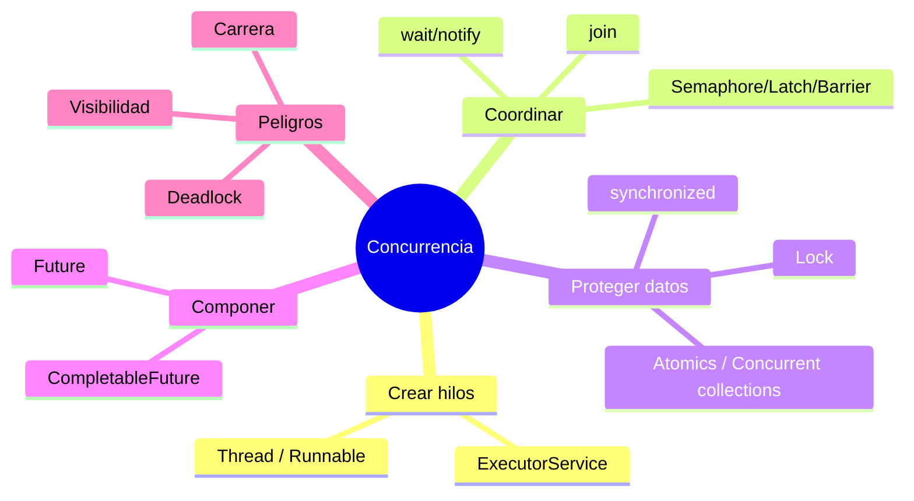
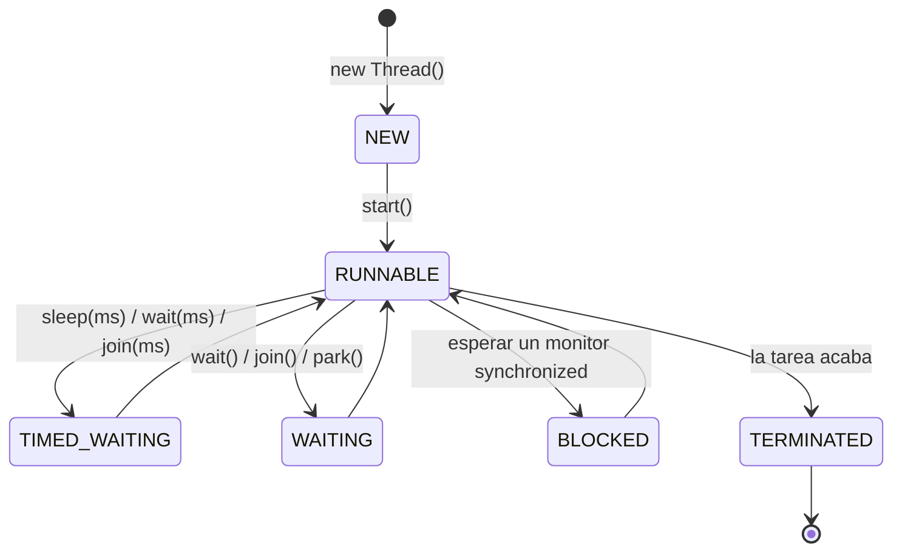
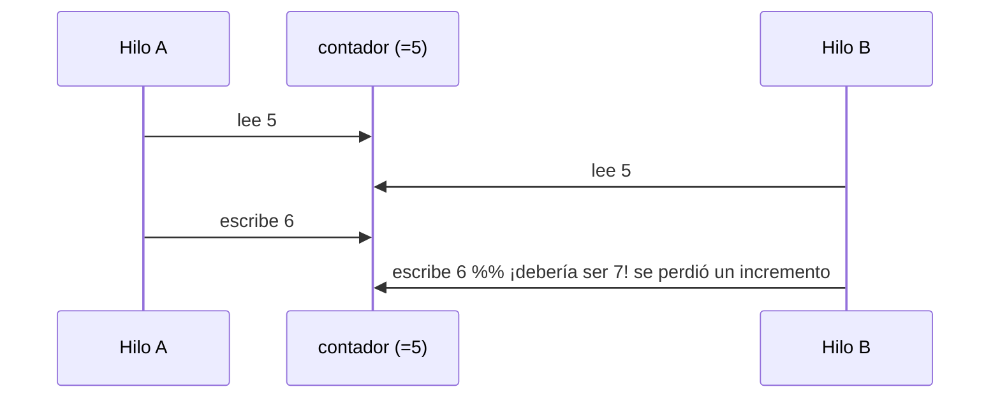
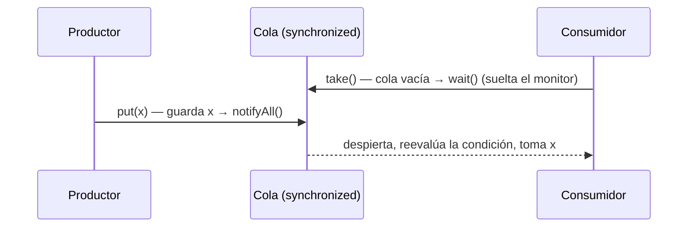
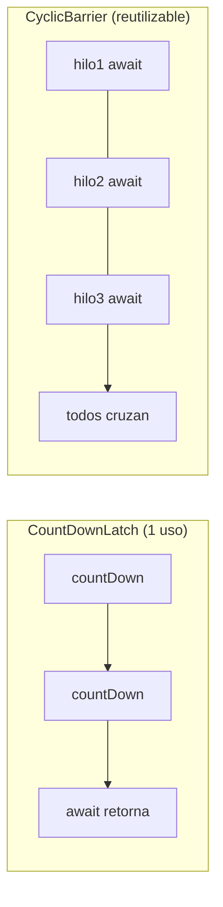
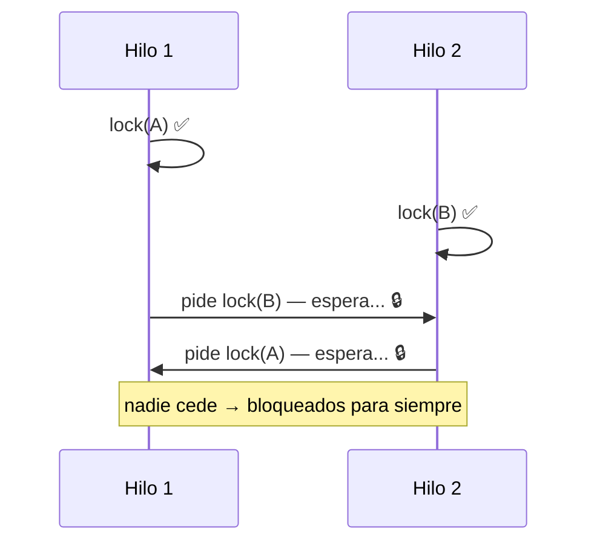

# Bloque XXVII · Concurrencia y multihilo a fondo

> Vienes de Java secuencial: una cosa después de otra. Pero un servidor REST atiende
> miles de peticiones **a la vez**, y PSP (módulo 0490 de 2º DAM, RA2) gira casi entero
> en torno a esto. La concurrencia es donde más se suspende y donde más se destaca: no
> porque sea "difícil", sino porque exige pensar en lo que pasa **entre** dos instrucciones.
> Este bloque te da el modelo mental y las herramientas, de `Thread` crudo hasta
> `CompletableFuture`.

> En `b01·Ej021` tocaste la concurrencia de pasada. Aquí la dominas. Y conecta hacia
> delante con `b21·Ej184` (`@Async` de Spring) y con `b29` (un servidor de sockets que
> atiende varios clientes con hilos).

## Cómo usar este documento

Lee UNA sección → haz SU ejercicio → vuelve. Cada sección termina con **"Lo practicas en…"**.

| Sección | Tema | Ejercicio |
|---|---|---|
| 27.1 | `Thread` vs `Runnable`, `start`/`join` | `Ej215ThreadRunnable` |
| 27.2 | Estados de un hilo, `sleep`, interrupción | `Ej216ThreadStates` |
| 27.3 | Condición de carrera y `synchronized` | `Ej217RaceConditionSynchronized` |
| 27.4 | `wait`/`notify`: productor-consumidor | `Ej218WaitNotify` |
| 27.5 | `ExecutorService` y pools | `Ej219ExecutorService` |
| 27.6 | `Callable` y `Future` | `Ej220CallableFuture` |
| 27.7 | `Lock`, `tryLock`, `ReadWriteLock`, `Condition` | `Ej221Locks` |
| 27.8 | `Semaphore`, `CountDownLatch`, `CyclicBarrier` | `Ej222Semaphores` |
| 27.9 | Atómicos y colecciones concurrentes | `Ej223AtomicAndConcurrentCollections` |
| 27.10 | Deadlock y cómo evitarlo | `Ej224DeadlockLivelock` |
| 27.11 | `CompletableFuture` (composición async) | `Ej225CompletableFutureAdvanced` |
| 27.12 | Prioridades, `ThreadLocal`, contexto | `Ej226ThreadPriorityAndContext` |

### Los tres pecados de la concurrencia

Todo el bloque combate tres problemas. Tenlos presentes:

1. **Condición de carrera (race condition):** dos hilos tocan el mismo dato sin coordinarse
   y el resultado depende del azar del planificador. → secciones 27.3, 27.9.
2. **Visibilidad:** un hilo escribe un valor y otro **no lo ve** (cachés de CPU, reordenación).
   → `volatile`, `synchronized`, atómicos. → secciones 27.3, 27.9.
3. **Interbloqueo (deadlock):** dos hilos se esperan mutuamente para siempre. → sección 27.10.



---

## 27.1 `Thread` vs `Runnable`: crear, arrancar y esperar

Un **hilo** (`Thread`) es una línea de ejecución independiente dentro del proceso. La tarea
que ejecuta se describe con un **`Runnable`** (una lambda sin parámetros ni retorno).

```java
Runnable tarea = () -> System.out.println("hola desde " + Thread.currentThread().getName());
Thread t = new Thread(tarea);
t.start();   // arranca un hilo NUEVO que ejecuta la tarea
t.join();    // el hilo actual ESPERA a que t termine
```

El error nº 1 del principiante: llamar a `t.run()` en vez de `t.start()`. `run()` **no crea
ningún hilo**: ejecuta la tarea en el hilo llamador, como una llamada normal. Solo `start()`
arranca concurrencia.

Como un `Runnable` no devuelve valor, el "canal de retorno" clásico es una variable
capturada mutable (un array de un elemento):

```java
long[] resultado = {0};
Thread t = new Thread(() -> { for (long i = 1; i <= n; i++) resultado[0] += i; });
t.start();
t.join();          // tras join, lo que el hilo escribió ya es visible (happens-before)
return resultado[0];
```

`join()` no solo espera: **establece visibilidad**. Todo lo que el hilo escribió antes de
terminar lo ves tú después del `join`.

> **Lo practicas en `Ej215ThreadRunnable`.**

---

## 27.2 Estados de un hilo, `sleep` e interrupción

Un hilo recorre estos estados (`Thread.State`):



- `sleep(ms)` duerme sin soltar ningún cerrojo → `TIMED_WAITING`.
- `wait()` (sección 27.4) **suelta** el monitor y espera → `WAITING`.
- Un hilo es de **un solo uso**: llamar a `start()` por segunda vez lanza
  `IllegalThreadStateException`. Para reutilizar hilos se usa un pool (27.5).

**Interrupción.** `t.interrupt()` no mata el hilo: le levanta una **bandera**. El hilo decide
qué hacer. Si está dormido/esperando, las operaciones bloqueantes (`sleep`, `wait`, `join`)
lanzan `InterruptedException` **y limpian la bandera**:

```java
while (!Thread.currentThread().isInterrupted()) {
    // trabajo cooperativo: se revisa la bandera de vez en cuando
}
```

> **Lo practicas en `Ej216ThreadStates`.**

---

## 27.3 Condición de carrera y `synchronized`

`contador++` **no es atómico**: son tres pasos (leer, sumar, escribir). Si dos hilos lo
hacen a la vez, pueden leer el mismo valor y uno **pisa** al otro: se pierde un incremento.



La solución es **exclusión mutua**: solo un hilo a la vez ejecuta la sección crítica.

```java
Object cerrojo = new Object();
synchronized (cerrojo) {   // adquiere el "monitor" del objeto cerrojo
    contador++;            // nadie más puede entrar aquí a la vez
}                          // libera el monitor al salir (incluso si lanza)
```

Reglas de oro:
- Para proteger un dato, **todos** los accesos deben usar **el mismo** cerrojo. Dos cerrojos
  distintos no se excluyen entre sí.
- Bloquea sobre un `Object` privado dedicado, no sobre `this` (evita interferencias externas).
- `volatile` arregla la **visibilidad** (una bandera `boolean`), pero **no** la atomicidad de
  `i++`. Para contar, usa `synchronized`, un `Lock` o un atómico (27.9).

| Herramienta | ¿Atomicidad? | ¿Visibilidad? | Uso típico |
|---|---|---|---|
| `volatile` | ❌ (no en `i++`) | ✅ | banderas booleanas |
| `synchronized` | ✅ | ✅ | secciones críticas |
| `Lock` | ✅ | ✅ | control fino (tryLock, timeout) |
| `Atomic*` | ✅ | ✅ | contadores, CAS |

> **Lo practicas en `Ej217RaceConditionSynchronized`.**

---

## 27.4 `wait`/`notify`: el productor-consumidor

Cuando un hilo debe **esperar a una condición** que otro provocará (la cola tiene hueco /
tiene datos), se usa `wait`/`notify` sobre un monitor:



El esqueleto canónico (¡la condición SIEMPRE en `while`, nunca `if`!):

```java
public synchronized void put(int v) throws InterruptedException {
    while (cuenta == datos.length) wait();   // lleno → esperar
    datos[cola] = v; cola = (cola + 1) % datos.length; cuenta++;
    notifyAll();                              // avisa a los consumidores
}
```

¿Por qué `while` y no `if`? Por los **spurious wakeups**: `wait()` puede volver sin que nadie
haya hecho `notify`. El `while` reevalúa la condición y vuelve a esperar si no se cumple.
Con varios hilos esperando, usa `notifyAll` (despertar a uno solo puede dejar colgados a otros).

> Esto es exactamente lo que hace una `BlockingQueue` (27.9) ya hecha por la librería.

> **Lo practicas en `Ej218WaitNotify`.**

---

## 27.5 `ExecutorService`: pools de hilos

Crear un `Thread` por tarea no escala (cada hilo cuesta ~1 MB de pila). Un **pool** mantiene
un número fijo de hilos y les va dando tareas de una cola.

```java
ExecutorService pool = Executors.newFixedThreadPool(4);
for (int i = 0; i < 1000; i++) pool.submit(() -> hacerAlgo());
pool.shutdown();                                  // no acepta más tareas
pool.awaitTermination(5, TimeUnit.SECONDS);       // espera a que acaben las pendientes
```

Tipos habituales: `newFixedThreadPool(n)`, `newCachedThreadPool()` (crea bajo demanda),
`newSingleThreadExecutor()` (serializa), `newScheduledThreadPool` (con retardos/periódico).

`shutdown()` es ordenado (deja terminar lo encolado); `shutdownNow()` intenta cancelar.
Enviar tras `shutdown()` lanza `RejectedExecutionException`. Un pool **reutiliza** sus hilos:
mil tareas en un pool de 4 usan solo 4 hilos.

> **Lo practicas en `Ej219ExecutorService`.**

---

## 27.6 `Callable` y `Future`

Un `Runnable` no devuelve nada; un **`Callable<V>`** sí, y `submit` te da un **`Future<V>`**,
el "pagaré" del resultado:

```java
Future<Integer> f = pool.submit(() -> calcular());
int r = f.get();                       // bloquea hasta tener el valor
int r2 = f.get(2, TimeUnit.SECONDS);   // o con timeout → TimeoutException
f.cancel(true);                        // cancelar (si aún no terminó)
boolean hecho = f.isDone();
```

- `get()` **bloquea**; con timeout lanza `TimeoutException` si tarda.
- Una excepción dentro de la tarea llega envuelta en `ExecutionException` (mira
  `e.getCause()`).
- `get()` es **idempotente**: el resultado se cachea, llamarlo dos veces da lo mismo.
- `invokeAll(tareas)` espera a todas; `invokeAny(tareas)` devuelve el primer resultado.

> **Lo practicas en `Ej220CallableFuture`.**

---

## 27.7 `Lock` explícito: `ReentrantLock`, `tryLock`, `ReadWriteLock`, `Condition`

`synchronized` es cómodo pero todo-o-nada. Los `Lock` de `java.util.concurrent.locks` dan
control fino. Patrón obligatorio: **`unlock()` siempre en `finally`**.

```java
ReentrantLock lock = new ReentrantLock();
lock.lock();
try {
    // sección crítica
} finally {
    lock.unlock();   // si no, una excepción dejaría el cerrojo tomado para siempre
}
```

Ventajas sobre `synchronized`:
- `tryLock()` / `tryLock(timeout)`: intenta sin bloquearse (clave para evitar deadlocks, 27.10).
- `lockInterruptibly()`: se puede interrumpir mientras espera.
- **Reentrante**: el mismo hilo puede tomarlo varias veces (`getHoldCount()`).
- `ReentrantReadWriteLock`: muchos lectores a la vez **o** un único escritor.
- `Condition` (`newCondition()`): el `wait/notify` de los Lock (`await`/`signal`), y puedes
  tener **varias** condiciones sobre un mismo cerrojo (noLleno, noVacío).

> **Lo practicas en `Ej221Locks`.**

---

## 27.8 `Semaphore`, `CountDownLatch`, `CyclicBarrier`

Tres coordinadores de alto nivel:

- **`Semaphore(permisos)`**: limita cuántos hilos hacen algo a la vez (`acquire`/`release`).
  Con 1 permiso es un mutex; útil para limitar conexiones, descargas, etc.
- **`CountDownLatch(n)`**: el hilo principal `await()` hasta que ocurren `n` sucesos
  (`countDown()`). **De un solo uso** (no se rearma). Sirve de "pistola de salida" o de
  "espera a que arranquen N servicios".
- **`CyclicBarrier(n)`**: reúne a `n` hilos en un punto; ninguno pasa hasta que llegan todos.
  **Reutilizable** (se rearma sola), con una acción opcional al completarse.



> **Lo practicas en `Ej222Semaphores`.**

---

## 27.9 Atómicos y colecciones concurrentes

La forma **idiomática** de compartir estado sin `synchronized`:

- **`AtomicInteger`/`AtomicLong`/`AtomicReference`**: operaciones atómicas con instrucciones
  CAS (compare-and-swap) del procesador. `incrementAndGet()`, `compareAndSet(esp, nuevo)`,
  `updateAndGet(fn)`.
- **`LongAdder`**: como `AtomicLong` pero reparte el conteo en celdas → mejor bajo alta
  contención.
- **`ConcurrentHashMap`**: mapa thread-safe sin bloquear todo el mapa. `merge(k, 1, Integer::sum)`
  para contar, `computeIfAbsent`.
- **`BlockingQueue`** (`ArrayBlockingQueue`): `put`/`take` que bloquean → el productor-consumidor
  de 27.4 ya resuelto.
- **`CopyOnWriteArrayList`**: ideal para muchas lecturas y pocas escrituras.
- **`ConcurrentLinkedQueue`**: cola no bloqueante (`offer`/`poll`).

> Regla práctica: ¿solo cuentas? `AtomicInteger`/`LongAdder`. ¿Mapa compartido?
> `ConcurrentHashMap`. ¿Cola productor-consumidor? `BlockingQueue`. Casi nunca necesitas
> escribir `wait/notify` a mano en producción.

> **Lo practicas en `Ej223AtomicAndConcurrentCollections`.**

---

## 27.10 Deadlock y cómo evitarlo

Un **deadlock** ocurre cuando dos hilos retienen un recurso y esperan el del otro, en orden
inverso:



Las cuatro condiciones de Coffman (todas necesarias): exclusión mutua, retención y espera,
no apropiación, espera circular. Rompe **una** y no hay deadlock. La cura más sencilla:

> **Adquiere SIEMPRE los cerrojos en el mismo orden global.** Si todos piden A antes que B,
> jamás hay espera circular.

Otras tácticas: `tryLock` con retroceso (si no consigues el segundo, suelta el primero y
reintenta); ordenar dinámicamente por `System.identityHashCode`; `lockInterruptibly` para
poder abortar. Para detectar un deadlock ya producido:
`ManagementFactory.getThreadMXBean().findDeadlockedThreads()`.

> **Lo practicas en `Ej224DeadlockLivelock`.**

---

## 27.11 `CompletableFuture`: composición asíncrona

El `Future` clásico solo sabe bloquear. **`CompletableFuture`** permite **encadenar** pasos
sin bloquear y manejar errores:

```java
CompletableFuture.supplyAsync(() -> cargarUsuario(id))   // paso async
    .thenApply(u -> u.getEmail())                        // transformar el resultado
    .thenCompose(email -> enviarAsync(email))            // encadenar OTRO futuro (aplanado)
    .exceptionally(ex -> "fallback")                     // recuperar de un fallo
    .thenAccept(System.out::println);                    // efecto final
```

- `thenApply` (transforma valor) vs `thenCompose` (encadena otro futuro, evita anidamiento).
- `thenCombine` une dos futuros independientes; `allOf`/`anyOf` combinan varios.
- `exceptionally(fn)` recupera de error; `handle((r, e) -> ...)` procesa resultado **y** error.
- `completeOnTimeout` / `orTimeout` para plazos. `complete(v)` lo completa a mano.
- `join()` recoge el resultado sin checked exceptions (a diferencia de `get()`).

Este es el modelo detrás de `@Async` de Spring (`b21·Ej184`) y de la programación reactiva.

> **Lo practicas en `Ej225CompletableFutureAdvanced`.**

---

## 27.12 Prioridades, `ThreadLocal` y contexto

El "entorno" de un hilo:

- **Prioridad** (`setPriority`, 1–10): una **pista** al planificador, no una garantía. Rara vez
  se toca.
- **Daemon** (`setDaemon(true)` antes de `start`): un hilo daemon no impide que la JVM
  termine (p.ej. el recolector de basura).
- **`ThreadLocal<T>`**: una variable con un **valor propio por hilo**. Es como cada hilo
  tuviera su copia. Frameworks web la usan para guardar el usuario/transacción de la petición
  actual sin pasarlo por parámetro.

```java
ThreadLocal<Usuario> actual = ThreadLocal.withInitial(() -> Usuario.ANONIMO);
actual.set(usuarioDeLaPeticion);
// ... en cualquier punto del mismo hilo:
actual.get();
actual.remove();   // ¡IMPRESCINDIBLE en pools! si no, el hilo reciclado vería datos ajenos
```

- **`InheritableThreadLocal`**: el valor se hereda a los hilos hijos.
- **`UncaughtExceptionHandler`**: captura excepciones que escapan del `run()` de un hilo.

> Cuidado de producción: en un pool, un `ThreadLocal` que no haces `remove()` **fuga** datos
> de una petición a la siguiente. Es un bug clásico de seguridad.

> **Lo practicas en `Ej226ThreadPriorityAndContext`.**

---

## Apéndice · Errores frecuentes

| Síntoma | Causa | Arreglo |
|---|---|---|
| El contador da menos de lo esperado | condición de carrera en `i++` | `synchronized` / `AtomicInteger` |
| Un cambio "no se ve" en otro hilo | problema de visibilidad | `volatile` / `synchronized` / atómico |
| `wait()` lanza `IllegalMonitorStateException` | no estás dentro de `synchronized` del mismo objeto | envuelve en `synchronized (monitor)` |
| El programa se cuelga | deadlock por orden inverso de locks | orden global de adquisición / `tryLock` |
| `IllegalThreadStateException` al `start()` | reiniciar un hilo ya usado | crea uno nuevo o usa un pool |
| Datos de otra petición en un endpoint | `ThreadLocal` sin `remove()` en pool | `remove()` en un `finally` |
| El test pasa "a veces" | dependes de tiempos (`sleep`) | usa latches / `Awaitility`, no `sleep` a ciegas |
