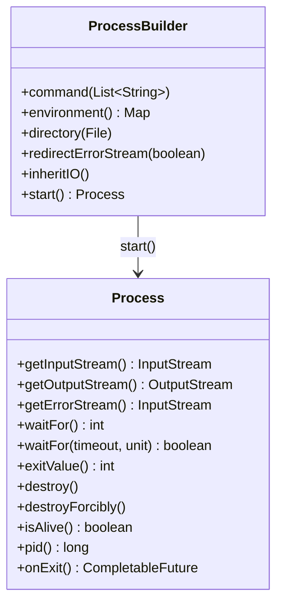
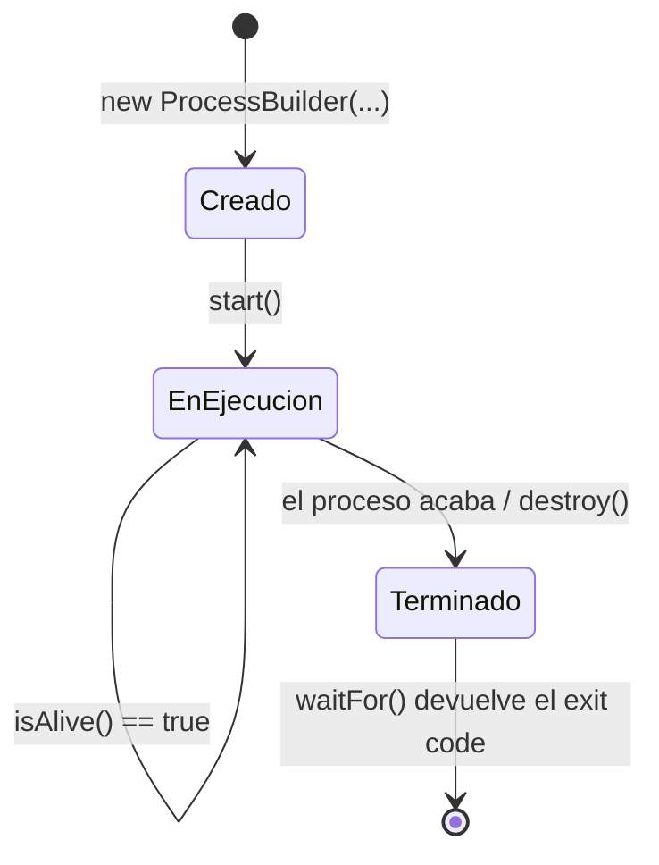
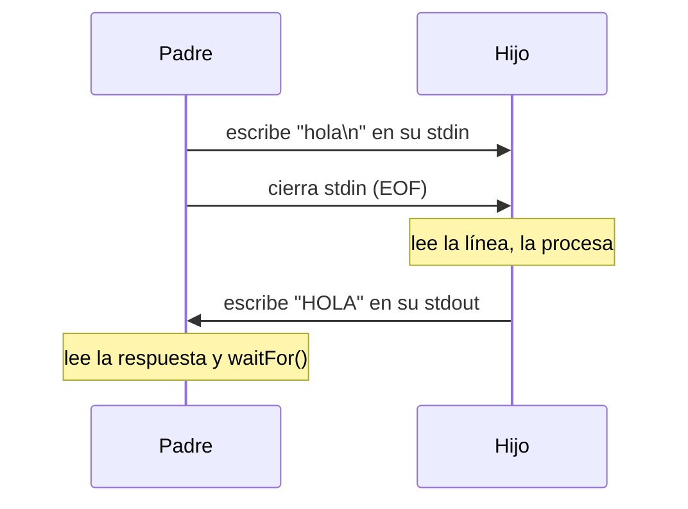
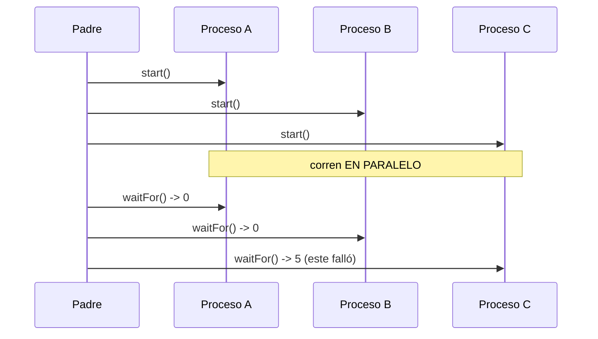

# Bloque XXVIII · Multiproceso e IPC

> En b27 aprendiste a tener varias líneas de ejecución DENTRO de un programa: los hilos,
> que comparten memoria. Aquí subes un nivel: lanzar y coordinar PROGRAMAS ENTEROS desde tu
> código —procesos del sistema operativo, con su propia memoria—. Es PSP RA1 (módulo 0490),
> el complemento natural de la concurrencia: a veces no quieres un hilo, quieres ejecutar
> `ffmpeg`, un script, otra JVM o un comando del sistema, y recoger su resultado.

> La herramienta es `ProcessBuilder`/`Process`. Parece simple (lanzar un comando), pero tiene
> trampas serias: el interbloqueo por no leer la salida, el proceso huérfano por no esperar o
> matar, y la inyección de comandos si construyes el comando con datos del usuario. Este bloque
> te las enseña todas.

## Cómo usar este documento

Lee UNA sección → haz SU ejercicio → vuelve. Cada sección cierra con **"Lo practicas en…"**.

| Sección | Tema | Ejercicio |
|---|---|---|
| 28.1 | Lanzar procesos (`ProcessBuilder`, `waitFor`, exit code) | `Ej227ProcessBuilderBasics` |
| 28.2 | E/S del proceso (stdin/stdout/stderr) | `Ej228ProcessIO` |
| 28.3 | IPC por pipes (hablar con el hijo) | `Ej229ProcessPipesIPC` |
| 28.4 | Timeouts y destrucción de procesos | `Ej230ProcessTimeoutAndDestroy` |
| 28.5 | Varios procesos en paralelo | `Ej231ParallelProcesses` |
| 28.6 | Entorno y directorio de trabajo | `Ej232ProcessEnvAndDir` |

### Proceso vs hilo

La distinción que cae siempre en el examen:

| | Proceso | Hilo (b27) |
|---|---|---|
| Memoria | propia, aislada | compartida con otros hilos del proceso |
| Creación | costosa (el SO arranca un programa) | barata |
| Comunicación | IPC: pipes, sockets, ficheros, señales | variables compartidas (con sincronización) |
| Fallo | aislado: si cae, no tumba al padre | un fallo puede tumbar todo el proceso |
| API Java | `ProcessBuilder` / `Process` | `Thread` / `ExecutorService` |
| Cuándo | ejecutar otro programa, aislar, paralelismo robusto | concurrencia dentro de tu app |



> **Nota de este bloque:** para que los tests sean deterministas y funcionen igual en Windows y
> Linux, no se lanzan comandos del SO (`dir`, `ls`...) sino un proceso **Java hijo** conocido
> (la clase `ProcesoHijo`), arrancado con el mismo `java` y classpath que corre los tests. En el
> mundo real lanzarás cualquier ejecutable; el patrón es idéntico.

---

## 28.1 Lanzar procesos: `ProcessBuilder`, `waitFor`, código de salida

Un **proceso** es un programa en ejecución gestionado por el SO. Para lanzarlo:

```java
ProcessBuilder pb = new ProcessBuilder("java", "-version");
Process p = pb.start();      // crea el proceso (no bloquea); IOException si el ejecutable no existe
int codigo = p.waitFor();    // BLOQUEA hasta que termina; devuelve el código de salida
```

Conceptos:

- **Código de salida (exit code):** por convención, `0` = éxito, `!=0` = error. `waitFor()`
  devuelve ese código y equivale a `exitValue()` (pero `exitValue()` sobre un proceso aún vivo
  lanza `IllegalThreadStateException`).
- **`start()` no bloquea**, `waitFor()` sí. **`isAlive()`** comprueba sin esperar.
- **`pid()`** da el identificador del SO; **`onExit()`** devuelve un `CompletableFuture<Process>`
  (puente con b27) que completa al terminar.



> **Lo practicas en `Ej227ProcessBuilderBasics`**: lanzas procesos, recoges códigos de salida,
> distingues éxito/error, consultas PID e `isAlive`, y provocas `IOException` (comando inexistente)
> e `IllegalThreadStateException` (`exitValue` prematuro).

---

## 28.2 E/S del proceso: leer su salida y su error

Un proceso tiene tres flujos estándar. Desde el padre se ven "al revés": el stdout del hijo es
un `InputStream` para ti (lees lo que el hijo escribe).

| Flujo del hijo | Método en el padre | Dirección |
|---|---|---|
| stdin | `getOutputStream()` | el padre **escribe** al hijo |
| stdout | `getInputStream()` | el padre **lee** del hijo |
| stderr | `getErrorStream()` | el padre **lee** los errores del hijo |

```java
Process p = new ProcessBuilder(cmd).start();
try (BufferedReader br = new BufferedReader(
         new InputStreamReader(p.getInputStream(), StandardCharsets.UTF_8))) {
    String linea = br.readLine();   // lo que el hijo imprimió por stdout
}
p.waitFor();
```

Trampas:

- **Interbloqueo por buffer lleno** ⚠️: si el hijo escribe mucho en stdout/stderr y nadie lo lee,
  el buffer del pipe se llena, el hijo se bloquea al escribir y tu `waitFor()` no vuelve nunca.
  Lee la salida (en un hilo, o con `redirectErrorStream`) antes/mientras esperas.
- **`redirectErrorStream(true)`** mezcla stderr en stdout (un solo flujo que leer).
- **`inheritIO()`** conecta los flujos del hijo a la consola del padre (no capturas, pero no te
  cuelgas). **`redirectOutput(file)`** los manda a un fichero.
- Fija el **charset** al leer (como en b26·208); entre procesos, limítate a ASCII si no controlas
  el encoding de consola de cada SO.

> **Lo practicas en `Ej228ProcessIO`**: capturas stdout y stderr por separado, los mezclas con
> `redirectErrorStream`, rediriges a fichero, usas `inheritIO` y lees con `readAllBytes`/`BufferedReader`.

---

## 28.3 IPC por pipes: hablar con el hijo

La forma más directa de **comunicación entre procesos (IPC)** son los pipes de los flujos
estándar: el padre escribe en el stdin del hijo y lee de su stdout. Es un diálogo
petición/respuesta, primo del de sockets (b29) pero local.

```java
Process p = new ProcessBuilder(cmd).start();
try (Writer w = new OutputStreamWriter(p.getOutputStream(), StandardCharsets.UTF_8)) {
    w.write("hola\n");
}   // al cerrar el Writer: flush + cierre del stdin del hijo (EOF) → el hijo procesa y responde
String respuesta = new BufferedReader(
        new InputStreamReader(p.getInputStream(), StandardCharsets.UTF_8)).readLine();
p.waitFor();
```



⚠️ **Hay que cerrar (o `flush`) el stdin del hijo.** Si no, el hijo sigue esperando más entrada
para siempre y ambos quedan bloqueados. Cerrar el `Writer`/`OutputStream` envía el EOF que el
hijo necesita para saber que no hay más datos.

> **Lo practicas en `Ej229ProcessPipesIPC`**: escribes en el stdin del hijo y lees su respuesta,
> cuentas líneas enviadas, compruebas que cerrar el stdin señala EOF y transmites líneas largas.

---

## 28.4 Timeouts y destrucción de procesos

Un proceso puede colgarse. Para no esperar eternamente:

```java
boolean termino = p.waitFor(2, TimeUnit.SECONDS);  // true si acabó a tiempo; false si venció
if (!termino) {
    p.destroy();            // pide terminar (SIGTERM): el proceso podría limpiar
    // p.destroyForcibly();  // mata sin contemplaciones (SIGKILL)
}
```

Ideas clave:

- **`waitFor(timeout, unit)` NO mata el proceso**: solo deja de esperar y devuelve `false`. Si no
  lo necesitas, **destrúyelo tú** o quedará huérfano corriendo.
- **`destroy()` vs `destroyForcibly()`**: el primero es educado (señal de terminación, el proceso
  puede limpiar); el segundo es a la fuerza. En Windows suelen ser equivalentes.
- Un proceso terminado por señal sale con **código distinto de 0** (así el padre sabe que fue
  abortado). `destroy()` es **idempotente**.
- `destroy()` no es instantáneo: tras llamarlo, haz `waitFor()` para que el SO recoja al hijo.

> **Lo practicas en `Ej230ProcessTimeoutAndDestroy`**: esperas con timeout, distingues "terminó a
> tiempo" de "venció", matas procesos colgados con `destroy`/`destroyForcibly` y compruebas que un
> timeout por sí solo no mata al proceso.

---

## 28.5 Varios procesos en paralelo

Para ejecutar varias tareas pesadas a la vez, lanza varios procesos. La regla de oro:
**arranca TODOS primero, espera DESPUÉS.**

```java
List<Process> procesos = new ArrayList<>();
for (String[] cmd : comandos) procesos.add(new ProcessBuilder(cmd).start());  // todos a la vez
int codigos = 0;
for (Process p : procesos) codigos += p.waitFor();                            // recoge resultados
```

Si arrancas y esperas dentro del mismo bucle (`start()` + `waitFor()` juntos), los **serializas**:
el segundo no empieza hasta que el primero acaba, y pierdes el paralelismo. Cada proceso tiene su
propia memoria y su propio PID; un fallo de uno (código != 0) no afecta a los demás, y puedes
recoger qué subtarea concreta falló.



> **Lo practicas en `Ej231ParallelProcesses`**: lanzas N procesos a la vez, sumas sus códigos de
> salida, detectas cuál falló, compruebas que sus PIDs son distintos y que arrancar-antes-de-esperar
> da paralelismo real.

---

## 28.6 Entorno y directorio de trabajo

Al lanzar un proceso controlas su **contexto de ejecución**:

```java
ProcessBuilder pb = new ProcessBuilder(cmd);
pb.environment().put("API_KEY", "1234");        // variables de entorno (mapa modificable)
pb.directory(new File("/ruta/de/trabajo"));     // directorio de trabajo (cwd) del hijo
```

- Por defecto el hijo **HEREDA** una copia del entorno y el directorio del padre.
- **Modificar `pb.environment()` NO toca el entorno del padre** (es una copia para el hijo).
  Puedes añadir, modificar o `remove(...)` variables solo para el hijo.
- `directory(File)` cambia el "current working directory" del hijo (lo que él ve como `user.dir`
  / `pwd`).

> **Lo practicas en `Ej232ProcessEnvAndDir`**: defines y eliminas variables de entorno para el
> hijo, compruebas que no afectan al padre, fijas el directorio de trabajo y combinas todo con
> `inheritIO`.

---

## La advertencia de seguridad: inyección de comandos

⚠️ **Nunca construyas un comando concatenando datos del usuario, y nunca lo pases por una shell.**

```java
// PELIGRO: si 'nombre' viene del usuario y vale "x; rm -rf /"...
Runtime.getRuntime().exec("backup " + nombre);          // ❌ inyección de comandos
new ProcessBuilder("bash", "-c", "backup " + nombre);   // ❌ la shell interpreta ; | && $()

// SEGURO: argumentos por separado, sin shell que los interprete
new ProcessBuilder("backup", nombre);                   // ✅ 'nombre' es UN argumento, no código
```

`ProcessBuilder` con la lista de argumentos NO usa una shell: cada elemento es un argumento
literal, así que metacaracteres como `;`, `|`, `&&`, `$()` no se interpretan. Es el mismo
principio que el `PreparedStatement` frente a la SQL injection (b11): **datos como datos, no
como código.**

---

## Errores comunes del bloque

| # | Error | Antídoto |
|---|---|---|
| 1 | No leer stdout/stderr del hijo → interbloqueo por buffer lleno | lee la salida (hilo aparte o `redirectErrorStream`) antes/mientras `waitFor` |
| 2 | No cerrar el stdin del hijo tras escribir | cierra/`flush` el `OutputStream`: el hijo necesita el EOF |
| 3 | `exitValue()` sobre un proceso aún vivo | usa `waitFor()`, o captura `IllegalThreadStateException` |
| 4 | Asumir que `waitFor(timeout)` mata el proceso | solo deja de esperar; destrúyelo tú si vence |
| 5 | Dejar procesos huérfanos (ni esperar ni matar) | siempre `waitFor()` o `destroy()`/`destroyForcibly()` |
| 6 | Arrancar y esperar en el mismo bucle (sin paralelismo) | arranca todos, espera después |
| 7 | Construir comandos concatenando entrada del usuario | argumentos separados en `ProcessBuilder`, sin shell |
| 8 | Lanzar comandos del SO no portables (`dir`/`ls`) | usa rutas/ejecutables portables o un proceso Java hijo |
| 9 | No fijar charset al leer la salida | `InputStreamReader(..., UTF_8)`; entre procesos, ASCII si dudas |
| 10 | Creer que el hijo comparte memoria con el padre | son procesos aislados; comunícate por IPC (pipes, ficheros) |
| 11 | Modificar `environment()` esperando cambiar el del padre | es una copia para el hijo; el del padre es inmutable |
| 12 | Ignorar el código de salida != 0 | compruébalo: es cómo el hijo te dice que falló |

---

## Chuleta final del bloque

```java
// === LANZAR + ESPERAR ===
Process p = new ProcessBuilder("cmd", "arg1", "arg2").start();   // start() no bloquea
int code = p.waitFor();                                          // 0 = éxito; bloquea
boolean ok = p.waitFor(2, TimeUnit.SECONDS);                     // con timeout (false si vence)
long pid = p.pid();  boolean vivo = p.isAlive();

// === LEER SALIDA (evita interbloqueo) ===
pb.redirectErrorStream(true);                                    // stderr dentro de stdout
try (var br = new BufferedReader(new InputStreamReader(p.getInputStream(), UTF_8))) {
    String l; while ((l = br.readLine()) != null) { /* ... */ }
}

// === IPC: escribir al stdin del hijo ===
try (var w = new OutputStreamWriter(p.getOutputStream(), UTF_8)) { w.write("dato\n"); } // cerrar = EOF

// === MATAR ===
if (!p.waitFor(2, TimeUnit.SECONDS)) { p.destroy(); /* o destroyForcibly() */ }

// === PARALELO: arranca todos, espera después ===
var ps = comandos.stream().map(c -> { try { return new ProcessBuilder(c).start(); }
                                       catch (IOException e) { throw new UncheckedIOException(e); } }).toList();
for (Process x : ps) x.waitFor();

// === CONTEXTO ===
pb.environment().put("VAR", "v");      // solo para el hijo
pb.directory(new File("/tmp"));        // directorio de trabajo del hijo
pb.inheritIO();                        // flujos del hijo a la consola del padre

// === SEGURIDAD ===
new ProcessBuilder("prog", datoUsuario);   // ✅ argumento literal, NUNCA "bash -c prog "+datoUsuario
```

---

## Autoevaluación

1. ¿Qué diferencia hay entre un proceso y un hilo en cuanto a memoria, coste y comunicación? (28 intro)
2. ¿Qué devuelve `waitFor()` y en qué se diferencia de `exitValue()`? ¿Qué significa el código 0? (28.1)
3. ¿Por qué un proceso puede quedarse bloqueado si no lees su stdout, y cómo lo evitas? (28.2)
4. En la comunicación por pipes, ¿por qué hay que cerrar el stdin del hijo tras escribir? (28.3)
5. ¿`waitFor(timeout)` mata el proceso si vence el plazo? ¿Qué diferencia hay entre `destroy()` y
   `destroyForcibly()`? (28.4)
6. ¿Por qué hay que "arrancar todos y esperar después" para tener paralelismo real entre procesos? (28.5)
7. ¿Modificar `ProcessBuilder.environment()` cambia el entorno del proceso padre? ¿Qué hereda el
   hijo por defecto? (28.6)
8. ¿Por qué es peligroso construir un comando concatenando datos del usuario, y cómo lo evita
   `ProcessBuilder` con argumentos separados? (seguridad)
9. ¿Por qué este bloque lanza un proceso Java hijo en vez de comandos del SO en los tests? (28 intro)
