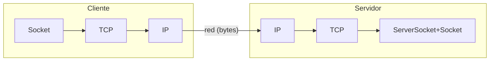
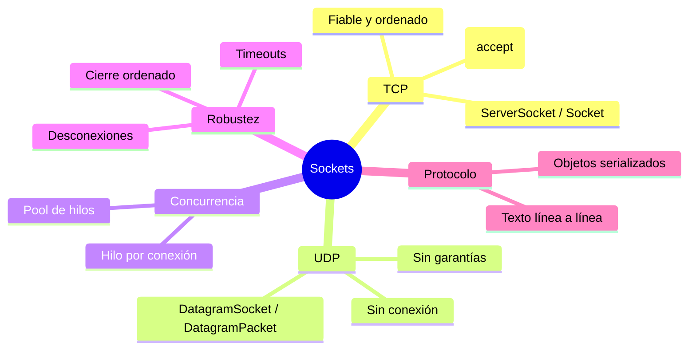
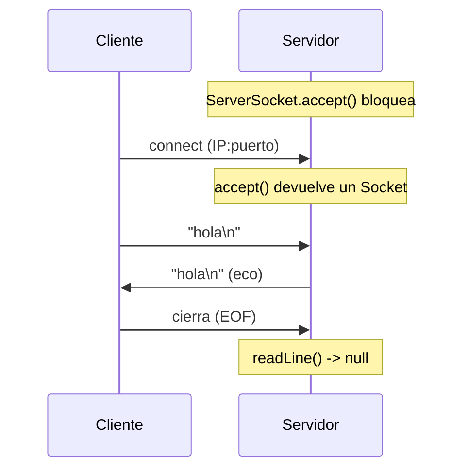
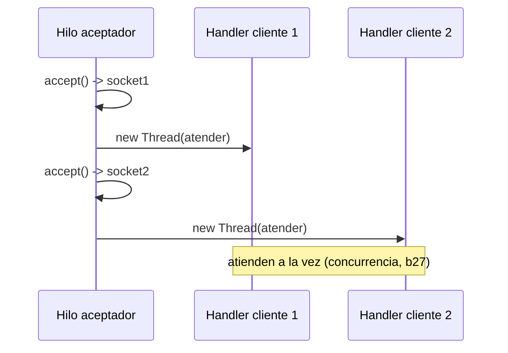
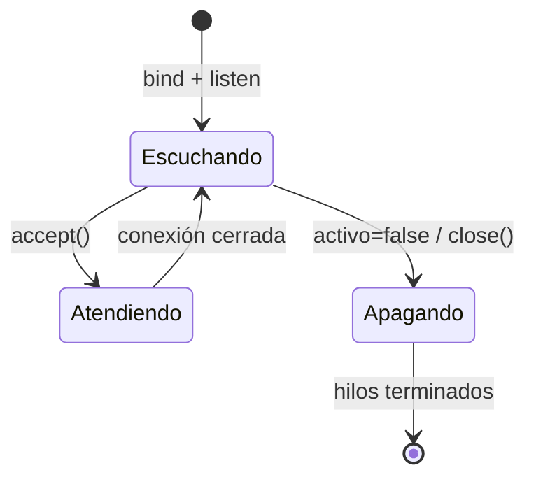

# Bloque XXIX · Sockets y programación en red

> Llevas todo el bootcamp consumiendo y construyendo APIs REST sobre HTTP, con Spring
> poniéndote la red "ya resuelta". Pero, ¿qué hay debajo? Un **socket**: dos programas, en
> dos máquinas (o la misma), intercambiando bytes por un canal. PSP (módulo 0490 de 2º DAM,
> RA3) te pide bajar a ese nivel: abrir tú el socket, escribir tú los bytes, gestionar tú a
> varios clientes a la vez. Cuando lo domines, la frase "un endpoint REST no es magia"
> dejará de ser un eslogan y será algo que sabes construir desde cero.

> **Puente mental del bloque:** un servidor REST = este servidor de sockets **+ HTTP**
> (el protocolo, `b00`) **+ Spring** (el framework que enruta y serializa, `b05`). Aquí
> construyes la base; en `b29·Ej236` montas tu propio mini-protocolo de aplicación y verás
> que HTTP es "lo mismo pero estandarizado". Cruza además con la concurrencia de `b27`
> (un servidor atiende a muchos a la vez) y con la serialización de `b26·Ej210`.

## Cómo usar este documento

Lee UNA sección → haz SU ejercicio → vuelve. Cada sección cierra con **"Lo practicas en…"**.

| Sección | Tema | Ejercicio |
|---|---|---|
| 29.1 | Servidor de eco TCP: `ServerSocket`, `accept`, streams | `Ej233TcpEchoServer` |
| 29.2 | Cliente TCP, `setSoTimeout`, `ConnectException` | `Ej234TcpClient` |
| 29.3 | Servidor multicliente: un hilo por conexión | `Ej235MultiClientThreadedServer` |
| 29.4 | Protocolo de aplicación propio (mini key-value) | `Ej236ApplicationProtocol` |
| 29.5 | UDP: datagramas sin conexión | `Ej237UdpDatagrams` |
| 29.6 | Enviar objetos serializados por socket | `Ej238ObjectOverSocket` |
| 29.7 | Servidor con pool de hilos (`ExecutorService`) | `Ej239ServerWithThreadPool` |
| 29.8 | Cierre ordenado, timeouts y desconexiones | `Ej240GracefulShutdownAndTimeouts` |

### El modelo cliente-servidor y la pila TCP/IP mínima

Un **socket** es un extremo de comunicación identificado por `(IP, puerto)`. El **servidor**
abre un puerto y *escucha*; el **cliente** *conecta* a ese `(IP, puerto)`. Una vez conectados,
hay un canal bidireccional de bytes: lo que uno escribe, el otro lo lee.



De la pila TCP/IP solo necesitas dos capas para PSP: **transporte** (TCP fiable / UDP ligero)
y, por encima, **tu protocolo de aplicación** (texto, objetos, o HTTP si fuera REST). El SO se
encarga de IP y de abajo.



---

## 29.1 Servidor de eco TCP: `ServerSocket`, `accept` y los streams del socket

El "hola mundo" de la red es el **servidor de eco**: acepta una conexión, lee una línea y la
devuelve tal cual. Sobre ese esqueleto se construye todo lo demás.

```java
try (ServerSocket server = new ServerSocket(0)) {  // puerto 0 = "el SO me asigna uno libre"
    int puerto = server.getLocalPort();
    Socket s = server.accept();                    // BLOQUEA hasta que llega un cliente
    try (BufferedReader in = new BufferedReader(
                 new InputStreamReader(s.getInputStream(), StandardCharsets.UTF_8));
         PrintWriter out = new PrintWriter(
                 new OutputStreamWriter(s.getOutputStream(), StandardCharsets.UTF_8), true)) {
        String linea = in.readLine();              // null si el cliente cierra (EOF)
        out.println(linea);                        // autoFlush=true => se envía al instante
    }
}
```

Tres ideas clave:

- **`accept()` bloquea.** El hilo se queda parado hasta que un cliente conecta; entonces
  devuelve un `Socket` ya conectado con ese cliente concreto.
- **Los streams del socket se usan como los de un fichero** (`b26`): envuelve el `InputStream`
  en un `BufferedReader` para leer líneas, y el `OutputStream` en un `PrintWriter`/`BufferedWriter`
  para escribir. **Siempre con `Charset` explícito** (UTF-8) o romperás los acentos.
- **`readLine()` devuelve `null` en fin de stream (EOF):** así te enteras de que el otro lado
  cerró. Una línea vacía es `""`, no `null`.

El intercambio lógico, sin entrar en el handshake TCP de bajo nivel:



El puerto efímero (`new ServerSocket(0)`) es imprescindible en tests: evita chocar con puertos
ocupados y permite ejecutar en paralelo sin colisiones.

> **Lo practicas en `Ej233TcpEchoServer`**: levantas un eco TCP en puerto efímero, lo
> conectas con un cliente y manejas el EOF, los acentos (UTF-8), el eco de varias líneas y
> transformaciones del servidor (mayúsculas, invertir, prefijo).

---

## 29.2 Cliente TCP: conectar sin colgarse (`setSoTimeout`, `ConnectException`)

El cliente es la otra mitad. Conectar es una línea; lo difícil es **no quedarse colgado**.

```java
try (Socket cliente = new Socket("localhost", puerto)) {
    cliente.setSoTimeout(2000);   // ms máximos esperando en una lectura (0 = infinito)
    PrintWriter out = new PrintWriter(new OutputStreamWriter(
            cliente.getOutputStream(), UTF_8), true);
    BufferedReader in = new BufferedReader(new InputStreamReader(
            cliente.getInputStream(), UTF_8));
    out.println("ping");
    String resp = in.readLine();  // si en 2 s no llega nada -> SocketTimeoutException
}
```

Dos fallos de red que **debes** distinguir (ambos son `IOException`, captúralos específicos):

| Situación | Excepción | Causa |
|---|---|---|
| Nadie escucha en ese puerto | `ConnectException` | el `connect` falla de entrada |
| El peer no responde a tiempo | `SocketTimeoutException` | venció `setSoTimeout` en una lectura |
| El peer cerró la conexión | `readLine()` devuelve `null` / `read()` `-1` | EOF, no excepción |

Sin `setSoTimeout`, un servidor mudo cuelga tu hilo **para siempre**. En un cliente real es
la diferencia entre "tarda" y "la app se congela".

**TCP es un flujo, no paquetes:** un `write` grande puede llegar troceado en varios `read`,
y dos `write` pequeños pueden llegar juntos. No asumas "1 write = 1 read"; por eso se delimita
con `\n` (`readLine`) o con una longitud por delante.

> **Lo practicas en `Ej234TcpClient`**: aplicas timeouts, provocas `ConnectException` y
> `SocketTimeoutException` a propósito, lees hasta EOF, envías bytes crudos con `shutdownOutput()`
> y compruebas que un mensaje de 10.000 caracteres llega completo (TCP como stream).

---

## 29.3 Servidor multicliente: un hilo por conexión

Un servidor que atiende un cliente y se acaba no sirve. El patrón clásico (PSP RA3.i) es:
**bucle infinito de `accept()` + un hilo nuevo por cada conexión**.

```java
while (activo) {
    Socket s = server.accept();              // espera al siguiente cliente
    new Thread(() -> atender(s)).start();    // lo atiende en paralelo; el bucle sigue
}
```

Así el `accept()` vuelve enseguida a por el siguiente mientras los anteriores siguen hablando.



Aquí los sockets se cruzan con la **concurrencia (`b27`)**: si los handlers comparten estado
(un contador de visitas, un mapa de sesiones), ese estado **debe protegerse** (`AtomicInteger`,
`ConcurrentHashMap`, `synchronized`), o tendrás condiciones de carrera. Y las variables de
cada conexión (la línea leída) deben ser **locales** al handler, nunca campos compartidos, o
los mensajes de un cliente se cruzarían con los de otro.

El inconveniente: un hilo por conexión **no escala** a decenas de miles de clientes (cada hilo
consume memoria). La solución es el pool (29.7).

> **Lo practicas en `Ej235MultiClientThreadedServer`**: atiendes varios clientes a la vez,
> demuestras concurrencia real con una `CyclicBarrier`, proteges un contador compartido,
> aíslas el fallo de un handler y cierras el servidor desbloqueando `accept()`.

---

## 29.4 Tu propio protocolo de aplicación: un mini key-value server

Un socket transporta bytes; el **protocolo** es el acuerdo de qué significan. Vamos a inventar
uno textual, línea a línea, sobre un mapa en memoria — un Redis de juguete:

```
PUT clave valor   -> "OK"
GET clave         -> el valor, o "NIL" si no existe
QUIT              -> el servidor cierra la conexión
(cualquier otra)  -> "ERROR"
```

```java
String[] partes = linea.split(" ", 3);     // límite 3: el valor puede llevar espacios
switch (partes[0]) {
    case "PUT" -> { mapa.put(partes[1], partes[2]); out.println("OK"); }
    case "GET" -> out.println(mapa.getOrDefault(partes[1], "NIL"));
    case "QUIT" -> { return; }              // sale del bucle y cierra
    default    -> out.println("ERROR");     // un protocolo robusto NUNCA se queda mudo
}
```

Detalles que el examen y los tests castigan:

- **`split(" ", 3)`** y no `split(" ")`: con límite 3, `"PUT frase hola mundo"` da
  `["PUT","frase","hola mundo"]` y el valor conserva sus espacios.
- **Sensible a mayúsculas:** si comparas con `"GET"`, entonces `"get"` cae en `default` →
  `"ERROR"`. Decide y documenta (o normaliza con `toUpperCase`).
- **Estado compartido entre clientes:** el mapa debe ser **único y concurrente**
  (`ConcurrentHashMap`), compartido por todos los handlers. Si cada handler crea su propio
  mapa, un cliente no verá lo que escribió otro (bug clásico).

Esto es, conceptualmente, lo que hace HTTP: un verbo (`GET`/`PUT`/`POST`...), un recurso y un
cuerpo. Cuando en `b05` escribiste `@GetMapping`, Spring parseaba un protocolo como este por ti.

> **Lo practicas en `Ej236ApplicationProtocol`**: implementas el parser de comandos,
> manejas `PUT`/`GET`/`QUIT`/`ERROR`, preservas valores con espacios, compartes el estado
> entre clientes con un mapa concurrente y cuentas comandos procesados.

---

## 29.5 UDP: datagramas sin conexión

TCP es un flujo fiable con conexión. **UDP es lo contrario:** envías `DatagramPacket` sueltos
por un `DatagramSocket`, **sin conexión, sin garantía de entrega ni de orden**. A cambio es más
ligero: lo usan DNS, streaming, juegos y VoIP, donde llegar tarde es peor que perder un dato.

```java
// Servidor
DatagramSocket servidor = new DatagramSocket(0);
byte[] buf = new byte[1024];
DatagramPacket pkt = new DatagramPacket(buf, buf.length);
servidor.receive(pkt);                       // bloquea hasta recibir un datagrama
// responder: la dirección del remitente viaja EN el paquete recibido
DatagramPacket resp = new DatagramPacket(
        pkt.getData(), pkt.getLength(), pkt.getAddress(), pkt.getPort());
servidor.send(resp);
```

No hay `accept()` ni `ServerSocket`: **ambos lados usan `DatagramSocket`**. Diferencias que
debes tener clarísimas:

| | TCP | UDP |
|---|---|---|
| Conexión | sí (`accept`/`connect`) | no (cada datagrama es autónomo) |
| Fiabilidad | garantizada (reenvía) | ninguna (se puede perder) |
| Orden | garantizado | no garantizado |
| Unidad | flujo de bytes (`stream`) | datagrama (mensaje entero o nada) |
| API Java | `ServerSocket` / `Socket` | `DatagramSocket` / `DatagramPacket` |
| Uso típico | HTTP, BBDD, ficheros | DNS, vídeo, juegos, VoIP |

La trampa nº1 de UDP: **el buffer corto trunca en silencio.** Si el `DatagramPacket` de
recepción tiene un `byte[]` de 4 y llega un datagrama de 10 bytes, recibes solo 4 y los otros 6
se **descartan** (no hay reensamblado como en TCP). Usa siempre `pkt.getLength()` para los
bytes realmente recibidos, nunca `buffer.length`.

> **Lo practicas en `Ej237UdpDatagrams`**: montas un eco UDP, respondes al remitente leyendo
> su dirección del paquete, aplicas `setSoTimeout` a `receive()`, compruebas el truncado por
> buffer pequeño y verificas que UDP no necesita conexión.

---

## 29.6 Enviar objetos Java por el socket (serialización)

Hasta ahora mandabas texto. Pero por un socket puedes mandar **objetos enteros**:
`ObjectOutputStream.writeObject(obj)` los convierte en bytes y `ObjectInputStream.readObject()`
los reconstruye. El objeto (y todo su grafo) debe implementar `Serializable`.

```java
// Cliente
ObjectOutputStream out = new ObjectOutputStream(socket.getOutputStream());
out.writeObject(new Punto(3, 4));
out.flush();
// Servidor
ObjectInputStream in = new ObjectInputStream(socket.getInputStream());
Punto p = (Punto) in.readObject();   // lanza ClassNotFoundException si la clase no está
```

Puntos finos (enlazan con `b26·Ej210`):

- **Orden de creación de streams:** crear un `ObjectOutputStream` escribe una cabecera en el
  stream. Si ambos extremos crean primero el `ObjectInputStream`, se bloquean mutuamente
  esperando esa cabecera. Regla: **crea primero el OutputStream (y `flush`), luego el InputStream.**
- **`transient` no se serializa:** un campo `transient` (una contraseña, una caché) se
  reconstruye como `null`/`0`. Justo para no enviar secretos por la red.
- **Referencias compartidas:** escribir dos veces el mismo objeto NO lo duplica; el stream
  guarda una back-reference y al leer obtienes la **misma instancia** (`==`). `out.reset()`
  rompe esa caché (necesario en servidores de larga vida para no fugar memoria).
- **Seguridad:** la serialización nativa es cómoda pero **insegura** con datos no confiables
  (gadget chains). En producción se prefiere JSON (`b02`) o Protobuf. Aquí es didáctica.

> **Lo practicas en `Ej238ObjectOverSocket`**: envías records y listas por el socket,
> compruebas que `transient` no viaja, serializas grafos de objetos, observas la diferencia
> entre referencia compartida y `reset()`, y provocas `NotSerializableException`.

---

## 29.7 Servidor con pool de hilos (`ExecutorService`)

"Un hilo por conexión" (29.3) es simple pero peligroso: 10.000 clientes = 10.000 hilos = máquina
muerta. La solución profesional es un **pool acotado** (`b27·Ej219`): el aceptador delega cada
conexión a un `ExecutorService` que reutiliza un número fijo de hilos.

```java
ExecutorService pool = Executors.newFixedThreadPool(nHilos);
while (activo) {
    Socket s = server.accept();
    pool.submit(() -> atender(s));   // si todos los hilos están ocupados, espera en cola
}
```

Ventaja clave: la concurrencia simultánea **nunca supera `nHilos`**, aunque lleguen miles de
conexiones; el resto esperan en la cola del executor. El servidor **degrada con gracia** bajo
carga en vez de reventar. Es exactamente lo que hace Tomcat/Spring por debajo (un pool de
*worker threads*).

| Mecanismo | Cuándo | Riesgo |
|---|---|---|
| Hilo por conexión (29.3) | pocos clientes, código simple | no escala (memoria por hilo) |
| `newFixedThreadPool(n)` | carga acotada y predecible | cola ilimitada por defecto (memoria) |
| `newCachedThreadPool()` | ráfagas de tareas cortas | puede crear muchos hilos en un pico |
| `ThreadPoolExecutor` + cola acotada + `AbortPolicy` | back-pressure real | rechaza con `RejectedExecutionException` |

El **back-pressure** (rechazar trabajo cuando estás saturado) es preferible a aceptarlo todo y
caer. Una cola acotada con `AbortPolicy` convierte el exceso en `RejectedExecutionException`,
que puedes traducir a un "503 Service Unavailable" en el mundo REST.

> **Lo practicas en `Ej239ServerWithThreadPool`**: sirves a muchos clientes con un pool fijo,
> mides que la concurrencia no pasa del tamaño del pool, encolas el exceso, provocas rechazo
> con cola acotada y nombras los worker threads con un `ThreadFactory`.

---

## 29.8 Cierre ordenado, timeouts y desconexiones

Arrancar un servidor es fácil; **apagarlo bien y sobrevivir a clientes que se portan mal** es
lo que lo hace usable. El ciclo de vida de un servidor:



Las cuatro herramientas del cierre robusto:

1. **Bandera `volatile boolean activo`** para parar el bucle de aceptación. `volatile` es
   imprescindible: sin él, el hilo aceptador podría no ver el cambio (visibilidad, `b27`) y no
   parar nunca.
2. **`server.close()` desde otro hilo** para desbloquear un `accept()` colgado: lanza
   `SocketException` en el `accept`, que interpretas como "hora de apagar".
3. **`setSoTimeout`** en `accept()` y en las lecturas, para no esperar eternamente y poder
   re-comprobar la bandera periódicamente (`SocketTimeoutException` → sigue el bucle).
4. **`try-with-resources`** sobre `Socket`/`ServerSocket` (son `AutoCloseable`) para no fugar
   descriptores ("Too many open files"). `close()` es idempotente: llamarlo dos veces no falla.

Y la regla de oro: **una desconexión abrupta de un cliente no debe tumbar el servidor.** Cada
handler corre en su propio `try/catch`; un cliente que cierra a media frase produce una
`IOException` o un `readLine()==null` que capturas y registras, mientras los demás clientes
siguen atendidos. En internet los clientes se caen constantemente; el servidor lo asume.

Esto es el mismo principio que el *graceful shutdown* de Spring (`b22·Ej193`): deja de aceptar
trabajo nuevo, termina el que está en curso, y luego cierra.

> **Lo practicas en `Ej240GracefulShutdownAndTimeouts`**: paras el bucle con una bandera
> `volatile`, desbloqueas `accept()` cerrando el `ServerSocket`, aplicas timeouts a accept y
> lectura, toleras desconexiones abruptas y cierras el pool con `awaitTermination`.

---

## Errores comunes del bloque

| # | Error | Antídoto |
|---|---|---|
| 1 | Leer/escribir sin `Charset` explícito → acentos rotos (mojibake) | `new InputStreamReader(in, StandardCharsets.UTF_8)` en ambos lados |
| 2 | Confundir EOF con error: tratar `readLine()==null` como excepción | `null` (o `read()==-1`) significa "el peer cerró"; gestiónalo, no es un fallo |
| 3 | No poner `setSoTimeout` → el cliente/servidor se cuelga si el otro no responde | `socket.setSoTimeout(ms)` antes de leer; captura `SocketTimeoutException` |
| 4 | Olvidar `flush()` con `BufferedWriter`/`ObjectOutputStream` → el peer no recibe nada | `flush()` tras escribir (o `PrintWriter(out, true)` con autoFlush) |
| 5 | `split(" ")` sin límite → se pierde el resto del valor con espacios | `split(" ", 3)` para conservar el último campo entero |
| 6 | Estado por conexión guardado en un campo compartido → mensajes cruzados | variables **locales** al handler; estado global con `ConcurrentHashMap`/atómicos |
| 7 | Un hilo por conexión a escala masiva → la máquina muere | `ExecutorService` con pool acotado (29.7) |
| 8 | En UDP, usar `buffer.length` en vez de `pkt.getLength()` → datos basura o truncados | siempre `pkt.getLength()`; dimensiona el buffer ≥ datagrama esperado |
| 9 | `ObjectInputStream` antes que `ObjectOutputStream` en ambos lados → interbloqueo | crea primero el OutputStream (+`flush`), luego el InputStream |
| 10 | No cerrar sockets (sin `try-with-resources`) → fuga de descriptores | `try (Socket s = ...)`; `close()` es idempotente |
| 11 | Bandera de parada sin `volatile` → el bucle de `accept` no ve el cambio y no para | `volatile boolean activo` (visibilidad entre hilos, `b27`) |
| 12 | Una excepción en un handler tumba todo el servidor | cada handler en su `try/catch`; aísla el fallo por conexión |

---

## Chuleta final del bloque

```java
// === TCP servidor de eco (puerto efímero) ===
try (ServerSocket server = new ServerSocket(0)) {
    int puerto = server.getLocalPort();
    Socket s = server.accept();                              // bloquea
    var in  = new BufferedReader(new InputStreamReader(s.getInputStream(), UTF_8));
    var out = new PrintWriter(new OutputStreamWriter(s.getOutputStream(), UTF_8), true);
    String l; while ((l = in.readLine()) != null) out.println(l);   // eco hasta EOF
}

// === TCP cliente con timeout ===
try (Socket c = new Socket("localhost", puerto)) {
    c.setSoTimeout(2000);                                    // SocketTimeoutException si vence
    var out = new PrintWriter(new OutputStreamWriter(c.getOutputStream(), UTF_8), true);
    var in  = new BufferedReader(new InputStreamReader(c.getInputStream(), UTF_8));
    out.println("hola"); String resp = in.readLine();
}                                                            // ConnectException si nadie escucha

// === Servidor multicliente ===
while (activo) { Socket s = server.accept(); new Thread(() -> atender(s)).start(); }
// ... o mejor con pool: pool.submit(() -> atender(s));   // ExecutorService acotado

// === UDP ===
DatagramSocket ds = new DatagramSocket(0);
byte[] buf = new byte[1024];
DatagramPacket pkt = new DatagramPacket(buf, buf.length);
ds.receive(pkt);                                             // usa pkt.getLength(), NO buf.length
ds.send(new DatagramPacket(pkt.getData(), pkt.getLength(), pkt.getAddress(), pkt.getPort()));

// === Objetos por socket ===
var oos = new ObjectOutputStream(s.getOutputStream()); oos.writeObject(obj); oos.flush(); // 1º out
var ois = new ObjectInputStream(s.getInputStream());  T o = (T) ois.readObject();          // 2º in

// === Cierre robusto ===
server.setSoTimeout(500);          // accept() re-mira la bandera periódicamente
volatile boolean activo;           // bandera de parada visible entre hilos
server.close();                    // desbloquea accept() -> SocketException
// try-with-resources + close() idempotente; cada handler en su try/catch
```

---

## Autoevaluación

1. ¿Qué hace exactamente `ServerSocket.accept()` y por qué se dice que "bloquea"? (29.1)
2. ¿Cómo distingues, en el cliente, que "nadie escucha el puerto" de que "el servidor no
   responde a tiempo"? ¿Qué excepción corresponde a cada caso? (29.2)
3. ¿Por qué no debes asumir que cada `write` del emisor corresponde a un `read` del receptor en
   TCP, y cómo se delimitan entonces los mensajes? (29.2)
4. En un servidor con un hilo por conexión, ¿qué partes del estado deben ser locales al handler
   y cuáles compartidas-protegidas, y con qué herramientas las proteges? (29.3, 29.7)
5. En tu mini key-value server, ¿por qué `split(" ", 3)` y no `split(" ")`? ¿Qué pasa con un
   comando en minúsculas? (29.4)
6. Enumera tres diferencias esenciales entre TCP y UDP y di qué tipo usarías para vídeo en
   directo y por qué. (29.5)
7. ¿Por qué hay que crear el `ObjectOutputStream` antes que el `ObjectInputStream` en ambos
   extremos, y qué efecto tiene un campo `transient` al enviarse por socket? (29.6)
8. ¿Qué ventaja da un pool de hilos frente a "un hilo por conexión" bajo carga alta, y cómo
   consigues *back-pressure* en vez de aceptar trabajo hasta caer? (29.7)
9. Cita las cuatro herramientas del cierre ordenado de un servidor y explica por qué la bandera
   de parada debe ser `volatile`. (29.8)
