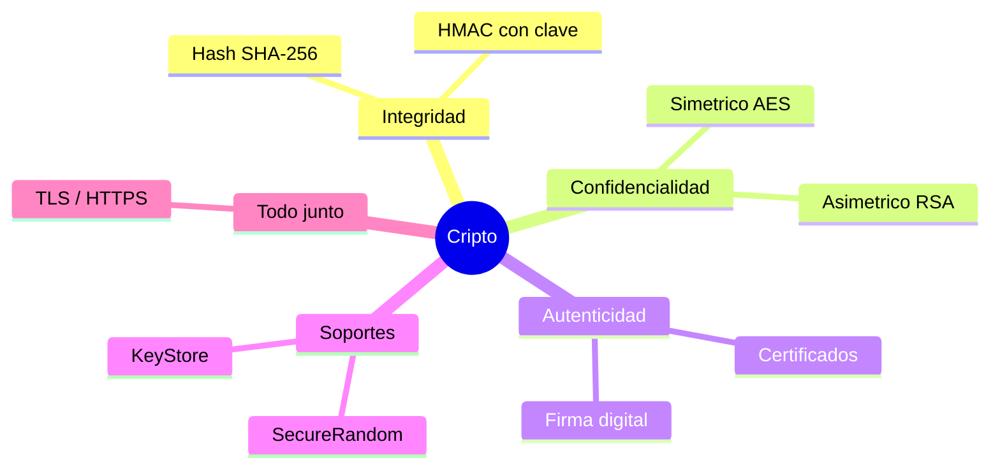
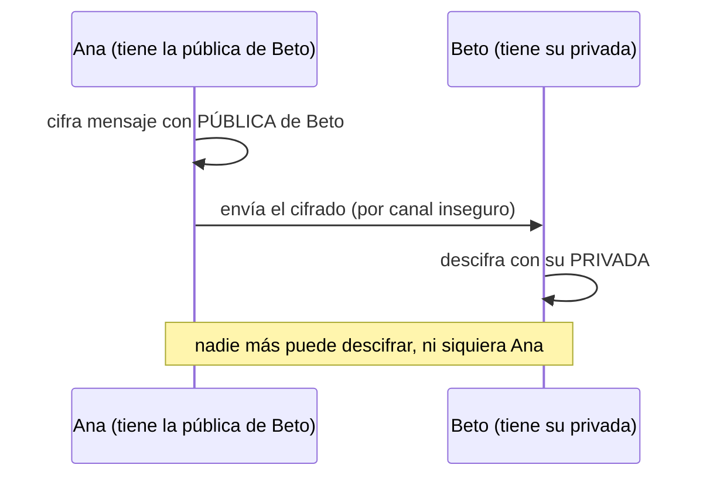
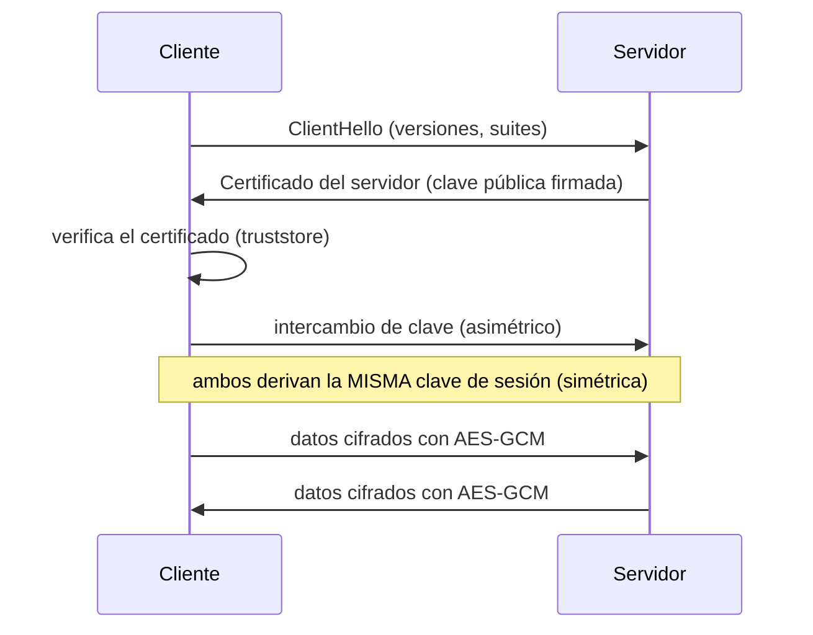

# Bloque XXX · Criptografía y programación segura

> En `b18` pusiste seguridad a una API REST: autenticación con JWT, roles, BCrypt. Pero
> usaste la criptografía como una caja negra ("encóder.encode(password)"). PSP RA5 (módulo
> 0490 de 2º DAM) te pide abrir esa caja: entender qué es un hash, por qué un salt, cómo cifra
> AES, qué es una clave pública, qué firma un certificado y por qué HTTPS es seguro. No para
> que inventes tu cripto —eso es justo lo que NUNCA hay que hacer— sino para usar bien la del
> JDK y reconocer cuándo algo está mal hecho.

> **Regla nº 0 (la más importante del bloque):** *no inventes criptografía propia*. Usa
> primitivas estándar (`java.security`, `javax.crypto`) con parámetros recomendados. El 90% de
> los fallos no es romper AES, es usarlo mal (IV reutilizado, ECB, comparar con `equals`,
> `Random` en vez de `SecureRandom`). Este bloque te enseña los usos correctos y los "pecados".

## Cómo usar este documento

Lee UNA sección → haz SU ejercicio → vuelve. Cada sección cierra con **"Lo practicas en…"**.

| Sección | Tema | Ejercicio |
|---|---|---|
| 30.1 | Hash / digest (SHA-256), integridad | `Ej241Hashing` |
| 30.2 | Contraseñas: salt + hashing lento (PBKDF2) | `Ej242PasswordHashingSalt` |
| 30.3 | Cifrado simétrico (AES, modos, IV) | `Ej243SymmetricAes` |
| 30.4 | Cifrado asimétrico (RSA, pública/privada) | `Ej244AsymmetricRsa` |
| 30.5 | Firma digital (autenticidad, no repudio) | `Ej245DigitalSignature` |
| 30.6 | HMAC y aleatoriedad segura (`SecureRandom`) | `Ej246HmacAndSecureRandom` |
| 30.7 | KeyStore: custodia de claves y certificados | `Ej247KeyStore` |
| 30.8 | TLS: canal seguro (cifrado híbrido) | `Ej248TlsSecureChannel` |

### El mapa: hash vs cifrado vs firma

Tres herramientas que se confunden todo el rato. Quédate con esta tabla:

| Herramienta | ¿Reversible? | ¿Necesita clave? | ¿Para qué sirve? | Ejemplo JDK |
|---|---|---|---|---|
| **Hash** (SHA-256) | No (un solo sentido) | No | Integridad, huella | `MessageDigest` |
| **HMAC** | No | Sí (secreta compartida) | Integridad + autenticidad | `Mac` |
| **Cifrado simétrico** (AES) | Sí | Sí (1 clave compartida) | Confidencialidad (mucho dato) | `Cipher` |
| **Cifrado asimétrico** (RSA) | Sí | Sí (par pública/privada) | Confidencialidad (poco dato), intercambio de clave | `Cipher` |
| **Firma** (SHA256withRSA) | — (se verifica) | Sí (privada firma, pública verifica) | Autenticidad, integridad, no repudio | `Signature` |



---

## 30.1 Hash: la huella digital de los datos

Un **hash** (digest, resumen) convierte cualquier entrada en una salida de tamaño fijo
(SHA-256 → 32 bytes), de forma **determinista**, **irreversible** y **resistente a colisiones**.
Sirve para **integridad**: ¿estos bytes son los mismos que antes?

```java
MessageDigest md = MessageDigest.getInstance("SHA-256");
byte[] hash = md.digest("abc".getBytes(StandardCharsets.UTF_8));
String hex = HexFormat.of().formatHex(hash);
// ba7816bf8f01cfea414140de5dae2223b00361a396177a9cb410ff61f20015ad  (¡valor famoso!)
```

Propiedades clave:

- **Efecto avalancha:** cambiar un solo bit de la entrada cambia ~la mitad de los bits del
  hash. `sha256("abc") != sha256("abd")` y no se parecen en nada.
- **Tamaño fijo:** SHA-256 siempre da 32 bytes (64 hex), sea `""` o un libro entero.
- **Incremental:** puedes hashear por bloques con `update()`, ideal para ficheros grandes (`b26`).

```java
md.update("ab".getBytes(UTF_8));
md.update("c".getBytes(UTF_8));
byte[] igual = md.digest();   // == sha256("abc")
```

⚠️ **MD5 y SHA-1 están rotos** (se fabrican colisiones): reconócelos, pero no los uses para
seguridad. Y **un hash NO sirve para contraseñas** (es rápido y sin sal): eso es la sección 30.2.

Para comparar hashes/secretos usa `MessageDigest.isEqual(a, b)`, que compara en **tiempo
constante** (no cortocircuita), evitando *timing attacks*.

> **Lo practicas en `Ej241Hashing`**: calculas SHA-256/MD5/SHA-1 en hex, verificas integridad,
> compruebas el efecto avalancha, el hash incremental y la comparación en tiempo constante.

---

## 30.2 Contraseñas: salt + hashing lento

Guardar `sha256(password)` es un error grave: (1) es rapidísimo → fuerza bruta con GPU; (2) sin
sal, dos usuarios con la misma contraseña tienen el mismo hash y las *rainbow tables* lo rompen.
La solución son dos ideas:

1. **Salt aleatorio por usuario** (único, no secreto): hace que la misma contraseña dé hashes
   distintos y anula las tablas precalculadas.
2. **Hashing lento con coste configurable** (PBKDF2, bcrypt, scrypt, argon2): muchas iteraciones
   para que probar millones de contraseñas sea inviable.

```java
byte[] salt = new byte[16];
new SecureRandom().nextBytes(salt);                       // salt aleatorio único
KeySpec spec = new PBEKeySpec(password.toCharArray(), salt, 100_000, 256); // 100k iteraciones
SecretKeyFactory f = SecretKeyFactory.getInstance("PBKDF2WithHmacSHA256");
byte[] hash = f.generateSecret(spec).getEncoded();        // 32 bytes
// se guarda "saltHex:hashHex"; para verificar, re-derivas con EL MISMO salt y comparas con isEqual
```

Esto es exactamente lo que hace por dentro el `BCryptPasswordEncoder` de Spring Security
(`b18·Ej157`): salt embebido + factor de coste. La diferencia es la receta (bcrypt vs PBKDF2);
el principio es idéntico. Verificar = re-derivar con el salt guardado y comparar en tiempo
constante (`MessageDigest.isEqual`).

> **Lo practicas en `Ej242PasswordHashingSalt`**: derivas con PBKDF2 + salt aleatorio, verificas
> contraseñas correctas/incorrectas, ves que la misma contraseña da hashes distintos y que
> cambiar salt o iteraciones cambia el resultado.

---

## 30.3 Cifrado simétrico: AES

En el cifrado **simétrico**, la MISMA clave cifra y descifra. AES es el estándar. Pero "AES" no
basta: hay que elegir **modo** e **IV** (vector de inicialización).

```java
KeyGenerator kg = KeyGenerator.getInstance("AES");
kg.init(256);
SecretKey clave = kg.generateKey();

byte[] iv = new byte[12];
new SecureRandom().nextBytes(iv);                          // IV único por mensaje, NO secreto
Cipher c = Cipher.getInstance("AES/GCM/NoPadding");
c.init(Cipher.ENCRYPT_MODE, clave, new GCMParameterSpec(128, iv));
byte[] cifrado = c.doFinal("mensaje".getBytes(UTF_8));
```

Modos de operación (esto cae en el examen):

| Modo | Seguridad | Notas |
|---|---|---|
| **ECB** | ❌ Inseguro | bloques iguales → cifrado igual; filtra patrones ("pingüino ECB"). Nunca. |
| **CBC** | ⚠️ Solo confidencialidad | encadena bloques, necesita IV aleatorio; no detecta manipulación. |
| **GCM** | ✅ Recomendado | *autenticado* (AEAD): cifra **y** detecta cualquier alteración. |

Reglas de oro del simétrico:

- **IV único por mensaje** (aleatorio) y se envía junto al cifrado (no es secreto). Reutilizar
  (clave, IV) rompe la seguridad, sobre todo en GCM.
- **Mismo texto + IV distinto → cifrado distinto:** un atacante no puede saber si dos mensajes
  cifrados son iguales.
- **GCM detecta manipulación:** si alteras un byte del cifrado, `doFinal` lanza
  `AEADBadTagException`. CBC no te da esto.

> **Lo practicas en `Ej243SymmetricAes`**: cifras/descifras con GCM y CBC, generas IVs aleatorios,
> demuestras por qué ECB es inseguro, que GCM detecta manipulación y el papel del IV.

---

## 30.4 Cifrado asimétrico: RSA

El simétrico tiene un problema: ¿cómo le haces llegar la clave al otro de forma segura? El
cifrado **asimétrico** usa un PAR de claves ligadas matemáticamente:

- Lo que cifra la **pública**, solo lo descifra la **privada** → **confidencialidad**.
- La pública se reparte a todos; la privada no sale nunca de su dueño.

```java
KeyPairGenerator kpg = KeyPairGenerator.getInstance("RSA");
kpg.initialize(2048);
KeyPair par = kpg.generateKeyPair();

Cipher c = Cipher.getInstance("RSA/ECB/OAEPWithSHA-256AndMGF1Padding");  // OAEP = padding seguro
c.init(Cipher.ENCRYPT_MODE, par.getPublic());
byte[] cifrado = c.doFinal("clave de sesión".getBytes(UTF_8));
// para descifrar: c.init(DECRYPT_MODE, par.getPrivate())
```



Limitaciones de RSA:

- **Lento** y **solo cifra datos pequeños** (RSA-2048 + OAEP ≈ 190 bytes). Por eso NO se cifran
  ficheros con RSA: se cifra una **clave AES** con RSA y el grueso con AES → cifrado **híbrido**
  (lo que hace TLS, 30.8).
- Formatos estándar: pública en **X.509**, privada en **PKCS#8**. Con `KeyFactory` reconstruyes
  una clave desde sus bytes para enviarla por la red.
- Con padding **OAEP**, cifrar dos veces el mismo texto da cifrados distintos (aleatoriedad).

> **Lo practicas en `Ej244AsymmetricRsa`**: generas pares RSA, cifras pública→privada, inspeccionas
> formatos y tamaño de clave, ves que RSA no cifra datos grandes y reconstruyes claves desde bytes.

---

## 30.5 Firma digital: autenticidad y no repudio

El cifrado oculta; la **firma** demuestra QUIÉN escribió algo y que no cambió. Es el uso inverso
del par: se firma con la **privada** y se verifica con la **pública**.

```java
Signature firmador = Signature.getInstance("SHA256withRSA");
firmador.initSign(par.getPrivate());
firmador.update(mensaje.getBytes(UTF_8));
byte[] firma = firmador.sign();                 // 256 bytes con RSA-2048

Signature verificador = Signature.getInstance("SHA256withRSA");
verificador.initVerify(par.getPublic());
verificador.update(mensaje.getBytes(UTF_8));
boolean valida = verificador.verify(firma);     // true solo si el mensaje no cambió
```

Una firma válida garantiza tres cosas:

- **Autenticidad:** lo firmó el dueño de la privada (nadie más la tiene).
- **Integridad:** si el mensaje cambia un solo byte, `verify()` da `false` (la firma incluye un
  hash del contenido — "SHA256withRSA" = SHA-256 + RSA).
- **No repudio:** el firmante no puede negar su firma.

`SHA256withRSA` (PKCS#1 v1.5) es **determinista** (misma clave + mensaje → misma firma);
**ECDSA** y **RSA-PSS** no lo son. Y ECDSA (curva elíptica) da la misma seguridad que RSA con
claves mucho más cortas (EC-256 ≈ RSA-3072), por eso domina hoy:

```java
KeyPairGenerator ec = KeyPairGenerator.getInstance("EC");
ec.initialize(256);
// luego Signature.getInstance("SHA256withECDSA")
```

Esto es lo que firma un JWT (`b18`), un certificado o un release de software.

> **Lo practicas en `Ej245DigitalSignature`**: firmas con privada y verificas con pública,
> compruebas que alterar el mensaje o la firma invalida, firmas con ECDSA y demuestras el no repudio.

---

## 30.6 HMAC y aleatoriedad segura

**HMAC** es un hash con clave secreta: solo quien tiene la clave puede generar o verificar el
código. Da integridad **y** autenticidad sin necesidad de claves asimétricas (más rápido).

```java
Mac mac = Mac.getInstance("HmacSHA256");
mac.init(new SecretKeySpec("clave-secreta".getBytes(UTF_8), "HmacSHA256"));
byte[] codigo = mac.doFinal("mensaje".getBytes(UTF_8));   // 32 bytes, determinista con esa clave
```

Es lo que firma un JWT con algoritmo **HS256** (`b18`) y lo que valida los *webhooks* de GitHub
o Stripe (el emisor manda `HMAC(cuerpo, secreto_compartido)` y tú lo recalculas). **Compara
HMACs siempre con `MessageDigest.isEqual`**, nunca con `equals`/`Arrays.equals` (timing attack).

La segunda mitad: **aleatoriedad segura**. Salts, IVs, claves, tokens, nonces... todo necesita
números **impredecibles**. `java.util.Random` es predecible y NO sirve para cripto:

```java
byte[] token = new byte[32];
new SecureRandom().nextBytes(token);                      // CSPRNG: impredecible
String t = Base64.getUrlEncoder().withoutPadding().encodeToString(token); // token para URL/cookie
// para material de larga vida: SecureRandom.getInstanceStrong()
```

⚠️ Generar un token de sesión o una API key con `new Random()` es un fallo de seguridad clásico:
`Random` se puede predecir observando unas pocas salidas.

> **Lo practicas en `Ej246HmacAndSecureRandom`**: calculas y verificas HMAC-SHA256, detectas
> manipulación, comparas en tiempo constante y generas salts/tokens/nonces con `SecureRandom`.

---

## 30.7 KeyStore: dónde se guardan las claves

Una clave privada o secreta NO se guarda en un `.txt` ni se *hardcodea*. Va en un **KeyStore**:
un almacén cifrado y protegido por contraseña.

```java
KeyStore ks = KeyStore.getInstance("PKCS12");
try (InputStream in = getClass().getResourceAsStream("/server.p12")) {
    ks.load(in, "changeit".toCharArray());                // la contraseña valida la integridad
}
Certificate cert = ks.getCertificate("server");           // clave pública + datos del titular
Key privada = ks.getKey("server", "changeit".toCharArray()); // requiere contraseña de entrada
```

| Tipo | Guarda | Notas |
|---|---|---|
| **PKCS12** (.p12/.pfx) | claves privadas + certificados | estándar, interoperable (OpenSSL, navegadores) |
| **JKS** | íd. (solo Java) | **deprecado**, usa PKCS12 |
| **JCEKS** | además claves **secretas** (AES, HMAC) | formato Java para simétricas |

Un **truststore** es un keystore que solo contiene certificados en los que confías (para validar
a la otra parte en TLS, 30.8). Se crea con `setCertificateEntry`. Los keystores de este módulo
(`server.p12`, `truststore.p12`) se generaron con `keytool`:

```bash
keytool -genkeypair -alias server -keyalg RSA -keysize 2048 -dname "CN=localhost" \
        -keystore server.p12 -storetype PKCS12 -storepass changeit
```

> **Lo practicas en `Ej247KeyStore`**: guardas/cargas claves secretas (JCEKS), abres el `server.p12`
> de recursos, recuperas su certificado y su clave privada, listas/borras alias y construyes un truststore.

---

## 30.8 TLS: el canal seguro (todo junto)

TLS (la "s" de HTTPS) **combina todo lo anterior** y es el ejemplo perfecto de criptografía
aplicada. En el **handshake**:

1. El servidor presenta su **certificado** (su clave pública + identidad, firmada por una CA → 30.5).
2. El cliente lo **verifica** contra los certificados en los que confía (su truststore).
3. Acuerdan una **clave de sesión simétrica** (AES) usando criptografía asimétrica/intercambio.
4. A partir de ahí, todo el tráfico va cifrado con esa clave AES (rápido). → cifrado **híbrido**.



En Java es un `SSLSocket`/`SSLServerSocket`: como los sockets de `b29` pero con cifrado
transparente. La pieza central es el `SSLContext`, que combina **quién soy** (`KeyManager`, del
keystore) y **en quién confío** (`TrustManager`, del truststore):

```java
// Servidor: presenta su identidad
KeyManagerFactory kmf = KeyManagerFactory.getInstance("PKIX");
kmf.init(keystore, "changeit".toCharArray());
SSLContext sc = SSLContext.getInstance("TLS");
sc.init(kmf.getKeyManagers(), null, null);
SSLServerSocket ss = (SSLServerSocket) sc.getServerSocketFactory().createServerSocket(0);

// Cliente: confía en el cert del servidor
TrustManagerFactory tmf = TrustManagerFactory.getInstance("PKIX");
tmf.init(truststore);
SSLContext sc2 = SSLContext.getInstance("TLS");
sc2.init(null, tmf.getTrustManagers(), null);
SSLSocket c = (SSLSocket) sc2.getSocketFactory().createSocket("localhost", puerto);
```

Tras el handshake puedes inspeccionar `c.getSession()`: protocolo (`TLSv1.3`), cipher suite
(`TLS_AES_256_GCM_SHA384` → ¡AES-GCM de 30.3!) y el certificado del servidor.

⚠️ **Un cliente que no confía en el certificado debe RECHAZAR** la conexión
(`SSLHandshakeException`). Por eso un cert autofirmado da error en el navegador. **Nunca**
desactives la validación de certificados "para que funcione": eso abre la puerta a ataques
*man-in-the-middle*.

**Puente con b29:** un servidor de sockets + TLS = un servidor seguro; + HTTP por encima = HTTPS.
Has cerrado el círculo: del socket crudo (`b29`) al canal cifrado (`b30`) que sostiene toda API REST.

> **Lo practicas en `Ej248TlsSecureChannel`**: levantas un eco TLS con keystore + truststore,
> inspeccionas el protocolo/suite/certificado negociados, compruebas que un cliente sin truststore
> rechaza, y construyes KeyManagers y TrustManagers desde los almacenes.

---

## Los pecados de la cripto casera (errores comunes del bloque)

| # | Error | Antídoto |
|---|---|---|
| 1 | Inventar tu propio algoritmo / "ofuscar" en vez de cifrar | usa primitivas estándar del JDK con parámetros recomendados |
| 2 | Guardar contraseñas con SHA-256 desnudo | salt aleatorio + PBKDF2/bcrypt (lento), `Ej242` |
| 3 | Usar `new Random()` para claves/IVs/tokens | siempre `SecureRandom` (CSPRNG), `Ej246` |
| 4 | Cifrar con AES en modo **ECB** | usa GCM (autenticado) o al menos CBC con IV aleatorio |
| 5 | Reutilizar el mismo IV/nonce con la misma clave | IV único y aleatorio por mensaje; viaja con el cifrado |
| 6 | Comparar hashes/HMAC/tokens con `equals` o `==` | `MessageDigest.isEqual` (tiempo constante), evita timing attacks |
| 7 | Cifrar ficheros grandes directamente con RSA | cifrado híbrido: RSA cifra una clave AES, AES cifra el dato |
| 8 | No autenticar el cifrado (solo CBC) y fiarte de la integridad | AES-GCM (AEAD) o "encrypt-then-MAC" con HMAC |
| 9 | Desactivar la validación de certificados TLS "para que funcione" | configura bien el truststore; un cert inválido DEBE fallar |
| 10 | Hardcodear claves/contraseñas en el código o el repositorio | KeyStore protegido + variables de entorno (12-factor, `b04`) |
| 11 | Confundir Base64/hex con cifrado | son codificación de TEXTO, no aportan seguridad ninguna |
| 12 | Usar MD5/SHA-1 para firmas o integridad seria | SHA-256+; MD5/SHA-1 están rotos por colisiones |

---

## Chuleta final del bloque

```java
// === HASH (integridad) ===
byte[] h = MessageDigest.getInstance("SHA-256").digest(datos);
String hex = HexFormat.of().formatHex(h);                       // 32 bytes / 64 hex
boolean ok = MessageDigest.isEqual(h, esperado);                // comparación segura

// === CONTRASEÑAS (salt + PBKDF2) ===
byte[] salt = new byte[16]; new SecureRandom().nextBytes(salt);
var spec = new PBEKeySpec(pwd.toCharArray(), salt, 100_000, 256);
byte[] dk = SecretKeyFactory.getInstance("PBKDF2WithHmacSHA256").generateSecret(spec).getEncoded();

// === SIMÉTRICO (AES-GCM, recomendado) ===
SecretKey k = KeyGenerator.getInstance("AES").generateKey();    // o init(256)
byte[] iv = new byte[12]; new SecureRandom().nextBytes(iv);     // único por mensaje
Cipher c = Cipher.getInstance("AES/GCM/NoPadding");
c.init(Cipher.ENCRYPT_MODE, k, new GCMParameterSpec(128, iv));
byte[] ct = c.doFinal(claro);                                   // descifrar: DECRYPT_MODE, mismo iv

// === ASIMÉTRICO (RSA) ===
KeyPair par = KeyPairGenerator.getInstance("RSA").generateKeyPair(); // initialize(2048)
Cipher r = Cipher.getInstance("RSA/ECB/OAEPWithSHA-256AndMGF1Padding");
r.init(Cipher.ENCRYPT_MODE, par.getPublic());                   // descifra la privada

// === FIRMA ===
Signature s = Signature.getInstance("SHA256withRSA");
s.initSign(par.getPrivate()); s.update(msg); byte[] firma = s.sign();
s.initVerify(par.getPublic()); s.update(msg); boolean val = s.verify(firma);

// === HMAC ===
Mac mac = Mac.getInstance("HmacSHA256");
mac.init(new SecretKeySpec(clave, "HmacSHA256")); byte[] code = mac.doFinal(msg);

// === KEYSTORE / TLS ===
KeyStore ks = KeyStore.getInstance("PKCS12"); ks.load(in, pass);
SSLContext sc = SSLContext.getInstance("TLS"); sc.init(km, tm, null);
SSLSocket sock = (SSLSocket) sc.getSocketFactory().createSocket(host, puerto);
```

---

## Autoevaluación

1. ¿Qué garantiza un hash y por qué NO sirve para guardar contraseñas tal cual? (30.1, 30.2)
2. ¿Para qué sirve el salt y por qué la misma contraseña debe producir hashes distintos? ¿Qué
   aportan las iteraciones de PBKDF2? (30.2)
3. ¿Por qué AES en modo ECB es inseguro y qué ventaja concreta da GCM sobre CBC? (30.3)
4. ¿Qué papel juega el IV, por qué debe ser único y por qué no es secreto? (30.3)
5. ¿Qué cifra la clave pública y qué la privada en RSA, y por qué no se cifran ficheros grandes
   directamente con RSA? (30.4)
6. ¿Qué tres propiedades garantiza una firma digital y con qué clave se firma y con cuál se
   verifica? (30.5)
7. ¿En qué se diferencia un HMAC de un hash normal, y por qué hay que compararlos con
   `MessageDigest.isEqual`? (30.1, 30.6)
8. ¿Por qué `new Random()` no vale para generar un token de sesión y qué debes usar? (30.6)
9. ¿Qué es un KeyStore y qué diferencia hay entre un keystore y un truststore? (30.7)
10. ¿Cómo combina TLS el cifrado simétrico y el asimétrico (cifrado híbrido) y por qué un cliente
    debe rechazar un certificado en el que no confía? (30.8)
