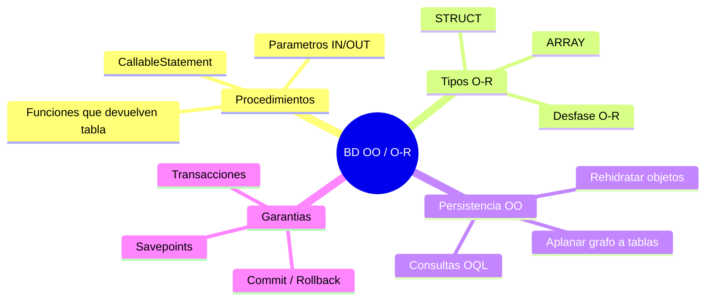
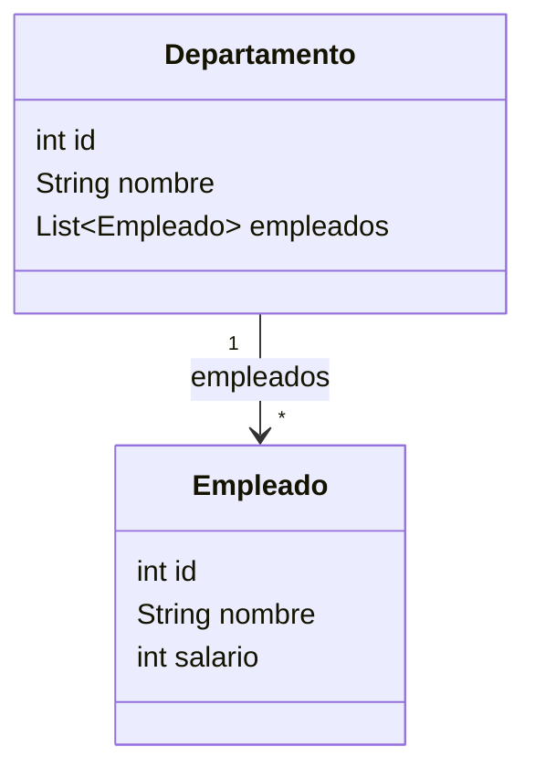
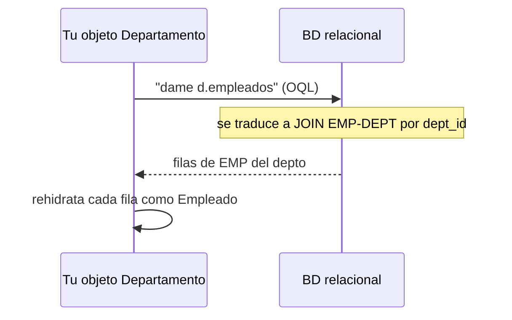
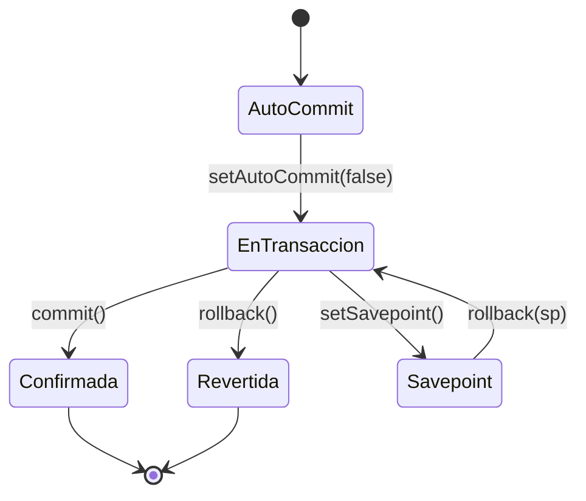

# Bloque XXXI · BD objeto-relacionales/OO y procedimientos almacenados

> Vienes de JDBC (`b11`) y de JPA (`b12`–`b15`): sabes mapear objetos a tablas con anotaciones
> y lanzar consultas. Te falta el último criterio del BOE de Acceso a Datos: las bases de datos
> **objeto-relacionales/OO** (RA4) y los **procedimientos almacenados** (RA2.k). Aquí cierras
> el círculo de AD entendiendo el "desfase objeto-relacional" desde dentro.

> **Nota honesta (léela antes de empezar).** El RA4 (bases de datos de objetos puras, OQL) es
> **tecnología marginal** en la industria actual: ganaron el modelo relacional + ORM (JPA) y, en
> otro frente, el NoSQL documental (`b17`). El objetivo de este bloque NO es dominar una
> tecnología muerta, sino **aprobar el criterio del BOE** y, de paso, entender *por qué* existe
> JPA: porque mapear objetos a tablas a mano (lo que harás aquí) es tedioso y repetitivo. Los
> procedimientos almacenados (RA2.k), en cambio, sí siguen muy vivos. Usamos **H2** (el mismo de
> `b11`/`b12`), que simula procedimientos y tipos objeto-relacionales sin instalar nada.

## Cómo usar este documento

Lee UNA sección → haz SU ejercicio → vuelve. Cada sección cierra con **"Lo practicas en…"**.

| Sección | Tema | Ejercicio |
|---|---|---|
| 31.1 | `CallableStatement`: llamar procedimientos/funciones (IN/OUT) | `Ej249CallableStatement` |
| 31.2 | Funciones que devuelven valor o conjunto de filas | `Ej250StoredFunctionResult` |
| 31.3 | Tipos objeto-relacionales: `ARRAY`/`STRUCT` | `Ej251ObjectRelationalTypes` |
| 31.4 | Persistir un grafo de objetos a mano (el desfase O-R) | `Ej252PersistObjectGraph` |
| 31.5 | Consultas estilo OQL (navegar objetos ≙ JOIN) | `Ej253OqlStyleQueries` |
| 31.6 | Transacciones sobre objetos: commit/rollback | `Ej254TransactionsOnObjects` |

### El mapa: ¿de qué va este bloque?



### El concepto que lo une todo: el desfase objeto-relacional

En memoria piensas en **objetos**: un `Departamento` con una `List<Empleado>`, referencias que
sigues con un `.`. En la base de datos relacional todo son **filas y columnas** atómicas, unidas
por claves foráneas. Pasar de uno a otro tiene fricción —el *impedance mismatch*— y hay tres
formas históricas de resolverlo:

| Enfoque | Idea | Dónde lo ves |
|---|---|---|
| **Relacional + JDBC a mano** | tú escribes el SQL y mapeas fila↔objeto | `b11`, y `Ej252` de este bloque |
| **ORM (mapeo objeto-relacional)** | una librería automatiza el mapeo | JPA/Hibernate, `b12`–`b15` |
| **BD de objetos / objeto-relacional** | la BD guarda objetos "tal cual" (OQL, tipos O-R) | este bloque (RA4), hoy marginal |

---

## 31.1 CallableStatement: llamar a procedimientos y funciones

Un **procedimiento almacenado** es código que vive *dentro* del SGBD y se ejecuta en el
servidor, cerca de los datos. Ventajas: menos viajes red, lógica reutilizable, permisos
afinados. Inconvenientes: lógica de negocio repartida y atada al dialecto del motor.

Desde Java se invocan con {@code CallableStatement} y la **sintaxis de escape JDBC** (las
llaves `{}` que el driver traduce a su dialecto):

| Sintaxis | Para qué |
|---|---|
| `{call P(?, ?)}` | procedimiento sin valor de retorno |
| `{? = call F(?, ?)}` | **función** con valor de retorno (el `?` de la izquierda es la salida) |

Los parámetros se numeran de izquierda a derecha empezando en 1. En `{? = call SUMAR(?, ?)}`
el índice **1 es la salida** y **2, 3 las entradas**:

```java
try (CallableStatement cs = c.prepareCall("{? = call SUMAR(?, ?)}")) {
    cs.registerOutParameter(1, Types.INTEGER);   // declara el hueco de salida y su tipo
    cs.setInt(2, a);                             // entrada
    cs.setInt(3, b);                             // entrada
    cs.execute();
    return cs.getInt(1);                         // lee la salida
}
```

| Modo de parámetro | Cómo se trata en JDBC |
|---|---|
| **IN** | `setInt`/`setString`… (lo envías tú) |
| **OUT** | `registerOutParameter(idx, Types.X)` + `getInt`/`getString` (lo recibes) |
| **INOUT** | ambos: lo fijas y luego lo relees |

> H2 no tiene PL/SQL: una "función almacenada" se crea registrando un método Java estático con
> `CREATE ALIAS NOMBRE FOR "paquete.Clase.metodo"`. La clase `ProcsAlmacenados` reúne esos
> métodos (`sumar`, `saludar`, `factorial`, `empleados`).

> **Lo practicas en `Ej249CallableStatement`**: llamas a SUMAR y SALUDAR con parámetros OUT,
> dominas los índices (salida=1, entradas=2,3), distingues la sintaxis de función vs procedimiento
> y capturas el `SQLException` de un alias inexistente.

---

## 31.2 Funciones que devuelven valor o conjunto de filas

Hay dos sabores de función almacenada:

- **Escalar:** devuelve un único valor (un número, un texto). Se lee con un parámetro OUT
  (`{? = call FACT(?)}`) o como consulta de una fila (`CALL FACT(5)`).
- **De tabla:** devuelve un **`ResultSet`** (varias filas). Se consume como una consulta normal
  con `executeQuery`, recorriendo el `ResultSet`.

```java
// Escalar con CALL (sin OUT):
try (var rs = c.createStatement().executeQuery("CALL SUMAR(2, 3)")) {
    rs.next();
    int total = rs.getInt(1);   // 5
}

// De tabla: la función EMPLEADOS() devuelve filas
try (CallableStatement cs = c.prepareCall("{call EMPLEADOS()}");
     ResultSet rs = cs.executeQuery()) {
    List<String> nombres = new ArrayList<>();
    while (rs.next()) {
        nombres.add(rs.getString("nombre"));
    }
}
```

En H2, una función de tabla es un método Java cuyo primer parámetro es `Connection` (H2 le
inyecta la conexión) y que devuelve un `ResultSet`:

```java
public static ResultSet empleados(Connection conn) throws SQLException {
    return conn.createStatement().executeQuery("SELECT nombre FROM EMP ORDER BY nombre");
}
```

> **Lo practicas en `Ej250StoredFunctionResult`**: lees el escalar `FACT(n)` con OUT y consumes
> la función de tabla `EMPLEADOS()` recorriendo su `ResultSet`, además de combinar y transformar
> los resultados (mayúsculas, conteo, concatenación).

---

## 31.3 Tipos objeto-relacionales: cuando una celda guarda una estructura

El modelo relacional puro exige valores **atómicos** en cada celda (1ª forma normal). Las
extensiones **objeto-relacionales** (SQL:1999 en adelante) rompen esa regla para acercar las
tablas a los objetos: una celda puede contener una colección o una estructura.

| Tipo SQL | Qué guarda | API JDBC |
|---|---|---|
| `ARRAY` | una colección ordenada | `java.sql.Array` |
| `STRUCT` (tipo estructurado) | varios campos como una unidad (≙ un objeto) | `java.sql.Struct` |
| `REF` | una referencia a otra fila-objeto | `java.sql.Ref` |

El más portable es `ARRAY` (H2 lo soporta de forma nativa):

```java
// columna: etiquetas VARCHAR ARRAY ; valor: ARRAY['java','sql','jdbc']
try (var ps = c.prepareStatement("SELECT etiquetas FROM PROD WHERE id=?")) {
    ps.setInt(1, id);
    var rs = ps.executeQuery();
    if (rs.next()) {
        java.sql.Array arr = rs.getArray("etiquetas");   // tipo O-R
        Object[] datos = (Object[]) arr.getArray();      // -> a Java
    }
}

// Camino inverso (Java -> SQL):
Array a = c.createArrayOf("VARCHAR", new Object[]{"uno", "dos"});
```

> **Por qué es marginal:** guardar un `ARRAY` o un `STRUCT` en una celda viola la normalización y
> complica las consultas (no puedes indexar bien dentro). En la práctica se modela con una tabla
> hija (1:N) y un JOIN, o —si de verdad quieres anidar— se usa una columna `JSON`/`JSONB` o una BD
> documental (`b17`). Lo aprendes para reconocerlo, no para abusar de él.

> **Lo practicas en `Ej251ObjectRelationalTypes`**: lees una columna `ARRAY` con `getArray`, la
> conviertes a `Object[]`, la creas desde Java con `createArrayOf` y operas sobre sus elementos.

---

## 31.4 Persistir un grafo de objetos (el desfase, en tus manos)

Aquí *eres tú* el ORM. Guardar un `Departamento` con su `List<Empleado>` en una BD relacional
obliga a **aplanar el grafo** a dos tablas, y cargarlo obliga a **rehidratarlo**:



Ese grafo se proyecta sobre:

```
DEPT(id PK, nombre)
EMP (id PK, nombre, salario, dept_id FK -> DEPT.id)
```

**Guardar** (aplanar): inserta el padre, recupera su clave generada, e inserta cada hijo con esa
clave foránea:

```java
int idDept;
try (var ps = c.prepareStatement("INSERT INTO DEPT(nombre) VALUES (?)",
                                  Statement.RETURN_GENERATED_KEYS)) {
    ps.setString(1, d.getNombre());
    ps.executeUpdate();
    try (var gk = ps.getGeneratedKeys()) { gk.next(); idDept = gk.getInt(1); }
}
try (var ps = c.prepareStatement("INSERT INTO EMP(nombre, salario, dept_id) VALUES (?,?,?)")) {
    for (Empleado e : d.getEmpleados()) {
        ps.setString(1, e.getNombre());
        ps.setInt(2, e.getSalario());
        ps.setInt(3, idDept);
        ps.addBatch();          // un viaje en vez de N
    }
    ps.executeBatch();
}
```

**Cargar** (rehidratar): lee el padre, lee los hijos por la FK y reconstruye los objetos. Si el
departamento no tiene empleados, la lista debe venir **vacía, nunca null**.

> Esto es exactamente lo que hace `@OneToMany` con `cascade` en JPA (`b13`). Verlo a mano explica
> por qué JPA fue una revolución: este código se repite para cada entidad y relación.

> **Lo practicas en `Ej252PersistObjectGraph`**: implementas `guardar` (con clave generada y
> batch) y `cargar` (rehidratando la lista), más operaciones derivadas (contar, sumar salarios,
> borrado en cascada manual).

---

## 31.5 Consultas estilo OQL: navegar objetos ≙ JOIN

**OQL** (Object Query Language, del estándar ODMG) consultaba **navegando objetos**, no tablas:

```text
-- OQL (conceptual)
SELECT e.nombre FROM Departamento d, d.empleados e WHERE d.nombre = "IT"
```

Fíjate en `d.empleados e`: estás "siguiendo la referencia" del departamento a sus empleados. En
SQL relacional eso es un **JOIN** por la clave foránea:

```sql
SELECT e.nombre
FROM EMP e JOIN DEPT d ON e.dept_id = d.id
WHERE d.nombre = ?
ORDER BY e.nombre
```



La idea clave del RA4: **navegar una relación entre objetos** y **reunir dos tablas por su clave**
son la misma operación vista desde dos modelos distintos. JPQL (el lenguaje de consulta de JPA,
`b15`) es el heredero práctico de OQL: consultas orientadas a entidades que Hibernate traduce a
SQL con JOINs por ti.

> **Lo practicas en `Ej253OqlStyleQueries`**: escribes el SQL (JOIN, agregados, `EXISTS`,
> `BETWEEN`, navegación inversa empleado→departamento) equivalente a consultas OQL sobre el grafo.

---

## 31.6 Transacciones sobre objetos: todo o nada

Persistir un objeto suele tocar **varias filas/tablas** (un departamento y sus empleados). Debe
ser **atómico**: o se guardan todos los cambios o ninguno. Sobre JDBC:

```java
boolean autoPrevio = c.getAutoCommit();
c.setAutoCommit(false);                 // empieza la transacción
try {
    // ... varios INSERT/UPDATE que forman una unidad ...
    c.commit();                         // confirma todo de golpe
} catch (SQLException e) {
    c.rollback();                       // deshace TODO si algo falla
    throw e;
} finally {
    c.setAutoCommit(autoPrevio);        // deja la conexión como estaba
}
```



Dos refinamientos:

- **Savepoints:** puntos de retorno intermedios. `rollback(sp)` deshace solo lo posterior al
  savepoint sin abortar toda la transacción.
- **Niveles de aislamiento:** controlan qué ven las transacciones concurrentes. De menos a más
  estricto: `READ_UNCOMMITTED` < `READ_COMMITTED` < `REPEATABLE_READ` < `SERIALIZABLE`. El más
  estricto evita todos los fenómenos pero es el más caro (enlaza con la concurrencia de `b27`).

> Mismo patrón que `b11·Ej097` (transferencia bancaria): la atomicidad no es opcional cuando una
> operación de negocio toca varias filas. En Spring esto se declara con `@Transactional`.

> **Lo practicas en `Ej254TransactionsOnObjects`**: implementas una transferencia de presupuesto
> atómica (con `PresupuestoException` + rollback) y un guardado "todo o nada" de empleados que
> revierte ante un id duplicado, más control de autocommit, savepoints y aislamiento.

---

## Errores comunes del bloque

| # | Error | Antídoto |
|---|---|---|
| 1 | Confundir los índices en `{? = call F(?, ?)}` (creer que la entrada es el índice 1) | la **salida es el índice 1**; las entradas empiezan en 2 |
| 2 | Usar `{call F()}` para una función con retorno y perder el valor | usa `{? = call F(?)}` + `registerOutParameter` |
| 3 | No registrar el parámetro OUT antes de `execute` | `registerOutParameter(idx, Types.X)` siempre antes |
| 4 | Olvidar `Statement.RETURN_GENERATED_KEYS` y no poder recuperar el id del padre | pásalo al `prepareStatement` y lee `getGeneratedKeys()` |
| 5 | Devolver `null` al cargar un objeto sin hijos en vez de lista vacía | el grafo sin hijos se rehidrata con `List.of()`/lista vacía |
| 6 | Insertar los hijos antes que el padre (FK sin destino) | inserta el padre primero, recoge su id, luego los hijos |
| 7 | Borrar el padre antes que los hijos (cascada al revés) | borra primero EMP (hijos), luego DEPT (padre) |
| 8 | Dejar `autoCommit` en `true` y esperar atomicidad | `setAutoCommit(false)` para abrir la transacción |
| 9 | Hacer `commit()`/`rollback()` con autocommit en `true` (lanza `SQLException`) | desactiva autocommit antes; restáuralo en `finally` |
| 10 | Tragarte el `SQLException` sin `rollback` y dejar la BD a medias | en el `catch`: `rollback()` y relanza |
| 11 | Meter un `ARRAY`/`STRUCT` donde tocaría una tabla hija normalizada | modela 1:N con tabla + FK; reserva los tipos O-R para casos justificados |
| 12 | No restaurar el `autoCommit` original y dejar la conexión "sucia" para el siguiente | guárdalo y restáuralo en `finally` |

---

## Chuleta final del bloque

```java
// === FUNCIÓN con retorno (OUT en índice 1) ===
try (CallableStatement cs = c.prepareCall("{? = call SUMAR(?, ?)}")) {
    cs.registerOutParameter(1, Types.INTEGER);
    cs.setInt(2, a); cs.setInt(3, b);
    cs.execute();
    int r = cs.getInt(1);
}

// === FUNCIÓN de tabla (ResultSet) ===
try (CallableStatement cs = c.prepareCall("{call EMPLEADOS()}");
     ResultSet rs = cs.executeQuery()) {
    while (rs.next()) { /* rs.getString("nombre") */ }
}

// === TIPO O-R: ARRAY ===
java.sql.Array arr = rs.getArray("etiquetas");
Object[] datos = (Object[]) arr.getArray();
Array nuevo = c.createArrayOf("VARCHAR", new Object[]{"a","b"});

// === PERSISTIR GRAFO: clave generada + batch ===
var ps = c.prepareStatement("INSERT INTO DEPT(nombre) VALUES (?)", Statement.RETURN_GENERATED_KEYS);
ps.executeUpdate(); var gk = ps.getGeneratedKeys(); gk.next(); int id = gk.getInt(1);

// === OQL ≙ JOIN ===
// d.empleados  ->  EMP e JOIN DEPT d ON e.dept_id = d.id WHERE d.nombre = ?

// === TRANSACCIÓN (todo o nada) ===
boolean prev = c.getAutoCommit(); c.setAutoCommit(false);
try { /* ... */ c.commit(); }
catch (SQLException e) { c.rollback(); throw e; }
finally { c.setAutoCommit(prev); }
```

---

## Autoevaluación

1. En `{? = call F(?, ?)}`, ¿qué índice es la salida y cuáles las entradas, y cómo declaras y lees
   la salida? (31.1)
2. ¿Qué diferencia hay entre la sintaxis de escape de un procedimiento y la de una función con
   retorno? (31.1)
3. ¿Cómo consumes una función almacenada que devuelve un conjunto de filas en vez de un escalar?
   (31.2)
4. ¿Qué es un tipo objeto-relacional `ARRAY`/`STRUCT` y por qué suele ser preferible una tabla
   hija normalizada? (31.3)
5. Al persistir un `Departamento` con empleados, ¿en qué orden insertas y cómo recuperas la clave
   foránea? (31.4)
6. Al cargar un objeto sin hijos, ¿qué debe contener su colección y por qué nunca `null`? (31.4)
7. ¿Por qué "navegar `d.empleados`" en OQL equivale a un JOIN en SQL, y quién es el heredero
   práctico de OQL? (31.5)
8. ¿Qué tres pasos garantizan la atomicidad de una operación que toca varias filas, y qué hay que
   restaurar en el `finally`? (31.6)
9. ¿Qué es un savepoint y en qué se diferencia de un rollback completo? (31.6)
10. ¿Por qué este RA (BD OO/OQL) se considera marginal hoy y qué tecnologías ganaron en su lugar?
    (intro)
```
