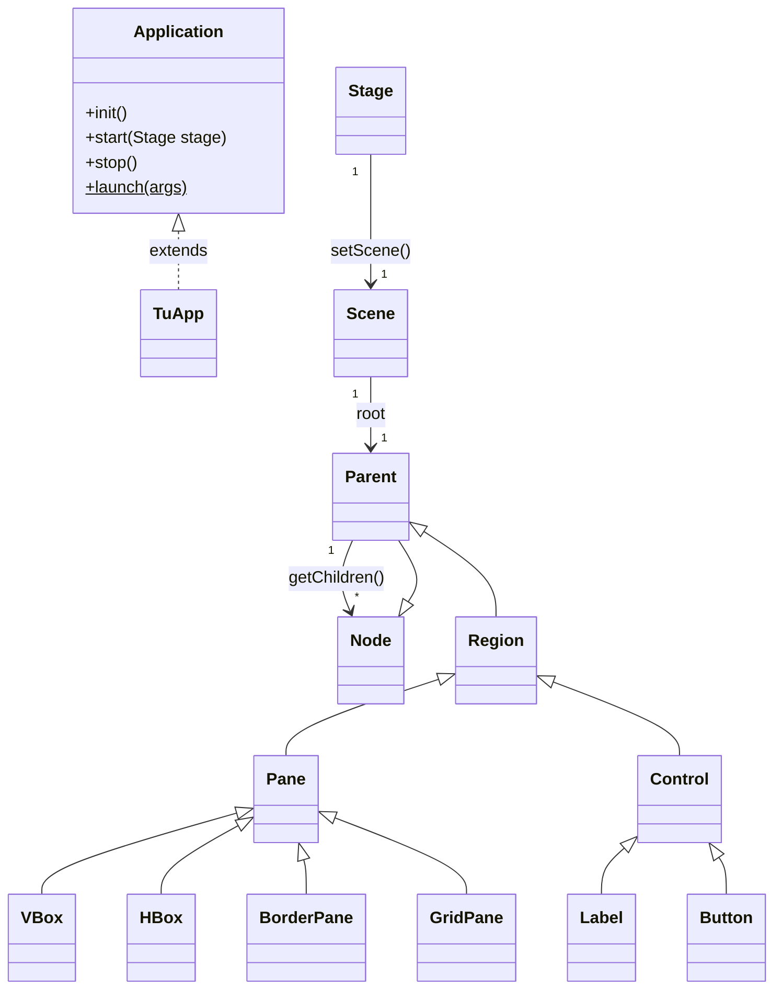
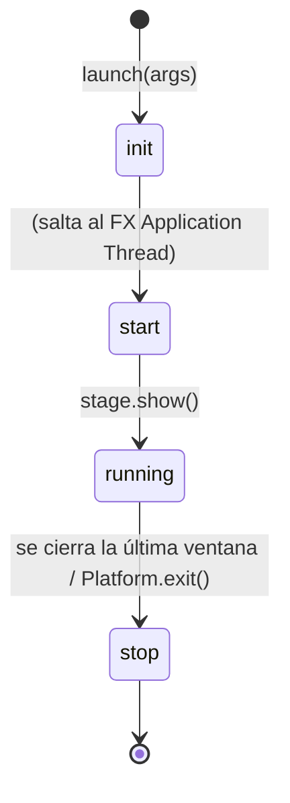
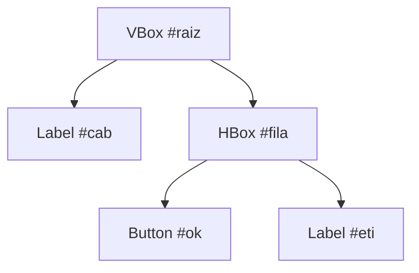
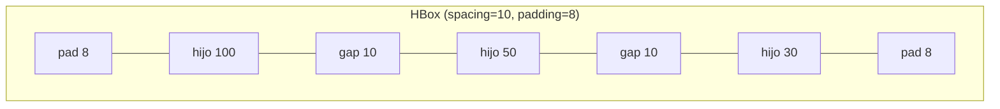
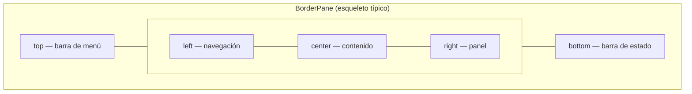
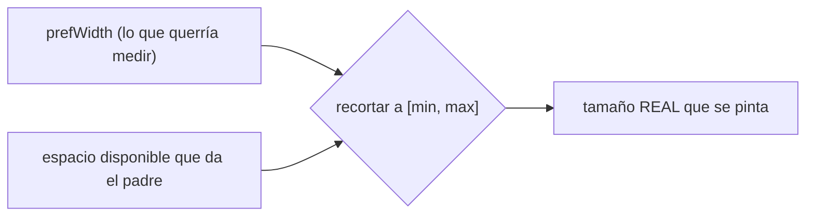
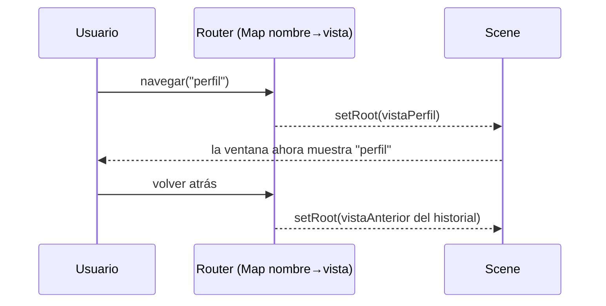

# Bloque 32 · JavaFX: aplicación, escena y layouts (DI · RA1)

> Vienes de construir APIs y lógica de servidor sin cara visible: todo eran tests, JSON y
> peticiones HTTP. Ahora empiezas **Desarrollo de Interfaces**, la otra mitad del oficio: una
> **ventana** donde una persona ve cosas y las toca. JavaFX es la tecnología moderna de interfaces
> de escritorio en Java —la sucesora de Swing—: declarativa, con CSS, animaciones y un modelo de
> datos *reactivo*.
>
> Este es el "Hola mundo estructural" del módulo: entender **qué es una app JavaFX** y su ciclo de
> vida, cómo se organiza su contenido en un **árbol de nodos** (el *scene graph*) y cómo **colocar**
> ese contenido con los *layouts*. Sin esto no hay dónde poner los controles (b33), ni FXML (b34),
> ni estilos (b36). Es la base de todo lo que viene.

---

## Cómo usar este documento

1. **Lee UNA sección y haz SU ejercicio.** Cada `## N.M` corresponde a un `EjNNN…`. No pases a la
   siguiente sección sin haber puesto en **verde** la anterior.
2. **Los tests son la especificación real.** El enunciado exacto de cada método vive en su test:
   ahí está el caso concreto y, sobre todo, el **caso límite** que tienes que respetar. Si dudas de
   qué se te pide, abre el `…Test.java`.
3. **El método `core` es lógica pura** (construir/recorrer el árbol, calcular una disposición, un
   router): se prueba **sin abrir ventana**. El `main` de cada ejercicio (el *Playground*) sí monta
   la UI real y la lanza con *Run*: ejecútalo para **ver** con tus ojos lo que acabas de calcular.
4. Esta teoría **va más allá de lo que piden los ejercicios**: explica las opciones y alternativas
   de cada elemento para que, cuando te encuentres un caso nuevo, puedas resolverlo tú solo. Lee
   también las tablas "completas": son tu material de consulta.
5. Cada reto extra trae una **GUÍA por capas** (teoría → pasos → `PISTA` → `OJO` → `CULTURA`). La
   capa `OJO:` te avisa de la trampa exacta del test.

> ⚠️ **Sobre los tests sin pantalla (*headless*):** construir nodos JavaFX necesita el *toolkit*
> arrancado. En la app lo arranca `Application.launch`; en los tests lo arrancamos con **Monocle**
> (un motor de render "de mentira" que no abre ventanas). No tienes que tocar nada: el `pom.xml` y
> el ayudante `IniciadorFx` ya lo hacen por ti. Solo recuérdalo si algún día ves el error
> `Toolkit not initialized`.

---

## Antes de empezar: JavaFX ya no viene dentro del JDK

Hasta Java 8, JavaFX venía incluido en el JDK. **Desde Java 11 está fuera**: es un conjunto de
dependencias aparte (`org.openjfx:javafx-controls`, `javafx-fxml`, …). Por eso el `pom.xml` de este
bloque las declara explícitamente. Consecuencia práctica que te ahorrará horas de frustración:

- Para **ejecutar** un Playground desde Maven usa `mvn -pl b32_fxbase javafx:run` (el plugin
  `javafx-maven-plugin` ya configurado), no `java -jar` a pelo.
- Si lo lanzas desde el IDE y ves `Error: JavaFX runtime components are missing`, es que falta el
  *module-path*. En este proyecto el plugin lo resuelve; en uno tuyo tendrías que añadir
  `--module-path <ruta> --add-modules javafx.controls,javafx.fxml` a los argumentos de la VM.

No necesitas dominar el sistema de módulos de Java para este bloque, pero **sí saber que JavaFX es
una librería externa**: es el origen del 90 % de los "no me arranca".

---

## Índice

| Sección | Tema | Ejercicio |
|---|---|---|
| 1.1 | Ciclo de vida (`Application`, `init`/`start`/`stop`, `launch`) y construir la raíz | `Ej255AppLifecycle` |
| 1.2 | El *scene graph* como árbol: recorrer y buscar nodos | `Ej256SceneGraph` |
| 1.3 | El `Stage` (ventana del SO): título, tamaño, posición, modalidad | `Ej257StageWindow` |
| 1.4 | Layouts en caja: `VBox`/`HBox` (spacing, padding, margin, grow, alignment) | `Ej258LayoutBoxes` |
| 1.5 | `BorderPane`, `GridPane`, `StackPane`, `AnchorPane`, `Flow/TilePane` | `Ej259BorderGridPane`, `Ej260StackAnchorFlow` |
| 1.6 | Tamaños (min/pref/max), `Insets`, *bounds* y sistema de coordenadas | `Ej261SizingAndBounds` |
| 1.7 | Cambiar de vista: raíz dinámica de la `Scene` y mini-router | `Ej262SceneSwitching` |

> **Modelo mental que NO debes perder nunca:** un **`Stage`** es la **ventana** del sistema
> operativo; una **`Scene`** es su **contenido**; y todo lo de dentro es un **árbol de nodos**
> (`Parent` → `Node`). Los *layouts* son nodos especiales que deciden **dónde** se colocan sus hijos.



Lee este diagrama de arriba abajo: tu app **es-una** `Application`; una `Stage` **tiene-una**
`Scene`; una `Scene` **tiene-una** raíz `Parent`; un `Parent` **tiene-muchos** `Node`. Y casi todo
lo que ves en pantalla (`VBox`, `Button`, `Label`…) **es-un** `Node` por herencia. Esta jerarquía
explica por qué un método que pide un `Node` acepta un `Button`, o por qué un `VBox` se puede meter
dentro de otro `VBox`: todos comparten antepasado.

---

## 1.1 · Ciclo de vida y construcción de la raíz (`Ej255AppLifecycle`)

Una app JavaFX **no tiene un `main` que pinte cosas**. En su lugar heredas de `Application` y JavaFX
llama a tus métodos en un **orden fijo**. La llamada `Application.launch(args)` arranca el motor
gráfico y dispara ese ciclo:



| Fase | ¿En qué hilo se ejecuta? | ¿Para qué sirve? | Qué NO hacer aquí |
|---|---|---|---|
| `init()` | el hilo de lanzamiento (**no** el de UI) | preparar datos, leer configuración, abrir recursos | **no** crear ni tocar nodos/`Stage` (lanza excepción) |
| `start(Stage)` | **FX Application Thread** | montar la `Scene`, asignarla a la `Stage` y `show()` | trabajo lento que congele la UI |
| `stop()` | FX Application Thread | liberar recursos (conexiones, hilos, ficheros) | abrir ventanas nuevas |

Solo `start(Stage)` es **obligatorio** de implementar (es `abstract`); `init()` y `stop()` son
opcionales (de fábrica no hacen nada). La `Stage` que recibe `start` es la **primaria**, te la da
JavaFX ya creada. Puedes abrir cuantas `Stage` **secundarias** quieras con `new Stage()`.

> **Regla grabada nº1:** *todo lo que toque la UI ocurre en el FX Application Thread.* `init()` corre
> **antes** y en **otro** hilo: es para preparar, no para pintar. Más adelante (b35) verás que para
> tareas largas se usan hilos aparte (`Task`) que **nunca** tocan la UI directamente.

### Construir el contenido: el árbol

El contenido se construye como un **árbol**: creas un contenedor (`Parent`, p.ej. un `VBox`), le
añades hijos con `getChildren().add(...)`, y opcionalmente le pones un **id** a cada nodo para
localizarlo después. Eso es exactamente lo que hace `construirRaiz()`:

```java
VBox raiz = new VBox();              // un contenedor vacío (apila en vertical)
raiz.setId("raiz");                  // id para localizarlo luego
Label titulo = new Label("Título");
titulo.setId("lblTitulo");
raiz.getChildren().addAll(titulo, new Button("Aceptar"));  // añadir hijos
// raiz ya es un sub-árbol: VBox -> [Label, Button]
```

Y `contarNodos(nodo)` lo **recorre** de forma recursiva: cuenta 1 (este nodo) y baja a cada hijo:

```java
int contarNodos(Node n) {
    if (n == null) return 0;
    int total = 1;                                   // me cuento a mí mismo
    if (n instanceof Parent p)                       // ¿puede tener hijos?
        for (Node hijo : p.getChildrenUnmodifiable())
            total += contarNodos(hijo);              // sumar el sub-árbol de cada hijo
    return total;
}
```

> **Por qué `instanceof Parent`:** no todos los `Node` tienen hijos. Un `Label` o un `Button` son
> nodos "hoja". Solo los `Parent` (contenedores) exponen `getChildren…`. Comprobarlo antes de bajar
> evita asumir hijos donde no los hay.

### Los parámetros de arranque

`getParameters()` (dentro de la `Application`) te da los argumentos de lanzamiento clasificados:

| Método de `getParameters()` | Devuelve | Ejemplo de entrada → salida |
|---|---|---|
| `getRaw()` | todos, tal cual (`List<String>`) | `["--modo=dark", "f.txt"]` → los dos |
| `getNamed()` | los `--clave=valor` como `Map<String,String>` | `--modo=dark` → `{modo=dark}` |
| `getUnnamed()` | los que **no** son `--clave=valor` | `f.txt`, `--verbose` → `["f.txt","--verbose"]` |

Ojo al matiz: `--verbose` (un *flag* sin `=`) **no** es "named" (no tiene valor) pero **sí** empieza
por `--`, así que cae en *unnamed*. Esto es justo lo que comprueban los retos 5 y 6.

> **Lo practicas en `Ej255AppLifecycle`**: construir la raíz del *scene graph* y contar sus nodos;
> en los retos, crear nodos sueltos, apilar etiquetas, el orden de las fases del ciclo de vida,
> parsear los parámetros de arranque (`named`/`unnamed`), asignar ids y construir árboles anidados.

---

## 1.2 · El *scene graph* como árbol: recorrer y buscar (`Ej256SceneGraph`)

El contenido de una escena es un **árbol** idéntico en espíritu al **DOM** de una página web o a un
**árbol de ficheros**: un `Parent` tiene hijos (`Node`), y un hijo puede a su vez ser `Parent` y
tener los suyos. Dominar el recorrido de este árbol es la habilidad central del bloque.



Sobre ese árbol harás siempre dos familias de operaciones, ambas **recursivas**:

- **Buscar** un nodo (por id, por tipo, por una condición): bajas en **profundidad** (DFS, *depth
  first*) hasta encontrarlo.
- **Medir** el árbol: profundidad (nivel más hondo), anchura (nivel con más nodos, que se mide en
  **anchura** o BFS con una cola), número de hojas, lista de ids…

### Las dos listas de hijos (¡no las confundas!)

| Método | Tipo | ¿Se puede modificar? | Cuándo usarlo |
|---|---|---|---|
| `getChildrenUnmodifiable()` | `ObservableList<Node>` de **solo lectura** | ❌ lanza excepción si intentas `add`/`remove` | **recorrer** (lo normal al inspeccionar) |
| `getChildren()` | `ObservableList<Node>` **mutable** | ✅ | **modificar** (añadir/quitar/reordenar) |

El detalle fino: `getChildren()` es `protected` en `Parent`, pero **público** en `Pane` (y por tanto
en `VBox`, `HBox`, etc.). Por eso, para reordenar hijos (reto del z-order) a veces casteas a `Pane`:
`((Pane) padre).getChildren()`.

### Propiedades de un nodo que conviene conocer (van más allá del ejercicio)

| Propiedad | Métodos | Qué controla |
|---|---|---|
| id | `setId` / `getId` | identificador único para localizar el nodo (`#id` en CSS) |
| clases de estilo | `getStyleClass().add("…")` | clases CSS (se estilan en b36) |
| estilo en línea | `setStyle("-fx-…")` | CSS aplicado solo a ese nodo |
| `visible` | `setVisible` / `isVisible` | si se **pinta** y recibe eventos |
| `managed` | `setManaged` / `isManaged` | si el *layout* le **reserva hueco** |
| `disable` | `setDisable` / `isDisabled` | si está deshabilitado (gris, sin eventos) |
| `opacity` | `setOpacity(0..1)` | transparencia |
| posición en padre | índice en `getChildren()` | el **z-order** (último = pintado encima) |

> **Trampa clásica `visible` vs `managed`** (cae en exámenes): un nodo con `visible=false` **sigue
> ocupando su hueco** (deja un vacío donde estaba); un nodo con `managed=false` **no ocupa hueco**
> (el layout lo ignora) aunque siga dibujándose si es visible. Son cosas distintas:
> - `visible=false, managed=true` → invisible **pero** deja el agujero.
> - `visible=true, managed=false` → se ve **pero** se solapa con otros (el layout no cuenta con él).

### Patrón de búsqueda recursiva (DFS)

```java
Node buscarPorId(Parent raiz, String id) {
    if (raiz == null || id == null) return null;
    for (Node hijo : raiz.getChildrenUnmodifiable()) {
        if (id.equals(hijo.getId())) return hijo;        // ¿es este?
        if (hijo instanceof Parent p) {                   // si no, baja...
            Node encontrado = buscarPorId(p, id);
            if (encontrado != null) return encontrado;    // ...y propaga el hallazgo
        }
    }
    return null;                                           // nadie coincide
}
```

> **El atajo que ya trae JavaFX:** `raiz.lookup("#id")` busca por id, y `lookupAll(".clase")` por
> clase CSS. Tú lo implementas a mano aquí para **entender qué hace por dentro** (es lo mismo que
> `document.querySelector` en una web). En código real usarás `lookup`, pero ahora lo construyes.

### Recorrido en anchura (BFS) con una cola

Para medir la **anchura** (cuántos nodos hay como mucho en un mismo nivel) se recorre nivel a nivel
con una cola (`ArrayDeque`):

```java
Deque<Node> cola = new ArrayDeque<>();
cola.add(raiz);
int maxAncho = 0;
while (!cola.isEmpty()) {
    int nNivel = cola.size();             // tamaño del nivel actual
    maxAncho = Math.max(maxAncho, nNivel);
    for (int i = 0; i < nNivel; i++) {    // procesar ESTE nivel entero
        Node n = cola.poll();
        if (n instanceof Parent p) cola.addAll(p.getChildrenUnmodifiable());
    }
}
```

> **DFS vs BFS:** DFS (recursión) baja por una rama hasta el fondo antes de pasar a la siguiente;
> BFS (cola) visita por niveles. La profundidad se mide natural con DFS; la anchura, con BFS. Las
> dos técnicas reaparecen en grafos, ficheros, árboles de decisión… son cultura general de programación.

> **Lo practicas en `Ej256SceneGraph`**: `buscarPorId` y `profundidadArbol`; en los retos, contar
> hojas/visibles/no-gestionados, la **ruta** hasta un id (con *backtracking*), el z-order y traer al
> frente, la **anchura** (BFS) y la búsqueda por **tipo** (el germen de `lookup`/`querySelector`).

---

## 1.3 · El `Stage`: la ventana del sistema operativo (`Ej257StageWindow`)

El `Stage` es la **ventana real** del SO: tiene barra de título, se mueve, se redimensiona, se
maximiza y se cierra. Solo se crea/muestra en el **FX Application Thread**. La primaria te llega en
`start(Stage)`; las secundarias (diálogos, paletas de herramientas, ventanas de detalle) las creas tú.

```mermaid
sequenceDiagram
    participant U as Usuario
    participant S as Stage primaria
    participant D as Stage secundaria (modal)
    S->>U: setScene(escena) + show()
    U->>S: pulsa "Editar"
    S->>D: new Stage(); initOwner(S); initModality(APPLICATION_MODAL); showAndWait()
    D->>U: BLOQUEA la primaria hasta cerrarse
    D-->>S: al cerrar, sigue la primaria
```

### Propiedades y métodos del `Stage` (consulta — más de los que usa el ejercicio)

| Necesidad | API | Notas |
|---|---|---|
| título | `setTitle(String)` | el texto de la barra |
| tamaño | `setWidth`/`setHeight` | en píxeles |
| límites | `setMinWidth/MinHeight`, `setMaxWidth/MaxHeight` | impide encoger/agrandar de más |
| posición | `setX`/`setY` | esquina superior-izquierda en la pantalla |
| centrar | `centerOnScreen()` | atajo de JavaFX (tú lo calculas a mano en el core) |
| redimensionable | `setResizable(boolean)` | si el usuario puede cambiar el tamaño |
| icono | `getIcons().add(new Image(...))` | el icono de la ventana/barra de tareas |
| estilo de ventana | `initStyle(StageStyle.…)` | decoración (ver tabla siguiente) |
| modalidad | `initModality(Modality.…)` | bloqueo de otras ventanas (antes de `show`) |
| propietaria | `initOwner(stage)` | la ventana "padre" de un diálogo |
| pantalla completa | `setFullScreen(true)` | modo inmersivo |
| siempre encima | `setAlwaysOnTop(true)` | flota sobre las demás |
| mostrar/esperar | `show()` / `showAndWait()` | `showAndWait` bloquea hasta cerrar (diálogos) |
| cerrar | `close()` / `hide()` | |

`StageStyle` (decoración de la ventana): `DECORATED` (normal, con barra), `UNDECORATED` (sin barra
ni bordes), `TRANSPARENT` (fondo transparente), `UTILITY` (barra mínima), `UNIFIED`.

`Modality` (a quién bloquea un `Stage`):

| Valor | Efecto |
|---|---|
| `NONE` | no bloquea nada (ventana independiente) |
| `WINDOW_MODAL` | bloquea solo su ventana propietaria (`initOwner`) y las hijas de esta |
| `APPLICATION_MODAL` | bloquea **todas** las ventanas de la app hasta cerrarse |

> **Regla grabada nº2:** una ventana **modal** bloquea la interacción con las demás hasta que se
> cierra; una `NONE` no. Es la diferencia entre un diálogo "¿Guardar cambios? Sí/No" (modal, te
> obliga a decidir) y una ventana de herramientas que puedes dejar abierta a un lado. `initModality`
> y `initStyle` deben llamarse **antes** de `show()`.

### Lo testeable sin pantalla: la **geometría**

Crear/mostrar un `Stage` exige el FX thread, así que lo que practicas con JUnit puro es la
**aritmética de la ventana**, que es independiente de pintar:

```java
// Centrar = colocar la esquina en la mitad del espacio sobrante (sin pasar de 0):
double x = Math.max(0, (anchoPantalla - anchoVentana) / 2);
double y = Math.max(0, (altoPantalla  - altoVentana ) / 2);
```

Esto incluye centrar, recortar el tamaño a `[min, max]`, mantener la ventana dentro de la pantalla,
escalar respetando la **relación de aspecto** (que no se deforme) y posicionar ventanas en
**cascada** (cada nueva un poco desplazada para no taparse). El reto 10 (`dpToPx`) introduce la
**densidad de pantalla**: en monitores HiDPI/Retina, 1 "dp" (píxel lógico) son varios píxeles
físicos; ese mismo concepto es la base del diseño en Android (PMDM, b42).

> **Lo practicas en `Ej257StageWindow`**: centrar y limitar el tamaño; en los retos, comprobar si
> cabe, empujar la ventana dentro de la pantalla, relación de aspecto y escalado uniforme, cascada
> de ventanas secundarias y conversión dp→px.

---

## 1.4 · Layouts en caja: `VBox` y `HBox` (`Ej258LayoutBoxes`)

Un *layout pane* es un `Parent` que **decide dónde van sus hijos**, para que tú no tengas que dar
coordenadas a mano. Los más simples son las **cajas**: `VBox` apila en **vertical**, `HBox` en
**horizontal**. Su tamaño es **pura aritmética**, y por eso se testea sin pintar.



`ancho_total = Σ(anchos de los hijos) + (n − 1) · spacing + 2 · padding`
→ `100 + 50 + 30 + 2·10 + 2·8 = 216`

### Los cuatro espaciados (no los mezcles)

| Término | Qué es | Quién lo fija | API |
|---|---|---|---|
| `spacing` | hueco **entre** hijos consecutivos | el contenedor | `caja.setSpacing(10)` |
| `padding` | relleno **dentro** del contenedor, rodeando a los hijos | el contenedor | `caja.setPadding(new Insets(8))` |
| `margin` | hueco **fuera** de **un** hijo concreto | el contenedor, por hijo | `VBox.setMargin(hijo, new Insets(6))` |
| `alignment` | dónde se coloca el bloque de hijos en el espacio sobrante | el contenedor | `caja.setAlignment(Pos.CENTER)` |

Y el reparto del espacio **sobrante** cuando la caja es más grande que sus hijos:

| Concepto | API | Valores |
|---|---|---|
| prioridad de crecimiento | `VBox.setVgrow(hijo, Priority.ALWAYS)` / `HBox.setHgrow(...)` | `ALWAYS`, `SOMETIMES`, `NEVER` |
| rellenar el ancho/alto | `vbox.setFillWidth(true)` / `hbox.setFillHeight(true)` | por defecto `true` |

> **`padding` vs `margin` (la confusión nº1 de quien empieza):** `padding` es *de dentro* —lo pone
> el contenedor y vale para todos sus hijos a la vez—. `margin` es *de fuera de un hijo* —es una
> propiedad **adjunta** (*attached property*): no vive en el hijo sino que el **padre** la fija sobre
> él, con un método **estático** `VBox.setMargin(hijo, …)`—. Es exactamente la misma distinción que
> en CSS web. Las *attached properties* (margin, vgrow, anclas, fila/columna del grid…) son un patrón
> que verás en casi todos los layouts: *"el dato pertenece a la relación hijo-padre, no al hijo"*.

> **Trampa de los huecos:** entre `n` hijos hay `n − 1` huecos, **no** `n`. Con 1 hijo, 0 huecos. El
> error típico es multiplicar `spacing` por `n` (te sobra un hueco).

### `Pos`: el enum de alineación

`setAlignment` recibe un `Pos`, que combina vertical (`TOP`/`CENTER`/`BOTTOM`/`BASELINE`) y
horizontal (`LEFT`/`CENTER`/`RIGHT`): `Pos.TOP_LEFT`, `Pos.CENTER`, `Pos.BOTTOM_RIGHT`,
`Pos.CENTER_LEFT`, etc. Lo reutilizan casi todos los layouts.

```java
VBox caja = new VBox(10, new Label("a"), new Label("b")); // constructor con spacing + hijos
caja.setPadding(new Insets(8));
caja.setAlignment(Pos.CENTER);
VBox.setMargin(caja.getChildren().get(0), new Insets(4)); // margen solo del primer hijo
```

> **Lo practicas en `Ej258LayoutBoxes`**: calcular el ancho de un `HBox` y construir un `VBox`; en
> los retos, alto de un `VBox`, construir `HBox`, padding/margin/alignment, reparto con `Priority`,
> distribución equitativa y el **ancho mínimo** necesario (que enlaza con la sección 1.6).

---

## 1.5 · `BorderPane`, `GridPane` y los paneles especiales (`Ej259BorderGridPane`, `Ej260StackAnchorFlow`)

Cuando la disposición no es una simple fila o columna, eliges otro panel. **Saber cuál usar es media
batalla** del diseño de interfaces. Esta es la tabla de decisión que deberías memorizar:

| Panel | Coloca los hijos… | Úsalo para… |
|---|---|---|
| `VBox` / `HBox` | apilados en columna / fila | barras de botones, listas verticales |
| `BorderPane` | en 5 zonas: `top`, `bottom`, `left`, `right`, `center` | **esqueleto** de app: menú arriba, contenido en el centro |
| `GridPane` | en una rejilla de filas × columnas, con `colspan`/`rowspan` | **formularios**, tablas de campos etiqueta+control |
| `StackPane` | **superpuestos** (uno encima de otro) | capas, *badges*, *overlays*, fondo + contenido |
| `AnchorPane` | **anclados** a distancias fijas de los bordes | fijar elementos a esquinas; estirar (4 anclas a 0) |
| `FlowPane` | en fila/columna que **salta** a la siguiente al no caber | galerías que se reajustan al ancho |
| `TilePane` | en rejilla de **celdas todas iguales**, fluida | cuadrículas uniformes (miniaturas, iconos) |
| `Group` | sin gestionar tamaño (coordenadas crudas) | dibujo/gráficos sin layout automático |



### `BorderPane` (5 zonas)

Cada zona admite **un** nodo (si pones otro, reemplaza al anterior). Métodos: `setTop`, `setBottom`,
`setLeft`, `setRight`, `setCenter` (y sus *getters*). El `center` se **estira** para ocupar el hueco
que dejan las otras cuatro; las laterales toman su tamaño preferido. Alineación y margen por zona con
`BorderPane.setAlignment(nodo, Pos…)` y `BorderPane.setMargin(nodo, Insets…)`.

### `GridPane` (rejilla)

| Necesidad | API |
|---|---|
| colocar en una celda | `grid.add(nodo, columna, fila)` ⚠️ **columna primero** |
| colocar abarcando celdas | `grid.add(nodo, col, fila, colSpan, rowSpan)` |
| fijar índices sueltos | `GridPane.setColumnIndex(n, c)`, `setRowIndex(n, f)` |
| fijar spans | `GridPane.setColumnSpan(n, s)`, `setRowSpan(n, s)` |
| huecos entre celdas | `grid.setHgap(10)`, `grid.setVgap(10)` |
| alineación dentro de celda | `GridPane.setHalignment(n, HPos…)`, `setValignment(n, VPos…)` |
| reglas de columna/fila | `grid.getColumnConstraints().add(new ColumnConstraints())` con `setPercentWidth`, `setHgrow`… |

Dos cuentas que reaparecen siempre (y que practicas en los retos):

- **Índice lineal ↔ (fila, columna)**, leyendo la rejilla por filas:
  `indice = fila · numColumnas + columna`; al revés, `fila = indice / numColumnas`,
  `columna = indice % numColumnas`.
- **Filas y huecos de un flujo:** `filas = ⌈n / porFila⌉`; huecos en la última fila
  `= (n % porFila == 0) ? 0 : porFila − (n % porFila)`.

> **Trampa de `GridPane` (cae siempre):** `grid.add(nodo, columna, fila)` recibe **primero la
> columna** y luego la fila. Es al revés que una matriz `m[fila][columna]`. Si te equivocas, la
> rejilla sale **transpuesta** y no entiendes por qué.

### `StackPane`, `AnchorPane`, `FlowPane`, `TilePane`

- **`StackPane`:** apila hijos centrados; el **orden en `getChildren()` es el z-order** (el primero
  al fondo, el último encima). Alineación global con `stack.setAlignment(Pos…)` o por nodo con el
  estático `StackPane.setAlignment(nodo, Pos…)`. Útil para poner un texto sobre una imagen.
- **`AnchorPane`:** anclas estáticas `AnchorPane.setTopAnchor/RightAnchor/BottomAnchor/LeftAnchor(nodo, Double)`.
  Las **cuatro a `0.0`** estiran el nodo para llenar el panel. Pasar `null` a un setter **quita** esa
  ancla.
- **`FlowPane`:** coloca en fila (o columna, según `orientation`) y **salta de línea** al no caber.
  `setHgap`/`setVgap`, `setPrefWrapLength` (a partir de qué ancho envuelve), `setAlignment`.
- **`TilePane`:** como `FlowPane` pero **todas las celdas miden lo mismo** (la mayor). `setPrefColumns`,
  `setPrefRows`, `setHgap`/`setVgap`, `setTileAlignment`.

> **Trampa de `StackPane`:** el orden de los hijos **es** el z-order. Lo que añades primero queda al
> fondo. Para "traer al frente" un nodo, lo quitas y lo vuelves a añadir al final (o usas
> `nodo.toFront()`).

> **Lo practicas en `Ej259BorderGridPane` y `Ej260StackAnchorFlow`**: colocar en zonas y celdas,
> `colspan`, índice ↔ coordenadas, apilar/anclar/estirar, filas y huecos de un flujo, posición en una
> rejilla de *tiles* y **elegir el layout adecuado** según el objetivo.

---

## 1.6 · Tamaños (min/pref/max), `Insets`, *bounds* y coordenadas (`Ej261SizingAndBounds`)

Aquí está la idea que más cuesta al principio y que explica el 90 % de los "¿por qué este nodo no
tiene el tamaño que le puse?": **cada nodo redimensionable (`Region`/`Control`) tiene TRES tamaños,
no uno.** El *layout* combina el **preferido** con el espacio disponible, **recortando** siempre al
rango `[min, max]`:



| Tamaño | Significado | API | Si te pasas… |
|---|---|---|---|
| `min` | lo mínimo antes de recortar/solapar el contenido | `setMinWidth/Height` | por debajo, el nodo **no** se encoge más |
| `pref` | el tamaño "ideal" (punto de partida del cálculo) | `setPrefWidth/Height` | es lo que intenta medir |
| `max` | lo máximo que se le permite crecer | `setMaxWidth/Height` | por encima, deja de crecer (sobra hueco) |

`tamanoEfectivo(pref, min, max) = clamp(pref, min, max)`. Ese `clamp` (recortar a un rango con
`Math.max(min, Math.min(valor, max))`) es el **ladrillo** de toda la resolución de tamaños.

> **Valores especiales que verás en código real:** `Region.USE_COMPUTED_SIZE` (-1) le dice a JavaFX
> "calcula tú el tamaño"; `Region.USE_PREF_SIZE` fuerza a usar el preferido como límite. Un truco
> habitual para que un nodo **no crezca** es `setMaxWidth(Region.USE_PREF_SIZE)`; para que **llene**
> el espacio, `setMaxWidth(Double.MAX_VALUE)` + `Priority.ALWAYS`.

### `Insets` y *bounds* (el área de contenido)

Los `Insets` (el padding) reducen el área **útil**: el contenido mide el total **menos** los insets.

`anchoContenido = anchoTotal − left − right` (nunca negativo) ·
`altoContenido = altoTotal − top − bottom`

`new Insets(10)` pone 10 en los cuatro lados; `new Insets(top, right, bottom, left)` los fija uno a
uno; `Insets.EMPTY` es cero. Un nodo es **redimensionable** si `min < max`; si `min == max`, queda
**clavado** a ese tamaño.

### El sistema de coordenadas y los tres *bounds* (consulta, va más allá del ejercicio)

Todo nodo conoce su posición y tamaño en **tres** sistemas. Saber cuál mirar evita errores sutiles:

| *Bounds* | Qué mide | Incluye transformaciones |
|---|---|---|
| `getLayoutBounds()` | el tamaño "intrínseco" del nodo en su propio sistema | no |
| `getBoundsInLocal()` | + efectos y *clip* | efectos |
| `getBoundsInParent()` | la "huella" del nodo dentro de su padre | + `scale`/`rotate`/`translate` |

Además, la posición se compone de `layoutX/layoutY` (la que pone el **layout**) y
`translateX/translateY` (un desplazamiento extra que pones **tú**, muy usado en animaciones, b41).
Y `Math.round` aparece porque JavaFX **engancha al píxel** (`setSnapToPixel(true)`, por defecto) para
que los bordes salgan nítidos.

> **Lo practicas en `Ej261SizingAndBounds`**: tamaño efectivo y *bounds* con insets; en los retos, el
> `clamp` genérico, redimensionable, expandir-para-llenar (comportamiento *grow*), redondeo a píxel y
> el factor de escala "*fit*" (encajar manteniendo proporción), que reaparece al encajar imágenes en
> multimedia (b40).

---

## 1.7 · Cambiar de vista: raíz dinámica y mini-router (`Ej262SceneSwitching`)

Una app de escritorio normalmente reutiliza **una sola** ventana y le **cambia el contenido** para
navegar entre pantallas: en lugar de abrir mil `Stage`, llamas a `scene.setRoot(nuevaRaiz)`. Cambiar
la raíz **sustituye toda la pantalla** de golpe.



### Anatomía de una `Scene` (consulta)

| Necesidad | API |
|---|---|
| crear con raíz | `new Scene(root)` |
| crear con tamaño | `new Scene(root, 800, 600)` |
| crear con color de fondo | `new Scene(root, 800, 600, Color.WHITESMOKE)` |
| cambiar la raíz | `scene.setRoot(nuevaRaiz)` |
| color de fondo | `scene.setFill(Color…)` |
| hojas de estilo CSS | `scene.getStylesheets().add("/estilos.css")` (b36) |
| la ventana que la contiene | `scene.getWindow()` |

Un **router** mínimo no es más que un `Map<String, Parent>`: registras vistas por nombre y las
resuelves al navegar. Si además llevas una **pila de historial** (`Deque`, LIFO), tienes el botón
"atrás" de un navegador; y un `Map<String, Object>` aparte sirve para **pasar datos** entre vistas
(el id seleccionado, un DTO de b07…).

```java
escena.setRoot(nuevaRaiz);                 // cambiar toda la pantalla
Parent vista = rutas.get(nombre);          // resolver por nombre (null = "404")
Parent v = rutas.getOrDefault(nombre, p404); // con pantalla por defecto
historial.push(nombre);                    // recordar para poder "volver atrás"
```

> **OJO (toolkit):** mutar una `Scene` **ya mostrada** debe hacerse en el FX App Thread. En los
> tests, `IniciadorFx.enFx(...)` ejecuta el cambio en ese hilo y espera el resultado. En una app
> real, ya estás en ese hilo (respondes a un botón), así que no te preocupa.

> **Regla grabada nº3:** una vista (`Parent`) **no puede estar en dos escenas a la vez**, ni ser hija
> de dos padres. Al hacer `setRoot`, la raíz anterior queda libre y la nueva se ata a esa escena. Si
> intentas reutilizar el mismo nodo en dos sitios, JavaFX lanza una excepción.

> **Lo practicas en `Ej262SceneSwitching`**: `cambiarRaiz` y un `navegar` por nombre; en los retos,
> crear/registrar rutas, listar rutas, navegar con vista por defecto, historial con "atrás", pasar
> datos entre vistas y resolver una secuencia de navegación. Es la **semilla** de la navegación
> multi-pantalla que harás de forma declarativa con FXML en **b34**.

---

## Errores comunes del bloque

| # | Error | Antídoto |
|---|---|---|
| 1 | `Error: JavaFX runtime components are missing` al ejecutar | JavaFX es externo: usa `mvn javafx:run` o configura `--module-path`/`--add-modules` |
| 2 | `IllegalStateException: Toolkit not initialized` en un test | el toolkit no arrancó; usa `IniciadorFx.iniciar()` en `@BeforeAll` |
| 3 | `Not on FX application thread` al tocar una `Scene` mostrada | hazlo dentro de `Platform.runLater` / `IniciadorFx.enFx(...)` |
| 4 | Crear nodos o tocar la `Stage` dentro de `init()` | `init()` no está en el FX thread; monta la UI en `start(Stage)` |
| 5 | Multiplicar `spacing` por `n` hijos | hay `n − 1` huecos, no `n` |
| 6 | Confundir `padding` (dentro, del contenedor) con `margin` (fuera, de un hijo) | `margin` se pone con el estático `VBox.setMargin(hijo, …)` |
| 7 | `grid.add(nodo, fila, columna)` y ver la rejilla transpuesta | el orden es `add(nodo, COLUMNA, fila)` |
| 8 | Esperar que `visible=false` no deje hueco | usa `managed=false` para que el layout lo ignore |
| 9 | Querer modificar `getChildrenUnmodifiable()` | esa lista es de solo lectura; usa `getChildren()` (castea a `Pane` si hace falta) |
| 10 | Reutilizar el mismo `Parent` como raíz de dos escenas | un nodo solo tiene un padre/escena; crea otro o quítalo del anterior |
| 11 | Fijar `prefWidth` y que el nodo no lo respete | el `pref` se recorta a `[min, max]`; ajusta también `max` (o `Double.MAX_VALUE` + `grow`) |
| 12 | Esperar que el último hijo de un `StackPane` quede al fondo | el último se pinta **encima** (z-order = orden en `getChildren`) |

## Chuleta final del bloque

```
Jerarquía     = Stage(ventana) -> Scene(contenido) -> Parent(raíz) -> Node... (todo es un árbol)
Ciclo de vida = launch -> init (otro hilo) -> start(Stage) (FX thread) -> stop ; UI SOLO en FX thread
Crear app     = class X extends Application { start(Stage s){ s.setScene(new Scene(raiz)); s.show(); } }
Árbol         = getChildren() (mutable, en Pane) vs getChildrenUnmodifiable() (solo lectura)
Buscar        = recursión DFS por id/tipo  |  atajo real: raiz.lookup("#id") / lookupAll(".clase")
visible/managed = visible=false deja hueco ; managed=false NO deja hueco
z-order       = orden en getChildren (último = encima) ; nodo.toFront()/toBack()
Stage         = setTitle/Width/Height/X/Y ; initModality(antes de show) ; showAndWait (diálogos)
Modality      = NONE (no bloquea) · WINDOW_MODAL · APPLICATION_MODAL (bloquea todo)
Caja          = VBox/HBox : setSpacing · setPadding(Insets) · setAlignment(Pos) · setVgrow/Hgrow(Priority)
Espaciados    = spacing(entre) · padding(dentro) · margin(fuera de UN hijo, estático) · n-1 huecos
BorderPane    = setTop/Bottom/Left/Right/Center (1 nodo/zona ; center se estira)
GridPane      = add(nodo, COLUMNA, fila[, colSpan, rowSpan]) · setHgap/Vgap · ¡columna primero!
StackPane     = superpone (último encima) ; AnchorPane = setTopAnchor... (null quita, 0 estira)
Flow/TilePane = envuelven a la siguiente fila ; TilePane = celdas iguales ; filas = ceil(n/porFila)
Tamaño        = 3 tamaños: min/pref/max ; real = clamp(pref, min, max) ; resizable = min<max
Insets/bounds = contenido = total - left - right ; layoutBounds < boundsInLocal < boundsInParent
Cambiar vista = scene.setRoot(nuevaRaiz) ; router = Map<String,Parent> ; historial = Deque (atrás)
JavaFX externo= mvn javafx:run / --module-path ; tests sin pantalla = Monocle headless
```

## Autoevaluación (responde sin mirar; si fallas 2+, relee la sección)

1. ¿En qué orden y en qué hilo se ejecutan `init`, `start` y `stop`? ¿Por qué no puedes crear nodos
   en `init()`? *(1.1)*
2. ¿Qué diferencia hay entre `getChildren()` y `getChildrenUnmodifiable()`? ¿Cuándo necesitas
   castear a `Pane`? *(1.2)*
3. Explica con un ejemplo la diferencia entre `visible=false` y `managed=false`. *(1.2)*
4. ¿Qué hace `APPLICATION_MODAL` y en qué momento hay que llamar a `initModality`? *(1.3)*
5. En un `HBox` con 4 hijos de 50 px, `spacing=10` y `padding=8`, ¿cuánto mide de ancho? ¿Por qué
   `n−1` huecos? *(1.4)*
6. ¿Dónde se pone el `margin` de un hijo y por qué es una propiedad "adjunta"/estática? *(1.4)*
7. ¿En qué orden recibe `GridPane.add` la columna y la fila? ¿Qué pasa si los inviertes? *(1.5)*
8. En un `StackPane`, ¿qué hijo se ve encima y por qué? ¿Cómo traes uno al frente? *(1.5)*
9. Un nodo tiene `pref=1000`, `min=200`, `max=800`. ¿Qué ancho real toma y con qué operación se
   calcula? *(1.6)*
10. ¿Cómo cambias de pantalla reutilizando la misma ventana? ¿Qué estructura usarías para el botón
    "atrás"? *(1.7)*
