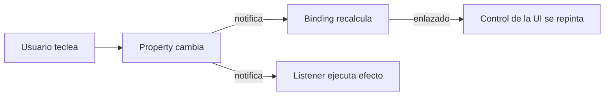
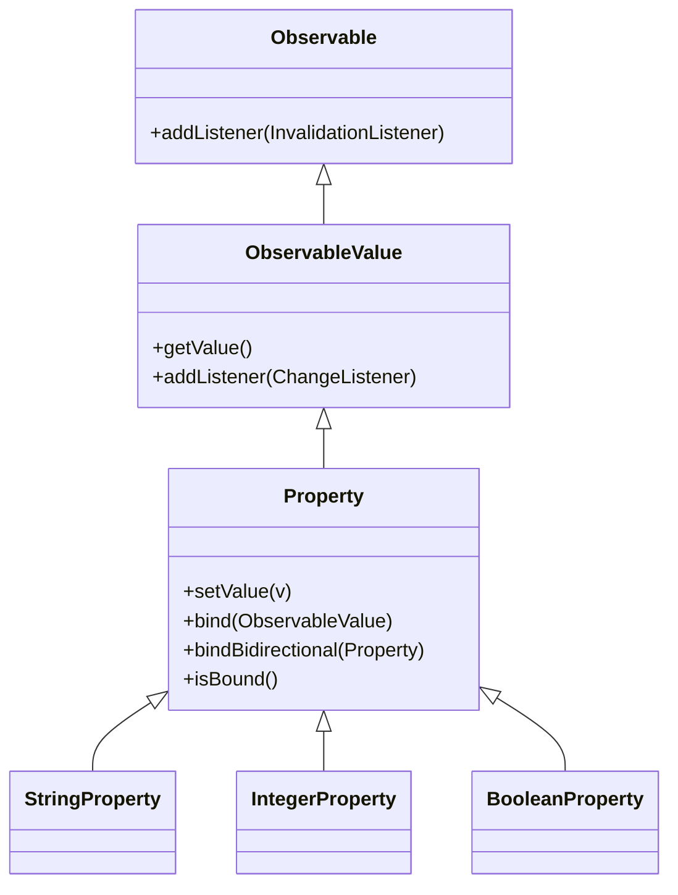
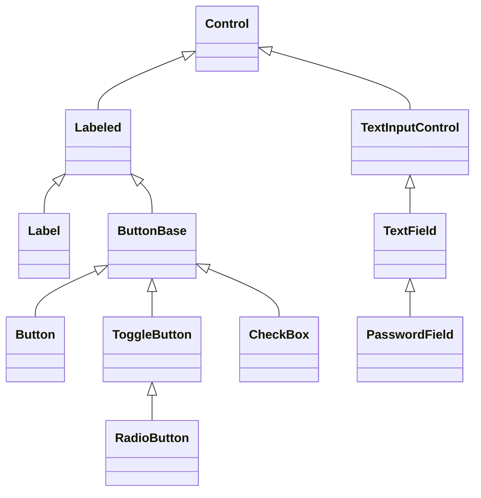
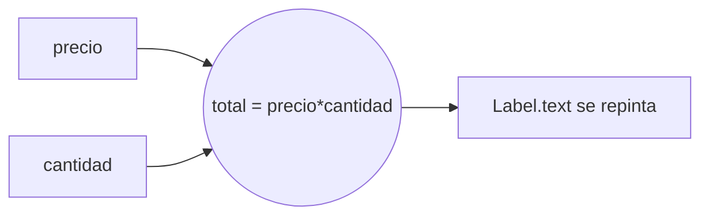
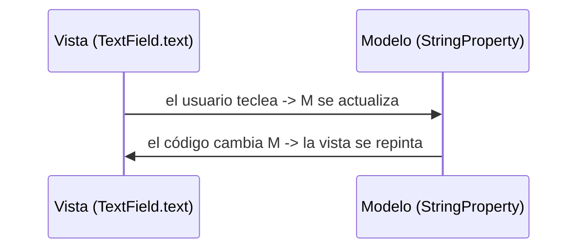
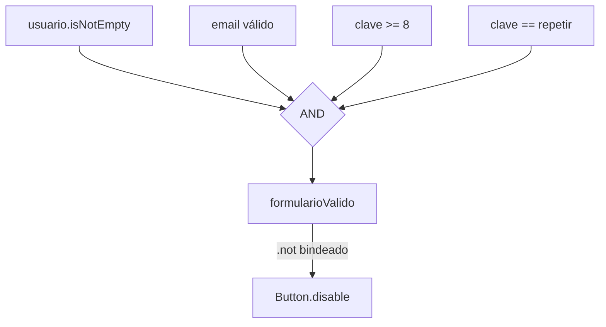

# Bloque 33 · Controles, Properties y Binding observable (DI · RA1/RA2)

> En el bloque 32 aprendiste a montar la ventana y a colocar el contenido (el *scene graph* y los
> *layouts*). Pero una ventana con cajas vacías no sirve de nada: falta **con qué interactúa la
> persona** (los *controles*: botones, campos, desplegables) y, sobre todo, falta el pegamento que
> conecta lo que el usuario hace con los datos de tu programa.
>
> Ese pegamento es el **modelo reactivo** de JavaFX: `Property`, `ObservableValue` y `binding`. Es
> **lo que más diferencia a JavaFX de la vieja Swing** y la idea más importante de todo el módulo de
> interfaces. La regla que vas a interiorizar aquí —y que ya no soltarás— es: **en JavaFX nunca
> actualizas la interfaz a mano**. No escribes "cuando cambie el precio, recalcula el total y pinta
> la etiqueta". Declaras una vez *"el total ES precio × cantidad"* y JavaFX lo mantiene vivo por ti.
>
> Si dominas este bloque, MVVM (b34), las tablas de datos (b35) y los formularios complejos te
> resultarán naturales. Si no, los arrastrarás como un peso. Tómatelo en serio: es el corazón.

---

## Cómo usar este documento

1. **Lee UNA sección y haz SU ejercicio.** Cada `## N.M` corresponde a un `EjNNN…`. No pases a la
   siguiente sin haber puesto en **verde** la anterior.
2. **Los tests son la especificación real.** El enunciado exacto de cada método vive en su
   `…Test.java`: ahí está el caso concreto y, sobre todo, el **caso límite** que debes respetar
   (clave de exactamente 7 vs 8 caracteres, lista vacía, valor `null`…). Si dudas, abre el test.
3. **El método `core` es lógica pura.** Construye controles y lee su estado, o calcula un binding,
   o convierte texto↔objeto: se prueba **sin abrir ventana**. El `main` (el *Playground*) sí monta
   la UI real y se lanza con *Run* (o `mvn -pl b33_fxcontrols javafx:run`): ejecútalo para **ver**
   con tus ojos lo que acabas de calcular.
4. Esta teoría **va más allá de lo que piden los ejercicios**: explica las alternativas de cada
   elemento (controles que no usa el ejercicio, tipos de listener, operaciones de `Bindings`…) para
   que, ante un caso nuevo, lo resuelvas tú solo. Las tablas "de consulta" son tu chuleta.
5. Cada reto extra trae una **GUÍA por capas** (teoría → pasos → `PISTA` → `OJO` → `CULTURA`). La
   capa `OJO:` te avisa de la trampa exacta del test.

> ⚠️ **Tests sin pantalla (*headless*):** algunos controles (`DatePicker`, `Spinner`…) necesitan el
> *toolkit* arrancado para construirse. En la app lo arranca `Application.launch`; en los tests lo
> arranca **Monocle** (motor de render "de mentira", sin ventanas). El `pom.xml` y el ayudante
> `IniciadorFx` ya lo hacen. Las `Property` y los `binding` puros **no** necesitan toolkit: son
> objetos normales, por eso buena parte de este bloque se testea sin tocar JavaFX gráfico.

---

## Antes de empezar: el cambio de chip "imperativo → reactivo"

Vienes de programar **imperativo**: das órdenes paso a paso ("lee el campo, calcula, escribe el
resultado"). Las interfaces antiguas (Swing) eran así: tú, a mano, en cada evento, leías un control,
calculabas y volcabas el resultado en otro. Funciona, pero es frágil: si olvidas recalcular en algún
sitio, la pantalla se queda **desincronizada** (muestra un dato viejo).

JavaFX propone el modelo **reactivo/declarativo**: describes **relaciones** entre datos una sola vez
y el framework las mantiene. Tres piezas:

- **`Property`** — un valor que **avisa** cuando cambia (un `int`, `String`, `boolean`… "observable").
- **Listener** — código que **reacciona** a ese aviso (lo de bajo nivel).
- **`Binding`** — un valor **calculado** a partir de properties que se **recalcula solo** (lo de alto
  nivel; casi siempre preferirás esto a los listeners).



La frase que resume el bloque: **el estado de la UI es DERIVADO del estado de los datos**. Tú tocas
los datos; la UI se actualiza sola porque la *describiste* en función de ellos.

---

## Índice

| Sección | Tema | Ejercicio |
|---|---|---|
| 1.1 | Controles básicos: `Label`, `Button`, `TextField`, `PasswordField`, `CheckBox`, `RadioButton` | `Ej263BasicControls` |
| 1.2 | Controles de selección: `ChoiceBox`, `ComboBox`, `DatePicker`, `Spinner`, `Slider` | `Ej264ChoiceComboPicker` |
| 2.1 | `Property` y listeners (`StringProperty`/`IntegerProperty`, `get`/`set`, `addListener`) | `Ej265PropertiesBasics` |
| 2.4 | Binding **unidireccional**: `bind()`, recálculo automático | `Ej266UnidirectionalBinding` |
| 2.5 | Binding **bidireccional**: `bindBidirectional`, sincronizar dos controles | `Ej267BidirectionalBinding` |
| 2.6 | Expresiones de binding: `Bindings.when/concat/createStringBinding` (fluent) | `Ej268BindingsExpressions` |
| 3.1 | Conversores: `StringConverter`, formateo y parsing en controles | `Ej269Converters` |
| 4.1 | Validación reactiva en vivo: habilitar el botón según el formulario | `Ej270FormValidationLive` |

> **Modelo mental que NO debes perder nunca:** un **control** muestra y recoge datos; su estado vive
> en **properties** (`textProperty`, `valueProperty`, `selectedProperty`…); un **binding** conecta
> properties para que un valor se calcule solo; y por eso **no escribes código que "repinte" la UI**.

La jerarquía de tipos que sostiene todo esto (cuanto más arriba, más general):



- **`Observable`**: lo mínimo, "algo que puede invalidarse" → admite `InvalidationListener`.
- **`ObservableValue`**: además **tiene un valor** que puedes leer (`getValue`) y observar con
  `ChangeListener` (te da viejo y nuevo). Un `Binding` es un `ObservableValue` de solo lectura.
- **`Property`**: además **se puede escribir** (`setValue`) y **enlazar** (`bind`). Las que usarás:
  `StringProperty`, `IntegerProperty`, `DoubleProperty`, `BooleanProperty`, `ObjectProperty<T>`.

---

## 1.1 · Controles básicos

**Ejercicio:** `Ej263BasicControls` · **Teoría aplicada:** construir controles y leer su estado.

Un **control** (`Control`) es un nodo del *scene graph* (b32) pensado para interactuar: tiene un
*skin* (su aspecto) y un estado. Los más elementales:

| Control | Para qué | Property clave | Lectura |
|---|---|---|---|
| `Label` | Mostrar texto (solo lectura) | `textProperty` | `getText()` |
| `Button` | Disparar una acción | `textProperty`, `onActionProperty` | — |
| `TextField` | Una línea de texto editable | `textProperty` | `getText()` |
| `PasswordField` | Texto editable enmascarado | `textProperty` | `getText()` (¡en claro!) |
| `CheckBox` | Sí/No independiente | `selectedProperty` | `isSelected()` |
| `RadioButton` | Opción exclusiva (con `ToggleGroup`) | `selectedProperty` | `isSelected()` |
| `ToggleButton` | Botón con estado on/off | `selectedProperty` | *(consulta — no lo usa el ejercicio)* |
| `Hyperlink` | Enlace clicable | `textProperty` | *(consulta)* |

**Reglas grabadas:**

- **`getText()` nunca es `null`** en `TextField`/`PasswordField`: por defecto es `""`. Por eso puedes
  llamar a `.isBlank()` sin miedo.
- **`PasswordField` enmascara al PINTAR, no al guardar.** `getText()` devuelve la contraseña en
  claro. Nunca la registres en logs ni la mandes sin cifrar (conecta con **b30 · criptografía**).
- **`disable` ≠ `visible`.** Un control deshabilitado (`setDisable(true)`) se ve atenuado y no recibe
  eventos; uno invisible (`setVisible(false)`) desaparece. Son cosas distintas.
- **`RadioButton` necesita un `ToggleGroup`** para ser exclusivo. Sin grupo, varios radios pueden
  estar marcados a la vez. El grupo garantiza "como mucho uno".
- `TextField` y `PasswordField` heredan de **`TextInputControl`**: esa superclase trae `clear()`,
  `appendText()`, `insertText()`, `positionCaret()`… Tratarlos por la superclase es polimorfismo (b01).



```java
TextField usuario = new TextField();
usuario.setId("usuario");
PasswordField clave = new PasswordField();
CheckBox recordar = new CheckBox("Recordarme");
Button entrar = new Button("Entrar");
VBox raiz = new VBox(usuario, clave, recordar, entrar);
```

Para los radios exclusivos:

```java
ToggleGroup grupo = new ToggleGroup();
RadioButton efectivo = new RadioButton("Efectivo"); efectivo.setToggleGroup(grupo);
RadioButton tarjeta  = new RadioButton("Tarjeta");   tarjeta.setToggleGroup(grupo);
// grupo.getSelectedToggle() -> el RadioButton marcado, o null si ninguno.
```

> **Trampa del test:** `resumenSeleccion` debe devolver `""` cuando **no hay nada seleccionado**
> (`getSelectedToggle()` es `null`). Comprueba el null antes de castear.

> **Lo practicas en `Ej263BasicControls`:** core `construirLogin` (montar y localizar controles por
> id) y `resumenSeleccion` (leer el radio del grupo, con caso límite "nada marcado"). Los 10 retos
> recorren todo el inventario: `Label`, toggle de `CheckBox`, leer `PasswordField`, contar marcados,
> `disable`, radio null-safe, validar no vacío, limpiar por `TextInputControl`, `appendText` y crear
> el `ToggleGroup`.

---

## 1.2 · Controles de selección

**Ejercicio:** `Ej264ChoiceComboPicker` · **Teoría aplicada:** construir un control y leer su valor.

Cuando el usuario debe **elegir** en vez de teclear libremente, usas un control de selección. La
ventaja: el valor está **acotado** (no puede meter basura), así te ahorras validar.

| Control | Para qué | Valor (`getValue()` / …) | Notas |
|---|---|---|---|
| `ChoiceBox<T>` | Pocas opciones, desplegable simple | `getValue()` | Ligero; sin búsqueda |
| `ComboBox<T>` | Muchas opciones; opcional editable | `getValue()` | Rico: `cellFactory`, editable, prompt |
| `DatePicker` | Elegir una fecha | `getValue()` → `LocalDate` | Texto vía `StringConverter` (3.1) |
| `Spinner<T>` | Número/valor con flechas ▲▼ | `getValue()` | Acotado por `SpinnerValueFactory` |
| `Slider` | Número continuo arrastrando | `getValue()` → `double` | `min`/`max`/`majorTickUnit`/`snapToTicks` |

**Conceptos que el ejercicio toca y los que NO (consulta):**

- **`getSelectionModel()`** gestiona la selección por índice (`selectFirst`, `select(i)`,
  `getSelectedIndex`). En `ComboBox`/`ChoiceBox`, `getValue()` y el `selectionModel` quedan
  sincronizados.
- **`ComboBox` editable** (`setEditable(true)`) expone un `TextField` interno con `getEditor()`,
  donde el usuario puede teclear un valor que **no está** en la lista. En un combo NO editable,
  `getEditor()` es `null`.
- **`Spinner`** delega el rango y el paso en un **`SpinnerValueFactory`** (por eso al pasarte del
  máximo se queda en el tope, sin excepción). Métodos: `increment(n)`, `decrement(n)`.
- **`Slider`**: además de `min/max/value`, tiene marcas (`showTickMarks`, `majorTickUnit`,
  `minorTickCount`) y **`snapToTicks`** (al soltar, salta a la marca más cercana). *(El ejercicio
  solo usa value/min/max y snap; el resto es consulta para cuando lo necesites.)*

```java
ComboBox<String> combo = new ComboBox<>();
combo.getItems().addAll("Rojo", "Verde", "Azul");
combo.setValue("Verde");                 // selección inicial

Spinner<Integer> spinner = new Spinner<>(0, 10, 3);  // min, max, inicial
spinner.increment(2);                    // -> 5

DatePicker dp = new DatePicker(LocalDate.now());
long dias = ChronoUnit.DAYS.between(a.getValue(), b.getValue());
```

> **Trampa del test:** en `porcentajeSlider`, **divide en `double`** (`(value-min)/(max-min)*100`):
> con `int` la división trunca a 0. Y en `comboEditableTexto`, pon `setEditable(true)` **antes** de
> `getEditor()` o tendrás `NullPointerException`.

> **Lo practicas en `Ej264ChoiceComboPicker`:** cores `construirCombo` y `valorSpinner`. Retos:
> `Slider` y su porcentaje, `selectFirst`, `ChoiceBox`, valor por defecto null-safe, `increment`,
> `DatePicker` y días entre fechas, combo editable y configurar marcas/snap del slider.

---

## 2.1 · `Property` y listeners

**Ejercicio:** `Ej265PropertiesBasics` · **Teoría aplicada:** observar cambios y notificaciones.

Una **`Property`** envuelve un valor y **avisa cuando cambia**. Las concretas:
`SimpleStringProperty`, `SimpleIntegerProperty`, `SimpleDoubleProperty`, `SimpleBooleanProperty`,
`SimpleObjectProperty<T>`. Operaciones básicas: `get()`/`getValue()`, `set()`/`setValue()`.

```java
StringProperty nombre = new SimpleStringProperty("Ada");
nombre.get();             // "Ada"
nombre.set("Grace");      // cambia y NOTIFICA a los listeners
```

### Listener de cambio (`ChangeListener`)

Recibe **observable, valor viejo y valor nuevo**. Úsalo cuando necesitas los valores:

```java
nombre.addListener((obs, viejo, nuevo) -> System.out.println(viejo + " -> " + nuevo));
```

**Regla de oro de la notificación:** asignar **el mismo valor que ya tenía NO dispara** el listener
(`set("Ada")` cuando ya valía `"Ada"` no hace nada). Esto evita disparos "de más" y, como verás en
el reto 9 de Ej270, **rompe los bucles infinitos** al modificar la property desde su propio listener.

### 2.2 · `InvalidationListener` vs `ChangeListener` *(consulta + reto 5)*

| Tipo | Firma de la lambda | Te da | Coste | Cuándo |
|---|---|---|---|---|
| `ChangeListener<T>` | `(obs, viejo, nuevo)` | el valor nuevo y el viejo | mayor (calcula el valor) | necesitas el dato |
| `InvalidationListener` | `(obs)` | nada (solo "algo cambió") | menor | solo "marcar sucio"/repintar |

Para una `Property` normal (eager) ambos disparan al cambiar; la diferencia conceptual es que
`InvalidationListener` no te entrega el valor (es más barato) y, en *bindings* perezosos, solo
dispara una vez hasta que vuelvas a leer.

### 2.3 · El patrón "JavaFX bean" *(consulta + reto 10)*

Para que un objeto de tu dominio sea observable, expón cada campo como property con **tres
miembros**: el getter, el setter y el accesor `xProperty()`:

```java
public final class Persona {
    private final StringProperty nombre = new SimpleStringProperty(this, "nombre", "");
    public String getNombre() { return nombre.get(); }
    public void setNombre(String v) { nombre.set(v); }
    public StringProperty nombreProperty() { return nombre; }   // <- la clave
}
```

Getter/setter y property **comparten estado**: tocar uno se ve en el otro. Ese `nombreProperty()` es
justo lo que **`TableView` (b35)** necesita para refrescar una sola celda cuando cambia ese campo.

> **No olvides `removeListener`** cuando un listener deje de hacer falta: si no, retiene los objetos
> a los que apunta y provoca **fugas de memoria** (el reto 7 lo demuestra: quitas el listener y deja
> de dispararse).

> **Lo practicas en `Ej265PropertiesBasics`:** cores `cambiosRegistrados` (un `ChangeListener` que
> acumula los valores nuevos) y `contarNotificaciones` (mismo valor → no cuenta). Retos: leer/escribir,
> property con bean/nombre, último valor, `InvalidationListener`, "¿dispara cambio?", `removeListener`,
> lectura null-safe, conmutar `BooleanProperty` y el patrón bean en un POJO.

---

## 2.4 · Binding unidireccional

**Ejercicio:** `Ej266UnidirectionalBinding` · **Teoría aplicada:** `bind()` y recálculo automático.

Un **binding** es un `ObservableValue` de **solo lectura** cuyo valor se **calcula** a partir de
otras properties y **se recalcula solo** cuando ellas cambian. Dos formas de crearlo:

**1) Operadores fluent** sobre la property (devuelven un `Binding`):

```java
IntegerProperty precio = new SimpleIntegerProperty(10);
IntegerProperty cantidad = new SimpleIntegerProperty(3);
NumberBinding total = precio.multiply(cantidad);   // total = precio * cantidad, VIVO
total.intValue();        // 30
cantidad.set(5);
total.intValue();        // 50  <- recalculado solo, sin multiplicar a mano
```

Catálogo fluent (sobre `IntegerExpression`/`StringExpression`/`BooleanExpression`):
`add`, `subtract`, `multiply`, `divide`, `negate`; `greaterThan`, `lessThan`,
`greaterThanOrEqualTo`, `isEqualTo`; `concat`, `length`, `isEmpty`, `isNotEmpty`; `and`, `or`, `not`.

**2) `property.bind(otra)`** — enlaza una property *destino* para que **copie y siga** a una fuente:

```java
StringProperty destino = new SimpleStringProperty();
destino.bind(fuente);        // destino = fuente, y la sigue
```



> **Trampa CAPITAL:** una property **enlazada con `bind()` es de solo lectura**. Si intentas
> `destino.set(x)` lanza `RuntimeException` ("A bound value cannot be set"). Para volver a asignarla
> a mano, primero `destino.unbind()`. (El reto 8 te hace provocar y capturar esa excepción.)

> **Trampa:** `greaterThan` es **estricto** (`>`). Si `numero == umbral`, da `false`. Para incluir
> el límite usa `greaterThanOrEqualTo`.

> **Lo practicas en `Ej266UnidirectionalBinding`:** cores `totalLineaPedido` y `recalculoAutomatico`
> (cambias el precio DESPUÉS y el total se actualiza solo). Retos: `bind` de properties, doble/suma,
> `isBound`, `concat`, `greaterThan`, `length`, la trampa de set sobre enlazada, `not`, y una cadena
> de dependencias recalculada (como una celda de Excel).

---

## 2.5 · Binding bidireccional

**Ejercicio:** `Ej267BidirectionalBinding` · **Teoría aplicada:** `bindBidirectional`.

El `bind()` va en **un solo sentido** y deja el destino de solo lectura. El **bidireccional**
mantiene **dos properties sincronizadas en ambos sentidos**, y ambas siguen siendo escribibles:

```java
StringProperty a = new SimpleStringProperty("X");
StringProperty b = new SimpleStringProperty("otro");
a.bindBidirectional(b);     // a TOMA el valor de b -> a = "otro"
a.set("HOLA");              // b también pasa a "HOLA"
b.set("mundo");             // a también pasa a "mundo"
a.unbindBidirectional(b);   // los desliga: vuelven a ser independientes
```

| | `bind()` (unidireccional) | `bindBidirectional()` |
|---|---|---|
| Sentido | fuente → destino | ambos sentidos |
| ¿Destino escribible? | **No** (solo lectura) | **Sí** (ambas) |
| Al enlazar, ¿quién gana? | el destino copia la fuente | la **derecha** (el argumento) gana |
| Deshacer | `unbind()` | `unbindBidirectional(otra)` |
| Tipos distintos | no directamente | sí, con `StringConverter` |
| Uso típico | etiqueta calculada, estado derivado | **control ↔ modelo** (MVVM) |

> **Trampa del "quién gana":** en `a.bindBidirectional(b)`, **`a` toma el valor de `b`** en el momento
> del enlace (gana el de la derecha). Al enlazar modelo↔vista, decide cuál tiene el dato bueno al
> arrancar y ponlo a la derecha.

**Tipos distintos** (p. ej. un `TextField` de texto enlazado a un `IntegerProperty`): hace falta un
conversor, con la forma estática de `Bindings`:

```java
Bindings.bindBidirectional(textoProperty, numeroProperty, new NumberStringConverter());
numeroProperty.set(42);     // textoProperty pasa a "42"
```



> **Lo practicas en `Ej267BidirectionalBinding`:** cores `sincronizarTextos` y
> `sincronizarDosControles`. Retos en dificultad creciente: comprobar el enlace, escribir en uno y
> leer en el otro, "quién gana", enlace numérico y booleano, cambios en ambas direcciones, desligar,
> tres en cadena, enlace **con conversor** (tipos distintos) y formulario espejo modelo↔vista.

---

## 2.6 · Expresiones de binding (`Bindings`)

**Ejercicio:** `Ej268BindingsExpressions` · **Teoría aplicada:** la clase utilitaria `Bindings`.

La clase **`Bindings`** ofrece la forma **estática** de construir bindings, y el "if observable"
fluido `when/then/otherwise`. Es el "SQL/Excel" del modelo reactivo.

| Operación | Crea | Ejemplo |
|---|---|---|
| `Bindings.when(cond).then(x).otherwise(y)` | el ternario observable | `when(saldo.lessThan(0)).then("Rojo").otherwise("OK")` |
| `Bindings.concat(a, "-", b)` | `StringExpression` | une properties y literales |
| `Bindings.createStringBinding(lambda, deps…)` | `StringBinding` a medida | tú escribes el cálculo |
| `Bindings.createBooleanBinding(lambda, deps…)` | `BooleanBinding` a medida | combinar reglas |
| `Bindings.format("%d uds", n)` | `StringExpression` | como `String.format`, observable |
| `Bindings.max/min(a, b)` | `NumberBinding` | mayor/menor |
| `Bindings.equal/greaterThan/...` | `BooleanBinding` | comparaciones |
| `Bindings.size(lista)` / `isEmpty(lista)` | `IntegerBinding`/`BooleanBinding` | sobre `ObservableList` |
| `Bindings.valueAt(lista, indiceObservable)` | `ObjectBinding<E>` | la celda i-ésima, viva |

```java
StringBinding estado = Bindings.when(saldo.lessThan(0)).then("Rojo").otherwise("OK");

StringBinding ficha = Bindings.createStringBinding(
        () -> nombre.get() + " (" + edad.get() + ")",
        nombre, edad);            // <- dependencias
```

> **El error #1 de `createXxxBinding`:** **olvidar una dependencia**. Si dentro de la lambda usas
> `edad` pero no la pasas como argumento, el binding **no se recalcula** cuando `edad` cambie: se
> queda "pillado" con el primer valor. Pasa SIEMPRE todas las properties que leas dentro.

> **Trampa del idioma:** `Bindings.format("%.2f", x)` usa el **Locale por defecto**; en España el
> separador decimal es coma (`3,14`). Para forzar punto: `Bindings.format(Locale.US, "%.2f", x)`. En
> el ejercicio usamos `%d` (entero) para evitar el problema.

> **Lo practicas en `Ej268BindingsExpressions`:** cores `etiquetaEstadoSaldo` (`when/then/otherwise`)
> y `mensajeCarrito` (`createStringBinding`). Retos: `concat`, ternaria, `max`, `equal`, `size`,
> `isEmpty`, `format`, binding con varias dependencias, `valueAt` y un `when` anidado (semáforo).

---

## 3.1 · Conversores (`StringConverter`)

**Ejercicio:** `Ej269Converters` · **Teoría aplicada:** texto ↔ objeto en los controles.

Un control muestra **texto**, pero su valor es un **objeto** (`LocalDate`, `Integer`, tu tipo). El
puente es un **`StringConverter<T>`**, con dos métodos:

- **`String toString(T objeto)`** — cómo se **VE** el objeto (para pintar).
- **`T fromString(String texto)`** — cómo se **LEE** lo tecleado (para guardar).

```java
StringConverter<LocalDate> conv = new StringConverter<>() {
    final DateTimeFormatter F = DateTimeFormatter.ofPattern("dd/MM/yyyy");
    public String toString(LocalDate d) { return d == null ? "" : d.format(F); }
    public LocalDate fromString(String s) { return LocalDate.parse(s, F); }
};
```

### 3.2 · Conversores de fábrica *(consulta + retos 2-4)*

En `javafx.util.converter` hay uno por tipo, ya hechos:
`IntegerStringConverter`, `LongStringConverter`, `DoubleStringConverter`, `BooleanStringConverter`,
`LocalDateStringConverter`, `NumberStringConverter` (este respeta el Locale; `DoubleStringConverter`
usa `Double.toString`, con punto, independiente del idioma).

### 3.3 · Enchufar el conversor a un control *(reto 8)*

```java
datePicker.setConverter(conv);     // ahora pinta/parsea con TU formato
spinner.getValueFactory().setConverter(conv);
tableColumn.setCellFactory(TextFieldTableCell.forTableColumn(conv));   // editar celdas (b35)
```

### 3.4 · Parseo seguro *(reto 9)*

`fromString` puede lanzar (`DateTimeParseException`, `NumberFormatException`…). En una UI, **degrada
con elegancia**: captura y devuelve un valor por defecto en vez de reventar la pantalla.

```java
try { return conv.fromString(texto); }
catch (RuntimeException e) { return porDefecto; }
```

> **La regla de oro del conversor:** debe cumplir `fromString(toString(x)).equals(x)` (ida y vuelta
> sin pérdida). El reto 5 lo verifica de forma genérica; es un test de calidad de cualquier conversor.

> **Lo practicas en `Ej269Converters`:** cores `fechaATexto`/`textoAFecha` (formato `dd/MM/yyyy`).
> Retos: conversor de fecha reutilizable, conversores de fábrica (`Double`/`Integer`), round-trip
> genérico, conversores a medida (`Boolean` "Sí/No", mayúsculas), enchufarlo a un `DatePicker`,
> parseo seguro y un conversor de un objeto de dominio (es un serializador como Jackson de **b02**).

---

## 4.1 · Validación reactiva en vivo

**Ejercicio:** `Ej270FormValidationLive` · **Teoría aplicada:** todo el bloque, junto, en un ViewModel.

La culminación: un **formulario que se valida solo**. La regla "¿puedo enviar?" es un
**`BooleanBinding`** calculado a partir de las properties de los campos, y la vista **bindea** el
`disableProperty` del botón a ese binding. **Nunca** habilitas/deshabilitas a mano.

```java
BooleanBinding formularioValido =
        usuario.textProperty().isNotEmpty()
       .and(clave.textProperty().length().greaterThan(7));

entrar.disableProperty().bind(formularioValido.not());   // el botón se gestiona SOLO
```

Lo potente: es **100 % testeable sin abrir ventana**. Toda la lógica vive en properties y bindings
(objetos normales). En el test creas properties, las mutas y compruebas que el binding cambia
"en vivo" sin volver a llamar a nada. Esa es la **regla de oro del addendum §1.6**: si un test
necesitara pantalla real, la lógica estaría mal colocada.

### 4.2 · Validación por patrón (regex) *(reto 4)*

Para formatos (email, DNI, código postal) usa expresiones regulares con `String.matches`:

```java
boolean ok = email != null && email.matches("[^@\\s]+@[^@\\s]+\\.[^@\\s]+");
```

### 4.3 · Cuándo un listener en vez de un binding *(reto 9)*

Un binding **calcula otro valor**. Si lo que quieres es **modificar la misma property** (forzar
mayúsculas según se teclea), eso es un **efecto secundario** → usa un listener. Cuidado con los
bucles: como `set` del mismo valor no notifica (2.1), `"ABC".toUpperCase()` ya es `"ABC"` y no
re-dispara. Úsalo con moderación; el binding es casi siempre la opción más limpia.

### 4.4 · El ViewModel completo *(reto 10)*

Un ViewModel reúne **todas las reglas** en un único binding combinado con `and`:

```java
BooleanBinding registroValido =
        usuario.isNotEmpty()
       .and(Bindings.createBooleanBinding(() -> emailValido(email.get()), email))
       .and(clave.length().greaterThanOrEqualTo(8))
       .and(clave.isEqualTo(repetir));
```

El estado de validez es **derivado**: nunca lo calculas a mano en cada evento. Esto es exactamente
el patrón de los **formularios reactivos** modernos (Angular Reactive Forms, React Hook Form, Formik)
y la antesala del **MVVM de b34**, donde este ViewModel se separa por completo de la vista FXML.



> **Lo practicas en `Ej270FormValidationLive`:** cores `puedeEnviar` (binding usuario+clave) y
> `mensajeValidacion` (primer error por prioridad). Retos: `isNotEmpty`, `length` mínima,
> `isEqualTo`, email por regex, contador de caracteres, binding reactivo que se devuelve y se prueba
> "en vivo", mensaje dinámico, "todos completos" combinando reglas, listener de mayúsculas y el
> ViewModel completo de registro.

---

## Errores comunes del bloque

| # | Error | Antídoto |
|---|---|---|
| 1 | Actualizar la UI a mano en cada evento ("recalcula y pinta") | Describe la relación con un **binding** una vez; deja que JavaFX repinte |
| 2 | `set(x)` sobre una property enlazada con `bind()` → `RuntimeException` | Una property con `bind()` es **solo lectura**; haz `unbind()` antes, o usa bidireccional |
| 3 | `createStringBinding`/`createBooleanBinding` que no se recalcula | **Pasa todas las dependencias** que leas dentro de la lambda |
| 4 | Esperar que `set(mismoValor)` dispare el listener | Asignar el valor que ya tenía **no notifica** (por diseño) |
| 5 | `NullPointerException` al castear `getSelectedToggle()` | Comprueba `null` (nadie seleccionado) antes de castear a `RadioButton` |
| 6 | `getEditor()` de un `ComboBox` da `null` | Solo existe si `setEditable(true)`; ponlo editable antes |
| 7 | `porcentajeSlider` da 0 | Divide en `double`, no en `int` (la división entera trunca) |
| 8 | `Bindings.format("%.2f", x)` muestra coma en vez de punto | Es el Locale; usa `Bindings.format(Locale.US, …)` o `%d` |
| 9 | `greaterThan` falla en el límite | Es **estricto** (`>`); usa `greaterThanOrEqualTo` para incluir el borde |
| 10 | El conversor pierde datos en la ida y vuelta | Cumple `fromString(toString(x)).equals(x)`; cuida `toString(null)` → `""` |
| 11 | `bindBidirectional` deja el valor "equivocado" al enlazar | Gana la **derecha** (el argumento); pon ahí el dato bueno |
| 12 | Fuga de memoria por listeners | `removeListener` cuando ya no haga falta |
| 13 | `fromString` inválido revienta la pantalla | Parseo seguro: `try/catch` y valor por defecto |
| 14 | Loguear/enviar `PasswordField.getText()` en claro | Guarda la contraseña en claro; trátala como secreto (b30) |

---

## Chuleta final del bloque

```text
Property            = valor observable (Simple{String,Integer,Double,Boolean,Object}Property)
get/set             = leer/escribir; set(mismoValor) NO notifica
ChangeListener      = (obs, viejo, nuevo) -> ...   (te da el valor)
InvalidationListener= (obs) -> ...                 (más barato, sin valor)
removeListener      = evita fugas de memoria
bind()              = destino sigue a fuente; destino queda SOLO LECTURA (set -> excepción)
unbind()            = romper bind unidireccional
bindBidirectional   = dos properties sincronizadas en ambos sentidos; gana la DERECHA al enlazar
fluent              = a.multiply(b) .add .greaterThan .length .isNotEmpty .and .or .not .concat
Bindings.when       = when(cond).then(x).otherwise(y)   (ternario observable; se anida)
Bindings.createX    = lambda + TODAS las dependencias (o no se recalcula)
Bindings.size/isEmpty/valueAt = sobre ObservableList
StringConverter<T>  = toString(obj)=cómo se VE ; fromString(txt)=cómo se GUARDA
conversores fábrica = javafx.util.converter.{Integer,Double,Boolean,LocalDate,Number}StringConverter
control.setConverter= enchufar conversor a DatePicker/Spinner/columna
validación reactiva = formularioValido = reglaA.and(reglaB)... ; boton.disable.bind(valido.not())
regla de oro        = nunca actualizas la UI a mano; el estado de la UI es DERIVADO de los datos
```

---

## Autoevaluación (responde sin mirar; si fallas 2+, relee la sección)

1. ¿Qué superclase comparten `TextField` y `PasswordField`, y qué método de limpieza heredan? *(1.1)*
2. ¿Por qué `PasswordField.getText()` es un riesgo de seguridad? *(1.1)*
3. ¿Qué garantiza un `ToggleGroup` sobre un conjunto de `RadioButton`? *(1.1)*
4. ¿Qué devuelve `getEditor()` en un `ComboBox` no editable y cómo lo evitas? *(1.2)*
5. ¿Por qué `Spinner` no lanza excepción al pasarte del máximo? *(1.2)*
6. ¿Qué diferencia hay entre `ChangeListener` e `InvalidationListener`? *(2.1/2.2)*
7. ¿Dispara el listener `set("x")` si la property ya valía `"x"`? ¿Por qué importa? *(2.1)*
8. ¿Qué tres miembros expone una property en el patrón "JavaFX bean"? *(2.3)*
9. ¿Qué ocurre si haces `set()` sobre una property enlazada con `bind()`? *(2.4)*
10. ¿En qué se diferencian `bind()` y `bindBidirectional()`? *(2.4/2.5)*
11. Al hacer `a.bindBidirectional(b)`, ¿qué valor acaba teniendo `a`? *(2.5)*
12. ¿Cuál es el error más común al usar `Bindings.createStringBinding`? *(2.6)*
13. ¿Por qué `Bindings.format("%.2f", x)` puede mostrar una coma decimal? *(2.6)*
14. ¿Qué dos métodos define un `StringConverter` y qué hace cada uno? *(3.1)*
15. ¿Qué propiedad debe cumplir un buen conversor (ida y vuelta)? *(3.1)*
16. ¿Cómo evitas que un `fromString` inválido rompa la pantalla? *(3.4)*
17. ¿Cómo expresas "el botón está habilitado solo si el formulario es válido" sin tocar la UI a mano? *(4.1)*
18. ¿Cuándo usarías un listener en vez de un binding? *(4.3)*
19. ¿Cómo combinas varias reglas de validación en un único binding? *(4.4)*
20. Frase del bloque: ¿de qué es "derivado" el estado de la UI? *(intro)*
