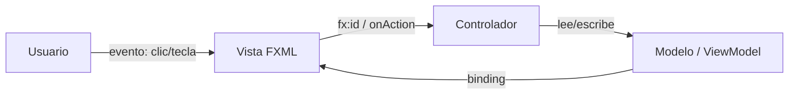
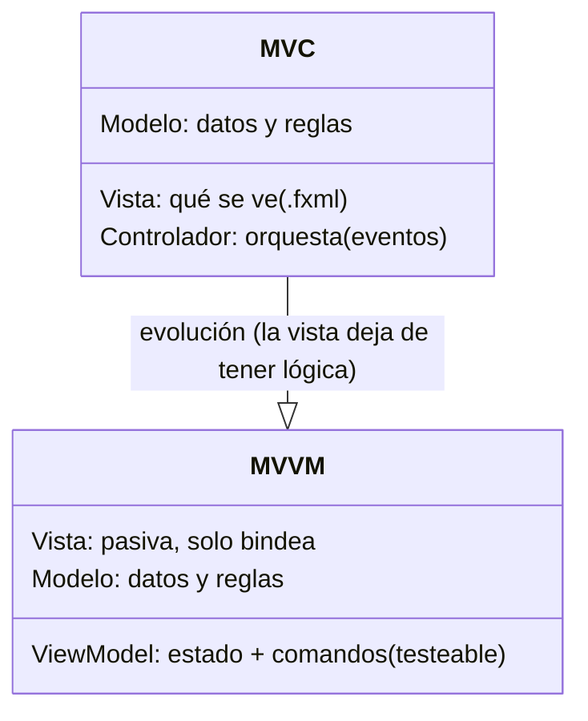
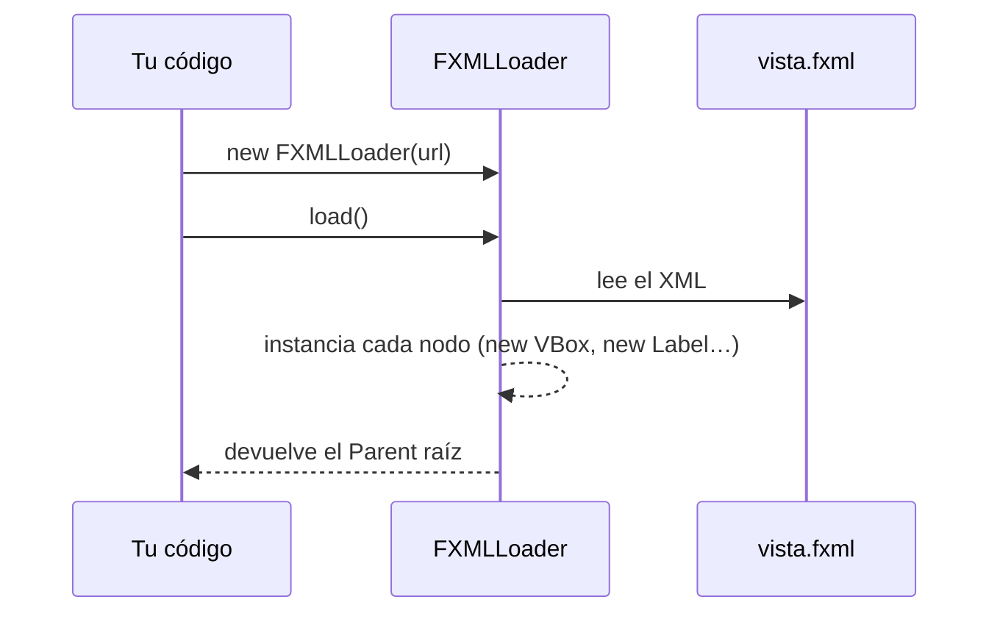
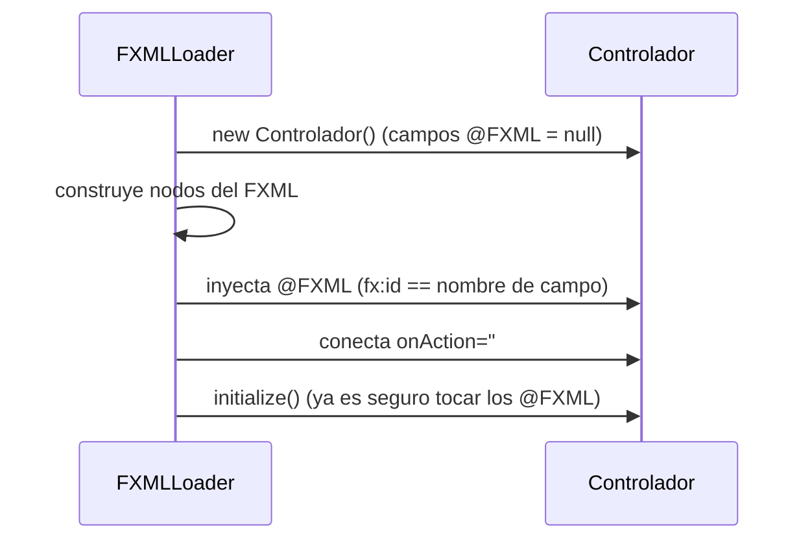
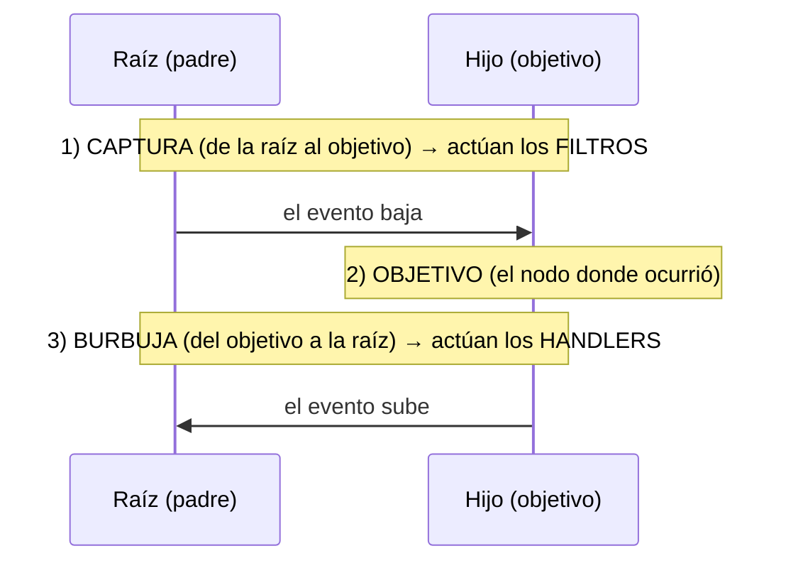
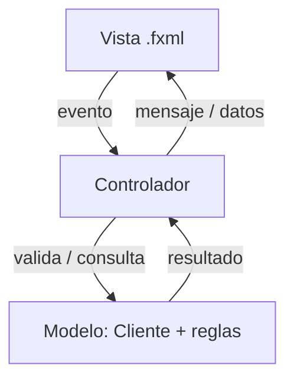
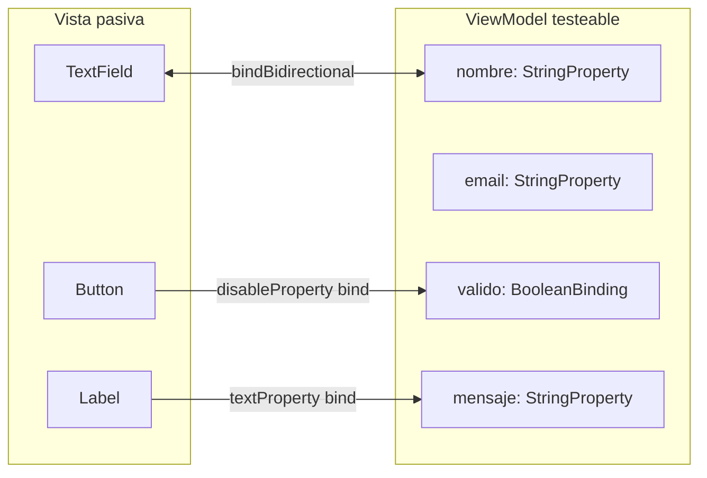
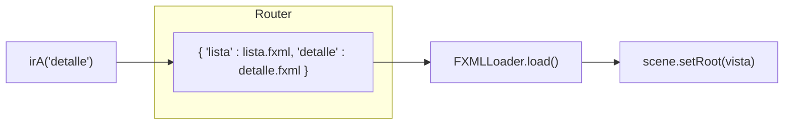
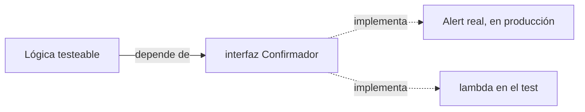

# Bloque 34 · FXML, Scene Builder, MVC/MVVM y eventos (DI · RA1)

> En el bloque 32 montaste la ventana a mano (Java puro: `new VBox(...)`) y en el 33 aprendiste el
> binding reactivo. Funciona, pero construir una pantalla grande escribiendo `new` para cada botón
> es lento, ilegible y mezcla *qué se ve* con *qué hace*. Los profesionales no lo hacen así.
>
> Aquí das el salto a la forma **real** de trabajar: describes la interfaz de forma **declarativa**
> en un fichero `.fxml` (que puedes dibujar con el ratón en **Scene Builder**) y dejas la lógica en
> una clase aparte, el **controlador**. Luego subes un peldaño más con **MVVM**: una *vista pasiva*
> que solo *bindea* un **ViewModel** testeable. Y aprendes cómo viaja un **evento** (un clic, una
> tecla) por la interfaz: el mecanismo que conecta al usuario con tu código.
>
> Si en el 33 interiorizaste "la UI deriva de los datos", aquí interiorizas "la UI se **declara**, no
> se programa; y la lógica vive **fuera** de la vista". Con esto ya puedes construir una aplicación
> de escritorio de verdad, y en b35 le enchufarás datos en tablas y llamadas a tu propia API REST.

---

## Cómo usar este documento

1. **Lee UNA sección y haz SU ejercicio.** Cada `## N.M` corresponde a un `EjNNN…`. No pases a la
   siguiente sin poner en **verde** la anterior.
2. **Los tests son la especificación real.** El enunciado exacto y, sobre todo, el **caso límite**
   (ruta inexistente, lista vacía, evento consumido, formulario inválido…) viven en su
   `…Test.java`. Si dudas de qué espera un método, abre el test.
3. **El método `core` es lógica pura headless.** Cargar un FXML y leer su árbol, contar disparos de
   un evento, el estado de un ViewModel o la decisión de un diálogo se prueban **sin abrir ventana**.
   El `main` (el *Playground*) sí monta UI real; lánzalo con *Run* o `mvn -pl b34_fxfxml javafx:run`
   para **ver** lo que calculaste (el Playground principal del bloque es `Ej276MvvmViewModel`).
4. Esta teoría **va más allá de lo que piden los ejercicios**: enumera opciones que no usarás en el
   reto (otros tipos de eventos, otros diálogos, `fx:include`, `ResourceBundle`…) para que ante un
   caso nuevo lo resuelvas tú solo. Las tablas "de consulta" son tu chuleta.
5. Cada reto extra trae una **GUÍA por capas** (teoría → pasos → `PISTA` → `OJO` → `CULTURA`). La
   capa `OJO:` te avisa de la trampa exacta del test.

> ⚠️ **Tests sin pantalla (*headless*):** cargar un `.fxml`, construir controles o crear un `Alert`
> necesita el *toolkit* arrancado. En la app lo arranca `Application.launch`; en los tests lo arranca
> **Monocle** (motor de render "de mentira"). El `pom.xml` y el ayudante `IniciadorFx` ya lo hacen.
> Crear un `Alert`/`Dialog` exige además estar en el **FX Application Thread**: por eso esos pocos
> tests envuelven su cuerpo en `IniciadorFx.enFx(...)`. La lógica pura (router, ViewModel, decisión
> de un diálogo abstraído tras una interfaz) **no** necesita nada de esto.

---

## Antes de empezar: tres trampas de entorno

1. **El FXML es un recurso del classpath, no un fichero suelto.** Vive en
   `src/main/resources/com/masterclass/api/b34_fxfxml/` y se localiza con
   `getClass().getResource("/com/masterclass/api/b34_fxfxml/vista.fxml")` (ruta **absoluta**, con
   `/` inicial). Si lo pones en `src/main/java`, Maven no lo copia y `getResource` devuelve `null`.
2. **`javafx-fxml` es una dependencia aparte.** `javafx-controls` te da los botones; el
   `FXMLLoader` vive en `javafx-fxml`. El `pom.xml` del bloque ya incluye ambas.
3. **Un `@FXML` vale `null` hasta que `load()` termina.** Tocar un campo `@FXML` en el constructor
   del controlador es el NullPointerException más típico de JavaFX. El sitio seguro es
   `initialize()` (ver 1.2).

---

## Tabla índice

| Sección | Tema | Ejercicio |
|---|---|---|
| 1.1 | Cargar una vista con `FXMLLoader` | `Ej271FxmlLoaderBasics` |
| 1.2 | Inyección de controlador: `@FXML`, `fx:id`, `initialize()` | `Ej272ControllerInjection` |
| 2.1 | Modelo de eventos: `onAction`, `EventHandler`, `ActionEvent` | `Ej273EventHandlers` |
| 2.3 | Ratón/teclado, *filtros* vs *handlers* y propagación | `Ej274MouseKeyboardEvents` |
| 3.1 | MVC: dónde vive cada cosa | `Ej275MvcSeparation` |
| 3.5 | MVVM: ViewModel *bindeado*, vista pasiva | `Ej276MvvmViewModel` |
| 4.1 | Navegación entre varias vistas FXML | `Ej277MultiViewNavigation` |
| 4.3 | Diálogos: `Alert`, `Dialog`, `ChoiceDialog` | `Ej278DialogsAndAlerts` |

> **Modelo mental del bloque.** Tres capas de separación, cada una más fina que la anterior:
> **(1) Vista vs Controlador** (FXML vs Java) → **(2) MVC** (mete el Modelo en medio) → **(3) MVVM**
> (la vista solo *bindea* un ViewModel testeable). Y, atravesándolo todo, el **evento**: el mensaje
> que el usuario envía a tu lógica.





---

## 1. FXML y el `FXMLLoader`

**FXML** es un XML donde cada etiqueta es una **clase JavaFX** y cada atributo, una **propiedad**.
`<VBox spacing="10">` equivale a `VBox v = new VBox(); v.setSpacing(10);`. Lo escribes a mano o lo
dibujas en **Scene Builder** (editor visual gratuito de Gluon que genera el `.fxml` por ti). La
ventaja: separas el *diseño* (declarativo, que cualquiera lee) de la *lógica* (Java).

### 1.1 Cargar una vista con `FXMLLoader`

El `FXMLLoader` lee el `.fxml`, instancia cada nodo y devuelve el **nodo raíz** ya montado. El flujo
mínimo:

```java
URL url = getClass().getResource("/com/masterclass/api/b34_fxfxml/vista271.fxml");
FXMLLoader loader = new FXMLLoader(url);
Parent raiz = loader.load();   // construye TODO el árbol y lo devuelve
Scene escena = new Scene(raiz);
```

Conceptos clave:

- **`getResource(ruta)`** devuelve una `URL` o `null` si el recurso no existe (ruta mal escrita o el
  `.fxml` no se copió a `target/classes`). Comprueba siempre que no sea `null` antes de cargar.
- **`load()`** se puede llamar **una sola vez** por `FXMLLoader`. Cada llamada a `load()` produce un
  árbol **nuevo** (un FXML es una *plantilla*: dos cargas = dos instancias distintas).
- **`load()` lanza `IOException`** si el XML está mal formado o referencia una clase inexistente.
  Por eso el core declara `throws IOException`.

| Método de `FXMLLoader` | Para qué | ¿Lo usa el ejercicio? |
|---|---|---|
| `new FXMLLoader(url)` | crea el loader apuntando a un recurso | sí |
| `load()` | carga y devuelve el `Parent` raíz | sí |
| `getController()` | el controlador creado (solo **tras** `load()`) | sí (1.2) |
| `getLocation()` | la `URL` desde la que carga | reto 8 |
| `setRoot(nodo)` | aporta la raíz desde código (patrón `fx:root`) | reto 9 (1.5) |
| `setController(obj)` | fija el controlador a mano | consulta |
| `setControllerFactory(f)` | delega la creación del controlador | reto 10 (1.6) |
| `setResources(bundle)` | i18n: textos desde un `ResourceBundle` | consulta |
| `static load(InputStream)` | cargar desde un flujo (no un fichero) | reto 6 |



> **Trampa de ruta.** `getResource("vista.fxml")` (sin `/`) busca **relativo al paquete** de la
> clase; `getResource("/com/.../vista.fxml")` busca desde la raíz del classpath. En este proyecto
> usamos siempre la **ruta absoluta**: es la que no depende de desde qué clase llames.

> **Lo practicas en `Ej271FxmlLoaderBasics`**: el core `cargarVista` (localizar recurso → loader →
> `load`) y `crearLoaderDe` (separar crear de cargar). Retos: existencia del recurso, contar hijos,
> cargar tipado, recuperar el controlador, cargar desde texto, `getLocation`, `fx:root` y
> `controllerFactory`.

### 1.2 Inyección de controlador: `@FXML`, `fx:id` e `initialize()`

El FXML puede declarar su **controlador** con el atributo `fx:controller`:

```xml
<VBox fx:controller="com.masterclass.api.b34_fxfxml.Controlador272">
    <TextField fx:id="usuario"/>
    <Button text="Saludar" onAction="#alAceptar"/>
    <Label fx:id="saludo"/>
</VBox>
```

Cuando el loader hace `load()`, **automáticamente**:

1. **Crea** una instancia de `Controlador272` (con su constructor sin argumentos).
2. **Inyecta** en los campos anotados `@FXML` los nodos cuyo `fx:id` coincide con el **nombre del
   campo**. `fx:id="usuario"` → rellena el campo `@FXML private TextField usuario;`.
3. **Conecta** los manejadores: `onAction="#alAceptar"` → llamará a `@FXML void alAceptar()`.
4. **Invoca `initialize()`** (si existe), una vez ya están todos los `@FXML` inyectados.



| Pieza | Dónde va | Regla |
|---|---|---|
| `fx:controller` | atributo del nodo raíz | una clase controladora por FXML |
| `@FXML` (campo) | en el controlador | el nombre debe casar con el `fx:id` |
| `fx:id` | atributo del nodo en el FXML | se traduce además en un **id CSS** (ver 1.3) |
| `onAction="#m"` | atributo del control | `m` es un método (`@FXML`) del controlador |
| `initialize()` | método del controlador | corre tras la inyección; sitio seguro para iniciar estado |

> **Trampa del `null`.** Antes de `load()` (p.ej. en el constructor del controlador) los `@FXML`
> valen `null`. El reto 6 lo demuestra: `new Controlador272().getUsuario()` es `null`. Toca los
> `@FXML` solo en `initialize()` o después.

> **Trampa del `fx:id` mal escrito.** Si el `fx:id` del FXML no coincide con el nombre del campo (un
> typo, mayúsculas), el campo se queda `null` y `load()` **no** se queja. El síntoma es un NPE
> después. Revisa que `fx:id="saludo"` ↔ `private Label saludo;` carácter a carácter.

### 1.3 (Consulta) `lookup`, `fx:id` e ids CSS

Un `fx:id` se convierte también en el **id CSS** del nodo. Por eso puedes buscar un nodo en el árbol
con un **selector CSS**:

```java
Node n = raiz.lookup("#usuario");   // '#' = buscar por id (como en CSS web)
TextField tf = (TextField) n;
```

- `lookup("#id")` devuelve el **primer** nodo con ese id, o `null`.
- `lookup(".text-field")` busca por **clase de estilo** (todos los `TextField`).
- `lookupAll(selector)` devuelve un `Set` con **todos** los que casen.

Para recorrer el árbol a mano (contar nodos, listar ids) bajas por `parent.getChildrenUnmodifiable()`
(lista de solo lectura de los hijos), igual que en b32 §1.2.

> **Lo practicas en `Ej272ControllerInjection`**: cores `cargarControlador` e `inyeccionCorrecta`.
> Retos: disparar el manejador, `lookup` por id, tipo del nodo, `initialize`, el `null` antes de
> cargar, listar ids del árbol, y el round-trip completo vista+controlador.

### 1.5 (Consulta) `fx:root`: la raíz la aporta el código

Normalmente el nodo raíz está **en** el FXML. Con `<fx:root type="VBox">` se invierte: el FXML no
fija la raíz, la pones tú **antes** de cargar con `loader.setRoot(unVBox)`. Con `fx:root`, `load()`
**devuelve la misma raíz que diste**. Es el patrón de los **componentes personalizados** (una clase
que *es* un control reutilizable y se autocarga su FXML):

```java
public class TarjetaCliente extends VBox {
    public TarjetaCliente() {
        FXMLLoader l = new FXMLLoader(getClass().getResource("tarjeta.fxml"));
        l.setRoot(this);        // yo soy la raíz
        l.setController(this);  // yo soy mi propio controlador
        l.load();
    }
}
```

### 1.6 (Consulta) `controllerFactory` y la conexión con Spring (b03)

Por defecto el loader crea el controlador llamando a su constructor sin argumentos. Con
`setControllerFactory(tipo -> ...)` decides **tú** qué instancia usar. Esto es el puente con la
**Inyección de Dependencias** de b03: la factoría puede pedirle el controlador al contenedor de
Spring, de modo que tu controlador FXML reciba sus dependencias (`@Autowired` un servicio, etc.):

```java
loader.setControllerFactory(applicationContext::getBean); // Spring crea el controlador
```

> **Lo practicas en `Ej271…` reto 10**: forzar con `setControllerFactory` que el controlador sea una
> instancia concreta y comprobar con `assertSame` que el loader usó **esa**.

---

## 2. El modelo de eventos

Un **evento** es un objeto que describe algo que pasó (un clic, una tecla, una acción). Tú registras
**manejadores** (código que reacciona) en los nodos. JavaFX se encarga de entregar el evento al
manejador adecuado.

### 2.1 `onAction`, `EventHandler` y `ActionEvent`

El evento más común es la **acción** de un control (pulsar un botón, dar Enter en un campo). Se
maneja con `setOnAction`:

```java
boton.setOnAction(e -> System.out.println("¡clic!"));   // e es un ActionEvent
```

- **`EventHandler<T extends Event>`** es una interfaz funcional con un método `handle(T evento)`.
  Por eso puedes pasar una **lambda**.
- **`setOnAction(h)`** guarda **un único** manejador (el último gana). Se recupera con
  `getOnAction()` (o `null` si no hay).
- **`addEventHandler(tipo, h)`** **acumula** varios manejadores para un tipo de evento. En un solo
  disparo se ejecutan **todos**.
- **`boton.fire()`** dispara la acción **sin ratón**: ideal para tests headless.
- Dentro del manejador, **`e.getSource()`** es el control que originó el evento.

| Forma de registrar | Cuántos manejadores | Cuándo usarla |
|---|---|---|
| `setOnAction(h)` | uno (sobrescribe) | el caso normal de un botón |
| `addEventHandler(tipo, h)` | varios (acumula) | varias reacciones al mismo evento |
| `addEventFilter(tipo, h)` | varios, en **captura** | interceptar antes del objetivo (2.3) |
| en el FXML: `onAction="#m"` | uno | conectar a un método del controlador |

> **Trampa del contador en la lambda.** Una lambda solo puede leer variables locales *efectivamente
> finales*. Para **contar** dentro de ella usa el truco del array de un elemento: `int[] c = {0};` y
> dentro `c[0]++`. (En MVVM usarás una `Property`, que es la versión "de verdad" de este truco.)

> **Trampa de la excepción en el manejador.** Si tu `handle` lanza una excepción, esta se propaga a
> quien disparó el evento (`fire()`). Un manejador debe gestionar sus propios errores; si no, un
> fallo puede romper la interacción. (Reto 9.)

> **Lo practicas en `Ej273EventHandlers`**: cores `contarDisparos` y `textoDeLaFuente`. Retos:
> fabricar un `EventHandler`, `getOnAction`, leer la fuente, disparar solo si habilitado, `consume`,
> `addEventHandler` múltiple, tipo de evento, orden de disparo, excepción en handler y un contador
> dirigido por clics (anticipo del patrón *command*).

### 2.2 (Consulta) Controles deshabilitados

Un control con `setDisable(true)` **no responde** a eventos de usuario y se ve atenuado.
`isDisabled()` lo consulta. En MVVM no lo activas/desactivas a mano: *bindeas* `disableProperty()` a
una regla (b33 §4 y aquí §3.5). El reto 4 del Ej273 imita a mano lo que la UI hace sola.

### 2.3 Ratón y teclado, *filtros* vs *handlers* y propagación

Un evento no se entrega "directamente". Viaja por el **árbol de nodos** en tres fases:



- **Filtro** (`addEventFilter`): se ejecuta en la fase de **captura** (de arriba abajo). Sirve para
  **interceptar** antes de que el evento llegue al objetivo.
- **Handler** (`addEventHandler` / `setOnXxx`): se ejecuta en la fase de **burbuja** (de abajo
  arriba). Es la reacción "normal".
- En un mismo nodo, **el filtro va siempre antes que el handler** (captura precede a burbuja).
- **`evento.consume()`** detiene el viaje: si un filtro del padre consume, el evento **no llega** al
  hijo; si el objetivo consume, **no sube** a los ancestros.

Tipos de evento más habituales:

| Evento | Tipos (`EventType`) | Datos útiles |
|---|---|---|
| `ActionEvent` | `ACTION` | `getSource()` |
| `MouseEvent` | `MOUSE_CLICKED`, `MOUSE_PRESSED`, `MOUSE_MOVED`… | `getButton()`, `getClickCount()`, `getX/Y()`, `isControlDown()` |
| `KeyEvent` | `KEY_PRESSED`, `KEY_RELEASED`, `KEY_TYPED` | `getCode()`, `getText()`, `isControlDown()` |
| `ScrollEvent` | `SCROLL` | `getDeltaY()` |
| `DragEvent` | `DRAG_OVER`, `DRAG_DROPPED`… | `getDragboard()` |

> **Por qué importa la propagación.** Un menú contextual, un atajo global, "cerrar al pulsar fuera",
> arrastrar y soltar… todo se construye decidiendo **en qué fase** y **en qué nodo** escuchas, y
> cuándo `consume()`. No es teoría: es cómo se hacen las interacciones ricas.

### 2.4 (Consulta) `consume()` y fases

`consume()` marca el evento como atendido y corta su propagación. `isConsumed()` lo consulta. Es la
herramienta para "este evento ya lo gestioné yo, que nadie más lo toque".

### 2.5 (Consulta) Teclado y atajos

`KeyEvent.getCode()` devuelve un `KeyCode` (constante: `ENTER`, `ESCAPE`, `S`, `F1`…). Un **atajo**
es una tecla + modificadores: Ctrl+S = `getCode()==KeyCode.S && isControlDown()`. Mapear teclas a
acciones lógicas (ENTER→aceptar, ESC→cancelar) es la base de la **accesibilidad por teclado** (que
profundizarás en b36): toda acción del ratón debería poder hacerse también con el teclado.

> **Lo practicas en `Ej274MouseKeyboardEvents`**: core `ordenDePropagacion` (filtro vs handler,
> objetivo vs no) y `descripcionRaton`. Retos: clic primario/doble, tecla pulsada, Ctrl,
> filtro que consume, orden filtro/handler en el mismo nodo, atajo Ctrl+S, posición, burbuja
> frenada al consumir en el objetivo y un mini-router de teclado.

---

## 3. Arquitectura: MVC y MVVM

Separar responsabilidades no es estética: es lo que hace que una app **crezca** sin convertirse en
un plato de espaguetis y que la lógica se pueda **testear** sin abrir ventanas.

### 3.1 MVC: dónde vive cada cosa

**Modelo–Vista–Controlador** reparte el trabajo en tres:

| Capa | Responsabilidad | En JavaFX es… | Qué NO hace |
|---|---|---|---|
| **Vista** | mostrar y capturar | el `.fxml`, los controles | no tiene reglas de negocio |
| **Controlador** | orquestar: leer la vista, pedir al modelo, devolver respuesta | la clase `@FXML` con `initialize()` y los manejadores | no contiene reglas de negocio ni "pinta" |
| **Modelo** | datos y **reglas de negocio** | tus clases/records (un `Cliente`), validaciones, repositorio | no sabe nada de la UI |



La pregunta de oro ante cualquier línea de código es: **"¿esto es mostrar (Vista), decidir si es
válido (Modelo) u orquestar (Controlador)?"**. Una regla "el nombre no puede estar vacío" es del
**Modelo**, aunque la dispare un botón. Pintar "Cliente creado" es de la **Vista**. Leer el campo,
pedir al modelo que cree y elegir qué mensaje mostrar es del **Controlador**.

> **Trampa clásica.** Meter el `if (nombre.isBlank())` dentro del manejador del botón. Funciona,
> pero esa regla queda **atrapada** en la vista: no se puede reutilizar ni testear sin UI. Va al
> Modelo.

### 3.2 (Consulta) El Modelo y sus reglas

El Modelo concentra los datos (a menudo *records* inmutables, como los DTO de b07) y las reglas
(`nombreValido`, `emailValido`). Al ser Java puro, se testea trivialmente. "Modificar" un record
inmutable es construir otro con el cambio (patrón *wither* de b07): `conNombre(c, "Berta")`.

### 3.3 (Consulta) El Controlador orquesta

El controlador es el director de orquesta: no toca el violín (no pinta) ni escribe la partitura (no
define reglas), pero coordina. Un alta típica: *valida con el modelo → si OK, crea y persiste → en
cualquier caso, devuelve un mensaje para la vista*. Es la misma forma del `@RestController` →
`@Service` → `@Repository` de b10.

### 3.4 (Consulta) Formato de presentación

Dar formato para mostrar ("Ana <ana@correo.com>", "1.234,50 €") es responsabilidad de la capa de
presentación, no del modelo. El modelo guarda el dato; la vista decide cómo se ve.

> **Lo practicas en `Ej275MvcSeparation`**: cores `crearCliente` (Modelo) y `procesarAlta`
> (Controlador). Retos: clasificar capas, reglas del modelo, primer error, formato de resumen,
> consultas sobre la colección, `Optional`, *wither* y el flujo de alta completo.

### 3.5 MVVM: ViewModel *bindeado* y vista pasiva — núcleo del bloque

MVVM (*Model–View–ViewModel*) lleva la separación un paso más allá usando el **binding** de b33. La
idea: la **vista no tiene lógica**; solo *bindea* sus controles a las `Property` de un **ViewModel**,
que concentra el **estado** (campos del formulario) y los **comandos** (aceptar, resetear).



Lo que cambia respecto a MVC:

- El estado del formulario son **`Property`** (observables), no variables sueltas.
- "¿Puedo enviar?" es un **`BooleanBinding`** *calculado* (regla de validez), no un `if` en el
  manejador. El botón hace `disableProperty().bind(valido.not())` y se habilita **solo**.
- La vista y el ViewModel se sincronizan con **`bindBidirectional`**: escribir en el campo actualiza
  el ViewModel y viceversa, sin copiar datos a mano.
- **El ViewModel se testea sin abrir ventana**: pones `nombre`/`email`, llamas al comando `aceptar`
  y compruebas el estado resultante. Esa es la **gran ventaja** y la **regla de oro** del §1.6.

```java
public static BooleanBinding reglaValidez(ModeloVista vm) {
    return Bindings.createBooleanBinding(
        () -> {
            String n = vm.nombreProperty().get();
            String e = vm.emailProperty().get();
            return n != null && !n.isBlank()
                && e != null && e.matches("[^@\\s]+@[^@\\s]+\\.[^@\\s]+");
        },
        vm.nombreProperty(), vm.emailProperty());  // ← dependencias: sin ellas, no es reactivo
}
```

> **Trampa de las dependencias.** En `createBooleanBinding`/`createStringBinding`, si olvidas pasar
> las properties como último argumento, el binding **no se recalcula** al cambiar los datos: te
> quedas con una "foto" vieja. Pásalas siempre.

> **Lo practicas en `Ej276MvvmViewModel`**: cores `reglaValidez` (binding de validez) y `aceptar`
> (comando). Retos: saludo derivado, validez puntual, resetear, botón habilitado combinado, mensaje
> de error dinámico, *dirty checking*, deshacer, procesar una tanda, enlace bidireccional y el flujo
> MVVM completo.

### 3.6 (Consulta) *Dirty checking* y deshacer

Un editor profesional sabe si hay **cambios sin guardar** (*dirty*): compara el valor actual con el
que se cargó (`!Objects.equals(original, actual.get())`) para preguntar "¿guardar antes de salir?".
**Deshacer** es volver a poner el valor anterior guardado. Ambos son comandos del ViewModel.

---

## 4. Navegación y diálogos

### 4.1 Navegación entre varias vistas FXML

Una app real tiene varias pantallas. El patrón habitual es un **router**: un mapa
`nombre lógico → ruta del .fxml` que se carga **bajo demanda**, más un **historial** (pila) para el
botón "atrás".



- Un **router** es, en esencia, un `Map<String,String>` (nombre → ruta) que resuelves y cargas.
- El **historial** se modela con una **pila** (`Deque`): `push` al navegar, `pop`+`peek` para volver
  (b32 §1.7 ya lo introdujo con vistas en memoria; aquí las vistas son FXML).
- Reutilizar **una** ventana cambiando `scene.setRoot(nuevaVista)` es lo normal en escritorio (no
  abrir una ventana por pantalla).

> **Trampa del mapa inmutable.** `Map.of(...)` es **inmutable**: si tu router necesita registrar
> rutas después, usa `new HashMap<>()`. (Reto 1.)

### 4.2 (Consulta) Pasar datos entre vistas: el contexto

Al navegar suele haber que **llevar datos** (el id seleccionado en una lista hacia su ficha de
detalle). Un **contexto** compartido (`Map<String,Object>`) es lo más simple: la vista origen deja
el dato (`put("id", 42)`), la destino lo recoge. Alternativas más limpias: pasar el dato por un
**setter del controlador** destino (recuperado con `loader.getController()`), o un servicio
inyectado. El patrón **maestro-detalle** (lista → ficha) es justo esto: el id viaja de una pantalla
a otra, igual que un `GET /clientes/{id}` en tu API, o el *extra* de un `Intent` en Android.

> **Lo practicas en `Ej277MultiViewNavigation`**: cores `irA` (resolver+cargar) y `navegarA`
> (historial). Retos: crear/registrar rutas, existencia, listado ordenado, ruta por defecto, volver
> atrás, contexto compartido (guardar/recuperar tipado), controlador de la ruta y flujo
> maestro-detalle.

### 4.3 Diálogos: `Alert`, `Dialog`, `ChoiceDialog`

Un **diálogo** es una ventana modal que pregunta algo y espera respuesta. El más común es **`Alert`**
(un `Dialog` prefabricado):

```java
Alert a = new Alert(Alert.AlertType.CONFIRMATION);
a.setTitle("Confirmar");
a.setContentText("¿Eliminar el cliente?");
Optional<ButtonType> r = a.showAndWait();   // BLOQUEA hasta que el usuario responde
if (r.isPresent() && r.get() == ButtonType.OK) { /* eliminar */ }
```

| Tipo de `Alert` | Para qué | Botones por defecto |
|---|---|---|
| `INFORMATION` | informar | Aceptar |
| `WARNING` | avisar | Aceptar |
| `ERROR` | error | Aceptar |
| `CONFIRMATION` | preguntar sí/no | Aceptar + Cancelar |
| `NONE` | a medida | ninguno (los pones tú) |

- **`showAndWait()`** devuelve un **`Optional<ButtonType>`**: vacío si el usuario cierra la ventana
  con la **X** (ni aceptar ni cancelar).
- Los **`ButtonType`** estándar (`OK`, `CANCEL`, `YES`, `NO`) se comparan por **identidad** (`==`).
  Puedes crear botones a medida: `new ButtonType("Guardar")`.
- **`getButtonTypes()`** es la lista de botones; `setAll(...)` la reemplaza.

**El problema de testear diálogos.** `showAndWait()` abre una ventana y **bloquea**: no se puede
testear. La solución profesional es **abstraer la pregunta tras una interfaz**:

```java
@FunctionalInterface interface Confirmador { boolean confirmar(String mensaje); }

// Producción: lo implementa un Alert real.
// Test: una lambda  m -> true  (o  m -> false), sin abrir nada.
boolean eliminarSiConfirma(Confirmador c, List<String> lista, String x) {
    if (!c.confirmar("¿Eliminar " + x + "?")) return false;
    return lista.remove(x);
}
```



> **Por qué es importante.** Esto es **puertos y adaptadores** (b10): tu lógica depende de una
> **interfaz**, no de la UI concreta, y por eso se testea con un *doble* (b19), igual que mockeas un
> repositorio. La regla de oro del bloque: si un test necesita pantalla real para pasar, está mal
> diseñado; empuja la decisión a una interfaz.

> ⚠️ **Crear un `Alert` exige el FX Application Thread.** A diferencia de los controles, el
> constructor de `Alert`/`Dialog` falla con `IllegalStateException: Not on FX application thread`
> fuera de él. En los tests, envuélvelo en `IniciadorFx.enFx(...)` (que además reenvía los fallos al
> hilo del test para que el rojo siga siendo rojo).

### 4.4 (Consulta) `ChoiceDialog` y `TextInputDialog`

`ChoiceDialog<T>` pide **elegir** una opción de una lista (arranca con una preseleccionada por
defecto); `TextInputDialog` pide **escribir** un texto. Ambos devuelven `Optional<T>` con
`showAndWait()`. Se abstraen igual que `Alert` (interfaz `Selector` con `Optional<String>`).

> **Lo practicas en `Ej278DialogsAndAlerts`**: cores `eliminarSiConfirma` (lógica abstraída) y
> `resultadoBotones`. Retos: interpretar la confirmación, `ButtonType`, texto del botón, opción por
> defecto, elegir con `Selector`, resultado del `Optional`, crear un `Alert`, contar/configurar
> botones y vaciar con confirmación.

---

## Errores comunes del bloque

| # | Error | Antídoto |
|---|---|---|
| 1 | `getResource` devuelve `null` y `load()` lanza NPE | el `.fxml` va en `src/main/resources/...`; usa ruta **absoluta** con `/` inicial |
| 2 | "Location is not set" al llamar `load()` | creaste el loader con `new FXMLLoader()` sin URL; usa `new FXMLLoader(url)` o `setLocation` |
| 3 | Un `@FXML` es `null` al usarlo | lo tocaste antes de `load()`; hazlo en `initialize()` |
| 4 | `@FXML` que no se inyecta (queda `null`) | el `fx:id` no coincide **exacto** con el nombre del campo (typo/mayúsculas) |
| 5 | `getController()` devuelve `null` | lo llamaste **antes** de `load()`; el controlador se crea al cargar |
| 6 | "javafx.fxml does not exist" al compilar | falta la dependencia `javafx-fxml` (no basta `javafx-controls`) |
| 7 | El binding de validez no se actualiza | olvidaste pasar las properties como **dependencias** en `createXxxBinding` |
| 8 | El botón no se deshabilita solo | lo activas/desactivas a mano; debe ser `disableProperty().bind(valido.not())` |
| 9 | Lógica de negocio atrapada en el manejador del botón | muévela al Modelo (regla) / ViewModel (estado); la vista no decide |
| 10 | El handler múltiple "no funciona" | usaste `setOnAction` (sobrescribe); para acumular varios usa `addEventHandler` |
| 11 | El filtro "no llega antes" | confundes filtro (captura) con handler (burbuja); filtro = `addEventFilter` |
| 12 | El evento sigue propagándose | no llamaste a `consume()` donde querías cortarlo |
| 13 | `IllegalStateException: Not on FX application thread` al crear un `Alert` | crea el `Alert` dentro de `Platform.runLater`/`IniciadorFx.enFx` |
| 14 | `ButtonType` comparado con `equals` y "no casa" | los estándar se comparan por identidad (`==`) |
| 15 | `Map.of()` peta al registrar una ruta nueva | es inmutable; usa `new HashMap<>()` para el router |

## Chuleta final del bloque

```text
FXML            = XML donde cada etiqueta es una clase JavaFX y cada atributo, una propiedad
FXMLLoader      = new FXMLLoader(getResource("/ruta.fxml")); Parent r = loader.load()
getResource     = ruta ABSOLUTA "/com/.../vista.fxml"; null si no existe
fx:controller   = clase controladora del FXML (atributo del nodo raíz)
@FXML + fx:id   = el loader inyecta el nodo cuyo fx:id == nombre del campo
initialize()    = corre tras inyectar los @FXML; sitio seguro para tocarlos
onAction="#m"   = conecta el evento del control al método @FXML m() del controlador
lookup("#id")   = busca un nodo por su id (selector CSS)
setOnAction     = UN manejador (sobrescribe)   |  addEventHandler = VARIOS (acumula)
addEventFilter  = fase de CAPTURA (arriba→abajo)  |  handler = fase de BURBUJA (abajo→arriba)
fire()          = dispara la acción sin ratón (tests)
consume()       = corta la propagación del evento
MouseEvent      = getButton(), getClickCount(), getX/Y(), isControlDown()
KeyEvent        = getCode() (KeyCode), atajo = code==S && isControlDown()
MVC             = Vista (qué se ve) / Controlador (orquesta) / Modelo (datos+reglas)
MVVM            = vista pasiva BINDEA un ViewModel (estado: Property; comandos; validez: Binding)
validez         = Bindings.createBooleanBinding(()->regla, deps...)  ← ¡pasa las deps!
botón auto      = boton.disableProperty().bind(valido.not())
router          = Map<nombre, rutaFxml>; historial = Deque (push/pop/peek)
Alert           = new Alert(CONFIRMATION); showAndWait() -> Optional<ButtonType>
testear diálogo = abstrae showAndWait tras una interfaz (Confirmador/Selector) -> doble en el test
```

## Autoevaluación (responde sin mirar; si fallas 2+, relee la sección)

1. ¿Por qué un `.fxml` debe ir en `src/main/resources` y con ruta absoluta? *(1.1)*
2. ¿Cuántas veces puedes llamar a `load()` sobre el mismo `FXMLLoader`, y qué devuelve cada
   `load()`? *(1.1)*
3. ¿Qué tres cosas hace el loader automáticamente al cargar un FXML con `fx:controller`? *(1.2)*
4. ¿Por qué un campo `@FXML` vale `null` en el constructor del controlador y cuándo es seguro
   tocarlo? *(1.2)*
5. ¿Para qué sirve `fx:root` y qué devuelve `load()` cuando lo usas? *(1.5)*
6. ¿Qué relación hay entre `setControllerFactory` y la Inyección de Dependencias de Spring? *(1.6)*
7. Diferencia entre `setOnAction` y `addEventHandler`. ¿Cuál acumula manejadores? *(2.1)*
8. ¿En qué fase actúa un *filtro* y en cuál un *handler*? ¿Cuál se ejecuta primero en el mismo
   nodo? *(2.3)*
9. ¿Qué le pasa a un evento si un filtro del padre llama a `consume()` durante la captura? *(2.4)*
10. ¿Cómo distingues el atajo Ctrl+S a partir de un `KeyEvent`? *(2.5)*
11. En MVC, ¿en qué capa va la regla "el nombre no puede estar vacío"? ¿Y pintar el mensaje de
    éxito? *(3.1)*
12. En MVVM, ¿por qué la validez del formulario es un `BooleanBinding` y no un `if` en el
    manejador? *(3.5)*
13. ¿Qué pasa si olvidas pasar las dependencias a `createBooleanBinding`? *(3.5)*
14. ¿Cómo se modela el botón "atrás" de la navegación? *(4.1)*
15. ¿Por qué `showAndWait` no se puede testear y cómo se resuelve? ¿Qué patrón de b10 es ese? *(4.3)*
16. ¿Qué devuelve `showAndWait` si el usuario cierra el diálogo con la X? *(4.3)*
