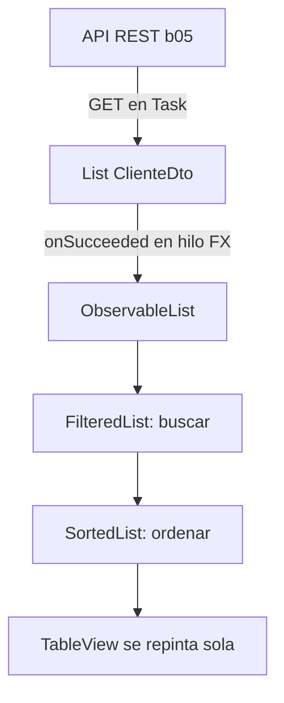
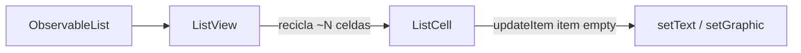
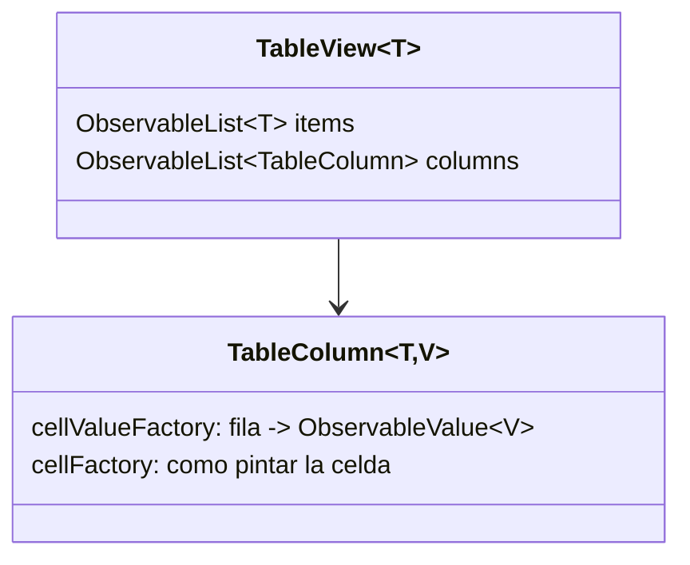
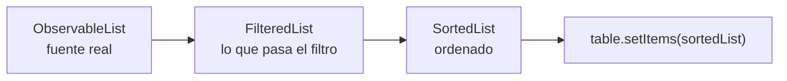
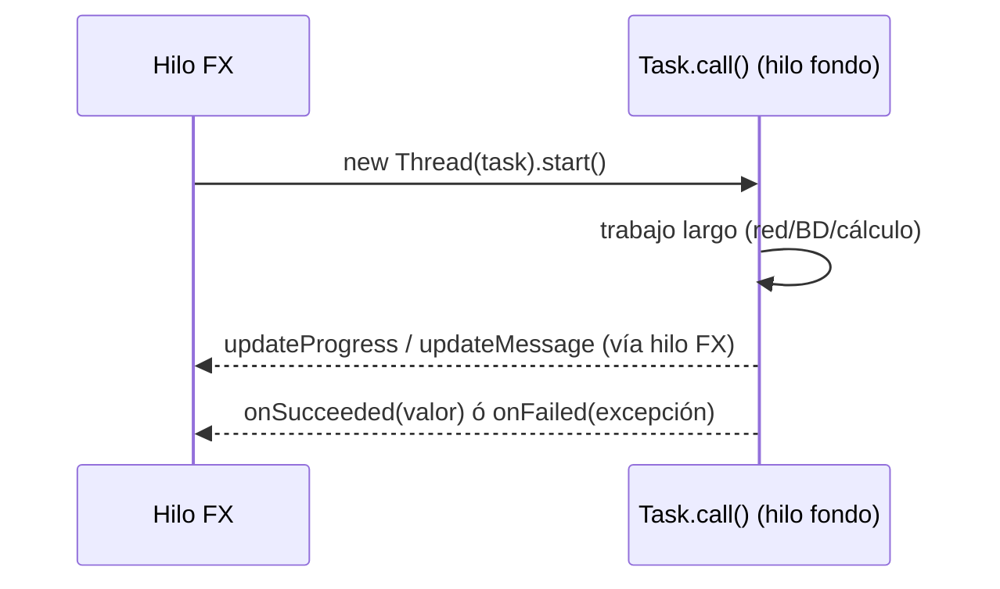
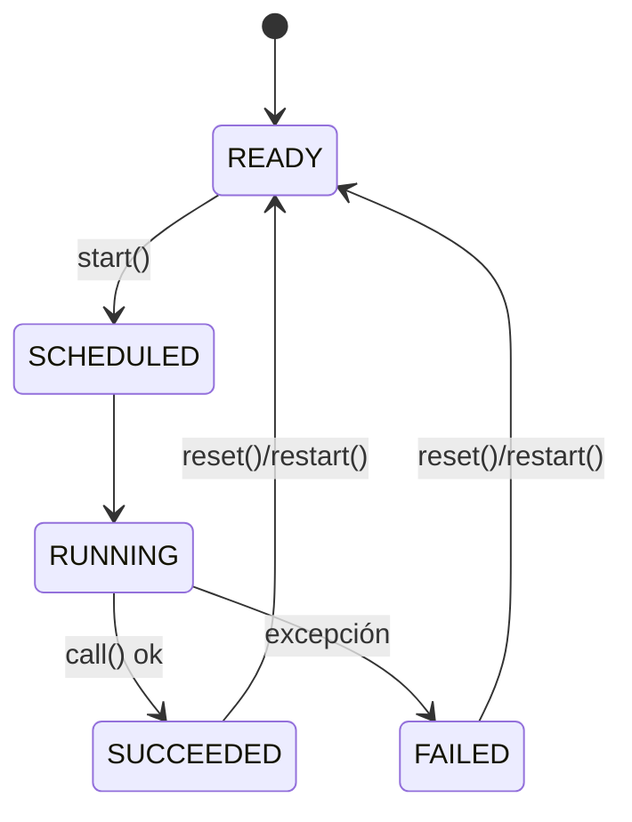
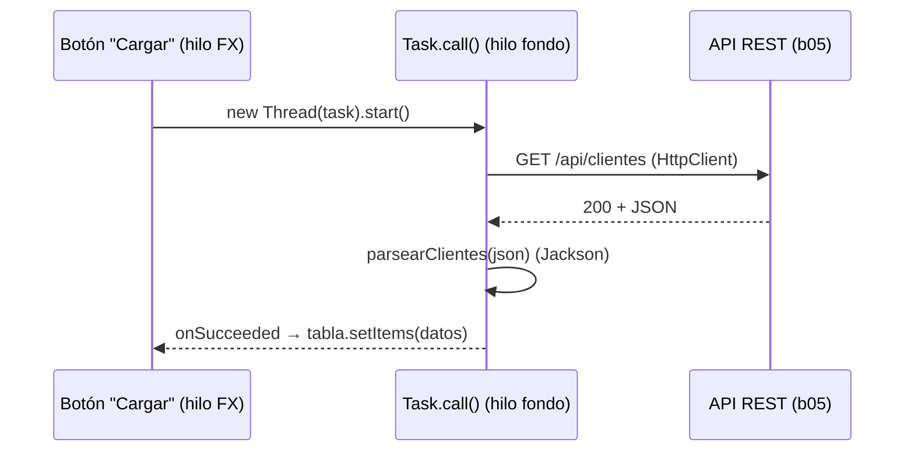

# Bloque 35 · Datos observables, tablas y asincronía (DI · RA2/RA4)

> Vienes de pintar formularios estáticos (b32–b34): una ventana, unos campos, un botón. Pero una
> aplicación de verdad **muestra datos** —decenas de filas que cambian— y los **trae de algún
> sitio** —un fichero, una base de datos, una API—. Y eso último tarda. Si lo haces mal, la ventana
> se **congela** mientras carga y el usuario cree que el programa ha muerto. Este bloque te enseña
> las dos mitades que faltan para un cliente de escritorio profesional: **enseñar colecciones de
> datos** en `ListView`/`TableView` enlazadas a un modelo que avisa cuando cambia, y **traer esos
> datos sin bloquear la interfaz** con `Task`/`Service`. El ejercicio final conecta tu cliente
> JavaFX con la API REST que construiste en b05: el círculo se cierra.

---

## Cómo usar este documento

- **Lee UNA sección → haz SU ejercicio → vuelve.** Cada sección `## N` corresponde a un `EjNNN`.
  No leas todo de golpe: la teoría rinde cuando la aplicas inmediatamente.
- **Los tests son la especificación real.** Cada ejercicio trae un test espejo que ya dice, con
  números concretos, qué debe devolver tu código. Si dudas de un caso límite, **mira el test**.
- **La teoría va más allá del ejercicio.** Las tablas listan métodos y opciones que el ejercicio no
  usa, marcados como *(consulta)*. Es a propósito: cuando en un examen o en el trabajo te pidan algo
  que el ejercicio no tocó, aquí tienes con qué resolverlo.
- **Nota de testing (importante en este bloque).** JavaFX necesita un *toolkit* arrancado y todo lo
  asíncrono tiende a ser no determinista. La filosofía del proyecto (addendum §1.6 del roadmap) es:
  - El método **core** es **lógica pura** (filtrar una lista, extraer el valor de una celda, un
    `Task` cuyo `call()` calcula y reporta progreso, parsear JSON). Se prueba **sin abrir ventana**.
  - El **`main`/Playground** sí monta la UI real (`extends Application`, `launch`): es lo que
    ejecutas con *Run* para verlo.
  - Para asincronía, los tests **NO usan `Thread.sleep` a ciegas**: usan `task.get()` (la API
    `Future`, determinista), `CountDownLatch` con *timeout* y `@Timeout` para no colgar la suite.
  - Lo que toca nodos JavaFX arranca el toolkit headless una vez (`IniciadorFx`, Monocle).

---

## Antes de empezar: el modelo de hilos de JavaFX

JavaFX tiene **un solo hilo** que pinta y atiende eventos: el **FX Application Thread** (lo
llamaremos "hilo FX" o "hilo UI"). Ese hilo está en un bucle infinito: dibuja la pantalla, procesa
clics, repinta. **Regla de oro: solo ese hilo puede tocar la interfaz.**

```mermaid
flowchart LR
    subgraph FX["FX Application Thread (UNO solo)"]
        A[Procesa eventos] --> B[Actualiza nodos] --> C[Pinta a 60 fps] --> A
    end
    BG[Hilo de fondo<br/>Task/Service] -. Platform.runLater .-> B
    BG2[Cálculo / red / BD] --> BG
```

¿Por qué importa tanto? Porque si en el manejador de un botón haces una operación **lenta** (leer un
fichero grande, una consulta a BD, un GET a una API), ese trabajo corre **en el hilo FX**, que
mientras tanto **no puede repintar ni atender clics**: la ventana se queda congelada ("Not
Responding"). La solución no es "hacerlo más rápido": es **sacar el trabajo a otro hilo** (`Task`,
secciones 5–6) y, cuando termine, **volver al hilo FX** para enseñar el resultado (`Platform.runLater`,
sección 7). Todo este bloque gira alrededor de esa idea.

> **Trampa de novato:** "funciona en mi máquina". Actualizar la UI desde otro hilo a veces *parece*
> funcionar (con cargas pequeñas) y luego peta de forma intermitente en producción. No es opcional:
> es la regla 7.

---

## Índice

| Sección | Tema | Ejercicio |
|---|---|---|
| 1 | `ObservableList`, `FXCollections`, escuchar cambios | `Ej279ObservableCollections` |
| 2 | `ListView`, `cellFactory`, render de celda | `Ej280ListViewCellFactory` |
| 3 | `TableView`, `TableColumn`, `cellValueFactory` | `Ej281TableViewColumns` |
| 4 | Edición *in-cell*, `FilteredList`/`SortedList` | `Ej282TableEditSortFilter` |
| 5 | `Task<V>`: `call()`, progreso, hilo de fondo | `Ej283TaskBackground` |
| 6 | `Service<V>`, reutilización, `ProgressBar` *bindeada* | `Ej284ServiceAndBindProgress` |
| 7 | `Platform.runLater` y la regla del hilo FX | `Ej285PlatformRunLater` |
| 8 | Cliente REST: GET a la API + `TableView` en fondo | `Ej286ConsumeRestApi` |

> **Modelo mental del bloque:** los datos viven en una **`ObservableList`** (avisa cuando cambia);
> una **vista** (`ListView`/`TableView`) se suscribe y se repinta sola; **`FilteredList`/`SortedList`**
> son vistas transformadas (buscar/ordenar) encadenadas sobre esa lista; un **`Task`** trae o
> calcula los datos en un hilo de fondo y, al terminar, vuelca el resultado en la lista **desde el
> hilo FX**. Datos reactivos + trabajo asíncrono = cliente que no se congela.



---

## 1 · Colecciones observables: `ObservableList` y `FXCollections`

Una **`ObservableList<T>`** es una lista normal (la usas con `add`, `remove`, `get`, `size`) que
además **notifica** a quien la observe cada vez que cambia. Esa notificación es lo que permite que
una tabla se repinte sola: la tabla observa la lista; tú añades un elemento; la tabla se entera y
pinta la fila nueva. Sin esto tendrías que decirle a mano "refréscate", como en Swing.

La fábrica es **`FXCollections`** (el equivalente JavaFX de `java.util.Collections`):

```java
ObservableList<String> lista = FXCollections.observableArrayList("Ana", "Berta");
lista.add("Caro");   // esto notifica a los observadores
```

### Escuchar cambios: `ListChangeListener`

Para enterarte de los cambios añades un `ListChangeListener`. Cada cambio llega como un objeto que
recorres con `while (cambio.next())` y consultas qué pasó (`wasAdded`, `wasRemoved`, `wasUpdated`):

```java
lista.addListener((ListChangeListener<String>) cambio -> {
    while (cambio.next()) {
        if (cambio.wasAdded())   System.out.println("Añadidos: " + cambio.getAddedSubList());
        if (cambio.wasRemoved()) System.out.println("Quitados: " + cambio.getRemoved());
    }
});
```

| Método del cambio | Qué te da | Cuándo |
|---|---|---|
| `wasAdded()` / `getAddedSubList()` | sublista de altas | inserciones |
| `wasRemoved()` / `getRemoved()` / `getRemovedSize()` | bajas | borrados |
| `wasUpdated()` | hubo cambio de **property interna** de un elemento | solo con *extractor* (ver abajo) |
| `wasPermutated()` | la lista se reordenó | tras `sort` |
| `getFrom()` / `getTo()` | rango afectado | *(consulta)* |

### Tipos de "lista que avisa" y utilidades de `FXCollections`

| Pieza | Qué hace | Lo usa el ejercicio |
|---|---|---|
| `observableArrayList(...)` | crea una lista observable | core, reto 1 |
| `observableArrayList(extractor)` | además avisa cuando cambia una property de un elemento | reto 10 |
| `unmodifiableObservableList(l)` | vista de **solo lectura** (rechaza `add`/`remove`) | reto 3 |
| `FXCollections.sort(l)` / `reverse(l)` | ordena/invierte **in-place** (muta la lista) | retos 4, 5 |
| `FilteredList` / `SortedList` | **vistas** filtrada/ordenada (NO mutan la fuente) | retos 7–9, sección 4 |
| `emptyObservableList()` | lista vacía inmutable | *(consulta)* |
| `fill` / `replaceAll` / `copy` | utilidades estilo `Collections` | *(consulta)* |

### El *extractor*: avisar de cambios INTERNOS

Por defecto una lista solo avisa de altas/bajas. Si quieres que también avise cuando **cambia una
property de un elemento que ya está dentro** (p.ej. el nombre de un cliente de la fila 3), le pones
un **extractor**: una función que declara qué properties de cada elemento hay que vigilar.

```java
ObservableList<ClienteFx> lista = FXCollections.observableArrayList(
        c -> new Observable[]{ c.nombreProperty() });   // vigila el nombre de cada cliente
// ahora cambiar lista.get(3).nombreProperty() dispara un wasUpdated()
```

> **Trampa:** sin extractor, editar `cliente.setNombre(...)` **no** repinta la fila en la tabla; la
> lista no se entera. El extractor es el motor del "edito un campo y la tabla lo refleja al instante"
> (lo verás de verdad en la sección 4, reto 10).

> **Lo practicas en `Ej279ObservableCollections`**: core `agregadosNotificados` (ListChangeListener,
> altas) y `filtrarObservable` (FilteredList viva); retos del 1 al 10 cubren crear, solo-lectura,
> ordenar/invertir in-place, contar bajas, filtrar/contar, re-filtrar, SortedList ligada y el extractor.

---

## 2 · `ListView` y `cellFactory`: render de celda

Un **`ListView<T>`** muestra una `ObservableList<T>` en vertical, una fila por elemento, usando una
**`ListCell<T>`** por fila visible. Punto clave de eficiencia: el `ListView` **recicla** celdas (si
caben 15 en pantalla, crea ~15 celdas aunque la lista tenga 10 000 elementos y las reutiliza al
hacer *scroll*). Por eso el render no es "pinta cada elemento una vez": es "dada esta celda, ponle el
contenido de ESTE elemento ahora".



### El render por defecto y la `cellFactory`

Sin configurar nada, una celda muestra `item.toString()`. Para personalizar (un formato, un color,
un icono) cambias la **`cellFactory`**: una fábrica que crea celdas con tu `updateItem` reescrito.

```java
lista.setCellFactory(lv -> new ListCell<Producto>() {
    @Override
    protected void updateItem(Producto p, boolean empty) {
        super.updateItem(p, empty);
        if (empty || p == null) { setText(null); setGraphic(null); }   // ¡SIEMPRE este caso!
        else setText(p.nombre() + " (" + String.format("%.2f", p.precio()) + " €)");
    }
});
```

> **Trampa nº1 de las cellFactory:** olvidar el caso `empty || item == null`. Como las celdas se
> reciclan, si no limpias el texto cuando la celda queda vacía, aparecen **"fantasmas"** (texto de un
> elemento que ya no está) al hacer *scroll*. Por eso el core `textoCelda(producto, vacia)` te obliga
> a devolver `null` cuando `vacia`. **La lógica de render es testeable sin pintar:** "dado este dato,
> ¿qué texto?".

### Selección y placeholder

| Pieza | Para qué | Reto |
|---|---|---|
| `getSelectionModel().selectFirst()` / `select(i)` | elegir fila | 6, 7 |
| `getSelectionModel().getSelectedItem()` | objeto elegido | 6, 7 |
| `setSelectionMode(SelectionMode.MULTIPLE)` | multi-selección (acumula) | 8 |
| `getSelectionModel().getSelectedItems()` | lista de elegidos | 8 |
| `setPlaceholder(Node)` | qué se ve cuando la lista está vacía ("No hay resultados") | 9 |
| `setCellFactory(...)` | render personalizado | core |
| `setEditable(true)` + `TextFieldListCell` | editar en celda *(consulta)* | — |

> **Por defecto la selección es `SINGLE`**: elegir otra fila deselecciona la anterior. Para sumar
> selecciones (Ctrl+clic) necesitas `MULTIPLE`. Si en el reto 8 contaras 1 en vez de 2, es que
> olvidaste cambiar el modo.

> **Lo practicas en `Ej280ListViewCellFactory`**: cores `textoCelda` y `claseEstado` (lógica de
> render: texto y clase CSS según el dato); retos: render por defecto/null-safe, construir ListView,
> selección simple/múltiple, placeholder e items vivos.

---

## 3 · `TableView`, `TableColumn` y `cellValueFactory`

Una **`TableView<T>`** muestra objetos del modelo en **filas** y reparte sus campos en **columnas**.
Dos listas observables distintas la sostienen: `getItems()` (las filas) y `getColumns()` (las
columnas). Cada **`TableColumn<T, V>`** necesita saber **qué valor de la fila mostrar**: esa es la
**`cellValueFactory`**, que recibe la fila y devuelve un `ObservableValue<V>`.



### Dos formas de declarar el valor de una columna

**(a) `PropertyValueFactory` (por reflexión):**

```java
TableColumn<ClienteFx, String> colNombre = new TableColumn<>("Nombre");
colNombre.setCellValueFactory(new PropertyValueFactory<>("nombre"));
// busca por reflexión, en este orden: nombreProperty()  →  getNombre()
```

Cómodo, pero "mágico": si te equivocas en el nombre de la propiedad no hay error de compilación,
simplemente sale vacío. Por eso el modelo de fila debe seguir el **patrón JavaFX bean** (campo
`Property` + `getX()` + `xProperty()`), como `ClienteFx`.

**(b) Lambda explícita (control total):**

```java
colNombre.setCellValueFactory(cd -> cd.getValue().nombreProperty());           // property viva
colResumen.setCellValueFactory(cd -> new SimpleObjectProperty<>(               // valor calculado
        cd.getValue().getNombre() + " (" + cd.getValue().getEdad() + ")"));
```

> **Ojo al `cd`**: la lambda recibe un `CellDataFeatures`; `cd.getValue()` es la **fila** (el objeto
> del modelo), **no** la celda. Devuelves un `ObservableValue`: si devuelves la *property viva*
> (`nombreProperty()`), la celda se actualiza cuando cambie el modelo; si devuelves
> `new SimpleObjectProperty<>(valorCopiado)`, la celda muestra una **foto** que no se entera de
> cambios posteriores (diferencia clave del reto 10).

### Probar el valor sin pintar la tabla

No hace falta mostrar la tabla para saber qué valor saldría: se lo preguntas a la columna.

```java
String v = columna.getCellObservableValue(fila).getValue();   // invoca la cellValueFactory
```

| Pieza | Para qué | Reto |
|---|---|---|
| `getColumns().add(col)` | añadir columna | 2 |
| `PropertyValueFactory<>("campo")` | valor por reflexión | core, 3, 4 |
| `cd -> cd.getValue().xProperty()` | valor por lambda | 5, 6, 10 |
| `getCellObservableValue(fila)` | extraer el valor (testeable) | core |
| `getSelectionModel().getSelectedItem()` | objeto fila elegido | 7 |
| `setColumnResizePolicy(CONSTRAINED_RESIZE_POLICY)` | columnas llenan el ancho | 8 |
| `getSortOrder()` + `sort()` | ordenar por columna(s) | 9 |
| `setCellFactory(...)` | pintar la celda (color, formato) *(consulta)* | — |

> **`cellValueFactory` vs `cellFactory`:** la primera dice **QUÉ valor** muestra la columna; la
> segunda, **CÓMO se pinta** la celda (color, botón, barra). En este bloque trabajas la primera; la
> segunda la usarás para columnas con estilo o con controles dentro *(consulta / b37)*.

> **Lo practicas en `Ej281TableViewColumns`**: cores `columnaDe` (PropertyValueFactory) y
> `valorDeFila` (extraer el valor); retos: crear tabla, añadir columnas, valor por propiedad/lambda,
> columna calculada, selección, política de ancho, orden y celda reactiva.

---

## 4 · Edición *in-cell*, `FilteredList` y `SortedList`

El patrón profesional de una tabla **buscable y ordenable** es una **cadena de vistas** encadenadas
sobre la lista fuente. Cada eslabón observa al anterior y se recalcula solo:



```java
ObservableList<ClienteFx> fuente = ...;
FilteredList<ClienteFx> filtrada = new FilteredList<>(fuente, c -> true);
SortedList<ClienteFx> ordenada  = new SortedList<>(filtrada);
ordenada.comparatorProperty().bind(tabla.comparatorProperty());   // ← imprescindible
tabla.setItems(ordenada);
```

### Filtrar = cambiar el predicado

Una `FilteredList` tiene un **predicado** que es una property: cambiarlo re-filtra al instante. Así
funciona una caja de búsqueda en vivo:

```java
buscador.textProperty().addListener((o, a, txt) ->
        filtrada.setPredicate(c -> c.getNombre().toLowerCase().contains(txt.toLowerCase())));
```

> **El filtro vacío debe mostrar todo:** con texto `""`, `contains("")` es siempre `true`. Si tu
> buscador esconde filas al estar vacío, ese es el bug. (El core `aplicarFiltro` te obliga a tratar
> el caso `""`.)

### Ordenar al pulsar la cabecera: el `bind` del comparador

Cuando usas `SortedList`, pulsar la cabecera de una columna **no ordena nada** por sí solo: hay que
**enlazar** el comparador de la `SortedList` al de la tabla con
`ordenada.comparatorProperty().bind(tabla.comparatorProperty())`. Es el error más típico: "le doy a
la flecha y no pasa nada".

### Editar en celda

Para editar haciendo doble clic hacen falta **dos interruptores** (tabla **y** columna) y una
`cellFactory` de edición:

```java
tabla.setEditable(true);
colNombre.setEditable(true);
colNombre.setCellFactory(TextFieldTableCell.forTableColumn());     // String: sin converter
colNombre.setOnEditCommit(e -> e.getRowValue().setNombre(e.getNewValue()));  // vuelca al modelo
```

| Pieza | Para qué | Reto |
|---|---|---|
| `new FilteredList<>(src, pred)` + `setPredicate` | buscar en vivo | core, 1–3 |
| `new SortedList<>(src, comparator)` | ordenar como vista | 4, 5 |
| `comparatorProperty().bind(tabla.comparatorProperty())` | que la cabecera ordene | 6 |
| `tabla.setEditable(true)` + `col.setEditable(true)` | habilitar edición | 7 |
| `TextFieldTableCell.forTableColumn()` | editor de texto en celda | 8 |
| `IntegerStringConverter` (columnas no-String) | parsear lo escrito *(consulta)* | — |
| `setOnEditCommit(e -> ...)` | guardar el valor en el modelo | core (concepto) |

> **Para columnas que no son `String`** (la edad, un `int`) necesitas un `StringConverter` (p.ej.
> `IntegerStringConverter`) que convierta texto ↔ número, o la edición fallará al confirmar.

> **Lo practicas en `Ej282TableEditSortFilter`**: cores `aplicarFiltro` (FilteredList por nombre) y
> `commitEdicion` (volcar la edición al bean); retos: contar/refiltrar, ordenar (vista), encadenar
> filtro+orden, enlazar comparador, editable, editor de texto, commit que refresca, y "editar saca
> del filtro" (extractor + cadena viva).

---

## 5 · `Task<V>`: trabajo en segundo plano con progreso

Un **`Task<V>`** encapsula un trabajo largo para ejecutarlo **fuera del hilo FX**. Implementas su
método protegido **`call()`** (lo que corre en el hilo de fondo) y devuelves un valor de tipo `V`.
Desde dentro reportas avance con `updateProgress(hechos, total)` y `updateMessage(texto)`; el
resultado y los errores se exponen luego en *properties* y en *callbacks*.



```java
Task<Integer> tarea = new Task<>() {
    @Override
    protected Integer call() {
        int suma = 0;
        for (int i = 1; i <= n; i++) { suma += i; updateProgress(i, n); }
        return suma;                       // será getValue() / get()
    }
};
```

### `Task` ES un `Future`: por eso se prueba sin dramas

`Task` implementa `Future<V>` y `Runnable`. Eso da dos cosas valiosas:

- Es `Runnable` → puedes pasarlo a `new Thread(task)` o a un `ExecutorService` (b27).
- Es `Future` → `task.run()` lo ejecuta y **`task.get()`** devuelve el resultado de `call()` de
  forma **determinista** (o lanza `ExecutionException` envolviendo la excepción de `call()`).

> **Determinismo en tests:** usa `task.get()` (Future), no `task.getValue()` (property). La property
> `value` se actualiza vía el hilo FX y puede ir un instante por detrás; `get()` no. Y para el
> progreso, el test ejecuta el Task en el hilo FX (`updateProgress` fija el valor al momento) y
> comprueba que es **monótono** (nunca retrocede) y acaba en **1.0**.

| Property / método | Qué expone |
|---|---|
| `call()` | el trabajo de fondo (lo implementas tú) |
| `updateProgress(w, max)` | progreso 0..1 (`-1` = indeterminado, si `max<=0`) |
| `updateMessage(s)` / `updateTitle(s)` | texto de estado para la UI |
| `progressProperty()` / `messageProperty()` | para *bindear* a una barra / label |
| `valueProperty()` / `getValue()` | resultado (vía hilo FX) |
| `get()` | resultado (Future, bloqueante, determinista) |
| `setOnSucceeded` / `setOnFailed` / `setOnCancelled` | *callbacks* (corren en el hilo FX) |
| `cancel()` / `isCancelled()` | cancelación cooperativa |
| `getException()` | la excepción de `call()` si falló |

> **Cancelar es cooperativo:** `cancel()` solo **marca** el Task; un `call()` largo debe consultar
> `isCancelled()` periódicamente y salir. Cancelar no mata un bucle que no mira.

> **Lo practicas en `Ej283TaskBackground`**: cores `tareaSuma` (suma con progreso/mensaje) y
> `tareaQueFalla` (excepción); retos: obtener valor/fallo, tareas de valor/error, ejecutar en hilo,
> cancelar, monotonía y fracción de progreso, tarea con progreso y **tarea con reintentos**.

---

## 6 · `Service<V>`: trabajo **repetible** y `ProgressBar` *bindeada*

Un `Task` es de **un solo uso**: cuando termina, no se relanza. Cuando necesitas **repetir** el mismo
trabajo (un botón "Actualizar" que recarga la tabla cada vez) usas un **`Service<V>`**: tú
implementas **`createTask()`** (la *fábrica* del trabajo) y el Service lo arranca con `start()` y lo
repite con `restart()` (que crea un Task **nuevo** cada vez).

```java
Service<Integer> servicio = new Service<>() {
    @Override
    protected Task<Integer> createTask() {        // se llama en CADA start()/restart()
        return new Task<>() { @Override protected Integer call() { /* ... */ } };
    }
};
servicio.start();      // primera vez
servicio.restart();    // otra vez (un Task no podría)
```



| Pieza | Para qué | Reto |
|---|---|---|
| `createTask()` | fábrica del trabajo (única pieza obligatoria) | core |
| `start()` | arrancar (¡en el hilo FX!) | 5 |
| `restart()` | repetir el trabajo | 6 |
| `reset()` | volver a READY (solo si no corre) | 7 |
| `getState()` (`Worker.State`) | READY/SCHEDULED/RUNNING/SUCCEEDED/FAILED | 1 |
| `setOnSucceeded` / `setOnFailed` + `getValue()`/`getException()` | resultado/error (hilo FX) | 5, 10 |
| `setExecutor(...)` | en qué *pool* corre *(consulta)* | — |

### *Bindear* la barra de progreso

La barra de la UI **no se actualiza a mano**: se **enlaza** (`bind`) a la `progressProperty` del
Service/Task y se mueve sola.

```java
ProgressBar barra = new ProgressBar();
barra.progressProperty().bind(servicio.progressProperty());   // ahora es de solo lectura
```

| Valor de progreso | Significado |
|---|---|
| `0.0` … `1.0` | porcentaje conocido |
| `-1.0` (`ProgressIndicator.INDETERMINATE_PROGRESS`) | "no sé cuánto falta" (animación) |

> **Tras `bind`, no puedes `setProgress` a mano** (lanza excepción): la barra es ahora un espejo de
> la property. Para recuperar el control, `unbind()`. Y `start()`/`restart()`/`reset()` **deben
> llamarse en el hilo FX**; para esperar el resultado en un test, usa el patrón
> `CountDownLatch` + `setOnSucceeded` (no bloquees el hilo FX).

> **Lo practicas en `Ej284ServiceAndBindProgress`**: cores `servicioSuma` (createTask con progreso) y
> `vincularProgreso` (bind de la barra); retos: estado inicial, barra a mano/indeterminada/desvincular,
> ejecutar/reutilizar/reset, porcentaje, service de valor y captura de fallo.

---

## 7 · `Platform.runLater` y la regla del hilo FX

Repaso de la regla de oro: **solo el hilo FX toca la UI**. Cuando un hilo de fondo termina y quiere
mostrar el resultado, **no** actualiza la UI directamente: **programa** ese trabajo en el hilo FX con
**`Platform.runLater(Runnable)`**, que mete el `Runnable` en la cola de eventos del hilo FX (que la
procesa en orden, **FIFO**).

```java
new Thread(() -> {
    String dato = traerDeLaRedLento();                 // hilo de fondo: cálculo/red
    Platform.runLater(() -> etiqueta.setText(dato));   // hilo FX: pintar
}).start();
```

| Pieza | Para qué |
|---|---|
| `Platform.isFxApplicationThread()` | ¿estoy en el hilo UI? (decide si necesitas runLater) |
| `Platform.runLater(r)` | ejecutar `r` en el hilo FX (FIFO) |
| `Platform.startup(r)` | arrancar el toolkit a mano (lo usa `IniciadorFx` en tests) |
| `Platform.exit()` | cerrar el toolkit *(consulta)* |
| `Platform.setImplicitExit(false)` | que cerrar la última ventana NO mate la app *(consulta)* |

> **El pecado capital:** tocar la UI desde otro hilo. A veces *parece* funcionar y luego peta de
> forma intermitente. Operaciones claramente prohibidas fuera del hilo FX (como **crear un `Stage`**)
> lanzan `IllegalStateException: Not on FX application thread`. El reto 7 te lo hace ver: crear un
> `Stage` desde un hilo no-FX salta la excepción; el reto 8, la misma operación en el hilo correcto,
> va perfecta. La diferencia es **solo el hilo**.

> **`Task`/`Service` ya respetan la regla por ti:** sus `updateProgress`/`updateMessage` y sus
> `onSucceeded`/`onFailed` se entregan en el hilo FX automáticamente. `runLater` es para cuando
> manejas hilos a pelo.

> **Lo practicas en `Ej285PlatformRunLater`**: cores `ejecutadoEnFx` (medir el hilo) y
> `actualizarEtiqueta` (update seguro vía runLater); retos: comprobar hilo, ejecutar/calcular en FX,
> orden FIFO, actualizar desde otro hilo, fallo/éxito al crear Stage, y el patrón completo fondo→UI.

---

## 8 · Cliente REST: GET a la API + `TableView` en segundo plano

La integración estrella: tu cliente JavaFX pide los datos a la **API REST de b05**, los **parsea**
con Jackson (b02) en `ClienteDto`, todo **dentro de un `Task`** (sección 5) para no congelar la UI, y
al terminar **vuelca los datos en la `TableView`** desde el hilo FX (`onSucceeded`, sección 7).



### Las dos mitades testeables

```java
// (a) PURA: parsear un array JSON -> lista de DTOs (Jackson, sin red)
List<ClienteDto> parsearClientes(String json) throws Exception {
    return MAPPER.readValue(json, new TypeReference<List<ClienteDto>>() {});
}

// (b) Task: GET con el HttpClient del JDK y parseo
Task<List<ClienteDto>> cargar(String url) {
    return new Task<>() {
        @Override protected List<ClienteDto> call() throws Exception {
            HttpResponse<String> r = HttpClient.newHttpClient()
                .send(HttpRequest.newBuilder(URI.create(url)).GET().build(),
                      HttpResponse.BodyHandlers.ofString());
            return parsearClientes(r.body());
        }
    };
}
```

> **Para un array JSON usa `TypeReference`, no `.class`.** `readValue(json, ClienteDto.class)` sirve
> para un objeto suelto (`{...}`); para una lista (`[...]`) necesitas
> `new TypeReference<List<ClienteDto>>(){}` o Jackson no sabe el tipo genérico.

### Errores HTTP, timeout, paginación

| Concepto | Cómo | Reto |
|---|---|---|
| ¿éxito? | `código >= 200 && < 300` (familia 2xx) | 4 |
| un 404/500 **no** lanza solo | `send` devuelve la respuesta; **tú** miras `statusCode()` y decides | 10 |
| timeout | `HttpRequest.newBuilder(...).timeout(Duration.ofSeconds(n))` | 7 |
| paginación | `url + "?page=P&size=S"` (el mismo idioma del `Pageable` de b12) | 5 |
| reintento | combinar con la "tarea con reintento" de la sección 5 | (Ej283 r10) |

> **Determinismo del test:** no se llama a internet. El test levanta un **servidor HTTP local** en un
> **puerto efímero** (`HttpServer.create(new InetSocketAddress("localhost", 0), 0)`) que responde un
> JSON fijo (o un 404), y comprueba que el Task devuelve lo esperado o falla con el código. Mismo
> truco del puerto efímero que en b29 (sockets).

> **Lo practicas en `Ej286ConsumeRestApi`**: cores `parsearClientes` (Jackson puro) y
> `cargarEnSegundoPlano` (Task con GET); retos: parsear uno/contar/nombres, éxito HTTP, URL paginada,
> petición GET/con timeout, tareas de descarga/clientes y **tarea con manejo de error HTTP**.

---

## Errores comunes del bloque

| # | Error | Antídoto |
|---|---|---|
| 1 | Usar `new ArrayList<>` para una tabla/lista | usa `FXCollections.observableArrayList`: una lista normal **no** notifica |
| 2 | `cellFactory` sin tratar `empty \|\| item == null` | limpia el texto: si no, salen "fantasmas" al hacer *scroll* |
| 3 | Filtro vacío que esconde filas | con `""`, `contains("")` es `true` → muestra todo |
| 4 | Pulsar la cabecera no ordena (con `SortedList`) | `sorted.comparatorProperty().bind(tabla.comparatorProperty())` |
| 5 | Editar un campo no repinta la fila | la lista necesita **extractor** sobre la property editada |
| 6 | Leer `task.getValue()` justo tras `run()` y sale viejo | usa `task.get()` (Future, determinista); `getValue` va por el hilo FX |
| 7 | El progreso nunca llega al 100% | `updateProgress(i, n)`, no `(i, n+1)`; el último paso debe ser `(n, n)` |
| 8 | Reusar un `Task` terminado | un Task es de un solo uso → usa `Service` y `restart()` |
| 9 | `setProgress` tras `bind` → excepción | una property *bindeada* es de solo lectura; `unbind()` para recuperarla |
| 10 | Tocar la UI desde un hilo de fondo | `Platform.runLater(...)`; crear UI fuera del hilo FX lanza `IllegalStateException` |
| 11 | Bloquear el hilo FX esperando un resultado | espera con `CountDownLatch` en **otro** hilo; el FX nunca se bloquea |
| 12 | `readValue(json, ClienteDto.class)` sobre un array | para `[...]` usa `new TypeReference<List<ClienteDto>>(){}` |
| 13 | Suponer que un 404 lanza excepción | `HttpClient.send` no lanza por status; comprueba `statusCode()` tú |
| 14 | GET sin `timeout` | una API caída cuelga el cliente para siempre; pon `Duration.ofSeconds(...)` |
| 15 | Editar columna no-`String` sin `StringConverter` | usa `IntegerStringConverter` (u otro) o el commit falla |

---

## Chuleta final del bloque

```
ObservableList      = lista que avisa al cambiar (FXCollections.observableArrayList)
ListChangeListener  = while(c.next()){ c.wasAdded()/wasRemoved()/wasUpdated() }
extractor           = observableArrayList(e -> new Observable[]{ e.xProperty() }) -> avisa de cambios internos
FilteredList        = vista filtrada viva; setPredicate(...) re-filtra al vuelo; "" muestra todo
SortedList          = vista ordenada viva; .comparatorProperty().bind(tabla.comparatorProperty())
cadena              = fuente -> FilteredList -> SortedList -> table.setItems(...)
ListView render     = setCellFactory + updateItem(item, empty){ if(empty||item==null) setText(null) ... }
TableColumn valor   = cellValueFactory: PropertyValueFactory("campo")  ó  cd -> cd.getValue().xProperty()
extraer valor       = columna.getCellObservableValue(fila).getValue()   (testeable sin pintar)
editar celda        = tabla.setEditable(true) + col.setEditable(true) + TextFieldTableCell + setOnEditCommit
Task<V>             = override call(); ES Future+Runnable; get() determinista; updateProgress(w,max)
Task progreso       = 0..1 monótono, acaba en 1.0; -1.0 = indeterminado
Service<V>          = repetible: override createTask(); start()/restart()/reset(); estado Worker.State
ProgressBar         = barra.progressProperty().bind(task/service.progressProperty())  (solo lectura)
regla de oro        = SOLO el hilo FX toca la UI
Platform            = isFxApplicationThread() ; runLater(r) FIFO ; crear Stage fuera de FX -> IllegalStateException
patrón async        = calcular en hilo fondo -> Platform.runLater / onSucceeded -> pintar en hilo FX
cliente REST        = HttpClient.newHttpClient().send(GET, BodyHandlers.ofString()) dentro de un Task
parseo array        = MAPPER.readValue(json, new TypeReference<List<ClienteDto>>(){})
HTTP exito          = 200..299 ; 404/500 NO lanzan -> compruebas statusCode() ; timeout = Duration.ofSeconds
paginacion          = url + "?page=P&size=S"  (mismo idioma del Pageable de b12)
test async          = task.get()/CountDownLatch/@Timeout ; servidor HTTP local en puerto 0 ; NO Thread.sleep
```

---

## Autoevaluación (responde sin mirar; si fallas 2+, relee la sección)

1. ¿Por qué una `TableView` se repinta sola al añadir un elemento, y qué tipo de lista lo permite? *(1)*
2. ¿Qué pasa si una `cellFactory` no trata el caso `empty`, y por qué con *scroll*? *(2)*
3. Dos formas de declarar la `cellValueFactory` de una columna: ¿qué diferencia hay entre devolver
   la property viva y un `SimpleObjectProperty` con el valor copiado? *(3)*
4. Tienes una `SortedList` puesta en la tabla y al pulsar la cabecera no ordena. ¿Qué falta? *(4)*
5. ¿Por qué `task.get()` es determinista en un test y `task.getValue()` puede no serlo? *(5)*
6. ¿Cuándo usas `Service` en vez de `Task`, y qué método obligatorio implementas? *(6)*
7. Enuncia la regla de oro de los hilos en JavaFX y di qué hace `Platform.runLater`. *(7)*
8. ¿Por qué un 404 no hace fallar tu `Task` por sí solo, y cómo lo conviertes en un error? *(8)*
9. ¿Cómo prueba el test el cliente REST sin depender de internet? *(8)*
10. ¿Qué es un *extractor* en una `ObservableList` y qué problema de la sección 4 resuelve? *(1, 4)*
