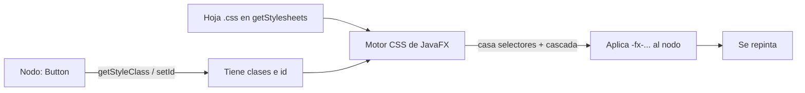
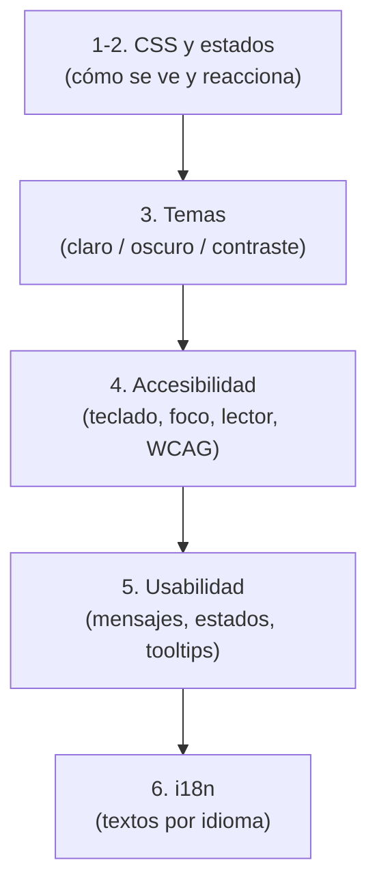
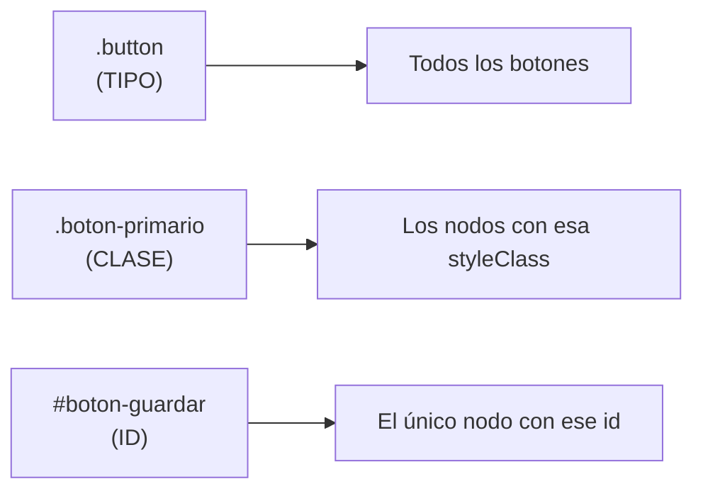
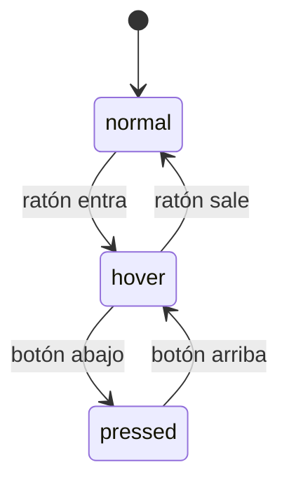
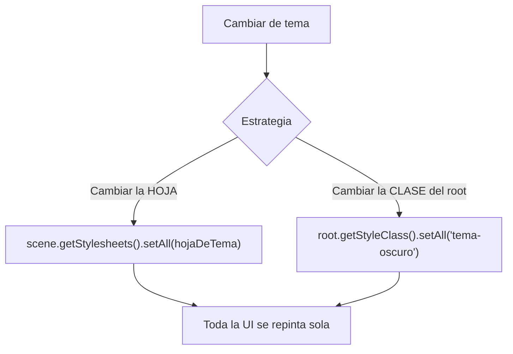
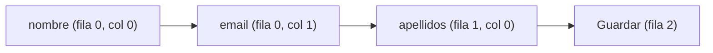
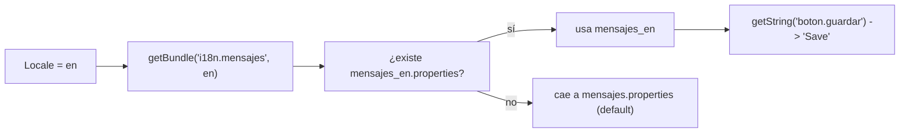

# Bloque 36 · CSS, usabilidad, accesibilidad e i18n (DI · RA3)

> Vienes de montar pantallas que *funcionan* (b32–b35): ventanas, controles, tablas con datos que
> llegan de una API sin congelarse. Pero "que funcione" no es "que esté terminado". Una aplicación
> profesional además **se ve bien** (estilo coherente, no el gris de fábrica), **se deja usar** sin
> frustración (mensajes claros, estados de carga, ayudas) y **la puede usar todo el mundo**: con
> teclado, con poca visión, con lector de pantalla. Y si quieres llegar a más gente, **habla varios
> idiomas**. Eso es exactamente lo que cubre el RA3 de Desarrollo de Interfaces: *aplicar
> recomendaciones de usabilidad y accesibilidad y dar estilo a la interfaz*. Este bloque te enseña
> las cuatro capas que convierten un prototipo en un producto: **CSS** (cómo se ve), **estados y
> temas** (cómo reacciona y se adapta), **accesibilidad** (que la use cualquiera) y **i18n** (en su
> idioma). Es la diferencia entre "el ejercicio compila" y "esto lo puedo entregar a un cliente".

---

## Cómo usar este documento

- **Lee UNA sección → haz SU ejercicio → vuelve.** Cada sección `## N` corresponde a un `EjNNN`.
  No leas todo de golpe: la teoría rinde cuando la aplicas inmediatamente.
- **Los tests son la especificación real.** Cada ejercicio trae un test espejo que ya dice, con
  cadenas y números concretos, qué debe devolver tu código. Si dudas de un caso límite, **mira el
  test**: ahí está la verdad (incluido qué espera exactamente, carácter a carácter).
- **La teoría va MÁS ALLÁ del ejercicio.** Las tablas listan selectores, pseudo-clases, funciones de
  color, reglas WCAG y APIs de `Locale` que el ejercicio no usa, marcados como *(consulta)*. Es a
  propósito: cuando en un examen o en el trabajo te pidan algo que el ejercicio no tocó, aquí tienes
  con qué resolverlo sin abrir otra fuente.
- **Nota de testing (importante en este bloque).** Casi todo lo de RA3 se puede comprobar **sin abrir
  ventana**. La filosofía del proyecto (addendum §1.6 del roadmap) es:
  - El método **core** es **lógica de presentación pura**: dado un estado del modelo, qué clase CSS
    le toca; qué pseudo-clases están activas; qué hoja de tema aplicar; cuál es el orden de foco; qué
    mnemónico tiene un texto; qué dice un mensaje de error; qué texto traducido corresponde a un
    `Locale`. Todo son cadenas, listas, booleanos y `ResourceBundle`: **JUnit puro**.
  - El **`main`** de cada ejercicio es un Playground de consola que imprime los core. El Playground
    **visual** de verdad es `PlaygroundEstilo` (`extends Application`, `mvn -pl b36_fxstyle javafx:run`):
    aplica las hojas de estilo y los textos reales en una ventana, alterna tema e idioma en caliente.
  - A diferencia de b35, aquí **ningún test necesita el toolkit JavaFX**: trabajamos con la lógica
    que decide el estilo, no con el pintado. Por eso los tests son rápidos y deterministas.

---

## Antes de empezar: el CSS de JavaFX NO es el CSS de la web

Si vienes de maquetar webs, cuidado: JavaFX usa una **sintaxis parecida** a CSS pero con reglas
propias. Confundirlas es la causa nº1 de "mi estilo no se aplica y no sé por qué". Lo esencial:

| Aspecto | CSS web | CSS de JavaFX |
|---|---|---|
| Prefijo de propiedad | `color`, `background` | **`-fx-`** SIEMPRE: `-fx-text-fill`, `-fx-background-color` |
| Color del texto | `color` | `-fx-text-fill` (¡no `color`!) |
| Unidades | `px`, `em`, `rem`, `%` | números "puntos" (`-fx-font-size: 14;`), no hay `px` |
| Selector por tipo | `div`, `p` | el nombre del control en minúsculas: `.button`, `.label` (con punto) |
| Variables | `--mi-color` + `var(--mi-color)` | **looked-up colors**: `-mi-color: #fff;` y lo usas por nombre |
| Pseudo-clases | `:hover`, `:nth-child` | `:hover`, `:focused`, `:pressed`… (NO `:nth-child`) |
| Dónde se carga | `<link>` en el HTML | `scene.getStylesheets().add(...)` o `parent.getStylesheets()` |
| Cómo se "marca" un nodo | `class="..."`, `id="..."` | `getStyleClass().add("...")`, `setId("...")` |

> **Regla grabada:** en JavaFX, **toda** propiedad empieza por `-fx-`. Si escribes `color: red;` no
> pasa nada (lo ignora en silencio). El error no salta: simplemente no se ve el efecto.



### Cómo encajan las cuatro capas del bloque



### Tabla índice

| Sección | Tema | Ejercicio |
|---|---|---|
| 1 | Hojas `.css`: selectores por tipo/clase/id, `getStyleClass`, especificidad | `Ej287CssStylesheets` |
| 2 | Pseudo-clases (`:hover`, `:focused`), estados y `PseudoClass` propia | `Ej288PseudoClassesStates` |
| 3 | Temas claro/oscuro, colores nombrados (looked-up colors), cambio en caliente | `Ej289ThemingAndVariables` |
| 4 | Accesibilidad: orden de foco, mnemónicos, atajos, contraste WCAG | `Ej290AccessibilityA11y` |
| 5 | Usabilidad: mensajes de error, estados (cargando/deshabilitado), tooltips | `Ej291UsabilityFeedback` |
| 6 | i18n: `ResourceBundle`, `Locale`, textos y formatos por idioma | `Ej292Internationalization` |

> **Modelo mental del bloque:** *separa el QUÉ del CÓMO*. El **qué** (la lógica: este saldo es
> negativo, este campo es obligatorio, este idioma es inglés) vive en Java y se testea. El **cómo**
> (rojo, borde grueso, "obligatorio"/"required") vive en hojas `.css` y archivos `.properties`, y se
> cambia sin tocar el código. Todo el bloque es practicar esa frontera.

---

## 1. Hojas de estilo CSS: selectores y clases

> **Ejercicio:** `Ej287CssStylesheets` · **Teoría de apoyo:** esta sección.

El aspecto de un control NO se escribe a mano (`boton.setStyle(...)` por todas partes envejece mal).
Se separa en una **hoja `.css`** y cada nodo decide a qué reglas se acoge. Hay tres formas de
"apuntar" a un nodo desde la hoja —los **selectores**—, igual que en la web:

### 1.1 Los tres selectores



| Selector | Sintaxis en la hoja | Cómo se marca el nodo | Alcance |
|---|---|---|---|
| Por **tipo** | `.button { }` | automático (es el tipo del control) | TODOS los de ese tipo |
| Por **clase** | `.boton-primario { }` | `nodo.getStyleClass().add("boton-primario")` | los que tengan esa clase (varios) |
| Por **id** | `#boton-guardar { }` | `nodo.setId("boton-guardar")` | uno solo (el id es único) |

> **Trampa que mata horas:** la clase se guarda **sin punto** (`"boton-primario"`), pero en el
> selector de la hoja lleva **punto** (`.boton-primario`). El punto es del SELECTOR, no del nombre.
> Lo mismo con el id: lo guardas como `"boton-guardar"` y lo seleccionas como `#boton-guardar`.

### 1.2 La lista de clases es observable

`getStyleClass()` devuelve una `ObservableList<String>` (¿te suena de b35?). Eso significa que
**añadir o quitar una clase repinta el nodo al instante**: ese es el motor de "estado del modelo →
aspecto". El patrón estrella del ejercicio:

```java
// El core no pinta nada: DECIDE la clase. La hoja .css ya tiene .saldo-negativo { -fx-text-fill: red; }
String clase = claseSegunSaldo(saldo);   // "saldo-negativo" / "saldo-cero" / "saldo-positivo"
celda.getStyleClass().setAll("celda", clase);   // y aquí se aplica
```

### 1.3 Combinar selectores

| Combinación | Sintaxis | Significado |
|---|---|---|
| Descendiente | `.dialogo .boton` (con **espacio**) | un `.boton` dentro de un `.dialogo`, a cualquier nivel |
| Multiclase | `.a.b.c` (**pegado**) | un nodo que tenga **todas** esas clases a la vez |
| Hijo directo *(consulta)* | `.dialogo > .boton` | solo hijo inmediato, no nietos |
| Lista *(consulta)* | `.a, .b` | a la vez `.a` y `.b` (dos reglas iguales) |

> **El espacio lo cambia TODO:** `.a .b` (descendiente) ≠ `.a.b` (un nodo con ambas clases). Un
> espacio de más o de menos rompe el selector en silencio.

### 1.4 Estilo inline: `setStyle`

Para un retoque puntual existe `nodo.setStyle("-fx-text-fill: red; -fx-font-size: 14;")`. Es el
equivalente al atributo `style="..."` del HTML: **gana en especificidad** (es lo más fuerte) pero es
difícil de mantener. Úsalo poco; lo normal es la hoja.

### 1.5 Operar sobre las clases

`getStyleClass()` se maneja como cualquier `List`: `add`, `remove`, `contains`. JavaFX **no impide
duplicados**, así que el patrón "añadir si no está" y el "toggle" (quitar si está, poner si no) los
gestionas tú. El toggle es el motor de un botón "activo/inactivo".

### 1.6 Especificidad: quién gana

Cuando dos reglas casan el mismo nodo y tocan la misma propiedad, gana la **más específica** (igual
que en la web). Puntuación: un **id** vale 100, una **clase** (o pseudo-clase) vale 10, un **tipo**
vale 1. Suma y compara.

| Selector | id (×100) | clase (×10) | tipo (×1) | Total |
|---|---|---|---|---|
| `#guardar` | 1 | 0 | 0 | 100 |
| `.a.b` | 0 | 2 | 0 | 20 |
| `.boton-primario` | 0 | 1 | 0 | 10 |
| `.button` | 0 | 0 | 1 | 1 |

> Por eso un `#id` pisa a una `.clase` **aunque vaya antes** en la hoja: la especificidad manda sobre
> el orden. El estilo inline (`setStyle`) gana a todos. Y `!important` *(consulta)* existe pero su
> uso es señal de que algo está mal diseñado.

> **Lo practicas en `Ej287CssStylesheets`**: el core `claseSegunSaldo` y `clasesDeFila` (estado →
> clase); los retos recorren los tres selectores (1, 2), combinaciones (3, 4), estilo inline (5),
> operaciones sobre la lista de clases (6, 7, 8), especificidad (9) y el patrón "severidad → clase"
> que conecta con logging y con b09 (10).

---

## 2. Pseudo-clases y estados

> **Ejercicio:** `Ej288PseudoClassesStates` · **Teoría de apoyo:** esta sección.

Una **pseudo-clase** es un estado que el control activa y desactiva **solo**, sin que tú toques la
lista de clases: el ratón entra → `:hover`; recibe el foco → `:focused`; lo pulsas → `:pressed`. En
la hoja escribes `.boton:hover { ... }` y JavaFX aplica esas reglas **mientras dure el estado**.

### 2.1 Pseudo-clases estándar

| Pseudo-clase | Activa cuando… | Control típico |
|---|---|---|
| `:hover` | el ratón está encima | cualquiera |
| `:focused` | tiene el foco de teclado | inputs, botones |
| `:pressed` | se mantiene pulsado | botones |
| `:disabled` | está deshabilitado | cualquiera |
| `:selected` | está seleccionado/marcado | `CheckBox`, `ToggleButton`, celda |
| `:focused-visible` *(consulta)* | foco por teclado (no por ratón) | accesibilidad |
| `:empty` / `:filled` *(consulta)* | celda vacía / con contenido | `Cell`, `ComboBox` |
| `:show-mnemonics` *(consulta)* | se muestran los subrayados (Alt) | menús, botones |



### 2.2 Varios estados a la vez: precedencia

Un control puede estar `:hover` **y** `:focused` a la vez. Si dos reglas chocan, decide la cascada
(orden + especificidad). Para tu lógica conviene fijar una **prioridad visual** (p.ej. `pressed`
manda sobre `hover`, y este sobre `focused`) y resolver con ella cuál enseñar.

### 2.3 Pseudo-clases PROPIAS

Lo potente: puedes inventarte estados. Dos mitades:

```java
// 1) Java: declaras la pseudo-clase y la activas/desactivas tú
private static final PseudoClass ERROR = PseudoClass.getPseudoClass("error");
campo.pseudoClassStateChanged(ERROR, true);   // ahora el campo "está en error"
```
```css
/* 2) Hoja: defines CÓMO se pinta ese estado */
.campo:error { -fx-border-color: red; -fx-border-width: 2; }
```

> **Trampa:** el nombre de la pseudo-clase debe ser "css-válido": minúsculas y guiones, sin espacios
> ni mayúsculas. `"En Error"` no vale; normalízalo a `"en-error"`. Y recuerda: activarla desde Java
> **no pinta nada** si no hay una regla en la hoja que la dibuje. Son las dos mitades del mismo
> mecanismo.

### 2.4 Selectores funcionales

`:not(.boton)` casa todo menos `.boton`. Encadenar pseudo-clases (`.boton:hover:focused`) exige que
se cumplan **todas** a la vez. Sin espacios: el espacio sería "descendiente" (sección 1.3).

### 2.5 Estados como máquina

Los estados de un control forman una **máquina de estados**: no todo salto es legal (no puedes
"pulsar" sin pasar antes por `hover` con el ratón). Modelar las transiciones válidas es útil para
animaciones y para validar lógica de UI.

> **Lo practicas en `Ej288PseudoClassesStates`**: el core `pseudoClasesActivas` y `selectorConPseudo`;
> los retos cubren pseudo-clases estándar (1, 2), nombre de pseudo-clase propia y su activación
> (3, 4), estado de un campo (5), `:not` y encadenado (6, 7), precedencia (8), la máquina de estados
> (9) y la regla CSS completa de una pseudo-clase propia (10).

---

## 3. Temas: claro, oscuro y colores nombrados

> **Ejercicio:** `Ej289ThemingAndVariables` · **Teoría de apoyo:** esta sección.

Un **tema** es una paleta coherente (fondo, texto, acento, bordes). El "modo noche" ya no es un
lujo: es accesibilidad y confort. JavaFX lo resuelve con **colores nombrados** (*looked-up colors*).

### 3.1 Colores nombrados (looked-up colors)

Defines un color **una vez** en `.root` y lo **referencias por nombre** en el resto de reglas:

```css
.root { -color-fondo: #ffffff; -color-texto: #1c1c1c; -color-acento: #2d6cdf; }
.label { -fx-text-fill: -color-texto; }              /* usa el nombre, no el hex */
.root  { -fx-background-color: -color-fondo; }
```

> Es el equivalente JavaFX a las **CSS custom properties** (`var(--x)`) de la web, y a los **design
> tokens** del diseño moderno: una paleta central que toda la app reutiliza.

### 3.2 Funciones de color

| Función | Ejemplo | Qué hace |
|---|---|---|
| `derive(c, %)` | `derive(-color-acento, -20%)` | aclara (+) u oscurece (−) un color |
| `linear-gradient` | `linear-gradient(to bottom, #fff, #000)` | degradado lineal |
| `radial-gradient` *(consulta)* | `radial-gradient(...)` | degradado circular |
| `ladder` *(consulta)* | `ladder(c, ...)` | elige color según la luminosidad de otro |
| `rgba` / `hsb` *(consulta)* | `rgba(0,0,0,0.5)` | color con transparencia |

Con `derive` evitas definir cinco tonos a mano: defines uno y generas las variantes (hover más
oscuro, deshabilitado más claro).

### 3.3 Cambiar de tema en caliente

Dos estrategias:



1. **Cambiar la hoja:** `tema-claro.css` ↔ `tema-oscuro.css`. Como las reglas usan `-color-fondo`
   (no `#fff` fijo), basta intercambiar la hoja y todo se repinta.
2. **Cambiar la clase del root:** una sola hoja con `.root.tema-oscuro { ... }`; cambias la clase del
   nodo raíz y listo. El core `alternarTema` y `claseRaizTema` cubren ambas ideas.

Hay un tercer tema clave: **alto contraste**, exigido por accesibilidad para baja visión (enlaza con
la sección 4).

### 3.4 El orden de las hojas importa

`getStylesheets()` es una lista y la cascada respeta el orden: **la última gana** en los empates. Por
eso la hoja del tema se añade **al final** (tras la base), para poder sobreescribir.

### 3.5 Contraste y paleta

El color de texto debe **contrastar** con el fondo: blanco sobre oscuro, negro sobre claro. No es
estética, es legibilidad (lo cuantifica WCAG en la sección 4). Un tema es, en el fondo, un
**diccionario** de colores nombrados.

### 3.6 Construir el `.root` del tema

Juntando todo: un tema ≈ su bloque `.root { -color-...: #...; }`. Generarlo desde un mapa de
variables es el reto culminante (10).

> **Lo practicas en `Ej289ThemingAndVariables`**: el core `alternarTema` y `hojaDeTema`; los retos
> recorren definir/usar colores nombrados (1, 2), `derive` y gradientes (3, 4), ciclo de tres temas
> (5), clase del root (6), orden de hojas (7), color de texto legible (8) y construir la paleta y el
> bloque `.root` (9, 10).

---

## 4. Accesibilidad (a11y)

> **Ejercicio:** `Ej290AccessibilityA11y` · **Teoría de apoyo:** esta sección.

**a11y** = "accessibility" (a + 11 letras + y). Una interfaz accesible la puede usar **cualquiera**:
sin ratón (solo teclado), con poca visión (contraste), con lector de pantalla (texto accesible). No
es opcional: en el sector público es **obligatorio por ley** (EN 301 549, basada en WCAG).

### 4.1 Orden de foco (navegación por teclado)

El usuario que no usa ratón se mueve con **Tab**. El foco debe recorrer los controles en un orden
**natural de lectura**: de arriba abajo y, dentro de cada fila, de izquierda a derecha. Un orden
caótico (o que cae en controles deshabilitados) deja al usuario perdido.



Reglas: el foco **salta** los controles deshabilitados; un control deshabilitado nunca debe recibir
foco (el usuario se quedaría "atrapado" sin saber por qué).

### 4.2 Mnemónicos (`Alt + letra`)

Un **mnemónico** es una tecla de acceso rápido. En JavaFX, con `mnemonicParsing = true` (activo por
defecto en botones/menús), el carácter tras un `_` se subraya y se activa con `Alt`:

| Texto | Se ve | Atajo |
|---|---|---|
| `_Guardar` | <u>G</u>uardar | `Alt+G` |
| `G_uardar` | G<u>u</u>ardar | `Alt+U` |
| `Guardar` | Guardar | (ninguno) |
| `Ctrl __ C` | Ctrl _ C | (el `__` es un `_` literal, no marcador) |

### 4.3 Texto accesible y roles

| Concepto | API JavaFX | Para qué |
|---|---|---|
| Texto que lee el lector | `nodo.setAccessibleText("Guardar cambios")` | un botón solo-icono es mudo sin esto |
| Rol del control | `setAccessibleRole(AccessibleRole.BUTTON)` | el lector anuncia "botón Guardar" |
| Ayuda extendida | `setAccessibleHelp("...")` | descripción larga |
| Texto descriptivo | `setAccessibleRoleDescription("...")` | matiza el rol |

> **Trampa:** un botón que solo muestra un icono (🖫) es **invisible** para una persona ciega: el
> icono no se "lee". Hay que darle `accessibleText`. Y un `Label` usado como si fuera botón confunde
> al lector, que lo anuncia como simple texto: usa el control con el **rol** correcto.

### 4.4 Atajos multiplataforma

Para atajos globales (`Ctrl+S`) usa `KeyCombination.SHORTCUT`, que es **Ctrl** en Windows/Linux y
**Cmd** en macOS. Así un mismo `Shortcut+S` funciona en todos lados.

### 4.5 Contraste (WCAG)

WCAG mide el contraste texto/fondo como una **ratio** (de 1:1 a 21:1). Umbrales:

| Nivel | Ratio mínima | Aplica a |
|---|---|---|
| AA (texto normal) | **4.5 : 1** | el mínimo legal habitual |
| AA (texto grande) | 3.0 : 1 | ≥ 18pt o 14pt en negrita |
| AAA (texto normal) | 7.0 : 1 | nivel exigente |
| AAA (texto grande) *(consulta)* | 4.5 : 1 | — |

> **Regla grabada:** nunca uses **solo el color** para transmitir información (un daltónico no
> distingue rojo de verde). Acompaña el color de un icono o un texto. El color es **refuerzo**, no el
> único canal. Misma idea que en los mensajes de error de la sección 5.

### 4.6 Checklist WCAG de escritorio

1. ¿Se puede hacer **todo** solo con teclado? (Tab, Enter, Esc, atajos)
2. ¿El **foco** se ve y sigue un orden lógico?
3. ¿Hay **contraste** suficiente (≥ 4.5:1)?
4. ¿Cada control tiene **texto accesible** y rol correcto?
5. ¿La información **no depende solo del color**?
6. ¿Los textos se pueden **ampliar** sin romper la interfaz?

> **Lo practicas en `Ej290AccessibilityA11y`**: el core `ordenFoco` y `mnemonicDe`; los retos cubren
> texto visible y letra del mnemónico (1, 2), texto accesible con fallback (3), escape del `_` (4),
> atajo multiplataforma (5), orden de tabulación (6), contraste WCAG (7, 8), rol accesible (9) y el
> orden de foco saltando deshabilitados (10).

---

## 5. Usabilidad y feedback

> **Ejercicio:** `Ej291UsabilityFeedback` · **Teoría de apoyo:** esta sección.

**Usabilidad** = que la app se entienda y se deje usar sin frustración. El usuario debe saber
siempre tres cosas: **qué pasa** (¿está cargando?), **qué puede hacer** (¿el botón está activo?) y
**qué ha fallado y por qué** (un mensaje claro, no un volcado técnico).

### 5.1 Mensajes de error orientados a la persona

Malo: `NullPointerException at line 42`. Bueno: *"El campo 'email' no tiene un formato válido."* La
regla: describe el problema **en términos del usuario** y, mejor aún, dile **qué hacer** (mensaje
*accionable*): *"No hay conexión. Revisa tu red e inténtalo de nuevo."*

### 5.2 Estados deshabilitado / habilitado con binding

No hagas `setDisable` a mano en diez sitios: **ata** `disableProperty` a una expresión booleana (lo
viste en b33) y la UI se sincroniza sola.

```java
// El botón Guardar solo se activa si el formulario es válido, no carga y hay cambios sin guardar
enviar.disableProperty().bind(
        valido.not().or(cargando).or(hayCambios.not()));
```

### 5.3 Estado "cargando"

Mientras una operación tarda (recuerda b35: `Task`/`Service`), dáselo a entender: cambia el texto del
botón a "Cargando…", muestra una `ProgressBar`/`ProgressIndicator`, desactiva el reenvío. Un
porcentaje ("50%") tranquiliza más que un spinner infinito.

### 5.4 Tooltips

Un `Tooltip` es una ayuda que aparece al pasar el ratón, sin ocupar sitio fijo. Úsalo para **ayuda
opcional** (un ejemplo de formato), nunca para información imprescindible: no todos lo descubren. Los
textos largos se recortan con elipsis (`…`).

### 5.5 Resúmenes y plural

Un formulario muestra arriba un resumen: *"Hay 2 errores: …"*. Cuida la **concordancia de número**:
"1 elemento" vs "0 elementos" (el cero va en plural en español). La pluralización correcta depende
del idioma → se hace bien con i18n (sección 6).

### 5.6 Feedback visual

El feedback también es visual: borde rojo en error, verde en correcto. Eso es una **clase CSS**
(sección 1): el core decide `"campo-error"` y la hoja la pinta. Recuerda la regla de accesibilidad:
color **+** icono/texto, nunca color solo.

### 5.7 Errores accionables y el backend

Un buen mensaje de cara al usuario suele nacer de un error del backend. En b09 diseñaste respuestas
`application/problem+json` (RFC 7807) con `type`/`title`/`detail`: la UI **traduce** ese problema
técnico a algo accionable y humano. Las dos capas se complementan.

> **Lo practicas en `Ej291UsabilityFeedback`**: el core `mensajeError` y `estadoBoton`; los retos
> cubren binding de `disable` (1), texto cargando (2), tooltips y truncado (3, 5), plural (4), clase
> de feedback (6), resumen de errores (7), porcentaje (8), condición de envío compuesta (9) y el
> mensaje accionable que conecta con b09 (10).

---

## 6. Internacionalización (i18n)

> **Ejercicio:** `Ej292Internationalization` · **Teoría de apoyo:** esta sección.

**i18n** = "internationalization" (i + 18 letras + n): separar los **textos** del código para
traducir la app **sin recompilar**. Y no solo textos: números, monedas y fechas también cambian por
región.

### 6.1 `Locale`: idioma + región

Un `Locale` identifica un idioma (y opcionalmente país): `es`, `en`, `es-ES`, `en-US`. Constrúyelo
con `Locale.forLanguageTag("es-ES")` (el constructor `new Locale(...)` está **obsoleto** desde Java
19). El idioma decide el **texto**; el país decide **moneda y formatos**.

### 6.2 `ResourceBundle`: los textos por idioma

Los textos viven en archivos `.properties`, uno por idioma, con el mismo juego de claves:

```
i18n/mensajes.properties      (por defecto / fallback)
i18n/mensajes_es.properties   -> boton.guardar=Guardar
i18n/mensajes_en.properties   -> boton.guardar=Save
```

```java
ResourceBundle b = ResourceBundle.getBundle("i18n.mensajes", Locale.forLanguageTag("en"));
b.getString("boton.guardar");   // "Save"
b.containsKey("no.existe");      // false -> usa containsKey antes de getString para un fallback
```



> **Trampa:** si pides una clave que no está, `getString` lanza `MissingResourceException`. En
> producción **no dejes que rompa la UI**: comprueba con `containsKey` o captura y usa un valor por
> defecto. Desde Java 9 los `.properties` se leen en **UTF-8** (antes ISO-8859-1): cuidado con los
> acentos si editas con codificación distinta.

### 6.3 Formatos de número y moneda

| Necesidad | API | Ejemplo es / en |
|---|---|---|
| Número | `NumberFormat.getNumberInstance(locale)` | `1.234,5` / `1,234.5` |
| Moneda | `NumberFormat.getCurrencyInstance(locale)` | `1.234,50 €` / `$1,234.50` |
| Código de moneda | `Currency.getInstance(locale).getCurrencyCode()` | `EUR` / `USD` |
| Porcentaje *(consulta)* | `NumberFormat.getPercentInstance(locale)` | `50 %` / `50%` |

> La moneda depende del **país**: `es-ES` → EUR, `en-US` → USD. `Currency.getInstance` necesita
> región; `"es"` a secas (sin país) no tiene moneda y lanzaría excepción.

### 6.4 Fechas localizadas

`Month.of(1).getDisplayName(TextStyle.FULL, locale)` → "enero" / "January". Las fechas completas se
formatean con `DateTimeFormatter.ofLocalizedDate(FormatStyle.LONG).withLocale(locale)` *(consulta)*.

### 6.5 Cambiar de idioma en caliente

Un botón "ES/EN" alterna el `Locale` (mismo patrón *toggle* que el tema de la sección 3) y
**re-traduce toda la pantalla**: vuelves a pedir cada texto al bundle del nuevo idioma.

### 6.6 Textos con parámetros: `MessageFormat`

Cuando el texto lleva huecos (`"Hola, {0}"`, `"{0} clientes"`), rellénalos con `MessageFormat`:

```java
String patron = bundle.getString("saludo");          // "Hola, {0}"
new MessageFormat(patron, locale).format(new Object[]{"Ana"});   // "Hola, Ana"
```

Pásale el `locale` también al `MessageFormat`: así un `{0,number}` o `{0,date}` saldrá en el formato
del idioma. **Nunca** concatenes a mano (`"Hola, " + nombre`): en otro idioma el orden de las
palabras cambia, y solo `{0}` lo respeta.

> **Conexión con b25:** esto es exactamente lo que hiciste con Thymeleaf (`#{clave}` en plantillas
> y archivos de mensajes). El concepto `Locale` + bundle de mensajes se **reutiliza** entre el
> backend web (b25) y el cliente JavaFX (este bloque). Una misma idea, dos interfaces.

> **Lo practicas en `Ej292Internationalization`**: el core `traducir` y `traducirConParametros`; los
> retos cubren construir `Locale` (1), `containsKey` y fallback (2, 3), formato de número y moneda
> (4, 5), nombre de mes (6), idiomas disponibles (7), texto con cantidad (8), toggle de idioma (9) y
> traducir una pantalla entera (10).

---

## Errores comunes del bloque

| # | Error | Antídoto |
|---|---|---|
| 1 | Escribir `color: red;` en la hoja y que no pase nada | En JavaFX **toda** propiedad lleva `-fx-`: `-fx-text-fill: red;` |
| 2 | Guardar la clase con punto (`add(".boton")`) | La clase va **sin** punto (`add("boton")`); el punto es del selector |
| 3 | Confundir `.a .b` (descendiente) con `.a.b` (multiclase) | El **espacio** significa "descendiente de"; pegado = "todas las clases" |
| 4 | Activar una `PseudoClass` propia y no ver cambio | Falta la regla en la hoja: `pseudoClassStateChanged` activa, la hoja **pinta** |
| 5 | Nombre de pseudo-clase con mayúsculas/espacios | Normaliza a minúsculas y guiones: `"En Error"` → `"en-error"` |
| 6 | Poner la hoja del tema **antes** que la base | El tema va **al final**: la última hoja gana en la cascada |
| 7 | Usar valores hex fijos en cada regla | Define **colores nombrados** en `.root` y referéncialos por nombre |
| 8 | Botón solo-icono sin `accessibleText` | Dáselo: el lector de pantalla no "lee" un icono |
| 9 | Dejar que el foco caiga en controles deshabilitados | Tab debe **saltarlos**; un deshabilitado no recibe foco |
| 10 | Indicar error **solo** con color | Acompaña de icono/texto (un daltónico no ve el color); WCAG |
| 11 | Mensaje de error técnico (`NullPointerException`) | Redáctalo para la persona y, mejor, **accionable** |
| 12 | Concatenar textos traducidos a mano (`"Hola, " + n`) | Usa `MessageFormat` con `{0}`: el orden de palabras cambia por idioma |
| 13 | `getString` de una clave inexistente rompe la app | `containsKey`/try-catch + valor por defecto |
| 14 | `new Locale("es")` | Obsoleto: `Locale.forLanguageTag("es")` |
| 15 | `Currency.getInstance` con `Locale` sin país | La moneda necesita región: `"es-ES"`, no `"es"` |

---

## Chuleta final del bloque

```
SELECTOR tipo   = .button { }            -> todos los de ese tipo
SELECTOR clase  = .boton-primario { }    -> getStyleClass().add("boton-primario")  (SIN punto)
SELECTOR id     = #guardar { }           -> setId("guardar")  (único)
descendiente    = .a .b   (con espacio)  |  multiclase = .a.b (pegado)
inline          = nodo.setStyle("-fx-text-fill: red;")  -> gana en especificidad
especificidad   = id 100 > clase/pseudo 10 > tipo 1  ; inline > todo
pseudo-clase    = .boton:hover :focused :pressed :disabled :selected
pseudo propia   = PseudoClass.getPseudoClass("error") + pseudoClassStateChanged(pc, true) + .x:error{}
tema            = looked-up colors: .root{ -color-fondo:#fff; } ; .label{ -fx-text-fill:-color-texto; }
cambiar tema    = scene.getStylesheets().setAll(hoja)  | la hoja del tema va LA ÚLTIMA
derive          = derive(-color-acento, -20%)  (- oscurece, + aclara)
a11y foco       = orden de lectura (fila, columna); Tab salta los deshabilitados
mnemónico       = "_Guardar" -> Alt+G ; "__" = "_" literal ; texto visible sin "_"
atajo portable  = KeyCombination.SHORTCUT (Ctrl/Cmd) -> "Shortcut+S"
contraste WCAG  = AA 4.5:1 (normal), 3:1 (grande), AAA 7:1 ; nunca solo color
usabilidad      = saber QUÉ pasa / QUÉ puedo hacer / QUÉ falló (mensaje accionable)
disable bind    = enviar.disableProperty().bind(valido.not().or(cargando))
i18n locale     = Locale.forLanguageTag("es-ES")  (NO new Locale)
i18n textos     = ResourceBundle.getBundle("i18n.mensajes", locale).getString("clave")
i18n parámetros = new MessageFormat(bundle.getString("saludo"), locale).format(args)
i18n número     = NumberFormat.getNumberInstance(locale).format(n)
```

---

## Autoevaluación (responde sin mirar; si fallas 2+, relee la sección)

1. ¿Por qué `color: red;` no hace nada en una hoja de JavaFX y cómo se escribe bien? *(1)*
2. ¿Qué diferencia hay entre `.a .b` y `.a.b`? *(1.3)*
3. Dadas las reglas `#g` y `.a.b` sobre el mismo nodo, ¿cuál gana y por qué? *(1.6)*
4. ¿Qué dos mitades necesita una pseudo-clase propia para que se vea el cambio? *(2.3)*
5. ¿Por qué el nombre `"En Error"` no sirve como pseudo-clase y cómo lo corriges? *(2.3)*
6. ¿Qué es un *looked-up color* y a qué equivale en CSS web? *(3.1)*
7. ¿Por qué la hoja del tema se añade la **última** a `getStylesheets()`? *(3.4)*
8. ¿En qué orden debe recorrer el foco un formulario y qué hace con los deshabilitados? *(4.1)*
9. ¿Qué atajo produce `"_Guardar"` y qué significa `"__"`? *(4.2)*
10. ¿Cuál es la ratio de contraste mínima para AA en texto normal? *(4.5)*
11. ¿Por qué no debes transmitir información **solo** con el color? *(4.5)*
12. ¿Cómo atas el estado deshabilitado de un botón a la validez del formulario? *(5.2)*
13. ¿Qué hace que un mensaje de error sea *accionable*? *(5.1, 5.7)*
14. ¿Por qué `MessageFormat` es mejor que concatenar `"Hola, " + nombre`? *(6.6)*
15. ¿Qué pasa si pides una clave que no existe en el bundle y cómo lo evitas? *(6.2)*
16. ¿Por qué `Currency.getInstance` necesita un `Locale` con país? *(6.3)*
