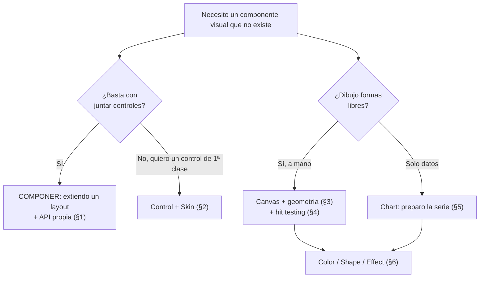
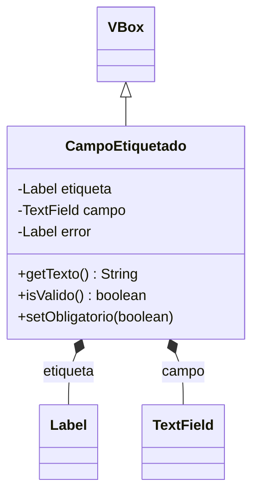
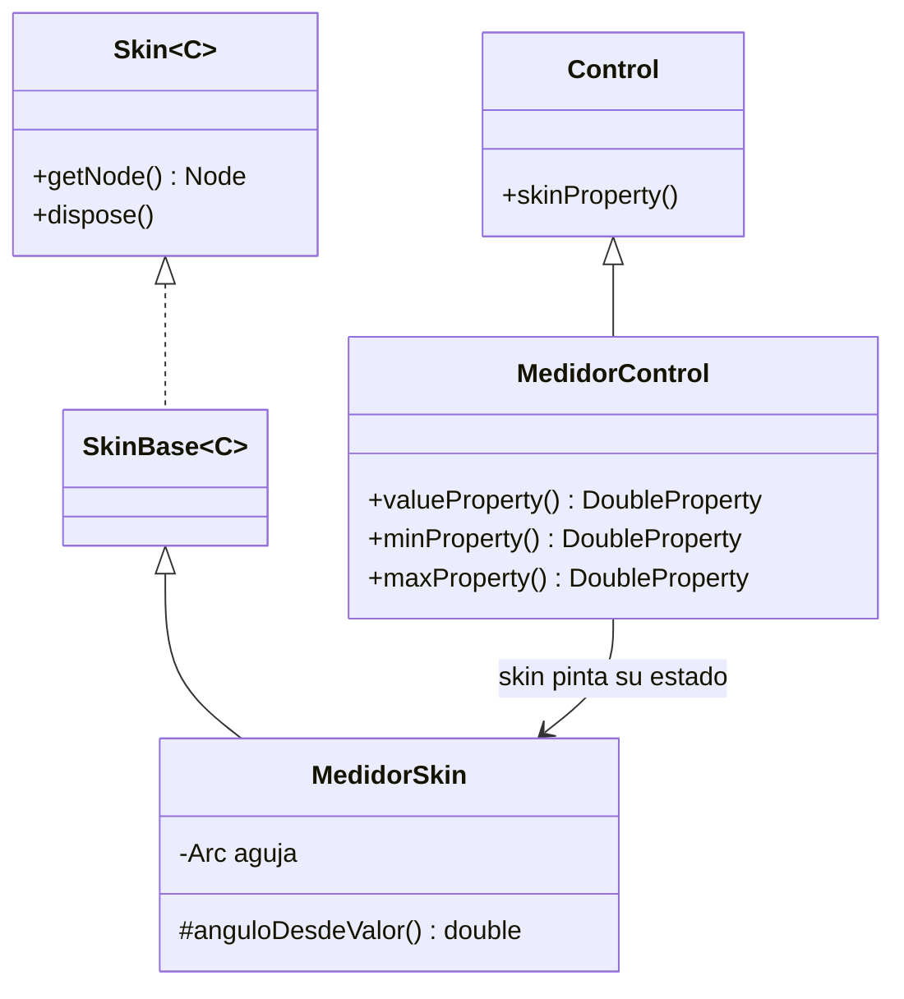
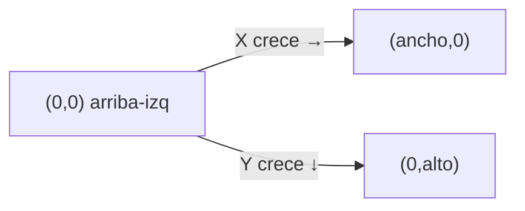
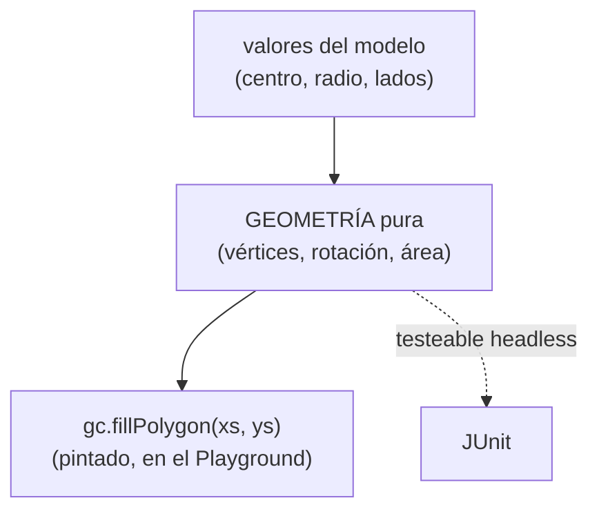
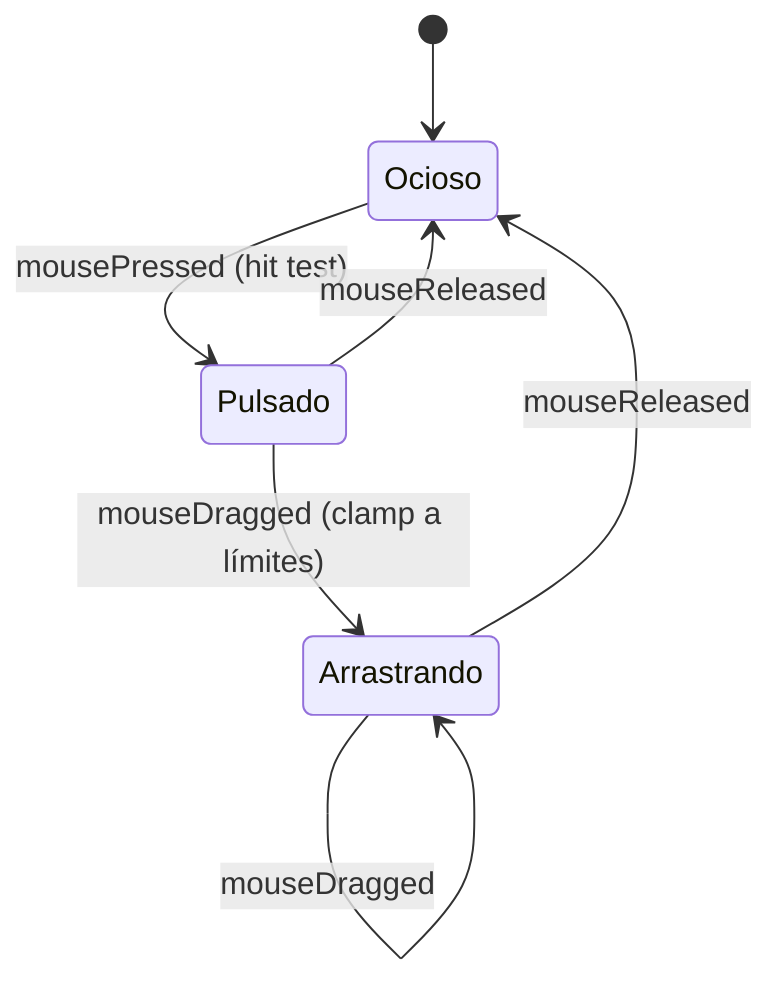
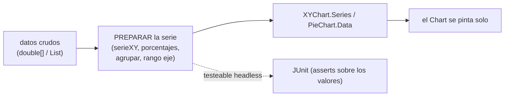
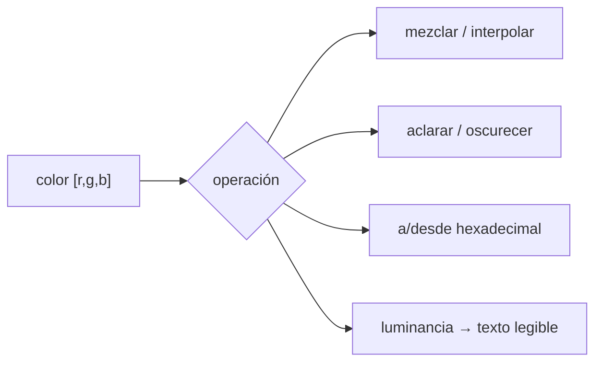

# Bloque 37 · Componentes personalizados, Canvas y gráficos (DI · RA2)

> Vienes de **usar** los controles que JavaFX te regala: `Button`, `TextField`, `TableView`,
> `LineChart`. Hasta ahora eras un consumidor de la librería. Lo que te falta —y es justo lo que
> exige el RA2 de Desarrollo de Interfaces— es **crear componentes visuales propios**: un control
> que no existe en la librería, una figura dibujada a mano sobre un lienzo, un gráfico alimentado
> con TUS datos. Importa porque toda aplicación real acaba necesitando algo que la librería no trae
> (un medidor, un editor de dibujo, un dashboard a medida), y porque entender CÓMO se construye un
> control por dentro (estado vs. pintado) te convierte de "usuario de widgets" en "diseñador de
> interfaces".

---

## Cómo usar este documento

- **Lee UNA sección → haz SU ejercicio → vuelve.** Cada `## N` de aquí corresponde a un
  `EjNNN…` del módulo `b37_fxcustom`. No leas todo de golpe: estudia la sección, implementa sus
  10 TODOs y sus 10 retos, y solo entonces pasa a la siguiente.
- **Los tests son la especificación real.** La teoría explica el *porqué*; el test
  (`EjNNN…Test`) fija el *qué* exacto (qué entra, qué sale, qué caso límite). Si dudas de un
  detalle (¿el borde cuenta como "dentro"? ¿la X empieza en 0 o en 1?), mira el test.
- **La teoría va MÁS ALLÁ del ejercicio.** Aquí encontrarás métodos, tipos de gráfico y opciones
  que los ejercicios no tocan. Es deliberado: cuando en el examen o en un proyecto te pidan algo
  nuevo, debes poder resolverlo solo. Las tablas marcan con "*(consulta)*" lo que va más allá.
- **Nota de testing (clave en este bloque):** todo lo testeable es **lógica pura headless**
  —geometría, estado, datos, color— y se prueba con JUnit normal, **sin abrir ventana**. Lo que
  toca nodos JavaFX de verdad vive en el `PlaygroundComponentes` (`extends Application`), que
  ejecutas con `mvn -pl b37_fxcustom javafx:run`. Esta separación es la **regla de oro del JavaFX
  testeable** (ver §1.6 del roadmap): si un test necesitara pantalla, la lógica estaría mal puesta.

### Antes de empezar (trampas de setup)

- **JavaFX no viene en el JDK** desde Java 11: son dependencias Maven aparte
  (`org.openjfx:javafx-controls`). Ya están en el `pom.xml` del bloque; si Maven se queja de que no
  encuentra `javafx.scene.canvas`, es que no descargó las dependencias (ejecuta `mvn -pl
  b37_fxcustom test-compile` con red).
- **`Canvas`, `Shape` y los `Chart` están en `javafx-controls`** (que arrastra `javafx-graphics`).
  No necesitas dependencias extra para este bloque: con la base JavaFX te llega.
- **El sistema de coordenadas del Canvas tiene la Y al revés** que en matemáticas: el origen
  `(0,0)` está arriba-izquierda y la Y crece hacia ABAJO. En los ejercicios trabajamos la
  geometría en coordenadas matemáticas (Y hacia arriba) y dejamos que el Playground haga el
  pintado; tenlo presente cuando dibujes de verdad.

---

## Índice del bloque

| Sección | Tema | Ejercicio |
|---|---|---|
| 1 | Componente compuesto: componer controles y darles una API propia | `Ej293CustomControlCompose` |
| 2 | `Control` + `Skin`: separar estado de pintado (el MVC del control) | `Ej294SkinnableControl` |
| 3 | `Canvas`/`GraphicsContext`: geometría de lo que dibujas | `Ej295CanvasDrawing` |
| 4 | Canvas interactivo: *hit testing* (¿el click cae dentro?) | `Ej296CanvasInteractive` |
| 5 | Gráficos integrados: `LineChart`/`BarChart`/`PieChart` | `Ej297ChartsBuiltIn` |
| 6 | `Shape`, `Color`/`Paint` y `Effect`: la matemática del color | `Ej298ShapesAndEffects` |

> **Modelo mental del bloque.** Crear un componente visual propio tiene **dos caminos** y **dos
> lienzos**:
>
> - **Componer** (§1): junto controles que ya existen dentro de un layout y les pongo una API. Es
>   rápido y suficiente el 90% de las veces.
> - **Heredar `Control`+`Skin`** (§2): separo el ESTADO (propiedades) del PINTADO (Skin). Más
>   trabajo, pero es un control "de primera clase" (estilable, reutilizable, con varios looks).
> - **`Canvas`** (§3–4): pinto píxeles a mano. Control total, cero objetos: yo calculo la geometría
>   y yo detecto los clicks (*hit testing*).
> - **`Chart`/`Shape`** (§5–6): la librería pinta por mí; yo solo preparo los **datos** y los
>   **colores**.
>
> La parte que se programa y se prueba SIEMPRE es la **lógica pura**: estado, geometría, datos,
> color. El pintado es la capa fina de arriba.



---

## 1. Componente compuesto: componer controles y darles una API propia

La forma **más sencilla y más usada** de crear un control nuevo es **componer**: extiendes un
contenedor (normalmente `VBox` o `HBox`) y metes dentro controles que ya existen. El resultado se
comporta como un control único con su propia **API pública**.

Ejemplo: un "campo etiquetado" (un patrón clarísimo en formularios) = un `Label` (la etiqueta)
encima de un `TextField` (el campo) encima de otro `Label` (el mensaje de error). Como clase:

```java
public class CampoEtiquetado extends VBox {
    private final Label etiqueta = new Label();
    private final TextField campo = new TextField();
    private final Label error = new Label();

    public CampoEtiquetado(String textoEtiqueta) {
        getChildren().addAll(etiqueta, campo, error);
        etiqueta.setText(textoEtiqueta);
    }

    // --- API PÚBLICA propia (lo que el resto del programa ve) ---
    public String getTexto()          { return campo.getText(); }
    public void setObligatorio(boolean b) { /* añade " *" a la etiqueta */ }
    public boolean isValido()         { /* aplica las reglas de validación */ return false; }
}
```

La clave pedagógica: **la lógica de esa API pública es testeable sin montar la ventana**. ¿Qué
etiqueta mostrar si el campo es obligatorio? ¿Es válido el valor? ¿Qué mensaje de error toca? Eso
son cadenas y booleanos que calculas con JUnit puro. El ejercicio practica justo esa lógica.



**Composición vs. herencia de un control.** Componer (extender `VBox`) es heredar de un *layout*:
el control "tiene" controles dentro. La alternativa es heredar de `Control` y escribir un `Skin`
(§2). Regla práctica:

| Criterio | Componer (extender layout) | `Control` + `Skin` |
|---|---|---|
| Esfuerzo | Bajo | Alto |
| Estilable por CSS a fondo | Limitado | Total |
| Varios "looks" del mismo estado | No | Sí (cambias de Skin) |
| Cuándo usarlo | El 90% de los casos | Componente de librería reutilizable |

> **Regla grabada:** la convención universal de "campo obligatorio" es el **asterisco** (`Email *`).
> El test del core lo comprueba: `etiquetaMostrada("Email", true)` → `"Email *"`.

> **Trampa del test:** `estadoCampo` distingue tres estados —`"vacio"`, `"corto"`, `"valido"`— y el
> ORDEN de los `if` importa. Comprueba primero longitud 0 (vacío), luego `< minimo` (corto), y deja
> válido al final. El caso frontera es longitud **igual** al mínimo → ya es `"valido"`.

> **Lo practicas en `Ej293CustomControlCompose`:** core `etiquetaMostrada` (asterisco de
> obligatorio) y `estadoCampo` (máquina de 3 estados); retos del 1 al 10, de formatear la etiqueta
> y el contador de caracteres (simples) a agregar el estado de varios campos en el progreso y el
> resumen de errores de un formulario entero (avanzados, enlazan con b38).

---

## 2. `Control` + `Skin`: separar el estado del pintado (el MVC del control)

Un control "de primera clase" en JavaFX separa **dos responsabilidades**:

- **`Control`** guarda el **estado**: las propiedades observables (`value`, `min`, `max`,
  `rating`…). Es el *Modelo*.
- **`Skin`** decide **cómo se pinta** ese estado: dónde va la aguja, cuántas estrellas se rellenan,
  qué color tiene cada zona. Es la *Vista*.

Es el patrón **MVC aplicado a UN control**. La ventaja: un mismo estado puede tener **varios
Skins** (looks distintos sin tocar la lógica), el CSS puede reestilar el Skin, y —lo que nos
importa— **el estado se prueba sin pintar nada**.



**Anatomía mínima de un control con Skin (consulta — más de lo que pide el ejercicio):**

```java
public class MedidorControl extends Control {
    private final DoubleProperty value = new SimpleDoubleProperty(0);
    public DoubleProperty valueProperty() { return value; }

    @Override protected Skin<?> createDefaultSkin() {
        return new MedidorSkin(this);   // el Control crea su Skin por defecto
    }
}

public class MedidorSkin extends SkinBase<MedidorControl> {
    public MedidorSkin(MedidorControl c) {
        super(c);
        // crea nodos (Arc, Text...), enlaza con c.valueProperty() y repinta al cambiar
    }
}
```

La regla mental: **el Control nunca pinta; el Skin nunca guarda estado.** El estado vive una sola
vez (en el Control) y el Skin lo *lee* para dibujar. Por eso el core del ejercicio es la lógica de
estado: **acotar un valor a su rango** (un Control jamás deja su valor fuera de `[min, max]`) y
**cuántas estrellas se llenan**. Los cálculos del Skin (ángulo de la aguja, posiciones de las
marcas, color por zona) son los retos.

| Concepto del control | Vive en… | En el ejercicio |
|---|---|---|
| Valor actual, acotado a `[min,max]` | `Control` (estado) | `valorAcotado`, `acotarEntero` |
| Fracción 0..1 del rango | calculada para el Skin | `fraccionDeRango` |
| Ángulo de la aguja (0..270°) | `Skin` (pintado) | `anguloAguja` |
| Posiciones de las marcas (ticks) | `Skin` (pintado) | `posicionesMarcas` |
| Pseudo-clase activa (`:vacio`/`:lleno`) | `Control` la dispara, CSS reacciona | `pseudoEstado` |
| Serializar el estado para guardarlo | `Control` (estado) | `serializarEstado` |

> **Regla grabada:** un medidor circular barre típicamente **270 grados** (no 360: deja un hueco
> abajo para que se distingan el mínimo y el máximo). Por eso `anguloAguja(fraccion) = fraccion *
> 270`.

> **Trampa del test:** `posicionesMarcas(n)` reparte N marcas con el divisor `(n-1)`, no `n`: con 3
> marcas quieres `[0.0, 0.5, 1.0]` (incluye los extremos). El caso límite es `n <= 1` → `[0.0]`
> (una sola marca, y evitas dividir por cero).

> **Lo practicas en `Ej294SkinnableControl`:** core `valorAcotado` y `estrellasLlenas` (estado
> siempre dentro de rango); retos del símbolo de estrella y el texto accesible (simples) al ángulo
> de la aguja, las posiciones de las marcas, la pseudo-clase del estado (enlaza con b36) y serializar
> el estado (enlaza con b02/b39).

---

## 3. `Canvas`/`GraphicsContext`: la geometría de lo que dibujas

Un `Canvas` es un **lienzo de mapa de bits**: un rectángulo de píxeles sobre el que pintas con
órdenes imperativas a través de su `GraphicsContext` (`gc`). No hay objetos `Rectangle` ni
`Circle`: hay píxeles. Una vez pintado, el `gc` no "recuerda" lo que dibujaste (a diferencia del
*scene graph*, que sí guarda cada nodo).

```java
Canvas canvas = new Canvas(400, 300);
GraphicsContext gc = canvas.getGraphicsContext2D();
gc.setFill(Color.STEELBLUE);
gc.fillRect(10, 10, 100, 50);          // rectángulo relleno
gc.setStroke(Color.BLACK);
gc.strokeLine(0, 0, 400, 300);          // línea
gc.fillPolygon(xs, ys, n);              // polígono a partir de arrays de coords
gc.fillText("Hola", 50, 50);            // texto
```

**Sistema de coordenadas.** El origen `(0,0)` está **arriba-izquierda**, la X crece a la derecha y
la **Y crece hacia ABAJO**. Esto sorprende: en matemáticas la Y sube. En los ejercicios calculamos
la geometría en coordenadas matemáticas y el Playground se encarga del pintado.



**Familia de métodos del `GraphicsContext` (consulta — más de lo que usa el ejercicio):**

| Método | Qué hace |
|---|---|
| `fillRect` / `strokeRect` | rectángulo relleno / solo borde |
| `fillOval` / `strokeOval` | elipse (un círculo es una elipse cuadrada) |
| `fillPolygon` / `strokePolygon` | polígono desde arrays `xs[]`, `ys[]` |
| `strokeLine` | un segmento |
| `fillText` / `strokeText` | texto |
| `beginPath`/`moveTo`/`lineTo`/`closePath`/`stroke` | trazar una ruta libre |
| `setFill` / `setStroke` / `setLineWidth` | color de relleno / de borde / grosor |
| `save` / `restore` | apila/restaura el estado (transformaciones, colores) |
| `translate` / `rotate` / `scale` *(consulta)* | transformaciones del lienzo |
| `clearRect` *(consulta)* | borra una zona (deja transparente) |

**Transformaciones.** `gc.translate(dx,dy)` mueve el origen; `gc.rotate(grados)` gira; `gc.scale(sx,
sy)` escala. Lo que de verdad cuesta no es llamarlas, sino **calcular dónde caen los puntos**. Por
eso el core es geometría:

- **Vértices de un polígono regular:** N puntos repartidos en círculo. El vértice `i` está en el
  ángulo `2π·i/N`, a distancia `r` del centro: `(cx + r·cos θ, cy + r·sin θ)`.
- **Rotar un punto** un ángulo θ alrededor del origen: `x' = x·cosθ − y·sinθ`, `y' = x·sinθ +
  y·cosθ`. Es la matriz de rotación 2D; memorízala.



| Cálculo geométrico | Fórmula | En el ejercicio |
|---|---|---|
| Centro de un rectángulo | `(x+w/2, y+h/2)` | `centroRectangulo` |
| Punto medio | `((x1+x2)/2, (y1+y2)/2)` | `puntoMedio` |
| Distancia | `√(dx²+dy²)` → `Math.hypot` | `distancia` |
| Punto en circunferencia | `(cx+r·cosθ, cy+r·sinθ)` | `puntoEnCircunferencia` |
| Bounding box | min/max de X e Y | `cajaContenedora` |
| Área de un polígono | fórmula del cordón (shoelace) | `areaPoligono` |
| Estrella | dos radios alternados | `verticesEstrella` |

> **Regla grabada:** usa `Math.hypot(dx, dy)` en lugar de `Math.sqrt(dx*dx+dy*dy)`: hace lo mismo
> pero evita desbordamientos cuando las distancias son enormes. Y `Math.toRadians(grados)` para
> pasar de grados (lo humano) a radianes (lo que comen `Math.cos`/`Math.sin`).

> **Trampa del test:** `verticesPoligonoRegular` empieza el primer vértice en el ángulo **0** → el
> primer punto es `(cx + r, cy)` (a la derecha del centro). Si empiezas en otro ángulo, el test del
> cuadrado falla. Y con menos de 3 lados no hay polígono → devuelve lista vacía.

> **Lo practicas en `Ej295CanvasDrawing`:** core `verticesPoligonoRegular` y `puntoTrasRotacion`;
> retos del centro y el punto medio (simples) al área por la fórmula del cordón y los vértices de
> una estrella de dos radios (avanzados, que reaparecen en el PieChart de §5).

---

## 4. Canvas interactivo: *hit testing* (¿el click cae dentro de la figura?)

Como el Canvas pinta píxeles y no objetos, cuando el usuario hace click JavaFX solo te da las
**coordenadas** `(x, y)`. Eres TÚ quien debe averiguar **qué figura ha tocado**. Eso es el **hit
testing**: geometría booleana de "¿este punto está dentro de este rectángulo / círculo / polígono?".

```java
canvas.setOnMousePressed(e -> {
    double x = e.getX();   // coordenadas LOCALES del canvas
    double y = e.getY();
    if (dentroDeCirculo(x, y, cx, cy, r)) {
        // ¡han clicado el círculo!
    }
});
```

**Las tres pruebas básicas:**



- **Rectángulo:** el punto está dentro si `px ∈ [rx, rx+ancho]` Y `py ∈ [ry, ry+alto]`. Bordes
  inclusive.
- **Círculo:** dentro si la distancia al centro ≤ radio. **Truco de rendimiento:** compara los
  **cuadrados** (`dx²+dy² ≤ r²`) para ahorrarte la raíz cuadrada en cada movimiento del ratón.
- **Polígono (consulta, pero está en los retos):** algoritmo del **rayo** (*ray casting*): lanza un
  rayo horizontal desde el punto y cuenta cuántos lados cruza. **Impar = dentro, par = fuera.**

| Prueba de hit testing | Cómo | En el ejercicio |
|---|---|---|
| Rango 1D | `px ∈ [min,max]` | `dentroDeRangoX` |
| Rectángulo (AABB) | rango en X y en Y | `dentroDeRectangulo` |
| Círculo | dist² ≤ r² | `dentroDeCirculo` |
| Línea (con tolerancia) | `|py−yLinea| ≤ tol` | `sobreLineaHorizontal` |
| Polígono | ray casting (impar=dentro) | `dentroDePoligono` |
| Colisión de dos cajas | solape en X y en Y | `colisionAABB` |
| Figura de arriba (z-order) | recorrer al revés | `indiceFiguraTocada` |

**Z-order.** Cuando varias figuras se solapan, la pintada **después** queda **encima**. Para saber
cuál tocó el click, recorres la lista **desde el final**: el primer acierto es la figura visible.
(*Z-order* = orden de apilamiento en el eje Z imaginario que sale de la pantalla.)

**Snap a rejilla.** Para que las figuras "encajen" al arrastrarlas, redondeas la coordenada al
múltiplo de rejilla más cercano: `Math.round(valor/rejilla)*rejilla`. Es el "imán" de cualquier
editor de dibujo.

> **Regla grabada:** en hit testing y colisiones, **compara distancias al cuadrado**, no las
> distancias. `Math.sqrt` es caro y en un juego con cientos de colisiones por *frame* (b41) se
> nota. `dist² ≤ r²` da exactamente el mismo resultado booleano.

> **Trampa del test:** `colisionAABB` solapan en X si `ax < bx+bw` **y** `bx < ax+aw` (las dos
> condiciones). Es fácil escribir solo una y que dos cajas lejanas parezcan chocar. Y
> `indiceFiguraTocada` debe devolver el índice **mayor** cuando dos figuras se solapan (la de
> arriba), por eso se recorre del final al principio.

> **Lo practicas en `Ej296CanvasInteractive`:** core `dentroDeRectangulo` y `dentroDeCirculo`;
> retos del rango 1D y la distancia al cuadrado (simples) al ray casting de polígonos, la colisión
> AABB (enlaza con el juego de b41) y la selección por lazo (avanzados).

---

## 5. Gráficos integrados: `LineChart`/`BarChart`/`PieChart`

Para representar datos no dibujas a mano: JavaFX trae una familia de gráficos. Tú **no pintas
barras**; construyes una **serie de datos** y el gráfico se dibuja, se anima y se actualiza solo.

```java
XYChart.Series<String, Number> serie = new XYChart.Series<>();
serie.setName("Ventas");
serie.getData().add(new XYChart.Data<>("Ene", 120));
serie.getData().add(new XYChart.Data<>("Feb", 95));

BarChart<String, Number> chart = new BarChart<>(new CategoryAxis(), new NumberAxis());
chart.getData().add(serie);
```

**La familia de gráficos (consulta — el ejercicio usa unos pocos):**

| Gráfico | Para qué | Ejes |
|---|---|---|
| `LineChart` | evolución / tendencia | X numérico o categoría, Y numérico |
| `BarChart` | comparar categorías | X categoría, Y numérico |
| `StackedBarChart` | comparar y ver el total apilado | X categoría, Y numérico |
| `AreaChart` | volumen acumulado | X, Y numéricos |
| `PieChart` | proporción del total (porcentajes) | sin ejes (usa `PieChart.Data`) |
| `ScatterChart` *(consulta)* | nube de puntos / correlación | X, Y numéricos |
| `BubbleChart` *(consulta)* | tres dimensiones (x, y, tamaño) | X, Y numéricos |

**Las dos piezas clave:**

- **`XYChart.Series`** = una línea/conjunto de barras, con un nombre y una lista de `Data`.
- **`XYChart.Data<X,Y>`** = un punto: una pareja `(x, y)`. En un `BarChart` la X suele ser un
  `String` (categoría) y la Y un número.

El `PieChart` es distinto: no tiene ejes, usa `PieChart.Data(nombre, valor)` y reparte el total en
porciones proporcionales.



Lo testeable —y lo importante— es **preparar los datos**:

| Preparación de datos | Qué calcula | En el ejercicio |
|---|---|---|
| Serie X/Y | pares `(posición, valor)`, X desde 1 | `serieXY` |
| Porcentajes de tarta | `valor/total·100` | `porcentajesPie` |
| Máximo / media | para el eje Y / línea de referencia | `maximoSerie`, `mediaSerie` |
| Acumulado | suma corrida (AreaChart) | `acumulado` |
| Normalizar 0..100 | comparar escalas distintas | `normalizar0a100` |
| Agrupar por categoría | de datos sueltos a barras | `agruparPorCategoria` |
| Rango "bonito" del eje | redondear el techo al alza | `rangoEjeY` |
| Top N | las N mayores categorías | `topN` |
| Apilado | total por categoría (stacked) | `apiladoTotal` |

> **Regla grabada:** en un `BarChart`/`LineChart` la X de la serie suele empezar en **1**, no en 0
> (el primer dato es el punto nº 1). El test de `serieXY` lo fija: `{10,20,30}` → `(1,10),(2,20),
> (3,30)`.

> **Trampa del test:** `porcentajesPie` con total 0 devuelve **lista vacía** (una tarta sin datos
> no tiene porciones, y así evitas dividir por cero). `agruparPorCategoria` usa un `LinkedHashMap` +
> `merge(clave, valor, Double::sum)` para sumar conservando el orden de aparición.

> **Lo practicas en `Ej297ChartsBuiltIn`:** core `serieXY` y `porcentajesPie`; retos de la etiqueta
> de categoría y el máximo (simples) al agrupado por categoría, el rango del eje, el top N y el
> apilado (avanzados, que alimentan los informes de b38).

---

## 6. `Shape`, `Color`/`Paint` y `Effect`: la matemática del color

Hay un tercer camino entre "componer controles" y "pintar en Canvas": las **formas del scene
graph** (`Rectangle`, `Circle`, `Polygon`, `Line`, `Path`…). A diferencia del Canvas, **son
nodos**: la escena los recuerda, responden a eventos y se estilan por CSS.

```java
Rectangle r = new Rectangle(10, 10, 100, 50);
r.setFill(Color.web("#3366CC"));        // un Paint (Color es un Paint)
r.setEffect(new DropShadow(8, Color.GRAY)); // una sombra
Circle c = new Circle(60, 60, 30, Color.GOLD);
```

**`Paint` y `Color`.** Lo que rellena una forma es un `Paint`. Los más comunes:

| `Paint` | Qué es | Ejemplo |
|---|---|---|
| `Color` | un color sólido (RGB + opacidad) | `Color.rgb(255,0,0)`, `Color.web("#FF0000")` |
| `LinearGradient` | degradado en línea | de un color a otro a lo largo de un eje |
| `RadialGradient` *(consulta)* | degradado circular | del centro hacia fuera |
| `ImagePattern` *(consulta)* | rellenar con una imagen | textura repetida |

Un `Color` en el fondo son **tres canales 0..255** (rojo, verde, azul) más una opacidad 0..1. Lo
reutilizable es la **matemática del color**, que no depende de JavaFX y se prueba con JUnit:



| Operación de color | Idea | En el ejercicio |
|---|---|---|
| Mezclar | media de cada canal | `mezclarColores` |
| A/desde hex | `#RRGGBB` ↔ `[r,g,b]` | `aHex`, `desdeHex` |
| Aclarar / oscurecer | `·(1±factor)`, acotado a `[0,255]` | `aclarar`, `oscurecer` |
| Luminancia | `0.299R+0.587G+0.114B` | `luminancia` |
| Texto legible | luminancia < 128 → blanco | `colorTextoLegible` |
| Opacidad (rgba) | `rgba(r,g,b,a)` | `conAlpha` |
| Interpolar | parada de degradado | `interpolar`, `mezclarPonderada` |
| Paleta | derivar tonos de un color base | `paletaDesde` |

**Luminancia y accesibilidad.** El ojo no percibe los tres canales igual: es **más sensible al
verde** que al rojo, y al rojo más que al azul. La fórmula `0.299·R + 0.587·G + 0.114·B` da el
"brillo percibido". Sirve para elegir automáticamente el color del texto: sobre fondo oscuro
(luminancia baja) → texto blanco; sobre fondo claro → texto negro. Es el contraste WCAG de b36
aplicado al revés.

**`Effect`.** Un efecto visual que se aplica a un nodo o forma:

| `Effect` | Qué hace |
|---|---|
| `DropShadow` | sombra proyectada (radio, desplazamiento, color) |
| `InnerShadow` | sombra interior (hundido) |
| `GaussianBlur` | desenfoque |
| `Glow` *(consulta)* | brillo / resplandor |
| `Reflection` *(consulta)* | reflejo bajo el nodo |

```java
node.setEffect(new DropShadow(10, 4, 4, Color.rgb(0,0,0,0.4)));
//                            radio offX offY color
```

> **Regla grabada:** para pasar un canal a hexadecimal de 2 dígitos usa `String.format("%02X", c)`:
> el `0` rellena con ceros (un `5` se ve `05`) y la `X` mayúscula da `A..F`. El test de `aHex` exige
> mayúsculas y dos dígitos: `(0,0,0)` → `"#000000"`.

> **Trampa del test:** al aclarar/oscurecer/interpolar hay que **acotar** cada canal a `[0, 255]` y
> usar `Math.round` (no truncar). `interpolar([0,0,0],[255,255,255], 0.5)` → `128` porque
> `Math.round(127.5)` redondea hacia arriba. Y al mezclar con división entera, `255/2 = 127`.

> **Lo practicas en `Ej298ShapesAndEffects`:** core `mezclarColores` y `aHex`; retos de hex inverso
> y aclarar/oscurecer (simples) a la luminancia, el texto legible (enlaza con b36), la interpolación
> de degradados, el radio de sombra y derivar una paleta de un color base (avanzados, enlazan con el
> theming de b36).

---

## Errores comunes del bloque

| # | Error | Antídoto |
|---|---|---|
| 1 | Poner la lógica en el control visual y no poder testearla. | Saca estado/geometría/datos/color a métodos `static` puros; la vista solo los llama. |
| 2 | Creer que el Canvas "recuerda" lo que pintas. | El `GraphicsContext` solo pinta píxeles; para "borrar" repintas el fondo. |
| 3 | Olvidar que en el Canvas la **Y crece hacia abajo**. | El origen está arriba-izquierda; si una figura sale "espejada", es la Y. |
| 4 | Empezar el primer vértice del polígono en un ángulo que no es 0. | Vértice 0 en ángulo 0 → `(cx+r, cy)`; el test del cuadrado lo fija. |
| 5 | Comparar distancias con `sqrt` en cada click/frame. | Compara los **cuadrados** (`dist² ≤ r²`): mismo resultado, mucho más rápido. |
| 6 | En `colisionAABB`, comprobar solo un lado del solape. | Hacen falta las dos condiciones por eje (`ax<bx+bw` **y** `bx<ax+aw`). |
| 7 | Devolver la primera figura que casa en lugar de la de arriba. | Recorre la lista **del final al principio** (z-order). |
| 8 | Dividir por cero en porcentajes/medias con datos vacíos. | Comprueba total/longitud 0 antes de dividir; devuelve `List.of()`/`0`. |
| 9 | Confundir la clase CSS (sin punto) con el selector (con punto). | La clase es `"campo-ok"`; el selector `.campo-ok` (heredado de b36). |
| 10 | No acotar los canales de color a `[0,255]` al aclarar/oscurecer. | `Math.min(255, …)` y `Math.max(0, …)`; usa `Math.round`, no truncar. |
| 11 | Olvidar el `(n-1)` al repartir marcas/posiciones equidistantes. | Para incluir los extremos 0 y 1, el divisor es `n-1`, no `n`. |
| 12 | Pensar que la X de una serie empieza en 0. | En `BarChart`/`LineChart` la primera categoría es la nº **1**. |

---

## Chuleta final del bloque

```text
COMPONER       = extends VBox/HBox + meter controles dentro + API pública propia
CONTROL+SKIN   = Control(estado: properties) + Skin(pintado); MVC del control
                 createDefaultSkin() crea el Skin; el Control nunca pinta
campo oblig.   = etiqueta + " *"        estado campo = vacio<corto<valido (orden!)
CANVAS         = lienzo de píxeles; gc = getGraphicsContext2D(); pinta y olvida
coords canvas  = (0,0) arriba-izq, X→derecha, Y→ABAJO
poligono reg.  = vértice i en ángulo 2πi/n, punto (cx+r·cosθ, cy+r·sinθ)
rotar punto    = x'=x·cosθ−y·sinθ ; y'=x·sinθ+y·cosθ ; Math.toRadians(grados)
distancia      = Math.hypot(dx,dy) ; hit testing → compara dist² ≤ r²
hit rect       = px∈[rx,rx+w] && py∈[ry,ry+h] (bordes inclusive)
AABB           = solape en X (ax<bx+bw && bx<ax+aw) Y en Y
z-order        = pintado después = encima → recorre del final al principio
CHART          = Series + Data(x,y); BarChart X=categoría; PieChart sin ejes
serie X/Y      = X empieza en 1 ; porcentajes = valor/total·100 (total 0 → vacío)
agrupar        = LinkedHashMap + merge(clave, valor, Double::sum)
color          = [r,g,b] 0..255 ; aHex = String.format("#%02X%02X%02X",r,g,b)
luminancia     = 0.299R+0.587G+0.114B ; <128 → fondo oscuro → texto blanco
aclarar/oscur. = canal·(1±factor) acotado [0,255], Math.round
Effect         = DropShadow/GaussianBlur/InnerShadow ; node.setEffect(...)
```

---

## Autoevaluación (responde sin mirar; si fallas 2+, relee la sección)

1. ¿Qué dos formas hay de crear un control propio y cuándo eliges cada una? *(1, 2)*
2. En el patrón `Control`+`Skin`, ¿quién guarda el estado y quién pinta? ¿Por qué facilita el
   testing? *(2)*
3. ¿Por qué un medidor barre 270° y no 360°? ¿Cómo pasas de un valor a la fracción 0..1? *(2)*
4. ¿Dónde está el origen del Canvas y hacia dónde crece la Y? *(3)*
5. ¿Cuál es la fórmula del vértice `i` de un polígono regular de N lados? *(3)*
6. ¿Cómo rotas un punto θ grados alrededor del origen? *(3)*
7. ¿Por qué en hit testing se comparan distancias al cuadrado en vez de las distancias? *(4)*
8. Escribe la condición de colisión entre dos cajas AABB. *(4)*
9. Si dos figuras se solapan, ¿cómo sabes cuál tocó el click? *(4)*
10. ¿Qué dos objetos necesitas para alimentar un `BarChart`? ¿En qué empieza la X de la serie? *(5)*
11. ¿Qué devuelve `porcentajesPie` si el total es 0 y por qué? *(5)*
12. ¿Cómo agrupas datos sueltos por categoría conservando el orden? *(5)*
13. ¿Cómo pasas `[255,0,128]` a `"#FF0080"`? ¿Qué hace el `%02X`? *(6)*
14. ¿Qué es la luminancia y cómo decides si el texto va en blanco o negro? *(6)*
15. Al aclarar/interpolar colores, ¿qué dos cosas no puedes olvidar? *(6)*
