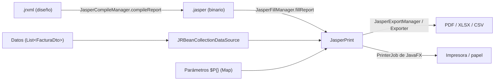
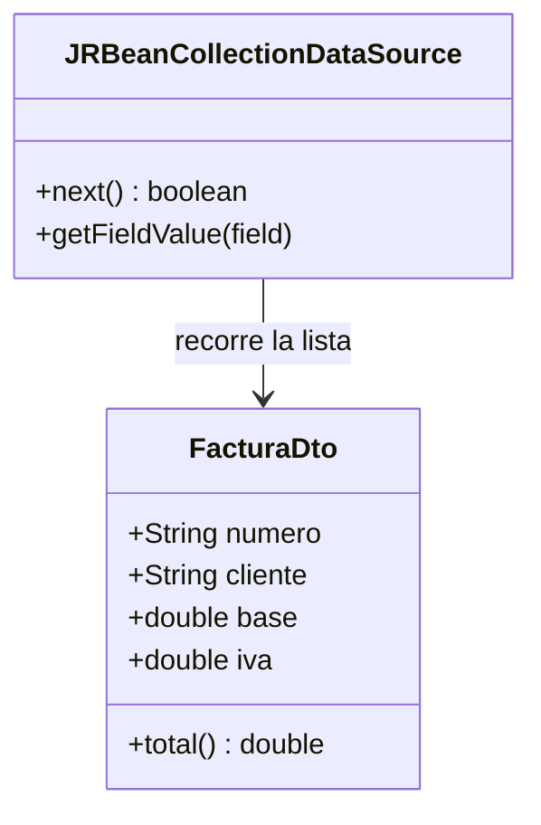
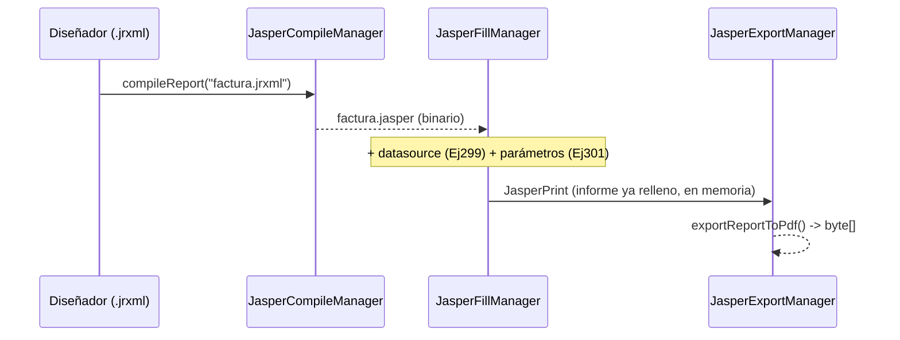
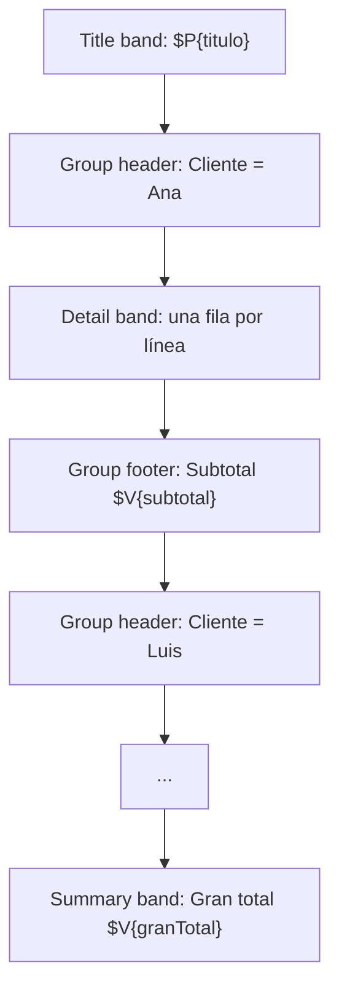
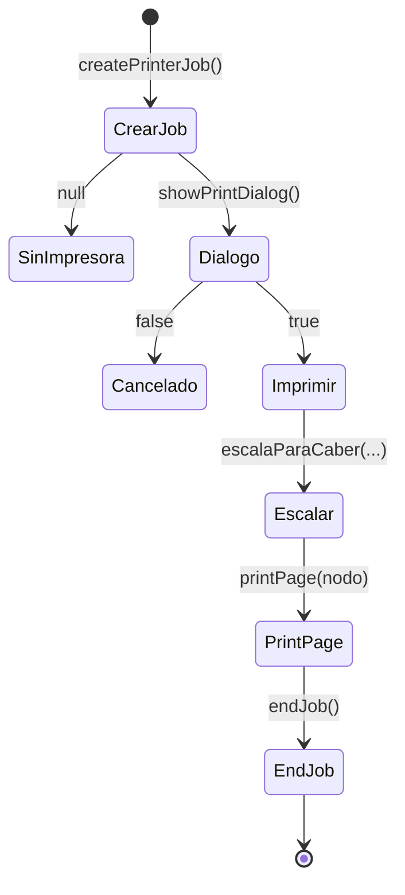
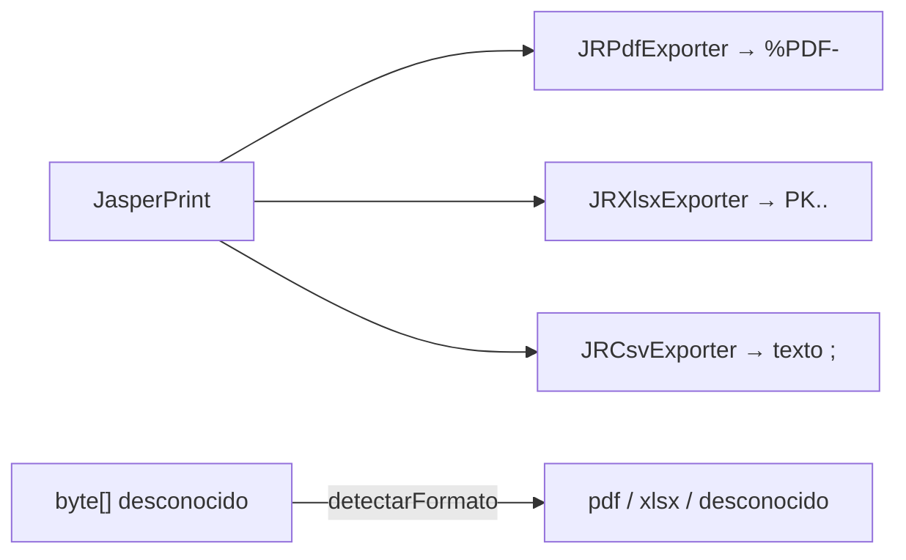

# Bloque XXXVIII · Informes, PDF e impresión (DI·RA4)

> Vienes de pintar datos en pantalla: una `TableView` (b35), un `BarChart` (b37). Pero el cliente
> no quiere mirar tu ventana: quiere **un papel**. Una factura, un listado de pedidos, un informe
> de ventas que pueda **imprimir, guardar en PDF y enviar por correo**. Eso es lo que te falta:
> convertir tus datos en un **documento** profesional, con cabeceras, grupos, subtotales, logo y
> número de página. La herramienta estándar del módulo es **JasperReports**, y JavaFX te deja
> además **imprimir cualquier nodo** directamente. Este bloque cierra el RA4 de Desarrollo de
> Interfaces: *generar informes a partir de datos integrando controles visuales*.

---

## Cómo usar este documento

- **Lee UNA sección → haz SU ejercicio → vuelve.** Cada sección `N` corresponde al ejercicio
  `Ej(298+N)`: la 1 a `Ej299`, la 2 a `Ej300`… la 6 a `Ej304`.
- **Los tests son la especificación real.** Cuando dudes de qué debe devolver un método, abre su
  test: ahí está el caso exacto (incluido el caso límite) que tienes que satisfacer.
- **Esta teoría va más allá de los ejercicios.** Explica todo el motor de informes —bandas que el
  ejercicio no toca, exporters que no usas, opciones de `PrinterJob`— para que puedas afrontar un
  informe nuevo tú solo. Las filas marcadas *(consulta)* en las tablas son "más de lo que pide el
  ejercicio".
- **Nota de testing:** los **core son lógica pura** (números, listas, bytes, cadenas). Se prueban
  con JUnit normal, **sin abrir ventana ni motor de informes**. El código real de JasperReports y
  de `PrinterJob` vive aquí y en el `PlaygroundInformes`; lo ejecutas tú con *Run*.

---

## Antes de empezar (trampas de entorno)

1. **JasperReports NO viene en el JDK ni en JavaFX.** Es una librería aparte
   (`net.sf.jasperreports:jasperreports`). En el `pom.xml` del bloque viene **comentada**: pesa
   ~40 MB con sus dependencias y los ejercicios no la necesitan. Para ejecutar el código real de
   las secciones 1–4, **descoméntala** y recarga Maven.
2. **Los cores de este bloque no importan ni una clase de Jasper.** Trabajan con la *lógica* del
   informe (el modelo de datos, los totales, los bytes del PDF). Es el mismo enfoque que usó `b25`
   para HTML→PDF: aprender el concepto sin atarte a una librería pesada. Así el módulo **compila
   sin internet** y los tests son deterministas.
3. **Un PDF es binario.** No lo abras con un editor de texto esperando ver tu factura: verás
   `%PDF-1.7` y luego ruido. Para comprobarlo en un test se mira su **firma** (los primeros bytes),
   no su contenido.
4. **Imprimir necesita una impresora (o uno virtual “PDF”).** Por eso `PrinterJob.printPage(...)`
   no se testea: se testea la **geometría** (escala, páginas, márgenes), que es pura matemática.

---

## Índice del bloque

| Sección | Tema | Ejercicio |
|---|---|---|
| 1 | Modelo de datos del informe (`JRBeanCollectionDataSource`) | `Ej299` |
| 2 | Compilar `.jrxml`, `fillReport`, exportar a PDF | `Ej300` |
| 3 | Parámetros, agrupaciones, totales y subtotales | `Ej301` |
| 4 | Subinformes y gráficos embebidos | `Ej302` |
| 5 | Imprimir un nodo/escena con `PrinterJob` | `Ej303` |
| 6 | Exportar a PDF/XLSX/CSV y comparar formatos | `Ej304` |

> **Modelo mental del bloque.** Un informe es una **tubería (pipeline)**: tus **datos** (una lista
> de objetos) entran por un lado, se vierten sobre una **plantilla** de diseño (`.jrxml`) y sale un
> **documento** (PDF, Excel, papel). Tú controlas los dos extremos —preparar los datos y elegir el
> formato de salida— y Jasper hace el relleno en medio. Todo lo testeable de este bloque está en
> esos dos extremos.



---

## 1. Modelo de datos del informe (`Ej299`)

Un informe no tiene datos propios: se los das tú. La forma más cómoda en Jasper es la
**`JRBeanCollectionDataSource`**: le pasas una `List` de objetos (los *beans*) y Jasper la **recorre
generando una fila por elemento**. Cada fila se llama **banda detalle** y cada campo del bean lo lee
la plantilla con la expresión **`$F{nombreCampo}`** (la `F` es de *Field*).

En nuestro ejercicio el bean es un `record FacturaDto(String numero, String cliente, double base,
double iva)`. La plantilla puede mostrar cinco columnas: los cuatro campos del record más un campo
**calculado** `total = base + iva` (Jasper lo trata como un campo más aunque no exista en el bean).

```java
// Código REAL de Jasper (necesita la dependencia descomentada):
List<FacturaDto> facturas = List.of(new FacturaDto("F-001", "Ana", 100, 21), ...);
JRBeanCollectionDataSource ds = new JRBeanCollectionDataSource(facturas);
// Jasper llamará a getNumero(), getCliente()... -> en un record son numero(), cliente()
```

> **Trampa — los nombres de los campos.** En la plantilla, `$F{numero}` debe coincidir EXACTAMENTE
> con el nombre del componente del record. Si la plantilla pone `$F{num}` y el record tiene
> `numero`, Jasper no encuentra el campo y la columna sale vacía (no da error: peor aún).

El **core** de este ejercicio es justo esa preparación de datos, en lógica pura: contar registros,
calcular el total con IVA, listar los campos. Y los retos cubren las operaciones que SIEMPRE haces
antes de un informe: filtrar (`WHERE`), proyectar (`map`), agrupar (`GROUP BY`), ordenar
(`ORDER BY`) y validar. Son las mismas que escribiste en SQL/JPA (b11–b15), ahora en Java sobre la
lista.

| Operación sobre el dataset | En el informe es… | En SQL/Streams era… |
|---|---|---|
| `numeroDeRegistros` | nº de filas detalle | `COUNT(*)` |
| `filtrarPorCliente` | informe filtrado | `WHERE cliente = ?` (b15) |
| `numerosDeFactura` | una columna | `SELECT numero` / `map` (b01) |
| `totalPorCliente` | grupo con subtotal | `GROUP BY cliente` (b14) |
| `ordenarPorTotalDesc` | orden de las bandas | `ORDER BY total DESC` |
| `facturaMayor` | registro destacado | `MAX(total)` → `Optional` (b01) |



> **Regla grabada.** El informe es tan bueno como sus datos: **limpia, filtra y ordena ANTES** de
> dárselos a Jasper. La plantilla solo pinta; no calcula tu lógica de negocio.

> **Lo practicas en `Ej299`**: cores `numeroDeRegistros`, `totalConIva`, `camposDisponibles`; retos
> del 1 (`clienteDe`) al 10 (`ordenarPorTotalDesc`), que recorren filtrar, proyectar, agrupar,
> validar y ordenar el dataset.

---

## 2. Compilar, rellenar y exportar a PDF (`Ej300`)

El pipeline de Jasper tiene **tres pasos** bien diferenciados. Confundirlos es el error nº 1 del
principiante:



1. **Compilar:** `factura.jrxml` (XML de diseño, editable con Jaspersoft Studio) → `factura.jasper`
   (binario optimizado). Se hace **una vez**; en producción compilas al construir, no en cada
   petición.
2. **Rellenar (`fill`):** unes el `.jasper` con el **datasource** (la lista de Ej299) y los
   **parámetros** (Ej301). Resultado: un `JasperPrint`, el informe ya maquetado en memoria.
3. **Exportar:** del `JasperPrint` sacas el formato final. `JasperExportManager.exportReportToPdf
   (print)` te da el **`byte[]`** del PDF.

```java
// Código REAL del pipeline (dependencia descomentada):
JasperReport jr = JasperCompileManager.compileReport(
        getClass().getResourceAsStream("/reports/factura.jrxml"));
JasperPrint print = JasperFillManager.fillReport(jr, params, ds);
byte[] pdf = JasperExportManager.exportReportToPdf(print);
Files.write(Path.of("factura.pdf"), pdf);
```

¿Qué se puede testear de esto sin el motor? **Reconocer y validar el resultado.** Todo PDF empieza
por una **firma** (su *magic number*): los 5 bytes ASCII **`%PDF-`** (`25 50 44 46 2D` en
hexadecimal), seguidos de la versión (`1.7`). Un fichero que no empieza así **no es un PDF**. Esta
idea —identificar un binario por sus primeros bytes— es universal y vuelve en la sección 6.

| Concepto | Valor | Por qué importa |
|---|---|---|
| Firma PDF | `%PDF-` = `25 50 44 46 2D` | el primer assert de cualquier test de export |
| Byte como entero | `'%'` = `0x25` = 37 | en Java un `byte` se compara como número |
| `%PDF-1.7` | versión tras la firma | depurar incompatibilidades de visor |
| `.jrxml` → `.jasper` | compilar | nunca rellenas el XML directamente |
| Recurso en classpath | `/reports/factura.jrxml` | igual que las plantillas de b25 |

> **Trampa — el `byte` con signo.** En Java `byte` va de −128 a 127. Las firmas con bytes altos
> (p.ej. `0x89` del PNG) salen **negativos** (`(byte)0x89` = −119). Para PDF y ZIP no pasa (son
> ASCII bajo), pero si comparas firmas genéricas, hazlo byte a byte, no como `int` suelto.

> **Lo practicas en `Ej300`**: cores `cabeceraPdf`, `esPdf`, `nombreCompilado`; retos como
> `versionPdf`, `empiezaPor` (la detección genérica que reusarás en Ej304) y `mismosBytes` (el
> *round-trip* escribir/leer de b26).

---

## 3. Parámetros, agrupaciones, totales y subtotales (`Ej301`)

Un informe profesional no es una tabla pelada. Lleva:

- **Parámetros** (`$P{...}`): valores que le pasas **desde fuera** en un `Map<String,Object>` al
  rellenar: el título, la fecha de emisión, el logo, el nombre del usuario. La plantilla los lee con
  `$P{titulo}`. La buena práctica es **resolverlos con un valor por defecto** por si faltan.
- **Grupos** (`<group>`): parten el detalle en secciones por un campo (p.ej. por cliente o por
  categoría). Cada grupo tiene su **cabecera**, su detalle y su **subtotal** al cerrar.
- **Variables** (`$V{...}`): acumuladores que Jasper calcula solo: un `$V{subtotal}` por grupo y un
  `$V{granTotal}` en la banda *summary* (el final del informe).



El **core** reproduce esa aritmética en Java puro: `parametro(...)` resuelve un `$P{}` con su
defecto; `subtotalPorGrupo(...)` agrega por grupo conservando el orden de aparición (un
`LinkedHashMap` + `merge`); `granTotal(...)` suma todo. Los retos añaden recuento, media, porcentaje
sobre el total, el grupo de mayor subtotal y un parámetro **tipado** (`Integer`) con degradación
elegante si el texto no es número.

| Elemento Jasper | Sintaxis | En el core |
|---|---|---|
| Parámetro | `$P{titulo}` | `parametro(params, "titulo", "Informe")` |
| Campo | `$F{importe}` | `l.importe()` |
| Variable de grupo | `$V{subtotalGrupo}` | `subtotalPorGrupo(...)` |
| Variable de informe | `$V{granTotal}` | `granTotal(...)` |
| Cálculo | `SUM`, `AVERAGE`, `COUNT` | `merge(Double::sum)`, media, `merge(1, Integer::sum)` |

> **Trampa — el orden de los grupos.** Jasper agrupa **en el orden en que llegan los datos**. Si
> quieres "primero los clientes con más facturación", **ordena el dataset antes** (sección 1). Por
> eso el core usa `LinkedHashMap`: conserva el orden de aparición, no lo aleatoriza como un
> `HashMap`.

> **Trampa — dividir por cero.** El `porcentajeDeGrupo` divide el subtotal entre el gran total. Si
> el informe está vacío, el gran total es 0 → comprueba y devuelve `0.0` antes de dividir.

> **Lo practicas en `Ej301`**: cores `parametro`, `subtotalPorGrupo`, `granTotal`; retos
> `mediaPorGrupo`, `grupoMayorSubtotal` (`Optional`), `porcentajeDeGrupo`, `parametroEntero` (tipado
> con `try/catch`) y `lineaResumen` (la banda *summary* en texto).

---

## 4. Subinformes y gráficos embebidos (`Ej302`)

Dos piezas avanzadas que comparten la misma operación de datos:

- **Subinforme** (`<subreport>`): un informe **dentro de** otro. El maestro recorre pedidos y, por
  cada fila, **incrusta** un subinforme con las líneas de ESE pedido. Es la relación
  **maestro-detalle** (`b13`): un pedido → muchas líneas. La clave es **filtrar** las líneas que
  pertenecen al maestro actual: ese subconjunto es el datasource del subinforme.
- **Gráfico embebido** (`<barChart>`, `<pieChart>`): un gráfico **dentro de** una banda del informe,
  alimentado por datos **agregados** (ventas por mes, % por categoría). Es exactamente el dato que
  preparabas para un `BarChart` de JavaFX en `b37`, ahora impreso en el PDF.

```mermaid
flowchart LR
    M["Maestro: por cada Pedido"] -->|itemsDePedido(id)| S["Subinforme: sus líneas"]
    M --> AGG["Agregación: ventasPorMes / porcentajePorMes"]
    AGG --> CH["Gráfico embebido (BarChart / PieChart)"]
```

El **core** hace el filtrado (`itemsDePedido`) y dos agregaciones (`totalPorPedido`, `ventasPorMes`),
todo con `LinkedHashMap` + `merge`. Los retos cubren el resto del repertorio de un dashboard: mes
pico, pedido con más líneas, media por pedido, ranking de meses, leyenda (productos distintos) y la
**serie acumulada** (la misma "suma corrida" de `b37`).

| Pieza | Operación | Resultado |
|---|---|---|
| Subinforme | `filter(pedidoId)` | la lista de líneas del maestro |
| Total del maestro | `SUM` por pedido | el número que el subinforme devuelve arriba |
| Barras | `SUM` por mes | dataset del `BarChart` embebido |
| Tarta | `% sobre total` | dataset del `PieChart` embebido *(consulta)* |
| Acumulado | *running sum* | la línea de "acumulado del año" *(consulta)* |

> **Trampa — el datasource del subinforme.** Cada vez que el maestro pinta un pedido, el subinforme
> necesita **solo sus líneas**, no todas. Si le pasas la lista entera, cada subinforme repite TODO.
> Por eso `itemsDePedido(id, items)` filtra: es el `JRBeanCollectionDataSource` del subinforme.

> **Lo practicas en `Ej302`**: cores `itemsDePedido`, `totalPorPedido`, `ventasPorMes`; retos
> `mesConMasVentas`/`pedidoConMasItems` (`Optional`), `porcentajePorMes`, `mesesOrdenadosPorVenta` y
> `acumuladoMensual` (puente con el acumulado de b37).

---

## 5. Imprimir un nodo/escena con `PrinterJob` (`Ej303`)

JavaFX imprime **cualquier nodo** (un `Node`: una `TableView`, un `Chart`, un `VBox` entero) sin
pasar por Jasper. La API son tres líneas:

```java
PrinterJob job = PrinterJob.createPrinterJob();      // null si no hay impresora
if (job != null && job.showPrintDialog(ventana)) {   // diálogo del SO
    job.printPage(nodo);                              // imprime el nodo
    job.endJob();                                     // cierra el trabajo (¡no lo olvides!)
}
```

El problema real **no es la llamada** (que necesita impresora y abre un diálogo), sino la
**geometría del encaje**: un nodo grande no cabe en un A4. Tienes que:

- **Escalar** el nodo con un `Scale` para que quepa: el factor es el **menor** de los dos cocientes
  (ancho página / ancho nodo, alto página / alto nodo), y **nunca agrandas** (tope 1.0).
- Saber **cuántas páginas** ocupa un contenido alto (división con `Math.ceil`, mínimo 1).
- Calcular el **área imprimible** = hoja − márgenes (los 4 lados).

Todo eso es matemática pura y determinista → es lo que testea el core.



| Concepto | Fórmula | Nota |
|---|---|---|
| Escala para caber | `min(pW/nW, pH/nH)`, tope 1.0 | el lado más justo manda; no agrandar |
| Páginas | `max(1, ceil(altoTotal/altoPag))` | siempre ≥ 1 hoja |
| Área imprimible | `(pW − 2·m, pH − 2·m)` | nunca negativa (`max(0, …)`) |
| Unidad | **punto** = 1/72 pulgada | `mm·72/25.4` convierte mm→puntos |
| Orientación | `ancho > alto` ⇒ apaisada | `PageOrientation.LANDSCAPE` *(consulta)* |
| Paginar tabla | `ceil(filas/filasPorPag)` | rango fila `(page−1)·size` = Pageable b12 |

> **Trampa — la división entera miente.** `250 / 100` en `int` da `2`, no `2.5`. Para contar páginas
> **castea a `double` antes de dividir** y aplica `Math.ceil`, o te quedarás corto de hojas y
> perderás la última fila.

> **Trampa — `createPrinterJob()` puede ser `null`.** Si la máquina no tiene ninguna impresora
> (ni una virtual "Microsoft Print to PDF"), devuelve `null`. Compruébalo antes de usarlo o tendrás
> un `NullPointerException`.

> **Lo practicas en `Ej303`**: cores `escalaParaCaber`, `paginasNecesarias`, `areaImprimible`; retos
> `orientacion`, `mmAPuntos`/`puntosAMm`, `paginasDeTabla` y `rangoDePagina` (la paginación
> `(page−1)·size`, idéntica a `Pageable` de b12 y al `skip().limit()` de b01).

---

## 6. Exportar a PDF/XLSX/CSV y comparar formatos (`Ej304`)

El mismo `JasperPrint` se exporta a varios formatos cambiando el **exporter**:

| Formato | Exporter de Jasper | Firma (*magic number*) | ¿Binario? |
|---|---|---|---|
| PDF | `JRPdfExporter` | `%PDF-` (`25 50 44 46 2D`) | sí |
| XLSX | `JRXlsxExporter` | `PK..` (`50 4B 03 04`) | sí (un XLSX es un ZIP) |
| CSV | `JRCsvExporter` | (ninguna: texto plano) | no |
| HTML | `HtmlExporter` | (texto) | no *(consulta)* |
| DOCX | `JRDocxExporter` | `PK..` (ZIP) | sí *(consulta)* |

Dos cosas testeables sin librerías:

1. **Detectar el formato por su firma.** Un XLSX, un DOCX y un JAR empiezan todos por `PK` porque
   por dentro **son ficheros ZIP**. Un PDF por `%PDF-`. Un CSV no tiene firma: es texto. Mirar los
   primeros bytes es como decide un servidor (o un antivirus) qué subió el usuario, sin fiarse de la
   extensión que mandó (puente con la seguridad de `b18`).
2. **Construir el CSV a mano**, que es el único de los tres que se genera sin motor: unir celdas con
   `;` y filas con `\n`, **escapando** según RFC 4180.



**El escape CSV es la trampa fina del bloque.** Si una celda contiene el separador (`;`), una comilla
(`"`) o un salto de línea, hay que **envolverla en comillas** y **duplicar** las comillas internas:

| Celda original | Celda escapada | Por qué |
|---|---|---|
| `ana` | `ana` | sin caracteres especiales: tal cual |
| `a;b` | `"a;b"` | el `;` rompería la columna → comillas |
| `di "hola"` | `"di ""hola"""` | la `"` se duplica y se envuelve |

```java
// El patrón RFC 4180 en una línea:
String celda = v.contains(";") || v.contains("\"") || v.contains("\n")
        ? "\"" + v.replace("\"", "\"\"") + "\""
        : v;
```

> **Trampa — `split(";")` se come las celdas vacías.** Para contar columnas, `"a;b;".split(";")`
> da `2` (descarta la vacía final). Usa `split(";", -1)` para que `"a;b;"` dé `3`. El `-1` conserva
> los campos vacíos del final.

> **Trampa — el MIME al descargar.** Si devuelves el informe por HTTP (b05/b25) con el `Content-Type`
> equivocado, el navegador no sabe abrirlo. PDF → `application/pdf`, XLSX →
> `application/vnd.openxmlformats-officedocument.spreadsheetml.sheet`, CSV → `text/csv`.

> **Lo practicas en `Ej304`**: cores `magicDe`, `detectarFormato`, `aCsv`; retos `mimeDe`,
> `celdaCsv`/`filaCsv`/`aCsvConCabecera` (RFC 4180), `contarColumnas` y `coincideFormato` (validar
> que los bytes son del formato declarado, defensa anti-corrupción como en b18).

---

## Errores comunes del bloque

| # | Error | Antídoto |
|---|---|---|
| 1 | Rellenar el `.jrxml` directamente | Primero **compila** a `.jasper`; solo el binario se rellena (sec. 2). |
| 2 | `$F{num}` no coincide con el campo `numero` del bean | El nombre del `$F{}` debe ser **idéntico** al componente del record (sec. 1). |
| 3 | El informe sale **desordenado** | Ordena el dataset **antes** de pasarlo a Jasper; `LinkedHashMap` conserva el orden (sec. 3). |
| 4 | `NullPointerException` al imprimir | `createPrinterJob()` puede ser `null` si no hay impresora (sec. 5). |
| 5 | Cuento una página de menos | Castea a `double` antes de dividir y usa `Math.ceil` (sec. 5). |
| 6 | Divido por cero en porcentajes | Comprueba que el total no es 0 antes de dividir (sec. 3). |
| 7 | El CSV se rompe con un `;` en un dato | Escapa la celda (comillas + duplicar comillas), RFC 4180 (sec. 6). |
| 8 | `split(";")` pierde la última columna vacía | Usa `split(";", -1)` (sec. 6). |
| 9 | Comparo un PDF como texto y "no es PDF" | Un PDF es binario; compara su **firma** `%PDF-`, no su contenido (sec. 2). |
| 10 | Detecto XLSX como "desconocido" | Su firma es `PK..` (es un ZIP), no algo con "xlsx" dentro (sec. 6). |
| 11 | El parámetro `$P{copias}` peta si llega `"x"` | Resuélvelo con `try/catch` y un valor por defecto (sec. 3). |
| 12 | El subinforme repite todas las líneas | Pásale **solo** las líneas del pedido actual (filtradas) (sec. 4). |
| 13 | Agrando el nodo al imprimir y se pixela | La escala para caber tiene tope **1.0**: no agrandes (sec. 5). |
| 14 | El navegador no abre el PDF descargado | Pon el `Content-Type`/MIME correcto (sec. 6). |

---

## Chuleta final del bloque

```text
PIPELINE          = .jrxml --compile--> .jasper --fill(datos,params)--> JasperPrint --export--> PDF/XLSX/CSV
DATASOURCE        = new JRBeanCollectionDataSource(List<Bean>)  -> 1 banda detalle por elemento
CAMPO             = $F{numero}   (nombre EXACTO del componente del bean)
PARAMETRO         = $P{titulo}   (Map externo, con valor por defecto)
VARIABLE          = $V{total}    (acumulador que Jasper calcula: SUM/AVG/COUNT)
GRUPO             = <group> -> cabecera + detalle + subtotal; orden = orden de los datos
PDF magic         = %PDF- = 25 50 44 46 2D  ; esPdf = empieza por esos 5 bytes
XLSX magic        = PK.. = 50 4B 03 04      (un XLSX/DOCX/JAR es un ZIP)
CSV               = celdas con ';' , filas con '\n' ; escape RFC4180 = "..." y "" dobladas
split columnas    = split(";", -1)  (conserva celdas vacías del final)
MIME              = pdf->application/pdf ; xlsx->...spreadsheetml.sheet ; csv->text/csv
PrinterJob        = createPrinterJob() [null!] -> showPrintDialog -> printPage(nodo) -> endJob()
escala caber      = min(pW/nW, pH/nH), tope 1.0   (nunca agrandar)
paginas           = max(1, ceil(altoTotal/altoPag))   (¡double antes de dividir!)
area imprimible   = (pW-2m, pH-2m), nunca negativa
unidad impresion  = punto = 1/72 pulgada ; mm->pt = mm*72/25.4
paginar tabla     = rango fila = (page-1)*size .. min(page*size, total)   (= Pageable b12)
REGLA DE ORO      = prepara/filtra/ordena los datos ANTES; la plantilla solo pinta.
```

---

## Autoevaluación (responde sin mirar; si fallas 2+, relee la sección)

1. ¿Qué es una `JRBeanCollectionDataSource` y cómo lee cada campo la plantilla? *(1)*
2. ¿Por qué el nombre de `$F{}` debe coincidir exactamente con el del bean? *(1)*
3. Enumera los tres pasos del pipeline de Jasper y qué produce cada uno. *(2)*
4. ¿Cuáles son los 5 bytes que identifican un PDF y por qué no se mira el contenido? *(2)*
5. ¿Qué diferencia hay entre un parámetro `$P{}`, un campo `$F{}` y una variable `$V{}`? *(3)*
6. ¿Por qué se usa `LinkedHashMap` para los subtotales y no `HashMap`? *(3)*
7. ¿Por qué un subinforme necesita un datasource **filtrado** y no la lista entera? *(4)*
8. ¿Qué dato agregado alimenta un `BarChart` embebido y de dónde viene (qué bloque)? *(4)*
9. ¿Cómo se calcula la escala para que un nodo quepa en la página sin agrandarlo? *(5)*
10. ¿Por qué hay que castear a `double` antes de dividir al contar páginas? *(5)*
11. ¿Qué firma tienen un XLSX y un DOCX, y por qué es la misma? *(6)*
12. ¿Cómo se escapa una celda CSV que contiene `;` o `"` (RFC 4180)? *(6)*
13. ¿Para qué sirve el `-1` en `split(";", -1)`? *(6)*
14. ¿Qué `Content-Type` pondrías para devolver un PDF y un CSV por HTTP? *(6)*
