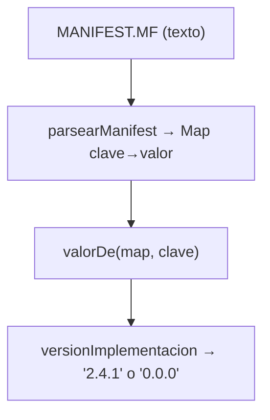
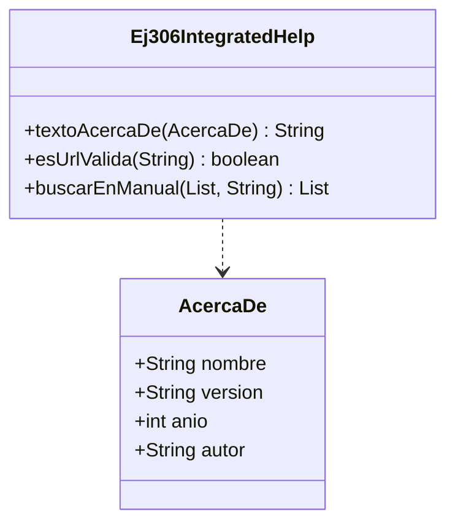
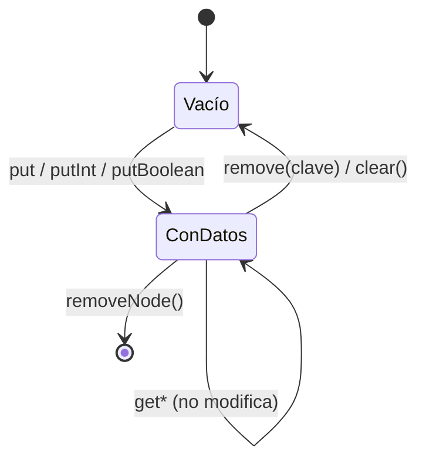
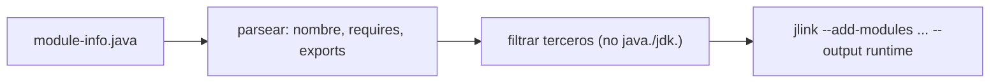
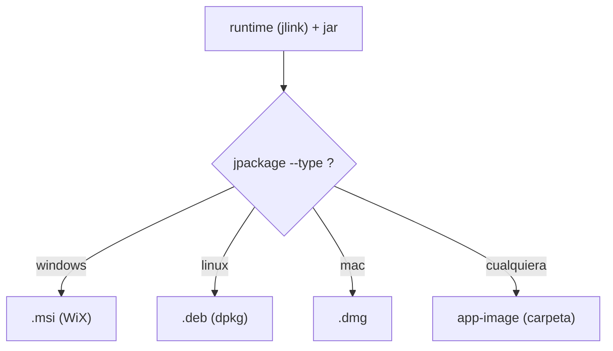
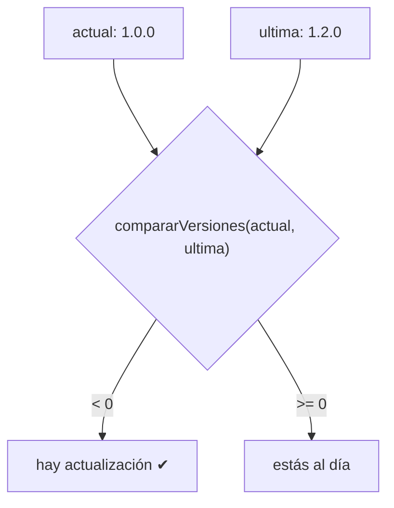

# Bloque XXXIX · Documentación, ayuda y distribución (DI·RA5/RA6)

> Tu app ya **funciona**: tiene ventana, controles, datos en tablas, estilo, informes. Pero vive
> solo en **tu** ordenador, dentro del IDE. ¿Cómo se la das a otra persona que no tiene Java, ni
> Maven, ni idea de qué es un `.jar`? Le falta lo que separa un "proyecto de clase" de un
> **producto**: estar **documentada** (que otro humano pueda mantenerla), tener **ayuda integrada**
> ("Acerca de", manual, enlaces), **recordar los ajustes** del usuario, venir empaquetada como un
> **instalador nativo** de doble clic, y saber **cuándo hay una versión nueva**. Este bloque cierra
> los RA5 (documentar) y RA6 (distribuir) de Desarrollo de Interfaces. Es el último del módulo DI:
> después de esto, tu cliente JavaFX está **listo para entregar**.

---

## Cómo usar este documento

- **Lee UNA sección → haz SU ejercicio → vuelve.** Cada sección `N` corresponde al ejercicio
  `Ej(304+N)`: la 1 a `Ej305`, la 2 a `Ej306`… la 6 a `Ej310`.
- **Los tests son la especificación real.** Cuando dudes de qué debe devolver un método, abre su
  test: ahí está el caso exacto (incluido el caso límite) que tienes que satisfacer.
- **Esta teoría va más allá de los ejercicios.** Explica el manifest entero, toda la API de
  `Preferences`, el modelo de módulos de Java y todas las opciones de `jpackage`, aunque el
  ejercicio solo use unas pocas: así podrás distribuir una app nueva tú solo. Las filas marcadas
  *(consulta)* en las tablas son "más de lo que pide el ejercicio".
- **Nota de testing:** los **core son lógica pura** (cadenas, mapas, números). Se prueban con JUnit
  normal, **sin abrir ventana ni ejecutar herramientas externas**. Dos ejercicios (`jlink` y
  `jpackage`) son **"guion"**: su core construye y valida COMANDOS de terminal como cadenas; el
  comando real para ejecutarlos a mano está aquí y en el `README.md` del bloque. Es honesto: el
  toolchain nativo (WiX, dpkg…) no encaja dentro de Maven/JUnit, igual que pasaba con Docker (b22).

---

## Antes de empezar (trampas de entorno)

1. **`jlink` y `jpackage` son HERRAMIENTAS de línea de comandos, no APIs Java.** No las "llamas"
   desde código en producción: las ejecutas en la terminal (o desde Maven). Por eso sus cores aquí
   construyen el comando como `String` y lo dejan listo para pegar; ejecutarlo de verdad lo haces tú.
2. **`jpackage` necesita herramientas del sistema operativo.** Para generar un `.msi` en Windows
   hace falta **WiX Toolset** instalado aparte; para un `.deb`, las utilidades `dpkg`. Si no están,
   `jpackage` solo puede generar un *app-image* (una carpeta ejecutable sin instalador).
3. **`Preferences` escribe FUERA de tu proyecto.** Guarda en el registro de Windows o en
   `~/.java/.userPrefs` en Linux. Por eso los tests usan un **nodo temporal** con nombre único y lo
   **borran al terminar** (`removeNode()`): si no, ensuciarías los ajustes reales de tu máquina.
4. **Un proyecto modular es "todo o nada".** En cuanto añades un `module-info.java`, *todas* tus
   dependencias deben ser módulos. Es un paso avanzado; por eso aquí lo trabajamos como **lectura y
   construcción de texto**, no migrando el proyecto entero.
5. **Versión ≠ número cualquiera.** El versionado semántico (`MAJOR.MINOR.PATCH`) tiene reglas: si
   no las respetas, la comparación "¿hay actualización?" da resultados absurdos (`1.10.0` debe ser
   MAYOR que `1.9.0`, aunque "9 > 10" como texto diría lo contrario).

---

## Índice del bloque

| Sección | Tema | Ejercicio |
|---|---|---|
| 1 | Javadoc del proyecto y metadatos del JAR (`MANIFEST.MF`) | `Ej305` |
| 2 | Ayuda integrada: "Acerca de", manual, `Hyperlink` a docs | `Ej306` |
| 3 | Persistir ajustes del usuario con `Preferences` | `Ej307` |
| 4 | Modularización (`module-info`) y runtime mínimo con `jlink` | `Ej308` |
| 5 | Instaladores nativos con `jpackage` (msi/deb/dmg) | `Ej309` |
| 6 | Versionado semántico (SemVer) y comprobación de actualizaciones | `Ej310` |

> **Modelo mental del bloque.** Distribuir una app es una **cadena de montaje**: del código
> documentado sale un **JAR con metadatos** (sección 1), que se empaqueta en un **runtime mínimo**
> (`jlink`, sección 4), que se mete en un **instalador nativo** (`jpackage`, sección 5). En paralelo,
> la app lleva su propia **ayuda** (sección 2), **recuerda los ajustes** del usuario (sección 3) y
> **se versiona** para poder actualizarse (sección 6).


---

## 1. Javadoc del proyecto y metadatos del JAR (`MANIFEST.MF`)

**Documentar** una app tiene dos caras: el **Javadoc** (los comentarios `/** ... */` que describen
cada clase y método, y que generan una web de referencia) y los **metadatos** del artefacto (quién
hizo el programa, qué versión es, cuál es su clase principal). Esos metadatos viven en un fichero de
texto dentro del `.jar`: `META-INF/MANIFEST.MF`.

### 1.1 ¿Qué es el manifest y por qué importa?

Cuando ejecutas `java -jar miapp.jar`, ¿cómo sabe Java por dónde arrancar? Lo lee del manifest, en
el atributo **`Main-Class`**. El manifest es una lista de pares **`Clave: Valor`**, uno por línea,
con un espacio obligatorio tras los dos puntos:

```
Manifest-Version: 1.0
Main-Class: com.masterclass.api.App
Implementation-Title: Masterclass App
Implementation-Version: 2.4.1
Implementation-Vendor: DAM
Class-Path: lib/jackson.jar lib/javafx.jar
```

> **Trampa del formato.** El separador es exactamente `": "` (dos puntos **y un espacio**). Si
> escribes `Main-Class:com.App` (sin espacio), muchos parsers no lo reconocen. Por eso el reto
> `lineaManifest` te obliga a poner `clave + ": " + valor`.

### 1.2 Atributos estándar

| Atributo | Para qué sirve | ¿Lo usa el ejercicio? |
|---|---|---|
| `Manifest-Version` | Versión del *formato* del manifest (siempre `1.0`) | sí |
| `Main-Class` | Clase con el `main` que arranca con `java -jar` | sí |
| `Implementation-Title` | Nombre legible de la app | sí |
| `Implementation-Version` | Versión de TU app (SemVer) | sí |
| `Implementation-Vendor` | Quién la publica (= `--vendor` de jpackage) | sí |
| `Class-Path` | Jars de los que depende, separados por espacios | sí |
| `Sealed` | *(consulta)* impide mezclar clases del paquete de otro jar | no |
| `Automatic-Module-Name` | *(consulta)* nombre de módulo si no hay `module-info` | no |
| `Created-By` | *(consulta)* versión del JDK que generó el jar | no |

En Maven, estos atributos los rellena el `maven-jar-plugin` con `<manifestEntries>`; no escribes el
fichero a mano. Pero saber **leerlo** te sirve para diagnosticar "¿por qué no arranca mi jar?".

### 1.3 Class-Path: las dependencias del jar

`Class-Path` lista los jars que tu app necesita, **relativos a la ubicación del jar** y separados
por **espacios**. Troceándolo (reto `classpath`) obtienes la lista de dependencias. Es el
antecesor "plano" del sistema de módulos de la sección 4.

### 1.4 Javadoc: documentar para que otro humano mantenga tu app

El Javadoc no es decoración: es el **manual del programador**. Las etiquetas clave:

| Etiqueta | Documenta |
|---|---|
| `@param nombre` | un parámetro del método |
| `@return` | qué devuelve (¡y el caso vacío/límite!) |
| `@throws Tipo` | cuándo lanza esa excepción |
| `@deprecated` | que no se use; qué usar en su lugar |
| `{@code ...}` | texto en fuente monoespaciada (código) |
| `{@link Clase#metodo}` | enlace a otro elemento |

Un fichero especial, **`package-info.java`**, lleva el Javadoc de un paquete entero. Una métrica de
calidad razonable es el **% de elementos públicos documentados** (reto `porcentajeDocumentado`): si
de 10 métodos públicos solo 7 tienen Javadoc, tu cobertura es del 70 %.

> **Trampa de la división entera.** `documentados * 100 / total`: multiplica por 100 **antes** de
> dividir, o en enteros `7/10` da `0` y luego `0*100 = 0`. El orden importa.

### 1.5 El nombre del artefacto y SemVer

Maven nombra el jar como `artifactId-version.jar` (p.ej. `b39_fxdeploy-1.0.0.jar`). La versión
debería seguir el **versionado semántico** `MAJOR.MINOR.PATCH` (lo profundizas en la sección 6). El
reto `esVersionValida` comprueba ese formato: tres trozos, todos numéricos.



> **Lo practicas en `Ej305JavadocAndManifest`**: los core `parsearManifest`/`valorDe`/
> `versionImplementacion` (parsear el formato y leer atributos con respaldo); los retos cubren
> título/vendor/main-class, contar atributos, construir líneas, `Class-Path`, cobertura de Javadoc,
> nombre del jar y validación de versión.

---

## 2. Ayuda integrada: "Acerca de", manual y enlaces a la documentación

Una app terminada no deja al usuario solo. Lleva un menú **Ayuda** con: un diálogo **"Acerca de"**
(nombre, versión, copyright), un **manual** de usuario, y **enlaces** que abren la documentación en
el navegador. Todo eso es **texto y URLs**: testeable sin abrir ventana.

### 2.1 El diálogo "Acerca de"

Es un `Alert` de tipo `INFORMATION` con el nombre, la versión y la línea de copyright:

```java
Alert a = new Alert(Alert.AlertType.INFORMATION);
a.setTitle("Acerca de — " + info.nombre());
a.setHeaderText(info.nombre());
a.setContentText(textoAcercaDe(info)); // "Mi App v1.0.0\n© 2026 Ana"
a.showAndWait();
```

El símbolo de copyright es **`©`** (no `(c)`). La línea legal es `© <año> <autor>`; si no hay autor,
solo `© <año>` (sin espacio sobrante: ojo a ese caso límite en `lineaCopyright`).

### 2.2 El manual de usuario

El manual es una lista de **secciones** (`Introducción`, `Primeros pasos`, `Funciones`, `Atajos`,
`Soporte`). Sobre esa lista se construyen funciones típicas de ayuda:

- **Buscar** (reto `buscarEnManual`): filtra las secciones que contienen un término, **sin
  distinguir mayúsculas** (`s.toLowerCase().contains(termino.toLowerCase())`).
- **Índice numerado** (reto `indiceNumerado`): antepone `1. `, `2. `… La numeración empieza en **1**,
  no en 0 (trampa clásica del índice de bucle).

### 2.3 Enlaces: `Hyperlink` y `HostServices`

Un `Hyperlink` es un control que parece un enlace web. Al pulsarlo, abres la URL en el navegador del
sistema con `getHostServices().showDocument(url)`:

```java
Hyperlink docs = new Hyperlink("Manual online");
docs.setOnAction(e -> {
    if (esUrlValida(url)) getHostServices().showDocument(url);
});
```

> **Trampa de seguridad.** Valida la URL antes de abrirla: solo `http://` o `https://`. Abrir un
> esquema arbitrario (`file://`, `javascript:`…) es un riesgo. Por eso `esUrlValida` solo acepta
> http/https.

La documentación suele estar **versionada**: la doc de tu versión vive en
`https://docs.app/<version>/index.html` (reto `urlDocsVersion`). Cuidado con la **barra final**: si
la base ya acaba en `/`, no la dupliques. Para enlazar a una sección concreta usas un **ancla**
(`#`), con el título convertido a *slug* (minúsculas, espacios → guiones): reto `urlConAncla`.

### 2.4 Soporte: validar un email

El enlace "Contactar" usa `mailto:`. Una validación mínima de email (reto `esEmailValido`): exactamente
una `@` y al menos un `.` después de ella. No es una validación perfecta (eso requiere reglas
complejas), pero atrapa los errores obvios.

### 2.5 Atajos de teclado

Los menús de ayuda llevan **aceleradores**: `F1` abre la ayuda, `Ctrl+Q` sale. La pista visible
("Pulsa [F1] para ayuda") la genera el reto `pistaAtajo`.



> **Lo practicas en `Ej306IntegratedHelp`**: los core `textoAcercaDe`/`esUrlValida`/`lineaCopyright`;
> los retos cubren título de ventana, URL de docs por versión, email, secciones del manual, búsqueda,
> atajos, índice numerado, anclas, copyright desactualizado y el "Acerca de" completo.

---

## 3. Persistir los ajustes del usuario con `Preferences`

Cuando el usuario cambia el tema a oscuro o redimensiona la ventana, eso debe **sobrevivir al
cierre**. ¿Dónde se guarda? No en un fichero que gestiones tú: Java ofrece
**`java.util.prefs.Preferences`**, un almacén clave→valor por usuario que el SO persiste solo.

### 3.1 El árbol de nodos

Las preferencias forman un **árbol** de nodos (como carpetas). Pides un nodo con una ruta:

```java
Preferences nodo = Preferences.userRoot().node("masterclass/b39/ajustes");
```

| Método | Qué hace |
|---|---|
| `Preferences.userRoot()` | raíz de las prefs del **usuario** actual |
| `Preferences.systemRoot()` | *(consulta)* raíz de las prefs de **toda la máquina** |
| `.node("a/b")` | baja (o crea) al nodo en esa ruta |
| `.absolutePath()` | la ruta del nodo desde la raíz (empieza por `/`) |
| `.removeNode()` | borra el nodo entero (lo usan los tests al limpiar) |

Bajo el capó: en Windows va al **registro** (`HKEY_CURRENT_USER\Software\JavaSoft\Prefs\...`), en
Linux a `~/.java/.userPrefs`, en macOS a un `.plist`. `Preferences` te **abstrae** de cada SO.

### 3.2 Leer y escribir valores tipados

No solo cadenas: hay métodos por tipo. **Todos los `get*` reciben un valor por defecto** que se
devuelve si la clave no existe (o no se puede parsear) — por eso leer nunca lanza por clave ausente.

| Escribir | Leer (con valor por defecto) |
|---|---|
| `put(clave, String)` | `get(clave, "porDefecto")` |
| `putInt(clave, int)` | `getInt(clave, 0)` |
| `putBoolean(clave, boolean)` | `getBoolean(clave, false)` |
| `putDouble(clave, double)` | `getDouble(clave, 1.0)` |
| `putLong` / `putByteArray` *(consulta)* | `getLong` / `getByteArray` |

```java
nodo.putBoolean("oscuro", true);
boolean oscuro = nodo.getBoolean("oscuro", false); // true; si no existiera, false
```

### 3.3 Límites: longitud de claves y valores

`Preferences` no es ilimitado:

| Constante | Valor | Significado |
|---|---|---|
| `Preferences.MAX_KEY_LENGTH` | 80 | longitud máxima de una clave |
| `Preferences.MAX_VALUE_LENGTH` | 8192 | longitud máxima de un valor de texto |
| `Preferences.MAX_NAME_LENGTH` | 80 | *(consulta)* longitud máxima del nombre de un nodo |

> **Trampa.** Pasar una clave de más de 80 caracteres lanza `IllegalArgumentException`. El reto
> `claveValida` comprueba ese límite **usando la constante** `Preferences.MAX_KEY_LENGTH`, no el
> número 80 escrito a mano (si el valor cambiara, tu código seguiría correcto).

### 3.4 Listar, comprobar y limpiar

- `keys()` devuelve un `String[]` con las claves del nodo, **en orden arbitrario** → ordénalas para
  un resultado estable (reto `listarClaves`).
- No hay un `contains`: para saber si existe una clave, recorre `keys()` (reto `existeClave`).
- `clear()` borra **todas** las claves de ESE nodo (resetear a fábrica; reto `limpiarNodo`).

> **Trampa de la excepción.** `keys()` y `clear()` declaran `throws BackingStoreException` (puede
> fallar el almacén del SO). Tienes que **capturarla** con `try/catch` y decidir un valor de
> respaldo (`List.of()` / `false`).



> **Lo practicas en `Ej307UserPreferences`**: los core `guardarPreferencia`/`leerPreferencia`/
> `borrarPreferencia` (texto); los retos añaden int/boolean/double, validación de clave, existencia,
> listado ordenado, limpieza y ruta del nodo. Los tests usan un **nodo temporal** que borran al
> final.

---

## 4. Modularización (`module-info.java`) y runtime mínimo con `jlink`

Para que el usuario no tenga que instalar Java, le entregas un **runtime a medida**: un mini-JDK que
solo lleva los módulos que tu app usa (pesa ~40 MB en vez de los ~300 MB del JDK completo). La
herramienta es **`jlink`**, y exige que tu proyecto sea **modular**.

### 4.1 ¿Qué es un módulo?

Desde Java 9, el código se organiza en **módulos**: unidades que declaran explícitamente de qué
dependen y qué exponen. Esa declaración va en un fichero `module-info.java` en la raíz del código:

```java
module com.masterclass.app {
    requires javafx.controls;          // de qué dependo
    requires transitive java.sql;      // ...y lo "presto" a quien dependa de mí
    exports com.masterclass.app.api;   // qué paquetes hago públicos
    opens com.masterclass.app.model;   // qué abro a reflexión (Jackson, FXML...)
    uses com.masterclass.app.spi.Plugin; // qué servicios consumo
}
```

| Palabra clave | Significado |
|---|---|
| `requires X` | tu módulo necesita el módulo `X` |
| `requires transitive X` | además, quien use tu módulo "hereda" `X` sin declararlo |
| `requires static X` | *(consulta)* `X` solo en compilación, opcional en ejecución |
| `exports paquete` | hace público ese paquete (su API) |
| `exports paquete to M` | *(consulta)* lo expone solo al módulo `M` |
| `opens paquete` | permite **reflexión** sobre él (FXML, Jackson lo necesitan) |
| `uses` / `provides ... with` | *(consulta)* consumir/ofrecer servicios (`ServiceLoader`) |

> **Trampa del nombre.** Los nombres de módulo siguen las reglas de un paquete Java: segmentos de
> identificadores separados por puntos, **sin guiones**. `com.app` es válido; `com.app-ui` **no**.
> El reto `nombreModuloValido` comprueba justo eso.

### 4.2 Módulos del JDK vs. de terceros

Los módulos de la plataforma empiezan por `java.` (p.ej. `java.base`, `java.sql`) o `jdk.` (p.ej.
`jdk.crypto.ec`). El resto son **de terceros** (tus dependencias: `javafx.controls`…). Distinguirlos
(retos `esModuloJdk`, `modulosDeTerceros`) importa porque cuantos más módulos metas en el runtime,
más pesa.

### 4.3 La API del módulo (`exports`)

`exports` define la **superficie pública** de tu módulo: solo esos paquetes son visibles desde
fuera. Es encapsulación a nivel de módulo. Contarlos (`numeroDeExports`) mide cuánta API expones.

### 4.4 `jlink`: el runtime mínimo

`jlink` toma tus módulos (y sus dependencias) y produce una carpeta con un Java reducido:

```bash
jlink --add-modules com.masterclass.app,javafx.controls --output runtime
```

| Opción | Para qué |
|---|---|
| `--add-modules m1,m2` | módulos raíz a incluir (separados por **comas**, sin espacios) |
| `--output dir` | carpeta donde dejar el runtime |
| `--strip-debug` | *(consulta)* quita info de depuración (más pequeño) |
| `--compress=2` | *(consulta)* comprime las clases |
| `--no-header-files` | *(consulta)* omite cabeceras C |

El core `comandoJlink` construye ese comando como cadena. (`jlink` clásico **no** acepta módulos
automáticos —jars sin `module-info`—; de ahí la importancia de distinguir los de terceros.)

### 4.5 Módulos automáticos

Un jar sin `module-info` recibe un **nombre de módulo automático** derivado de su nombre de fichero:
se quitan la versión y la extensión, y los `-`/`_` pasan a `.` (reto `moduloAutomatico`:
`b39_fxdeploy` → `b39.fxdeploy`).



> **Lo practicas en `Ej308ModularJlink`**: los core `nombreModulo`/`requires`/`exports` (parsear el
> `module-info`); los retos cuentan requires/exports, detectan transitive, validan nombres,
> construyen `--add-modules` y el comando `jlink`, derivan módulos automáticos y separan JDK de
> terceros. Ejercicio **"guion"**: no ejecuta `jlink`, construye su comando.

---

## 5. Instaladores nativos con `jpackage` (msi/deb/dmg)

`jlink` da el runtime; **`jpackage`** da el último paso: lo mete en un **instalador nativo** del SO,
el doble clic que un usuario normal espera.

### 5.1 Un formato por sistema operativo

`jpackage` solo genera el instalador **nativo del SO en el que se ejecuta** (no puedes crear un
`.msi` desde Linux). Por eso un *pipeline* de release real corre en Windows, Linux y macOS por
separado.

| SO | Tipos de instalador | Icono | ¿Herramienta externa? |
|---|---|---|---|
| Windows | `msi`, `exe` | `.ico` | **sí** (WiX Toolset) |
| Linux | `deb`, `rpm` | `.png` | sí (`dpkg` / `rpmbuild`) |
| macOS | `dmg`, `pkg` | `.icns` | herramientas de Xcode |
| *(cualquiera)* | `app-image` | — | no (carpeta ejecutable, sin instalador) |

El core `tipoInstaladorPara` elige el tipo por defecto del SO; `app-image` es el respaldo universal.

> **Trampa.** Un `app-image` **no es un fichero con extensión**: es una **carpeta**. Por eso
> `extensionInstalador("app-image")` devuelve `""` (cadena vacía), no `".app-image"`.

### 5.2 Anatomía del comando

```bash
jpackage --name MiApp --app-version 2.0.0 --type msi \
         --input target --main-jar app.jar \
         --vendor "ACME Corp" --icon app.ico
```

| Opción | Para qué |
|---|---|
| `--name` | nombre de la app (acaba siendo nombre de carpeta/fichero) |
| `--app-version` | versión (debe ser SemVer válida) |
| `--type` | msi/deb/dmg/app-image |
| `--input` | carpeta con el jar y sus dependencias |
| `--main-jar` | el jar principal dentro de `--input` |
| `--vendor` | fabricante (con espacios → **entre comillas**) |
| `--icon` | icono nativo del SO |
| `--win-menu` / `--win-shortcut` | *(consulta)* acceso en menú/escritorio (Windows) |
| `--mac-package-identifier` | *(consulta)* identificador (macOS) |

> **Trampa del shell.** Un valor con espacios (`ACME Corp`) **debe ir entre comillas** en la línea
> de comandos, o el shell lo parte en dos argumentos. El reto `argVendor` lo entrecomilla solo si
> hace falta.

### 5.3 Iconos y validación

Cada SO usa un formato de icono distinto (reto `extensionIcono`). El `--name` acaba siendo un nombre
de fichero, así que no puede llevar caracteres prohibidos (`/ \ : * ? " < > |`): reto
`nombreAppValido`. Y la versión debe ser SemVer válida — el reto `argAppVersion` **reutiliza**
`Ej305.esVersionValida` (no dupliques la regla: principio DRY).

### 5.4 El nombre del paquete final

`jpackage` deja un fichero `nombre-version.extension` (p.ej. `MiApp-2.0.0.msi`): reto
`nombrePaquete`. El comando completo y listo para pegar lo arma `comandoCompleto`, encadenando
nombre, versión, tipo, input y main-jar.

### 5.5 Por qué 308 y 309 son "guion"

`jpackage` **delega** en herramientas del SO (WiX para `.msi`, `dpkg` para `.deb`…). Esas no se
pueden instalar ni ejecutar dentro de Maven/JUnit, igual que no se podía levantar Docker en b22. Por
eso el core **construye y valida el comando** (texto, determinista) y la ejecución real la haces tú
siguiendo el `README.md` del bloque.



> **Lo practicas en `Ej309JpackageInstaller`**: los core `tipoInstaladorPara`/`extensionInstalador`/
> `construirComandoJpackage`; los retos cubren icono por SO, validación de nombre, `--app-version`
> (reutilizando Ej305), `--vendor` con comillas, nombre del paquete, herramienta externa, `--input`,
> tipos por SO, validez tipo↔SO y el comando completo.

---

## 6. Versionado semántico (SemVer) y comprobación de actualizaciones

Una vez distribuida, la app debe saber **cuándo hay una versión nueva**. Eso es comparar su versión
con la última publicada — y para que la comparación sea fiable, las versiones siguen **SemVer**.

### 6.1 Las tres cifras: `MAJOR.MINOR.PATCH`

```
   2  .  4  .  1
 MAJOR  MINOR  PATCH
```

| Cifra | Subes cuando… | Ejemplo |
|---|---|---|
| **PATCH** | corriges un bug (compatible) | `1.2.3` → `1.2.4` |
| **MINOR** | añades algo nuevo compatible (y reinicias patch) | `1.2.3` → `1.3.0` |
| **MAJOR** | rompes la compatibilidad (y reinicias minor y patch) | `1.2.3` → `2.0.0` |

Los retos `incrementarPatch/Minor/Major` codifican estas reglas — ojo a los **reinicios**: subir
MINOR pone PATCH a 0; subir MAJOR pone los dos a 0.

> **Trampa de comparar como texto.** `"1.10.0"` vs `"1.9.0"`: como **texto**, `'9' > '1'`, así que
> `"1.9.0"` parecería mayor — ¡falso! Hay que comparar **número a número** (10 > 9). Por eso
> `compararVersiones` parsea a `int[]` y compara MAJOR, luego MINOR, luego PATCH.

### 6.2 Parsear y comparar

`parsearVersion("2.4.1")` → `{2, 4, 1}`. Lo que falte se rellena con 0 (`"1.2"` → `{1,2,0}`). Sobre
eso, `compararVersiones(a, b)` devuelve `-1` / `0` / `1`, y `hayActualizacion(actual, ultima)` es
simplemente `compararVersiones(actual, ultima) < 0`.



### 6.3 Normalizar: el prefijo `v`

Las etiquetas de git suelen ser `v1.2.3`. Antes de comparar conviene **normalizar** quitando la `v`
(reto `quitarV`); para mostrar al usuario se la vuelves a poner (`formatoConV`). Cuidado con no
duplicarla si ya está.

### 6.4 La última versión publicada

El servidor de actualizaciones devuelve una **lista** de versiones; eliges la mayor recorriéndola
con `compararVersiones` (reto `ultimaVersion`). No vale `Collections.max` con orden de texto, por la
trampa de 6.1.

### 6.5 Pre-releases

Las versiones de prueba llevan un sufijo tras un guion: `1.2.0-beta`, `2.0.0-rc1` (reto
`esPrerelease`). SemVer dice que una pre-release es **menor** que la versión final del mismo número.

### 6.6 Clasificar el salto

`tipoDeCambio(desde, hasta)` dice si el salto fue `major`/`minor`/`patch`/`ninguno`. Es lo que usan
los gestores de dependencias (npm con `^`/`~`, los *ranges* de Maven) para decidir qué
actualizaciones aplicar solos y cuáles avisarte que revises.

> **Lo practicas en `Ej310VersioningAndUpdate`**: los core `compararVersiones`/`hayActualizacion`/
> `esSemverValida`; los retos parsean, extraen el MAJOR, incrementan cada cifra, normalizan la `v`,
> eligen la última de una lista, detectan pre-releases y clasifican el tipo de cambio.

---

## Errores comunes del bloque

| # | Error | Antídoto |
|---|---|---|
| 1 | Parsear el manifest con `":"` en vez de `": "` y quedarte con espacios | Parte por el **primer** `": "` y haz `trim()` a clave y valor. |
| 2 | `porcentajeDocumentado`: dividir antes de multiplicar → siempre 0 | En enteros, `documentados * 100 / total`: **multiplica primero**. |
| 3 | `versionImplementacion` no contempla el atributo ausente | Si falta o está en blanco, devuelve el respaldo `"0.0.0"`. |
| 4 | `urlDocsVersion` duplica la `/` cuando la base ya acaba en `/` | Quita la barra final de la base antes de concatenar. |
| 5 | Índice numerado que empieza en `0. ` | La numeración visible empieza en **1**: usa `i+1`. |
| 6 | Olvidar `try/catch BackingStoreException` en `keys()`/`clear()` | Captúrala y devuelve `List.of()` / `false` de respaldo. |
| 7 | No borrar el nodo temporal de prefs en los tests | `@AfterEach` con `removeNode()`; usa un nombre único por test. |
| 8 | `claveValida` con el número 80 a pelo | Usa la constante `Preferences.MAX_KEY_LENGTH`. |
| 9 | Nombre de módulo con guiones (`com.app-ui`) | Los módulos no admiten `-`: solo identificadores con puntos. |
| 10 | `--add-modules` con espacios entre comas | Únelos con `,` sin espacios: `m1,m2,m3`. |
| 11 | `extensionInstalador("app-image")` devolviendo `".app-image"` | `app-image` es una **carpeta**: extensión `""`. |
| 12 | `--vendor ACME Corp` sin comillas → el shell parte el argumento | Entrecomilla los valores con espacios. |
| 13 | Comparar versiones como texto (`"1.10.0" < "1.9.0"`) | Parsea a `int[]` y compara cifra a cifra. |
| 14 | Subir MINOR/MAJOR sin reiniciar las cifras menores | MINOR → patch a 0; MAJOR → minor y patch a 0. |
| 15 | Abrir cualquier URL del `Hyperlink` sin validar el esquema | Acepta solo `http://`/`https://` antes de `showDocument`. |

---

## Chuleta final del bloque

```
# --- 1. Manifest / Javadoc ---
MANIFEST.MF          = pares "Clave: Valor" (¡espacio tras los dos puntos!)
Main-Class           = clase con main que arranca con `java -jar`
Implementation-Version = versión de tu app (SemVer)
Class-Path           = jars separados por ESPACIOS
porcentajeDocumentado = doc*100/total (multiplica ANTES de dividir)
@param/@return/@throws + package-info.java = documentación del programador

# --- 2. Ayuda integrada ---
"Acerca de"          = Alert INFORMATION con nombre + versión + © año autor
Hyperlink + getHostServices().showDocument(url)  (valida http/https)
buscarEnManual       = filtrar contains(termino) sin mayúsculas
índice numerado      = empieza en 1 (i+1)
slug                 = lower + espacios->guiones (para #ancla)

# --- 3. Preferences ---
node = Preferences.userRoot().node("ruta")  -> registro/.userPrefs/.plist
put/get + putInt/getInt + putBoolean/getBoolean + putDouble/getDouble
get*(clave, porDefecto)  -> nunca lanza por clave ausente
keys()/clear() lanzan BackingStoreException (try/catch)
MAX_KEY_LENGTH = 80 ; removeNode() borra el nodo entero

# --- 4. Módulos + jlink ---
module-info.java: requires / requires transitive / exports / opens / uses
módulo JDK = empieza por java. o jdk.   ; resto = terceros
nombre módulo: identificadores con puntos, SIN guiones
jlink --add-modules m1,m2 --output runtime   (comas sin espacios)
módulo automático: '-'/'_' -> '.'

# --- 5. jpackage ---
tipo por SO: windows=msi, linux=deb, mac=dmg, otro=app-image
app-image = carpeta (extensión "")
jpackage --name X --app-version V --type T --input dir --main-jar j.jar --vendor "Con Espacios"
msi/exe requieren WiX (herramienta externa) -> por eso es "guion"

# --- 6. SemVer ---
MAJOR.MINOR.PATCH : patch=bug, minor=nuevo compatible (reset patch), major=rompe (reset minor+patch)
compararVersiones  = parsear a int[] y comparar cifra a cifra (NO como texto)
hayActualizacion   = comparar(actual, ultima) < 0
formatoConV/quitarV = normalizar el prefijo "v" (tags de git)
prerelease         = contiene "-" (1.2.0-beta)
```

---

## Autoevaluación (responde sin mirar; si fallas 2+, relee la sección)

1. ¿Cuál es el separador EXACTO entre clave y valor en un `MANIFEST.MF` y por qué importa? *(1.1)*
2. ¿Qué atributo del manifest hace que `java -jar app.jar` sepa por dónde arrancar? *(1.2)*
3. Calculando la cobertura de Javadoc en enteros, ¿por qué hay que multiplicar por 100 antes de
   dividir? *(1.4)*
4. ¿Qué dos condiciones debe cumplir una URL para que la abras desde un `Hyperlink`? *(2.3)*
5. Al construir la URL de la doc versionada, ¿qué problema causa una `/` al final de la base? *(2.3)*
6. ¿Dónde guarda `Preferences` los datos en Windows y en Linux? *(3.1)*
7. ¿Por qué los métodos `get*` de `Preferences` nunca lanzan por una clave inexistente? *(3.2)*
8. ¿Qué excepción declaran `keys()` y `clear()`, y cómo la gestionas? *(3.4)*
9. ¿Por qué `com.app-ui` no es un nombre de módulo válido? *(4.1)*
10. ¿Cómo distingues un módulo del JDK de uno de terceros? *(4.2)*
11. ¿Qué hace `jlink` y qué pinta tiene su opción `--add-modules`? *(4.4)*
12. ¿Por qué `jpackage` no puede crear un `.msi` desde Linux? *(5.1)*
13. ¿Qué extensión tiene un `app-image` y por qué? *(5.1)*
14. ¿Por qué un `--vendor` con espacios debe ir entre comillas? *(5.2)*
15. ¿Por qué `"1.10.0"` comparado como texto parece menor que `"1.9.0"`, y cómo se arregla? *(6.1)*
16. Al subir la versión MINOR, ¿qué pasa con la cifra PATCH? *(6.1)*
17. ¿Cómo decides cuál es la "última versión" de una lista de cadenas SemVer? *(6.4)*
