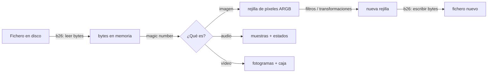
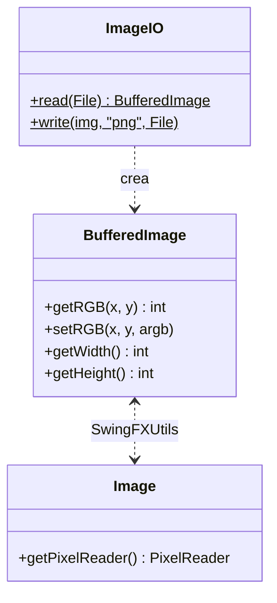
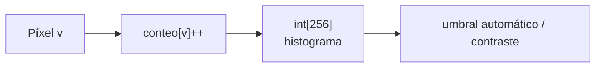
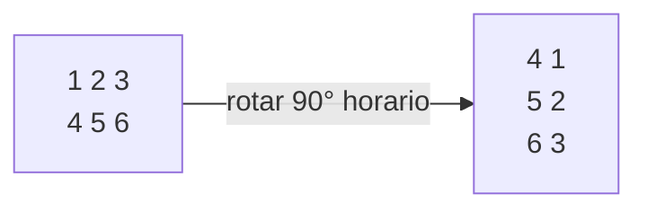
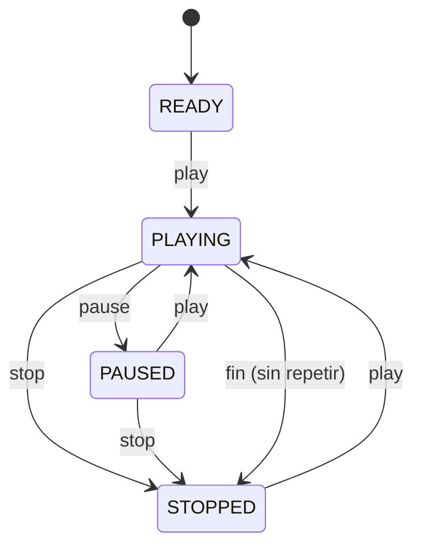
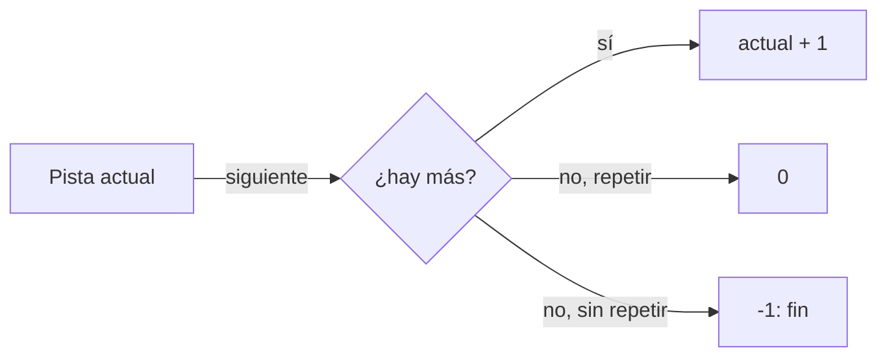
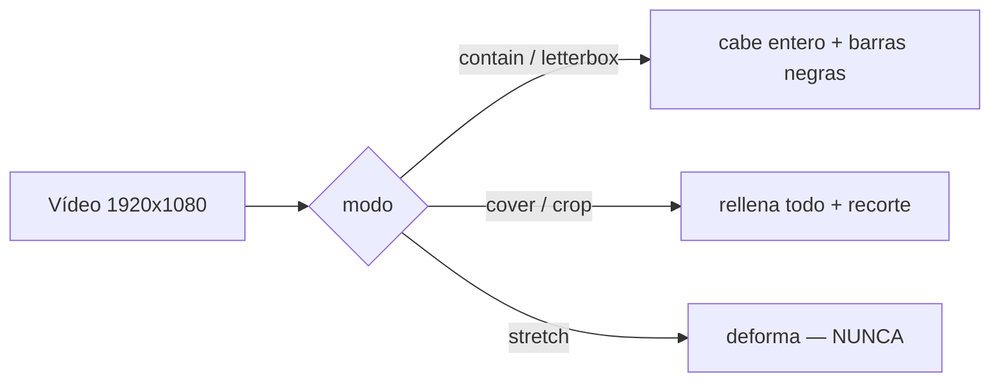
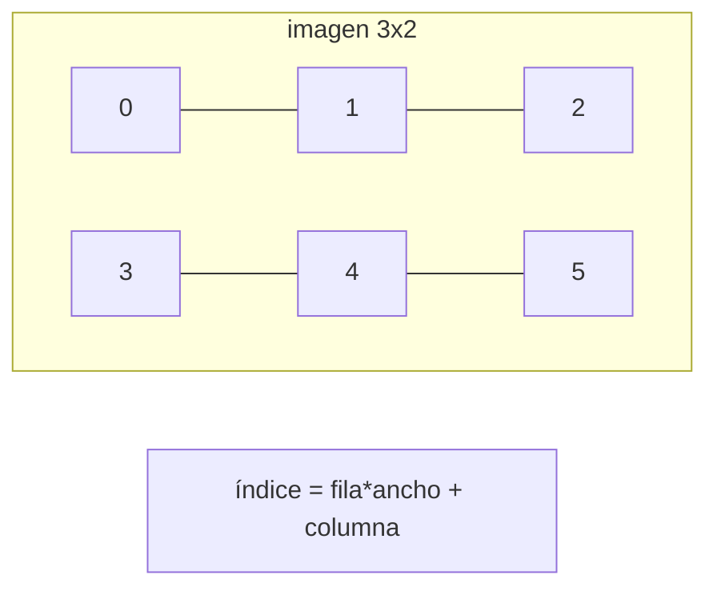

# Bloque 40 · Multimedia: imagen, audio y vídeo (PMDM · RA1/RA2)

> Vienes de saber pintar interfaces (b32–b37), generar informes (b38) y empaquetar la aplicación
> (b39). Y desde mucho antes (b26_io) sabes **leer y escribir bytes y ficheros**. Lo que te falta
> es lo que convierte una app "seria" en una app que la gente disfruta: **enseñar fotos, reproducir
> sonido y vídeo**. La buena noticia es que cargar el fichero ya lo sabes hacer; aquí aprendes lo
> nuevo: **qué hacer con el contenido** una vez está en memoria. Una imagen no es un misterio: es
> una rejilla de números. Un sonido es una lista de muestras. Un vídeo, una secuencia de imágenes.
> Cuando lo ves así, "aplicar un filtro" o "ajustar el volumen" deja de ser magia y pasa a ser
> aritmética que puedes escribir tú.

---

## Cómo usar este documento

- **Lee UNA sección → haz SU ejercicio → vuelve.** Cada sección `N` corresponde al ejercicio
  `Ej31N`. No intentes leerlo entero de un tirón: el bloque está pensado para alternar lectura y
  práctica.
- **Los tests son la especificación real.** Cuando una GUÍA dice "el test comprueba X", esa frase
  vale más que cualquier explicación: dice exactamente qué debe devolver tu método y con qué caso
  límite te van a pillar.
- **Esta teoría va MÁS ALLÁ de los ejercicios.** Los ejercicios tocan una parte de cada tema; aquí
  se explica el tema entero (todos los formatos, todos los estados, todas las opciones) para que
  puedas resolver un caso nuevo que el ejercicio no plantea. Las tablas marcan con "(consulta)" lo
  que es ampliación.
- **Nota de testing:** los `core` son **lógica pura headless** (aritmética de píxeles, máquinas de
  estado, geometría): se prueban con JUnit normal, sin abrir ventana ni cargar códecs. Sólo el
  **Playground visual** (`PlaygroundMultimedia`, `extends Application`) abre una ventana de verdad,
  y se ejecuta con `mvn -pl b40_media javafx:run`.

---

## Antes de empezar (trampas de entorno que bloquean al novato)

1. **Leer el fichero NO se re-enseña aquí.** `InputStream`/`OutputStream`, `Files.readAllBytes`,
   NIO.2… todo eso está en **b26_io**. En b40 se da por sabido: usamos `ImageIO.read(...)` o
   `new Media(uri)` solo como *puerta de entrada*, y nos centramos en el contenido.
2. **JavaFX no trae el módulo de medios por defecto.** Reproducir audio/vídeo necesita la
   dependencia `org.openjfx:javafx-media` (ya está en el `pom.xml` del bloque) **y códecs nativos**
   del sistema operativo. Por eso la reproducción REAL solo ocurre en el Playground; los `core` no
   importan ni una sola clase de `Media`.
3. **Dos mundos de imagen que no son lo mismo:**
   - `java.awt.image.BufferedImage` + `javax.imageio.ImageIO`: el mundo clásico de Java (AWT). Es
     el que usa `ImageIO.read`/`write` para PNG/JPG y el que da acceso píxel a píxel con
     `getRGB`/`setRGB`.
   - `javafx.scene.image.Image` + `ImageView`: el mundo JavaFX, para MOSTRAR imágenes en la escena.
   - El puente entre ambos es `SwingFXUtils` (dependencia `javafx-swing`): convierte una `Image` de
     JavaFX en `BufferedImage` para poder guardarla con `ImageIO`.
4. **Coordenadas de imagen.** El origen `(0,0)` está **arriba-izquierda**; X crece a la derecha e
   **Y crece hacia ABAJO**. En las matrices usamos `m[fila][columna]`, donde la fila es la Y y la
   columna la X. No lo confundas con los ejes de matemáticas.
5. **Recortar (clamp) SIEMPRE.** Un canal de color va de 0 a 255. Si sumas brillo y te pasas, hay
   que recortar; si no, "200 + 100 = 300" produce colores corruptos. Es el error nº 1 del bloque.

---

## Índice del bloque

| Sección | Tema | Ejercicio |
|---|---|---|
| 1 | Cargar/guardar imágenes: formatos y el píxel ARGB | `Ej311ImageLoadSave` |
| 2 | Filtros por píxel: grises, brillo, umbral, convolución | `Ej312ImageFilters` |
| 3 | Transformaciones: recortar, rotar, escalar, miniaturas | `Ej313ImageTransform` |
| 4 | Audio: la máquina de estados del `MediaPlayer` | `Ej314AudioPlayback` |
| 5 | Control de audio: seek, playlist, muestras | `Ej315AudioControl` |
| 6 | Vídeo con `MediaView`: geometría de ajuste | `Ej316VideoMediaView` |
| 7 | `snapshot`: capturar un nodo como imagen | `Ej317NodeSnapshot` |
| 8 | Formatos, metadatos, conversión y compresión | `Ej318FormatMetadata` |

> **Modelo mental del bloque:** *Imagen = rejilla de números. Audio = lista de muestras + máquina
> de estados. Vídeo = secuencia de imágenes que hay que encajar en una caja. Y todo fichero
> empieza por un "número mágico" que dice qué es.* Si interiorizas esas cuatro frases, el bloque
> entero se vuelve aritmética.



---

## 1. Cargar y guardar imágenes: formatos y el píxel ARGB

Una imagen de mapa de bits (*bitmap* o *raster*) es una **rejilla de píxeles**. Cada píxel es un
color, y un color se guarda como un entero de 32 bits con **cuatro canales** de 8 bits cada uno:
**A**lfa (opacidad), **R**ojo, **V**erde (Green) y **A**zul (Blue). El formato se llama **ARGB** y
se escribe en hexadecimal como `0xAARRGGBB`.

```
  0xFF 10 20 30
    │  │  │  └── Azul  = 0x30 = 48
    │  │  └───── Verde = 0x20 = 32
    │  └──────── Rojo  = 0x10 = 16
    └─────────── Alfa  = 0xFF = 255  (totalmente opaco)
```

**Empaquetar** (juntar los cuatro canales en un `int`) se hace con desplazamientos de bits y OR:

```java
int argb = (a << 24) | (r << 16) | (g << 8) | b;
```

**Desempaquetar** (sacar un canal) es desplazar y enmascarar con `& 0xFF`:

```java
int a = (argb >>> 24) & 0xFF;   // OJO: >>> sin signo, el alfa está en el bit más alto
int r = (argb >> 16) & 0xFF;
int g = (argb >> 8)  & 0xFF;
int b =  argb        & 0xFF;
```

> **Trampa del desplazamiento con signo.** Para el alfa usa `>>>` (relleno con ceros), no `>>`
> (relleno con el bit de signo). Un píxel opaco `0xFF......` tiene el bit 31 a 1, que Java
> interpreta como número negativo; con `>>` "arrastrarías" unos y obtendrías basura.

### Reconocer el formato por su "número mágico"

La extensión del nombre (`.png`, `.jpg`) **miente** (cualquiera la renombra). Lo fiable son los
primeros bytes del fichero, su *magic number*:

| Formato | Primeros bytes | ¿Transparencia? | ¿Compresión? |
|---|---|---|---|
| PNG | `89 50 4E 47` (`‰PNG`) | Sí (alfa) | Sin pérdida |
| JPEG | `FF D8 FF` | No | Con pérdida |
| GIF | `47 49 46` (`GIF`) | Sí (1 color) | Sin pérdida, 256 colores |
| BMP | `42 4D` (`BM`) | No | Normalmente ninguna |
| WebP *(consulta)* | `RIFF`…`WEBP` | Sí | Ambas |
| TIFF *(consulta)* | `49 49` / `4D 4D` | Sí | Varias |



**Tabla de referencia — cómo cargar/guardar de verdad (lo hace el Playground, no el core):**

| Quiero… | Código |
|---|---|
| Cargar PNG/JPG a `BufferedImage` | `ImageIO.read(new File("foto.png"))` |
| Guardar `BufferedImage` a PNG | `ImageIO.write(img, "png", new File("out.png"))` |
| Mostrar imagen en JavaFX | `new ImageView(new Image(url))` |
| `Image` (FX) → `BufferedImage` | `SwingFXUtils.fromFXImage(image, null)` |
| `BufferedImage` → `Image` (FX) | `SwingFXUtils.toFXImage(bimg, null)` |

> **Lo practicas en `Ej311ImageLoadSave`**: el core `detectarFormato` (magic number) y
> `empaquetarARGB`; los retos cubren los cuatro canales, totales de píxeles, extensión/MIME,
> transparencia, tamaño en RAM y forzar opacidad.

---

## 2. Filtros por píxel: escala de grises, brillo, umbral y convolución

Un filtro recorre la rejilla y calcula un valor nuevo para cada píxel. Distinguimos dos
representaciones:

- **Color:** `int[][]` de píxeles ARGB.
- **Escala de grises:** `int[][]` con valores `0..255` (0 = negro, 255 = blanco). Más cómodo para
  muchos filtros porque hay un único número por píxel.

### Escala de grises: luminancia, no promedio

El ojo humano percibe el verde mucho más que el azul. Por eso un gris "fiel" no es `(R+G+B)/3`,
sino la **luminancia ponderada**:

```java
int gris = (int) Math.round(0.299*r + 0.587*g + 0.114*b);
```

| Método | Fórmula | Cuándo |
|---|---|---|
| Luminancia (recomendado) | `0.299R + 0.587G + 0.114B` | Fotos, miniaturas fieles |
| Promedio simple *(consulta)* | `(R+G+B)/3` | Rápido, menos fiel |
| Desaturación *(consulta)* | `(max+min)/2` | Efecto artístico |

### Brillo, umbral, contraste y gamma

```java
nuevo = clamp(v + delta);                       // brillo: suma constante
binario = (v >= umbral) ? 255 : 0;              // umbral: binarización
contraste = clamp(round((v - 128)*factor + 128)); // estira respecto al gris medio
gamma = clamp(round(255 * Math.pow(v/255.0, g))); // corrección no lineal de pantalla
```

`clamp` (recortar a `0..255`) es la operación que evita colores imposibles:

```java
int clamp(int v) { return Math.max(0, Math.min(255, v)); }
```

### El histograma

El **histograma** es un `int[256]` que cuenta cuántos píxeles tiene cada valor de gris. Es la base
del ajuste automático de contraste, de la ecualización y del umbral de Otsu.



### Convolución: la operación madre

La **convolución** desliza una pequeña matriz (el *kernel*) sobre la imagen: para cada píxel,
multiplica su vecindario por el kernel y suma. Cambiando el kernel obtienes desenfoque, nitidez o
detección de bordes. En los bordes, cuando el vecino se sale, se **replica** el píxel más cercano
(clamp de coordenadas) para no encoger la imagen.

| Kernel 3×3 | Efecto |
|---|---|
| `0 0 0 / 0 1 0 / 0 0 0` | Identidad (no cambia nada) |
| `1 1 1 / 1 1 1 / 1 1 1` ×(1/9) | Desenfoque (media) |
| `0 -1 0 / -1 5 -1 / 0 -1 0` | Nitidez (*sharpen*) |
| `-1 -1 -1 / -1 8 -1 / -1 -1 -1` | Detección de bordes |
| Sobel X/Y *(consulta)* | Bordes con dirección |

> **Trampa de la convolución.** El centro del kernel (`kernel[1][1]`) multiplica al píxel actual.
> Si olvidas replicar el borde, o lo recorres mal, obtendrás una imagen un poco más pequeña o con
> marco negro.

> **Lo practicas en `Ej312ImageFilters`**: cores `aGrises` (luminancia) y `ajustarBrillo` (con
> clamp); retos: negativo, umbral, clamp, histograma, media, contraste, sepia, gris-promedio,
> gamma y convolución 3×3. La convolución conecta con el **Canvas de b37** y, culturalmente, con
> las redes neuronales convolucionales (CNN) de visión por computador.

---

## 3. Transformaciones geométricas: recortar, rotar, escalar, miniaturas

Mientras los filtros cambian el **color** de cada píxel, las transformaciones cambian su
**posición**. Todo es manipulación de índices sobre `int[][]` en grises (`m[fila][columna]`).

### Rotaciones de 90°: la fórmula de los índices

Rotar 90° en sentido horario convierte una matriz de `filas × columnas` en `columnas × filas`:

```java
salida[i][j] = m[filas - 1 - j][i];   // horario
salida[i][j] = m[j][columnas - 1 - i]; // antihorario
```



| Transformación | Regla de índices | Tamaño resultante |
|---|---|---|
| Voltear horizontal | `salida[f][c] = m[f][cols-1-c]` | igual |
| Voltear vertical | `salida[f][c] = m[filas-1-f][c]` | igual |
| Transponer | `salida[c][f] = m[f][c]` | cols × filas |
| Rotar 180° | `salida[f][c] = m[filas-1-f][cols-1-c]` | igual |
| Rotar 90° H / AH | (ver arriba) | cols × filas |

### Escalado por vecino más cercano

El reescalado más simple: para cada píxel de destino, toma el píxel de origen "más cercano" con una
división entera.

```java
int fOrig = f * filas / nuevoAlto;
int cOrig = c * cols  / nuevoAncho;
salida[f][c] = m[fOrig][cOrig];
```

| Método de reescalado | Calidad | Coste |
|---|---|---|
| Vecino más cercano | Baja (pixelado) | Mínimo |
| Bilineal *(consulta)* | Media | Medio |
| Bicúbica / Lanczos *(consulta)* | Alta | Alto |

### Miniaturas con proporción

Un *thumbnail* NUNCA debe deformar la imagen: se escala con **un único factor** de forma que el
lado más largo valga `maxLado`.

```java
if (ancho >= alto) { nuevoAncho = maxLado; nuevoAlto = round(alto * maxLado / (double) ancho); }
else               { nuevoAlto  = maxLado; nuevoAncho = round(ancho * maxLado / (double) alto); }
```

> **Trampa de las dimensiones tras rotar.** Para 90° y 270° se intercambian ancho y alto; para 0°
> y 180° se mantienen. Las fotos del móvil ni siquiera rotan los píxeles: guardan la orientación en
> el metadato **EXIF "Orientation"** y el visor la aplica al mostrar (lo lees con los metadatos de
> la sección 8).

> **Lo practicas en `Ej313ImageTransform`**: cores `recortar` y `rotar90Horario`; retos: volteos,
> transponer, 180°/90°-AH, miniatura, recorte cuadrado central, vecino más cercano, incrustar
> (marca de agua) y dimensiones tras rotación.

---

## 4. Audio: la máquina de estados del `MediaPlayer`

Para reproducir sonido, JavaFX usa dos objetos:

- `Media`: representa el recurso (la URL del fichero de audio).
- `MediaPlayer`: el reproductor que controla `play`/`pause`/`stop`, volumen, posición…

Lo importante para programarlo bien no es la salida de sonido, sino su **máquina de estados**:



| Estado | Significado | Acciones válidas |
|---|---|---|
| `READY` | Cargado, listo, sin sonar | play |
| `PLAYING` | Sonando | pause, stop |
| `PAUSED` | Pausado, conserva la posición | play, stop |
| `STOPPED` | Parado, vuelve al inicio | play |
| `STALLED` *(consulta)* | Esperando datos (buffering) | — |
| `HALTED` *(consulta)* | Error irrecuperable | — |

**Regla de oro de una máquina de estados:** si la acción no es válida desde el estado actual, el
estado **no cambia** (no lanzes excepción: ignórala).

### Volumen y velocidad

- `setVolume(double)`: rango `0.0` (silencio) a `1.0` (máximo). Siempre hay que **recortar**.
- `setRate(double)`: velocidad de reproducción, rango válido `(0, 8]`.

```java
double clampVolumen(double v) { return Math.max(0.0, Math.min(1.0, v)); }
```

| Propiedad del `MediaPlayer` | Rango | Para qué |
|---|---|---|
| `volume` | 0.0 – 1.0 | Volumen |
| `rate` | 0.0 – 8.0 | Velocidad |
| `balance` *(consulta)* | -1.0 – 1.0 | Balance izq/der |
| `cycleCount` *(consulta)* | 1 – `INDEFINITE` | Nº de repeticiones |

> **Lo practicas en `Ej314AudioPlayback`**: cores `siguienteEstado` (la máquina) y `clampVolumen`;
> retos: formatear tiempo, % de progreso, consultas de estado, cambiar/mostrar volumen, validar
> velocidad, estado al terminar (`onEndOfMedia`), tiempo restante y validar estado. La idea
> "estados + transiciones válidas" reaparece en **sockets (b29)** y en el ciclo de vida de una
> **Activity de Android (b42)**.

---

## 5. Control de audio: seek, playlist y muestras

Sobre la reproducción básica se construye lo que el usuario espera: saltar a un punto, encadenar
canciones y manipular las muestras.

### Seek y lista de reproducción

- **Seek** (saltar a un segundo): `mediaPlayer.seek(Duration.seconds(s))`, recortando a
  `[0, duración]`.
- **Playlist**: índice actual + lógica de siguiente/anterior, con modo *repetir*.



```java
int siguiente(int actual, int total, boolean repetir) {
    if (total <= 0) return -1;
    if (actual + 1 < total) return actual + 1;
    return repetir ? 0 : -1;
}
```

### Muestras de audio (samples)

Un audio digital es una lista de **muestras**: el valor de la onda medido `frecuencia` veces por
segundo (44100 Hz en CD). Operaciones típicas:

| Operación | Fórmula | Para qué |
|---|---|---|
| Normalizar | `muestra / |pico|` | Subir el volumen al máximo sin distorsión |
| Mezclar a mono | `(izq + der) / 2` | Estéreo → mono |
| Ganancia → dB | `20 · log10(ganancia)` | El oído percibe en escala logarítmica |
| Duración | `muestras / frecuencia` | Segundos a partir del nº de muestras |

> **Trampa de los decibelios.** `ganancia = 1.0` → `0 dB` (sin cambio); `ganancia = 0` →
> `-∞ dB` (silencio absoluto). Si no proteges el `log10(0)`, obtendrás `-Infinity` o `NaN`.

### Modo aleatorio reproducible

El "modo aleatorio" se implementa barajando con **Fisher-Yates**. Si usas `new Random(semilla)` con
una semilla fija, el orden es **reproducible** (idéntico en cada ejecución), lo que es vital para
poder testearlo.

> **Lo practicas en `Ej315AudioControl`**: cores `siguientePista` y `clampSeek`; retos: pista
> anterior, duración total, índice válido, tiempo acumulado, pista en un segundo dado, normalizar,
> mezclar a mono, ganancia a dB, duración formateada y barajado determinista (Fisher-Yates).

---

## 6. Vídeo con `MediaView`: geometría de ajuste

El vídeo se muestra con un `MediaView` (un nodo) que pinta los fotogramas de un `MediaPlayer`. El
reto NO es el códec (lo hace JavaFX), sino **encajar** un vídeo de unas dimensiones en un
contenedor de otras **sin deformarlo**.



La clave es el **factor de escala** y de qué eje se toma:

```java
double fx = cw / vw, fy = ch / vh;
double factor = Math.min(fx, fy); // contain (letterbox): cabe entero
double factor = Math.max(fx, fy); // cover (crop): rellena y sobresale
double[] escalado = { vw * factor, vh * factor };
```

| Modo | Factor | Resultado | Equivalente |
|---|---|---|---|
| Contain / letterbox | `min(fx, fy)` | Cabe entero, barras negras | `object-fit: contain` (CSS) |
| Cover / crop | `max(fx, fy)` | Rellena, recorta bordes | `object-fit: cover` (CSS), `centerCrop` (Android) |
| Stretch | distinto por eje | Deforma | `fill` (evítalo) |

**Relación de aspecto** = `ancho / alto`. 16:9 ≈ 1.777; 4:3 ≈ 1.333. Compara floats siempre con un
epsilon, nunca con `==`.

**Propiedades reales de `MediaView` (consulta):** `fitWidth`, `fitHeight`, `preserveRatio`,
`smooth`, `viewport` (para mostrar solo una región del vídeo).

> **Trampa del letterbox.** El hueco sobrante se reparte en **dos** barras iguales: cada barra mide
> `(contenedor − contenido) / 2`. Si centras restando solo una vez, el vídeo queda pegado a un lado.

> **Lo practicas en `Ej316VideoMediaView`**: cores `escalarParaCaber` (contain) y `esApaisado`;
> retos: relación de aspecto, cover, barra letterbox, cabe sin escalar, centrar, detectar 16:9,
> escalar a ancho/alto, % de escala y recorte en cover.

---

## 7. `snapshot`: capturar un nodo o la escena como imagen

JavaFX permite "fotografiar" cualquier nodo a una imagen con
`nodo.snapshot(SnapshotParameters, null)`, que devuelve una `WritableImage`. Sirve para exportar un
gráfico, guardar el estado de un `Canvas` o generar la vista previa de un informe. Luego esa imagen
se guarda con `ImageIO` (lo de b26) vía `SwingFXUtils`.

```java
SnapshotParameters p = new SnapshotParameters();
p.setTransform(Transform.scale(2.0, 2.0));        // el doble de resolución
WritableImage img = grafico.snapshot(p, null);
ImageIO.write(SwingFXUtils.fromFXImage(img, null), "png", new File("grafico.png"));
```

### La matemática del snapshot

- **Tamaño en píxeles:** `ceil(anchoNodo · escala) × ceil(altoNodo · escala)`. Se redondea HACIA
  ARRIBA porque no hay fracciones de píxel.
- **Buffer lineal (row-major):** una imagen W×H se guarda como una lista de `W·H` colores, fila a
  fila. El píxel `(fila, columna)` está en el índice `fila · ancho + columna` (igual que leías
  bytes en b26). El inverso: `fila = i / ancho`, `columna = i % ancho`.



### Color en hexadecimal y composición de capas (alpha compositing)

- `#RRGGBB`: el formato de CSS y de `Color.web(...)`. Conversión con `String.format("#%02X%02X%02X", r, g, b)`.
- **Alpha compositing "over"** (pegar una capa semitransparente sobre un fondo opaco):

```
out = primerPlano · α + fondo · (1 − α)   (por canal; α = alfa/255)
```

| α del primer plano | Resultado |
|---|---|
| 1.0 (255) | Gana el primer plano (totalmente opaco) |
| 0.0 (0) | Gana el fondo (primer plano invisible) |
| 0.5 (128) | Mezcla al 50 % |

> **Lo practicas en `Ej317NodeSnapshot`**: cores `dimensionSnapshot` (con `ceil`) e `indicePixel`
> (row-major); retos: bytes, coord↔índice, región dentro del nodo, escala para una resolución,
> hex↔color, alpha compositing, escalar manteniendo proporción, baldosas (tiles) y mm→puntos (la
> misma conversión de impresión de b38).

---

## 8. Formatos multimedia, metadatos, conversión y compresión

Cierre del bloque: identificar audio/vídeo por su magic number, entender la compresión y calcular
metadatos derivados.

### Magic numbers de audio/vídeo

| Formato | Primeros bytes | Tipo | MIME |
|---|---|---|---|
| MP3 | `49 44 33` (`ID3`) | Audio | `audio/mpeg` |
| WAV | `52 49 46 46` (`RIFF`) | Audio | `audio/wav` |
| OGG | `4F 67 67 53` (`OggS`) | Audio | `audio/ogg` |
| MP4 | bytes 4–7 = `66 74 79 70` (`ftyp`) | Vídeo | `video/mp4` |
| FLAC *(consulta)* | `fLaC` | Audio | `audio/flac` |
| WebM *(consulta)* | `1A 45 DF A3` | Vídeo | `video/webm` |

> **Trampa del MP3:** su MIME es `audio/mpeg`, **no** `audio/mp3`. Y el magic number del MP4 NO
> está al principio: empieza en el byte 4 (precedido por el tamaño del *box* `ftyp`).

### Compresión: ratio, ahorro y bitrate

```
ratio  = original / comprimido            (4.0 = "ocupa la cuarta parte")
ahorro = (1 − comprimido/original) · 100  (en %)
bitrate(kbps) = bytes · 8 / segundos / 1000
tamaño(bytes) = bitrate · 1000 / 8 · segundos
```

| Concepto | Con pérdida | Sin pérdida |
|---|---|---|
| Imagen | JPEG, WebP | PNG, GIF, BMP |
| Audio | MP3, OGG, AAC | FLAC, WAV |
| Vídeo | H.264 (MP4), VP9 | FFV1 (raro) |

### Metadatos derivados

```
duración(s)   = muestras / frecuencia       (44100 muestras a 44100 Hz = 1 s)
fotogramas    = fps · segundos              (30 fps · 10 s = 300 frames)
tamaño legible: < 1024 → "N B"; < 1024² → "X.X KB"; resto → "X.X MB"
```

> **Trampa del tamaño legible:** usa `Locale.US` en `String.format` para que el separador decimal
> sea el **punto** (`1.0 KB`), no la coma española (`1,0 KB`), o el test fallará.

> **Lo practicas en `Ej318FormatMetadata`**: cores `ratioCompresion` y `detectarFormatoMedia`;
> retos: % de ahorro, extensión/MIME, audio vs vídeo, bitrate, tamaño estimado, duración desde
> muestras, fotogramas (la base del game loop de b41) y tamaño legible. El "fps" enlaza con la
> **animación de b41**.

---

## Errores comunes del bloque

| # | Error | Antídoto |
|---|---|---|
| 1 | No recortar (clamp) tras sumar/multiplicar canales → colores corruptos | `clamp(v)` a `0..255` SIEMPRE en brillo, contraste, sepia, gamma |
| 2 | Usar `>>` (con signo) para el alfa | Para el alfa usa `>>>`; el bit 31 hace negativos los píxeles opacos |
| 3 | Fiarse de la extensión `.png`/`.jpg` | Detecta el formato por su *magic number* (los primeros bytes) |
| 4 | Promediar `(R+G+B)/3` esperando un gris "fiel" | Usa luminancia `0.299R+0.587G+0.114B` |
| 5 | Confundir filas/columnas en rotaciones | `m[fila][columna]`; horario `salida[i][j]=m[filas-1-j][i]` |
| 6 | Deformar la imagen al hacer miniatura | Un único factor de escala; el lado largo manda |
| 7 | Lanzar excepción ante una acción inválida en la máquina de estados | Si no es válida, devuelve el MISMO estado |
| 8 | Olvidar el clamp del volumen / seek | Volumen `[0,1]`; seek `[0, duración]` |
| 9 | `log10(0)` en los decibelios | Protege `ganancia <= 0` → `-Infinity` |
| 10 | Usar `min` donde toca `max` (contain vs cover) | Contain = `min(fx,fy)`; cover = `max(fx,fy)` |
| 11 | Comparar relaciones de aspecto con `==` | Compara floats con un epsilon (`< 0.01`) |
| 12 | No redondear hacia arriba el tamaño del snapshot / las baldosas | `Math.ceil` (no caben fracciones de píxel ni media baldosa) |
| 13 | MIME del MP3 como `audio/mp3` | Es `audio/mpeg` |
| 14 | Separador decimal con coma en tamaño legible | `String.format(Locale.US, "%.1f KB", ...)` |
| 15 | Dividir enteros sin castear a `double` (ratio, duración) | Castea ANTES de dividir |

---

## Chuleta final del bloque

```
imagen            = rejilla de píxeles; píxel = int ARGB 0xAARRGGBB
empaquetar        = (a<<24)|(r<<16)|(g<<8)|b
desempaquetar     = (argb>>>24)&0xFF (alfa), (argb>>16)&0xFF (rojo)...
magic number      = los primeros bytes mandan, no la extensión
gris (luminancia) = round(0.299R + 0.587G + 0.114B)
clamp             = Math.max(0, Math.min(255, v))   -> SIEMPRE tras sumar
brillo/umbral     = clamp(v+delta) / (v>=u ? 255 : 0)
convolución       = vecindario * kernel, suma; borde replicado
rotar 90° horario = salida[i][j] = m[filas-1-j][i]
miniatura         = un solo factor; lado largo = maxLado
estados player    = READY->PLAYING->PAUSED->STOPPED; acción inválida = sin cambio
volumen / rate    = clamp [0,1] / (0,8]
seek              = clamp [0, duración]
playlist next     = actual+1 < total ? actual+1 : (repetir?0:-1)
dB                = 20*log10(ganancia); 0 -> -Infinity
contain (caber)   = factor = min(cw/vw, ch/vh)
cover (rellenar)  = factor = max(cw/vw, ch/vh)
aspecto           = ancho/alto; compara con epsilon
snapshot px       = ceil(ancho*escala) x ceil(alto*escala)
índice lineal     = fila*ancho + columna   (inverso: /ancho, %ancho)
over compositing  = fg*alfa + bg*(1-alfa)
ratio compresión  = (double) original / comprimido
bitrate kbps      = bytes*8 / segundos / 1000
duración          = muestras / frecuencia ; frames = fps*segundos
tamaño legible    = B / KB / MB con Locale.US
```

---

## Autoevaluación (responde sin mirar; si fallas 2+, relee la sección)

1. ¿Cómo empaquetas cuatro canales `a,r,g,b` en un `int` ARGB y cómo sacas de nuevo el alfa? ¿Por
   qué `>>>` y no `>>`? *(1)*
2. ¿Por qué no te fías de la extensión del fichero y qué miras en su lugar? *(1)*
3. ¿Qué fórmula da un gris fiel y por qué no vale `(R+G+B)/3`? *(2)*
4. ¿Qué hace `clamp` y en qué cuatro filtros es imprescindible? *(2)*
5. ¿Qué es una convolución y qué kernel deja la imagen igual? *(2)*
6. Escribe la fórmula de índices de la rotación 90° horaria y di cómo cambia el tamaño. *(3)*
7. ¿Cómo calculas las dimensiones de una miniatura sin deformar? *(3)*
8. Dibuja la máquina de estados del `MediaPlayer`. ¿Qué pasa con una acción inválida? *(4)*
9. ¿Cuáles son los rangos válidos de `volume` y `rate`? *(4)*
10. ¿Cómo se obtiene el índice de la siguiente pista con y sin "repetir"? *(5)*
11. ¿Cómo pasas una ganancia lineal a decibelios y qué da `ganancia = 0`? *(5)*
12. ¿Qué factor usas para "contain" y cuál para "cover"? *(6)*
13. ¿Cuánto mide cada barra de letterbox? *(6)*
14. ¿Cómo se direcciona el píxel `(fila, columna)` en el buffer lineal y cuál es el inverso? *(7)*
15. Escribe la fórmula del alpha compositing "over" y di qué pasa con `α = 0` y `α = 1`. *(7)*
16. ¿Cuál es el magic number del WAV y el MIME del MP3? *(8)*
17. ¿Cómo calculas el bitrate en kbps y la duración a partir de las muestras? *(8)*
