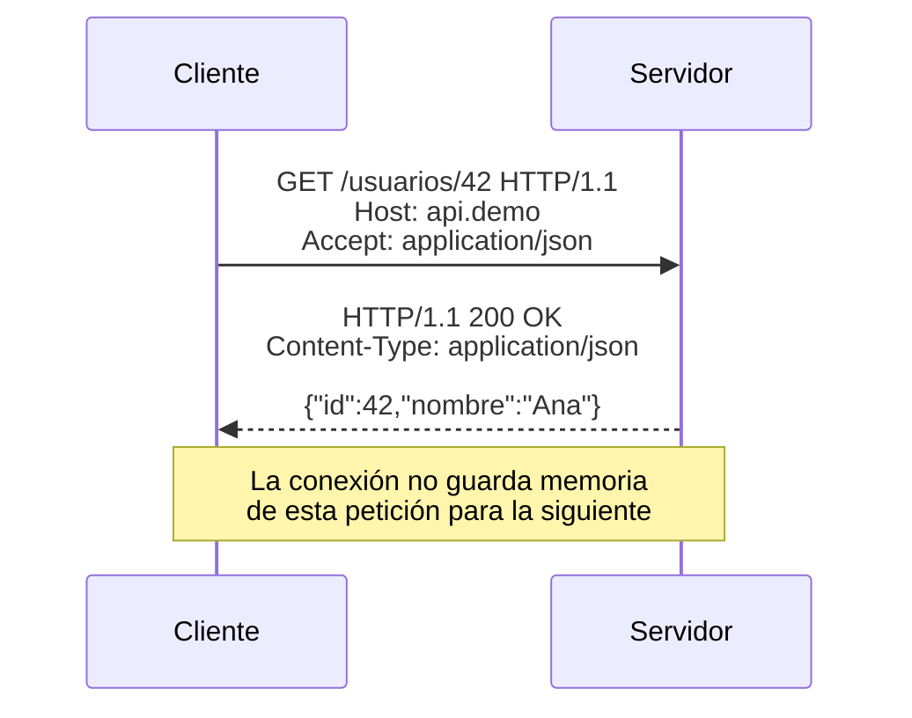
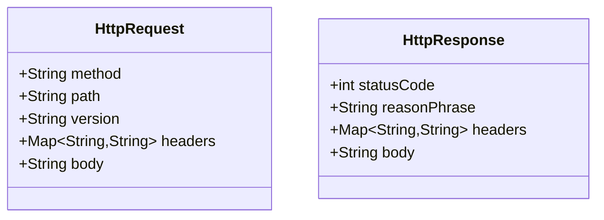
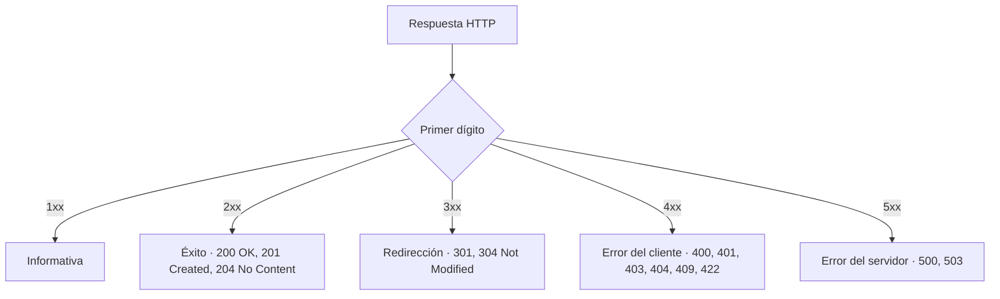
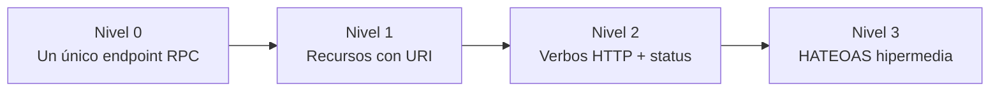
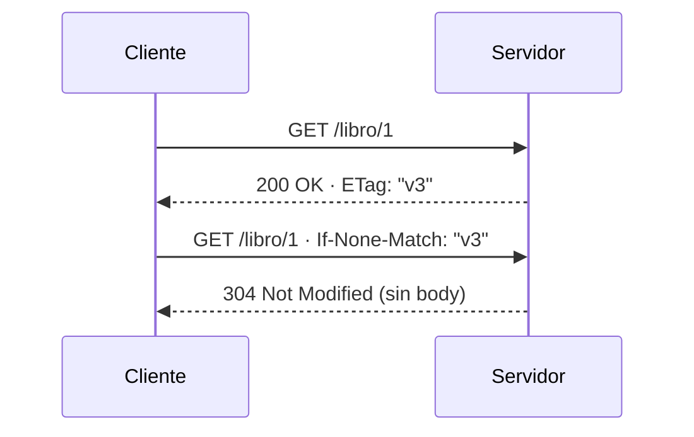

# Bloque 0 · Fundamentos HTTP y Web

> Antes de Spring, antes de JPA, antes de nada: **HTTP**. Una API REST no es más que
> un programa que habla HTTP con disciplina. Si dominas esto, el resto es sintaxis.

---

## 0.1 ¿Qué es HTTP?

HTTP es un protocolo **petición–respuesta**, **sin estado** (stateless) y **textual**
(en HTTP/1.1). El cliente manda una *request*, el servidor devuelve una *response*.
Cada intercambio es independiente: el servidor no recuerda el anterior.



---

## 0.2 Anatomía de una petición

```
GET /productos?categoria=libros&page=2 HTTP/1.1   ← línea de petición
Host: api.tienda.com                              ← headers
Accept: application/json
Authorization: Bearer eyJhbGc...
                                                  ← línea en blanco
{ "opcional": "cuerpo solo en POST/PUT/PATCH" }   ← body
```

Tres zonas: **línea de petición** (método + ruta + versión), **headers** (metadatos
`Clave: Valor`) y **body** (opcional).



---

## 0.3 Verbos y su semántica

| Verbo | Significado | ¿Seguro? | ¿Idempotente? |
|---|---|---|---|
| GET | Leer un recurso | Sí | Sí |
| POST | Crear / acción | No | No |
| PUT | Reemplazar completo | No | **Sí** |
| PATCH | Modificar parcial | No | No (normalmente) |
| DELETE | Borrar | No | **Sí** |

- **Seguro**: no modifica estado en el servidor.
- **Idempotente**: repetir N veces deja el mismo resultado que hacerlo 1 vez.

---

## 0.4 Códigos de estado



Regla mental: **4xx = la culpa es de quien llama**; **5xx = la culpa es del servidor**.

---

## 0.5 Modelo de madurez de Richardson



La mayoría de APIs "REST" reales viven en **Nivel 2**. Eso está bien: es el objetivo
realista de este bootcamp.

---

## 0.6 Statelessness y caché

Cada request lleva **todo** lo que necesita (no hay sesión en el servidor).
Para no recalcular, el servidor puede mandar un `ETag` (huella del recurso); el
cliente lo reenvía en `If-None-Match` y el servidor responde `304 Not Modified`
si nada cambió.



---

### Qué practicarás en este bloque

Parsear y construir HTTP a mano (sin librerías), clasificar códigos y verbos,
negociar contenido por `Accept`, modelar recursos REST y aplicar lógica de ETag.
Todo Java puro: aquí se forja el cimiento.


## Teoría Extendida y Ejemplos de Código

### 1. La Anatomía de una Petición (Request)
Toda petición HTTP se compone de:
1. **Request Line**: `VERBO URI HTTP_VERSION`
2. **Headers**: Pares clave/valor.
3. **Body**: Opcional (común en POST/PUT/PATCH).

```http
POST /api/v1/usuarios HTTP/1.1
Host: api.miempresa.com
Content-Type: application/json
Accept: application/json
Authorization: Bearer jwt.token.aqui

{
  "nombre": "Ana",
  "email": "ana@email.com"
}
```

### 2. Idempotencia y Seguridad
- **Safe (Seguros)**: Métodos que no alteran el estado del servidor (GET, HEAD, OPTIONS). Se pueden llamar mil veces sin riesgo.
- **Idempotent (Idempotentes)**: Métodos que alteran el estado, pero llamarlos 1 vez o 100 veces deja el servidor en el **mismo estado** (PUT, DELETE).
- **No Idempotentes**: POST (crea un nuevo recurso cada vez) o PATCH (aplicar incrementos parciales).

### 3. Códigos de Estado (Status Codes)
```java
// Ejemplo de manejo correcto en Spring Boot
@GetMapping("/{id}")
public ResponseEntity<Usuario> getUsuario(@PathVariable Long id) {
    return repository.findById(id)
            .map(ResponseEntity::ok) // 200 OK
            .orElse(ResponseEntity.notFound().build()); // 404 Not Found
}
```
- **1xx**: Informativos (ej. WebSockets).
- **2xx**: Éxito (200 OK, 201 Created, 204 No Content).
- **3xx**: Redirecciones (301 Moved Permanently, 304 Not Modified para Caché).
- **4xx**: Error del cliente (400 Bad Request, 401 Unauthorized, 403 Forbidden, 404 Not Found).
- **5xx**: Error del servidor (500 Internal Server Error, 503 Service Unavailable).
