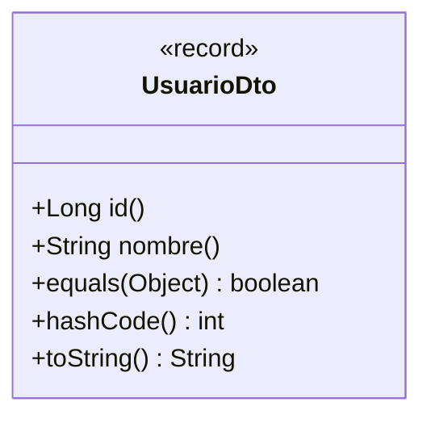
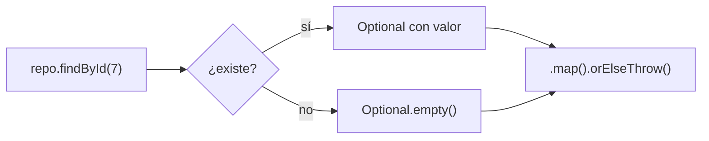
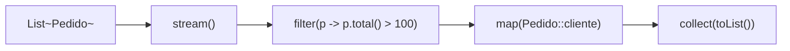
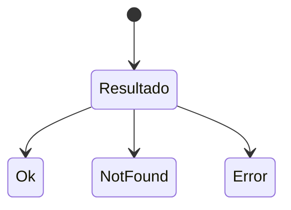

# Bloque I · Java moderno para APIs

> Vienes de Java hasta interfaces. Las APIs reales usan herramientas que DAM1 roza
> de pasada: `record`, `Optional`, streams, genéricos serios, `sealed`, concurrencia.
> Sin esto, Spring se siente mágico; con esto, se siente lógico.

---

## 1.1 `record`: el DTO inmutable

Un `record` es una clase inmutable con `equals`/`hashCode`/`toString` autogenerados.
Es el ladrillo de los DTOs de una API.

```java
public record UsuarioDto(Long id, String nombre) {}
```



---

## 1.2 `Optional`: el fin del `NullPointerException`

`Optional<T>` modela "puede haber valor o no" de forma explícita. Una API que busca
por id devuelve `Optional<Usuario>`, no `null`.



---

## 1.3 Streams: tuberías de datos



`filter` → `map` → `collect`. Inmutable, declarativo, encadenable. El 80 % de la
lógica de servicio de una API es esto.

---

## 1.4 Genéricos serios

`Repository<T, ID>` no es opcional en una API: un único repositorio genérico sirve
para cualquier entidad. Verás `? extends`, `? super` y tipos acotados `<T extends Comparable<T>>`.

---

## 1.5 `sealed` + pattern matching

Una jerarquía cerrada de resultados (`Ok`, `Error`, `NotFound`) que el `switch`
sabe que está completa. Es la base de un manejo de errores robusto.



---

## 1.6 Concurrencia mínima viable

Una API atiende muchas peticiones a la vez. `CompletableFuture` permite trabajo
asíncrono sin bloquear el hilo de la petición. Aquí solo el cimiento; PSP lo
profundiza en 2º.

---

### Qué practicarás

Records como DTO, `Optional` encadenado, pipelines de streams, repositorio
genérico, interfaces funcionales, `sealed`, excepciones con try-with-resources,
`java.time`, `CompletableFuture` y contratos `equals`/`hashCode`.


## Teoría Extendida y Ejemplos de Código

### 1. Records (Java 14+)
Inmutables por defecto, perfectos para DTOs.
```java
public record UsuarioDto(Long id, String nombre, String email) {
    // Constructor compacto para validaciones
    public UsuarioDto {
        if (email == null || email.isBlank()) {
            throw new IllegalArgumentException("Email no puede ser nulo");
        }
    }
}
```

### 2. Optional y Streams
Nunca devuelvas `null` si una entidad puede no existir, usa `Optional`. Para procesar colecciones usa la API Stream.
```java
public List<String> obtenerEmailsActivos() {
    return repository.findAll().stream()
            .filter(Usuario::isActivo)
            .map(Usuario::getEmail)
            .map(String::toLowerCase)
            .toList(); // Java 16+
}
```

### 3. Sealed Classes (Java 15+) y Pattern Matching
Modelado estricto de dominios. Evita herencias incontroladas.
```java
public sealed interface Resultado permits Exito, Error {}
public record Exito(String data) implements Resultado {}
public record Error(String motivo) implements Resultado {}

// Pattern matching en switch (Java 21)
String mensaje = switch(resultado) {
    case Exito e -> "Todo bien: " + e.data();
    case Error e -> "Falló: " + e.motivo();
};
```
