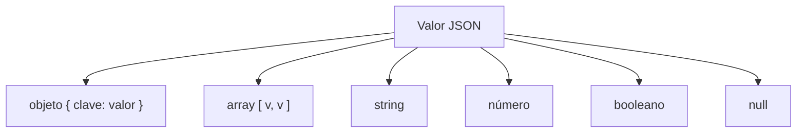
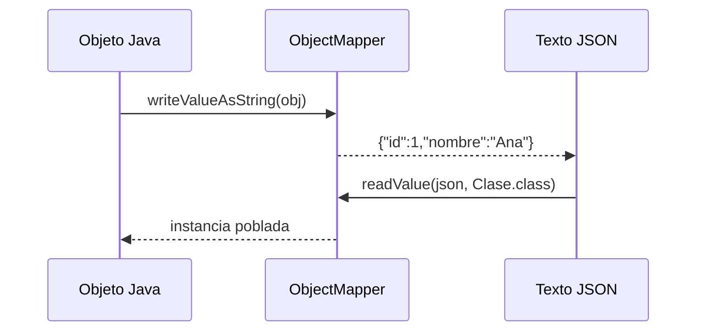

# Bloque II · JSON y Jackson

> El cuerpo de casi toda API REST viaja en JSON. Spring usa **Jackson** por debajo
> para convertir objetos Java ↔ JSON. Entender esto antes de tocar controllers
> evita el 90 % del "por qué mi endpoint devuelve `{}`".

---

## 2.1 El modelo JSON

JSON solo tiene 6 tipos: objeto `{}`, array `[]`, string, número, booleano, `null`.



---

## 2.2 Serialización ↔ deserialización



- **Serializar**: Java → JSON (`writeValueAsString`).
- **Deserializar**: JSON → Java (`readValue`).

Jackson usa los *getters* para serializar y el constructor/*setters* (o el
constructor de un `record`) para deserializar.

---

## 2.3 Anotaciones clave

| Anotación | Efecto |
|---|---|
| `@JsonProperty("nom")` | Renombra el campo en el JSON |
| `@JsonIgnore` | Excluye el campo (p.ej. password) |
| `@JsonInclude(NON_NULL)` | Omite nulls |
| `@JsonFormat` | Formatea fechas |

---

## 2.4 Árbol JSON (lectura dinámica)

Cuando no conoces la forma del JSON, lo lees como árbol: `JsonNode`.

```mermaid
flowchart LR
    T["readTree(json)"] --> R[JsonNode raíz]
    R --> P1["get(\"datos\")"]
    P1 --> P2["get(0).get(\"id\").asInt()"]
```

---

### Qué practicarás

Modelar JSON, serializar/deserializar con `ObjectMapper`, renombrar e ignorar
campos, manejar objetos anidados y colecciones, escribir un serializer propio y
navegar un árbol `JsonNode`.
