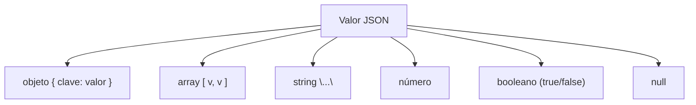
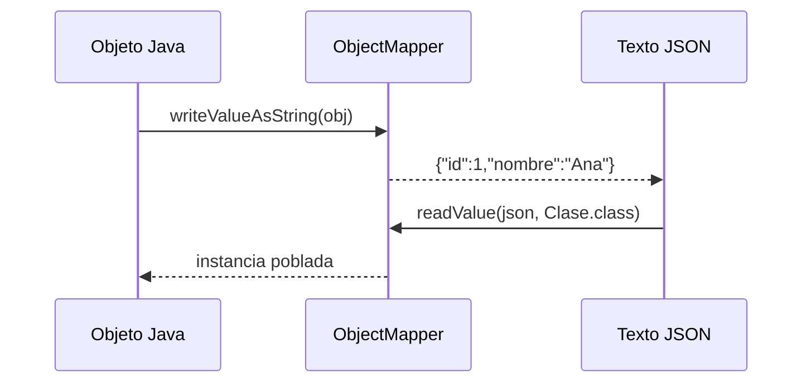
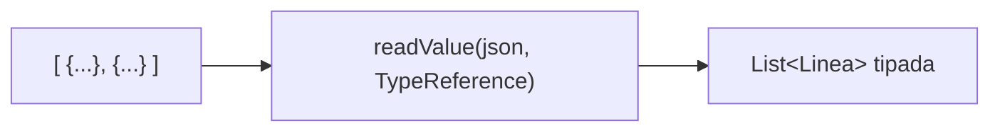
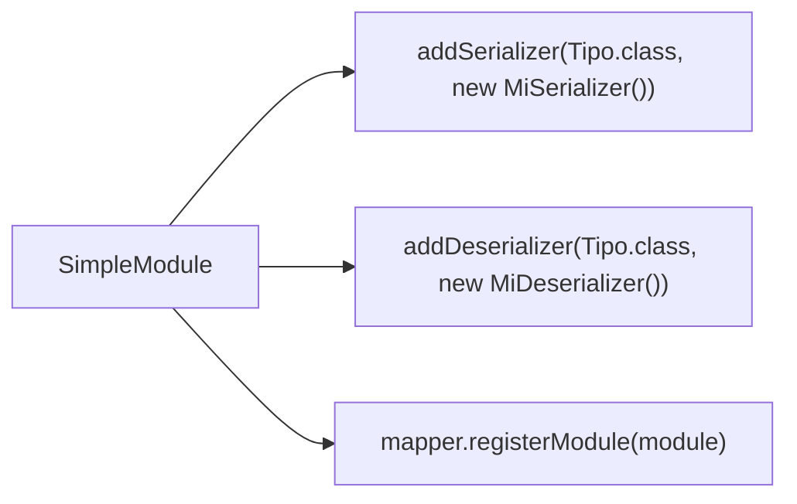

# Bloque II · JSON y Jackson

> El cuerpo de casi toda API REST viaja en JSON. Spring usa **Jackson** por debajo
> para convertir objetos Java ↔ JSON. Entender esto antes de tocar controllers
> evita el 90 % del "por qué mi endpoint devuelve `{}`".

## Cómo usar este documento

Igual que en los bloques anteriores: lee UNA sección → haz SU ejercicio → vuelve.
Cada sección termina con el recuadro **"Lo practicas en…"**. Aquí hay un matiz
importante: el primer ejercicio (`Ej023`) trabaja JSON **a mano, sin librería**,
para que entiendas la sintaxis por dentro; a partir de `Ej024` ya entra Jackson,
que es lo que usarás de verdad.

| Sección | Tema | Ejercicio |
|---|---|---|
| 2.1 | El modelo de tipos JSON (sin librería) | `Ej023JsonModel` |
| 2.2 | ObjectMapper: serializar y deserializar | `Ej024ObjectMapperBasics` |
| 2.3 | Anotaciones de Jackson | `Ej025JsonAnnotations` |
| 2.4 | Objetos anidados y colecciones | `Ej026NestedAndCollections` |
| 2.5 | Serializadores/deserializadores propios | `Ej027CustomSerializer` |
| 2.6 | Árbol JSON (`JsonNode`) | `Ej028JsonTreeModel` |

---

## 2.1 El modelo de tipos JSON

JSON (JavaScript Object Notation) es un formato de texto para intercambiar datos.
Su gracia es que solo tiene **6 tipos de valor**, y cualquier estructura por
compleja que sea se construye anidándolos:



| Tipo | Sintaxis | Cómo se reconoce de un vistazo |
|---|---|---|
| objeto | `{"id":1,"nombre":"Ana"}` | empieza por `{` |
| array | `[1, 2, 3]` | empieza por `[` |
| string | `"hola"` | empieza y termina por `"` |
| número | `42`, `-5`, `3.14` | parsea como número; sin comillas |
| booleano | `true` / `false` | exactamente esas dos palabras |
| null | `null` | exactamente esa palabra |

Reglas que hay que tener grabadas para no pelearte con los tests:

- **Las claves de un objeto van SIEMPRE entre comillas dobles** (`"id"`, no `id`).
- **Solo comillas dobles**, nunca simples. `'hola'` NO es JSON válido.
- Dentro de un string, una comilla literal se escapa con barra: `"dijo \"si\""`.
  Esos dos caracteres `\"` representan UNA comilla en el texto real.
- No hay enteros vs decimales a nivel de sintaxis: `42` y `3.14` son ambos
  "número". Distinguir "es entero" es decisión tuya (mirar si tiene `.`).

En este ejercicio clasificas literales a mano. El truco mental es mirar el
**primer carácter** (`{`, `[`, `"`) para los tipos estructurales, comparar la
cadena completa con `"true"`/`"false"`/`"null"` para las palabras reservadas, y
dejar el número para el final intentando `Double.parseDouble` dentro de un
`try/catch`: si lanza `NumberFormatException`, no era número.

```java
String s = literal.strip();           // quita espacios de los extremos
if (s.startsWith("{")) return "objeto";
if (s.startsWith("[")) return "array";
try { Double.parseDouble(s); return "numero"; }
catch (NumberFormatException e) { /* no era número */ }
```

> **Lo practicas en `Ej023JsonModel`**: clasificar tipos JSON, validar literales
> (objeto/array vacío, string, entero, null, false) y manipular el texto a mano
> sin ninguna librería.

---

## 2.2 ObjectMapper: serializar y deserializar

`ObjectMapper` es la clase central de Jackson. Hace dos cosas simétricas:



- **Serializar** = Java → JSON: `mapper.writeValueAsString(objeto)`.
- **Deserializar** = JSON → Java: `mapper.readValue(json, Clase.class)`.

Para serializar, Jackson lee los *getters* (o los accesores de un `record`). Para
deserializar, usa el constructor y los *setters* (o el constructor canónico del
`record`). Por eso un `record` funciona de fábrica: sus accesores `id()`,
`nombre()` y su constructor le dan a Jackson todo lo que necesita.

**La excepción que SIEMPRE aparece.** Los métodos de Jackson lanzan
`JsonProcessingException`, que es *checked*: el compilador te obliga a tratarla.
El patrón correcto en una API es **no silenciarla**: envuélvela en una
`RuntimeException` para que suba y un handler la convierta en HTTP (bloque 9).

```java
public static String toJson(Cliente c) {
    try {
        return MAPPER.writeValueAsString(c);
    } catch (JsonProcessingException e) {
        throw new RuntimeException(e);   // nunca: return null; o catch vacío
    }
}
```

Más herramientas del mismo `ObjectMapper` que aparecen en los retos:

| Necesidad | API |
|---|---|
| JSON legible (indentado) | `mapper.writerWithDefaultPrettyPrinter().writeValueAsString(o)` |
| Deserializar a un tipo genérico | `mapper.readValue(json, Clase.class)` con `<T>` |
| Tolerar campos extra en el JSON | `configure(FAIL_ON_UNKNOWN_PROPERTIES, false)` |
| Serializar a bytes (UTF-8) | `writeValueAsBytes(o)` / `readValue(bytes, Clase.class)` |
| Convertir entre objetos (Map↔DTO) | `convertValue(origen, Clase.class)` |
| Leer/escribir a fichero | `writeValue(File, o)` / `readValue(File, Clase.class)` |

Sobre `FAIL_ON_UNKNOWN_PROPERTIES`: por defecto Jackson **explota** si el JSON
trae un campo que tu DTO no tiene. En APIs reales eso es frágil (el cliente añade
un campo y tu backend revienta), así que casi siempre se desactiva. Spring Boot,
de hecho, lo desactiva por ti.

> **Lo practicas en `Ej024ObjectMapperBasics`**: serializar/deserializar con
> manejo correcto de la checked, pretty-print, genéricos, tolerancia a campos
> desconocidos, bytes, `convertValue` y persistencia en fichero temporal.

---

## 2.3 Anotaciones de Jackson

Las anotaciones controlan **cómo se mapea** un campo Java a su clave JSON, sin
escribir código de conversión. Las que cubre el bloque:

| Anotación | Efecto | Ejemplo |
|---|---|---|
| `@JsonProperty("user_name")` | renombra la clave en el JSON | `nombre` → `"user_name"` |
| `@JsonIgnore` | excluye el campo (¡passwords!) | nunca serializa `password` |
| `@JsonAlias({"a","b"})` | acepta varios nombres AL LEER | lee `full_name` o `nombre_completo` |
| `@JsonInclude(NON_NULL)` | omite campos null | un null no aparece en el JSON |
| `@JsonInclude(NON_EMPTY)` | omite null + vacíos | lista vacía o `""` no aparecen |
| `@JsonPropertyOrder(alphabetic=true)` | ordena las claves | salida determinista |
| `@JsonFormat(pattern=…)` | formatea fechas | `LocalDate` → `"2026-05-21"` |
| `@JsonValue` | el objeto SE serializa como ese único valor | enum → su código |
| `@JsonUnwrapped` | aplana un objeto anidado al nivel raíz | `direccion.calle` → `calle` |
| `@JsonAnyGetter` / `@JsonAnySetter` | propiedades dinámicas vía `Map` | campos no declarados |

Hay dos sabores de configuración y conviene no confundirlos:

1. **Por anotación en la clase/campo** (`@JsonProperty`, `@JsonIgnore`,
   `@JsonValue`…): la regla vive en el DTO y aplica siempre.
2. **Por configuración del mapper** (`@JsonInclude`, orden alfabético, módulos):
   se puede poner como anotación o configurar globalmente en el `ObjectMapper`.
   Para excluir nulos a nivel global: `mapper.setSerializationInclusion(Include.NON_NULL)`.

```java
public class Usuario {
    @JsonProperty("user_name")     // en el JSON saldrá "user_name", no "nombre"
    public String nombre;
    @JsonIgnore                    // jamás cruza la frontera HTTP
    public String password;
}
```

El caso de las **fechas** merece nota: `LocalDate`/`Instant` necesitan el módulo
`JavaTimeModule` registrado (`mapper.registerModule(new JavaTimeModule())`), o
mejor `mapper.findAndRegisterModules()`. Sin él, Jackson o falla o serializa la
fecha como un array de números horrible. Spring Boot lo registra por ti.

> **Lo practicas en `Ej025JsonAnnotations`**: renombrar/ocultar campos, excluir
> nulos y vacíos, ordenar claves, formatear fechas, alias, `@JsonValue`,
> `@JsonUnwrapped`, propiedades dinámicas y leer una anotación por reflexión.

---

## 2.4 Objetos anidados y colecciones

Jackson recorre la estructura entera por sí solo: si un `record Pedido` contiene
una `List<Linea>`, al serializar el pedido las líneas se anidan automáticamente
como un array. No tienes que hacer nada especial **para serializar**.

```java
record Linea(String producto, int cantidad) {}
record Pedido(Long id, List<Linea> lineas) {}
// toJson(pedido) -> {"id":1,"lineas":[{"producto":"cafe","cantidad":2}]}
```

El problema aparece **al deserializar a una colección genérica**. Por el borrado
de tipos (lo viste en 1.5), en runtime `List<Linea>` es solo `List`: Jackson no
sabe a qué convertir cada elemento. La solución es `TypeReference`, un truco que
captura el tipo genérico completo:

```java
List<Linea> lineas = MAPPER.readValue(json, new TypeReference<List<Linea>>(){});
```

Ese `(){}` no es un error: es una **clase anónima** que existe solo para que el
genérico `List<Linea>` quede grabado y Jackson pueda leerlo. Lo mismo aplica a
`Map<String, Object>`, `Map<String, List<Linea>>`, etc.



Tabla de los tipos de destino que pide el bloque:

| JSON de entrada | TypeReference de destino |
|---|---|
| `[{...},{...}]` | `new TypeReference<List<Map<String,Object>>>(){}` |
| `{"a":"1","b":"2"}` | `new TypeReference<Map<String,String>>(){}` |
| `{"cat":[{...}]}` | `new TypeReference<Map<String,List<Linea>>>(){}` |
| estructura desconocida | `new TypeReference<Map<String,Object>>(){}` |

Cuando deserializas a `Map<String, Object>`, Jackson infiere el tipo Java de cada
valor: un número JSON entero → `Integer`, un decimal → `Double`, un texto →
`String`, un array → `List`, `true`/`false` → `Boolean`. El test de
`deserializarMapGenerico` comprueba exactamente eso (`25` llega como `Integer`,
no como `Long`).

> **Lo practicas en `Ej026NestedAndCollections`**: serializar estructuras
> anidadas, deserializar listas y mapas genéricos con `TypeReference`, saneado de
> nulos, recuento y filtrado de líneas, y bytes.

---

## 2.5 Serializadores/deserializadores propios

Cuando una anotación no basta —quieres una transformación a medida— escribes un
serializer/deserializer y lo registras en un `SimpleModule`.



**Serializer** (Java → JSON a tu manera): extiende `StdSerializer<T>` y sobre­
escribe `serialize`. Dentro escribes en el `JsonGenerator`:

```java
public class PrecioSerializer extends StdSerializer<Precio> {
    public PrecioSerializer() { super(Precio.class); }
    @Override public void serialize(Precio v, JsonGenerator gen, SerializerProvider p)
            throws IOException {
        gen.writeString(String.format(Locale.US, "%.2f €", v.valor())); // "9.90 €"
    }
}
```

Métodos del `JsonGenerator` que usarás:

| Método | Escribe |
|---|---|
| `writeString(s)` | un string JSON (con comillas) |
| `writeNumber(n)` | un número JSON (sin comillas) |
| `writeNull()` | `null` |
| `writeStartObject()` / `writeEndObject()` | `{` … `}` |
| `writeStartArray()` / `writeEndArray()` | `[` … `]` |
| `writeStringField("k", v)` | par `"k":"v"` dentro de un objeto |
| `writeNumberField("k", n)` | par `"k":n` dentro de un objeto |

**Deserializer** (JSON → Java a tu manera): extiende `StdDeserializer<T>` y
sobreescribe `deserialize`, leyendo del `JsonParser` (típicamente
`p.getValueAsString()`), y devolviendo el objeto. Si el texto no es válido, lanza
`IOException` (o `ctxt.weirdStringException(...)`).

```java
@Override public LocalDate deserialize(JsonParser p, DeserializationContext ctxt)
        throws IOException {
    String s = p.getValueAsString();
    return LocalDate.parse(s, DateTimeFormatter.ofPattern("dd-MM-yyyy"));
}
```

Punto clave para el reto 10: **un mismo `SimpleModule` puede registrar varios
serializers y deserializers**; los registras todos y haces UN
`mapper.registerModule(module)`. Así un solo mapper sabe convertir `LocalDate`,
`Dinero`, etc. a la vez. Esto es exactamente lo que hace Spring Boot al arrancar:
agrupa todos los módulos en el `ObjectMapper` que inyecta en tus controllers.

> **Lo practicas en `Ej027CustomSerializer`**: formatear precios, fechas, enmascarar
> tarjetas, traducir booleanos a SI/NO, convertir Map↔array, serializar dinero y
> componer un módulo con varios (de)serializers.

---

## 2.6 Árbol JSON (`JsonNode`)

Cuando NO conoces la forma del JSON (o es tan variable que crear un DTO no
compensa), lo lees como un **árbol** de nodos: `JsonNode`. Es el modelo dinámico
de Jackson, paralelo al modelo "bind a una clase" de las secciones anteriores.

```mermaid
flowchart LR
    T["readTree(json)"] --> R["JsonNode raíz"]
    R --> P1["get(\"datos\")"]
    P1 --> P2["get(0).get(\"id\").asInt()"]
```

Dos formas de navegar, y la diferencia importa:

| Método | Si la clave NO existe |
|---|---|
| `node.get("clave")` | devuelve `null` (¡cuidado con el NPE!) |
| `node.path("clave")` | devuelve un nodo "missing" (encadenable, sin null) |

Por eso para rutas profundas se prefiere `path`, que no rompe la cadena:

```java
String ciudad = root.path("direccion").path("ciudad").asText("Desconocida");
```

Métodos de lectura y de tipo:

| Método | Para qué |
|---|---|
| `asText()` / `asText(def)` | valor como String (con default) |
| `asInt()` / `asDouble()` | valor numérico |
| `isArray()` / `isObject()` | comprobar la forma antes de recorrer |
| `size()` | nº de elementos de un array/objeto |
| `fieldNames()` / `fields()` | iterar las claves de un objeto |
| `getNodeType()` | tipo del nodo (`STRING`, `NUMBER`, `OBJECT`, `ARRAY`, `BOOLEAN`, `NULL`, `MISSING`) |

Para **construir o modificar** JSON programáticamente se usan los nodos
mutables `ObjectNode` / `ArrayNode` (vía `mapper.createObjectNode()`):

```java
ObjectNode raiz = MAPPER.createObjectNode();
raiz.put("nombre", "Ana");
raiz.put("edad", 30);
ArrayNode arr = raiz.putArray("aficiones");
arr.add("cine").add("viajes");
String json = MAPPER.writeValueAsString(raiz);
```

Para inyectar un campo en un JSON existente: `readTree` → castea a `ObjectNode` →
`put` → vuelve a serializar. Para eliminar: `((ObjectNode) root).remove("clave")`.
Para fusionar dos árboles, Jackson trae `mapper.readerForUpdating(base).readValue(otro)`,
que sobreescribe recursivamente las claves de `base` con las de `otro`.

> **Lo practicas en `Ej028JsonTreeModel`**: navegar por ruta con `path`, construir
> JSON con `ObjectNode`/`ArrayNode`, inyectar/eliminar/fusionar claves, inspeccionar
> el tipo de un nodo, buscar recursivamente y convertir un subárbol a DTO.

---

## Errores comunes del bloque

| # | Error | Antídoto |
|---|---|---|
| 1 | Silenciar `JsonProcessingException` con `return null` o catch vacío | Envuélvela en `RuntimeException` y déjala subir |
| 2 | `readValue(json, List.class)` para una lista tipada | Usa `new TypeReference<List<X>>(){}` (borrado de tipos) |
| 3 | Olvidar registrar `JavaTimeModule` y que las fechas exploten | `registerModule(new JavaTimeModule())` o `findAndRegisterModules()` |
| 4 | El JSON trae un campo extra y Jackson revienta | `configure(FAIL_ON_UNKNOWN_PROPERTIES, false)` |
| 5 | `node.get("x")` y NPE al encadenar | Usa `path("x")`, que devuelve nodo missing, no null |
| 6 | Comillas simples o claves sin comillas en JSON de prueba | JSON solo admite comillas dobles, también en las claves |
| 7 | En un serializer usar `writeNumber` cuando el test espera string | El test compara `"9.90 €"` con comillas → `writeString` |
| 8 | Esperar `Long` al deserializar un número a `Map<String,Object>` | Un entero JSON llega como `Integer`, un decimal como `Double` |
| 9 | Modificar el `JsonNode` raíz sin castear a `ObjectNode` | `put`/`remove` solo existen en `ObjectNode` |
| 10 | Asumir que `record` no se serializa (intentar getters manuales) | Jackson usa los accesores del record de fábrica |

## Chuleta final del bloque

```
Tipos JSON   = objeto{} · array[] · string"" · número · booleano · null (comillas DOBLES)
Serializar   = mapper.writeValueAsString(obj)          (usa getters/accesores)
Deserializar = mapper.readValue(json, Clase.class)     (usa constructor/setters)
Checked      = JsonProcessingException → try/catch → throw new RuntimeException(e)
Genéricos    = readValue(json, new TypeReference<List<X>>(){})   ← borrado de tipos
Anotaciones  = @JsonProperty rename · @JsonIgnore oculta · @JsonInclude(NON_NULL) · @JsonValue
Config mapper= setSerializationInclusion · FAIL_ON_UNKNOWN_PROPERTIES=false · registerModule
Pretty       = writerWithDefaultPrettyPrinter().writeValueAsString(o)
Custom       = StdSerializer<T>+serialize / StdDeserializer<T>+deserialize → SimpleModule
Generator    = writeString (con comillas) · writeNumber (sin) · writeStringField
Árbol        = readTree → JsonNode · get()=null vs path()=missing · asText/asInt/getNodeType
Construir    = createObjectNode().put(...) · createArrayNode().add(...) · castea a ObjectNode
```

## Autoevaluación (responde sin mirar; si fallas 2+, relee la sección)

1. ¿Cuáles son los 6 tipos de valor de JSON y cómo distingues un número de un
   booleano mirando el literal? *(2.1)*
2. ¿Qué método serializa y cuál deserializa en `ObjectMapper`? ¿Qué excepción
   lanzan y cómo la tratas en una API? *(2.2)*
3. ¿Por qué `readValue(json, List.class)` no basta para una `List<Linea>` y qué
   usas en su lugar? *(2.4)*
4. ¿Qué diferencia hay entre `@JsonProperty` y `@JsonAlias`? ¿Y entre
   `NON_NULL` y `NON_EMPTY`? *(2.3)*
5. ¿Qué clase extiendes para un serializer propio y qué método sobreescribes?
   ¿Con qué escribes un string frente a un número? *(2.5)*
6. ¿Por qué `path("x")` es más seguro que `get("x")` al navegar un árbol? *(2.6)*
7. ¿Qué hace falta para que un `LocalDate` se serialice bien con Jackson? *(2.3)*
8. Al deserializar un número JSON a `Map<String,Object>`, ¿de qué tipo Java llega
   un `25`? ¿Y un `3.14`? *(2.4)*
</content>
</invoke>
