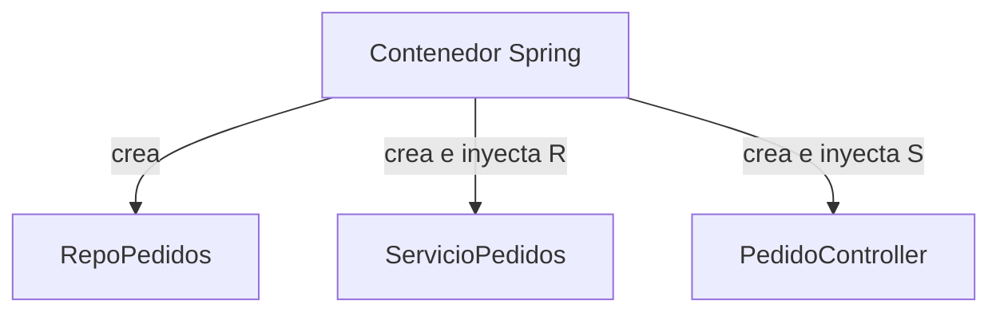
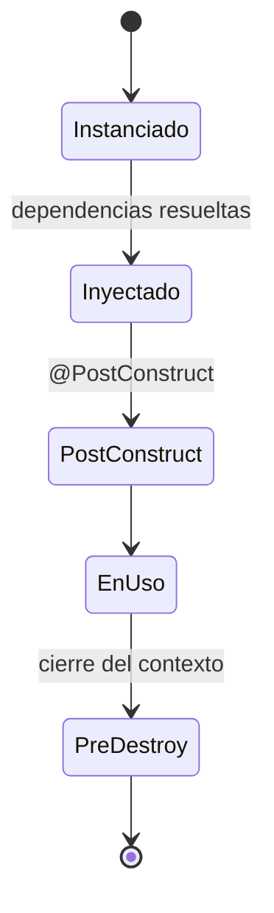
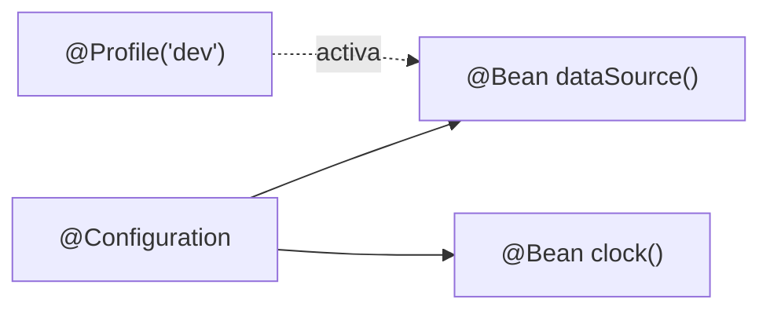

# Bloque III · Spring Core: IoC y DI

> Spring no es magia: es un **contenedor** que crea objetos por ti y se los pasa a
> quien los necesita. Entender IoC/DI es entender el 70 % de Spring.

---

## 3.1 Inversión de Control (IoC)

Sin IoC, tú haces `new ServicioPedidos(new RepoPedidos())`. Con IoC, le dices al
contenedor "necesito un ServicioPedidos" y él arma el árbol de dependencias.



---

## 3.2 Inyección de dependencias por constructor

```java
@Service
class ServicioPedidos {
    private final RepoPedidos repo;
    ServicioPedidos(RepoPedidos repo) { this.repo = repo; } // Spring inyecta
}
```

Por constructor (no por campo) → inmutable, testeable, dependencias explícitas.

---

## 3.3 Ciclo de vida de un bean



---

## 3.4 Scopes

| Scope | Instancias |
|---|---|
| `singleton` (def.) | Una por contenedor |
| `prototype` | Una nueva por cada petición de bean |

---

## 3.5 Configuración por Java

`@Configuration` + `@Bean` define beans programáticamente. `@Profile` y
`@Conditional` deciden si un bean existe según el entorno.



---

### Qué practicarás

Un mini-contenedor IoC propio, inyección por constructor, `@Qualifier`/`@Primary`,
scopes, ciclo de vida, `@Configuration`/`@Bean`, `@Conditional`, eventos y un
aspecto AOP. Los tests usan `AnnotationConfigApplicationContext` cuando hace falta
Spring real.
