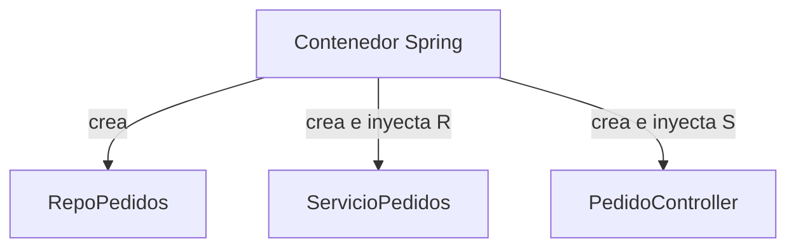
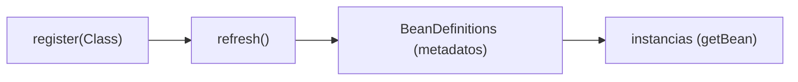
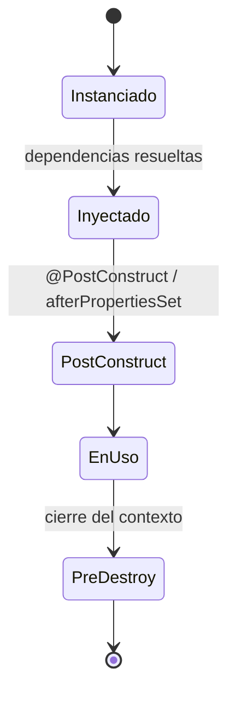
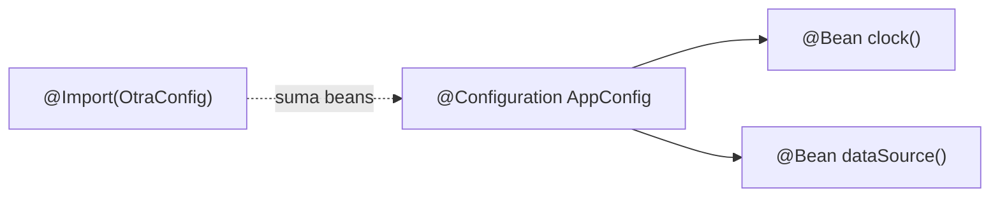

# Bloque III · Spring Core: IoC y DI

> Spring no es magia: es un **contenedor** que crea tus objetos por ti, los conecta
> entre sí y gestiona su ciclo de vida. Si entiendes IoC/DI, entiendes el 70 % de
> Spring; el resto (web, datos, seguridad) son beans construidos sobre esta misma base.

## Cómo usar este documento

Igual que en los bloques anteriores: lee UNA sección → haz SU ejercicio → vuelve.
Cada sección termina con el recuadro **"Lo practicas en…"**. Los primeros ejercicios
reconstruyen a mano lo que Spring hace por dentro (un mini-contenedor); a partir de
`Ej030` ya usas Spring real con `AnnotationConfigApplicationContext`, que es el mismo
motor que arranca por debajo cuando llamas a `SpringApplication.run` en el bloque 4.

| Sección | Tema | Ejercicio |
|---|---|---|
| 3.1 | Inversión de Control: el contenedor por dentro | `Ej029ManualIoCContainer` |
| 3.2 | `@Component` y el escaneo de beans | `Ej030ComponentScan` |
| 3.3 | Inyección por constructor | `Ej031ConstructorInjection` |
| 3.4 | `@Qualifier` / `@Primary`: desambiguar | `Ej032QualifierAndPrimary` |
| 3.5 | Scopes: singleton vs prototype | `Ej033BeanScopes` |
| 3.6 | Ciclo de vida del bean | `Ej034BeanLifecycle` |
| 3.7 | Configuración por Java: `@Configuration`/`@Bean` | `Ej035JavaConfigBeans` |
| 3.8 | Beans condicionales: `@Profile`/`@Conditional` | `Ej036ConditionalBeans` |
| 3.9 | Eventos de aplicación | `Ej037ApplicationEvents` |
| 3.10 | AOP: lógica transversal | `Ej038AopCrossCutting` |

---

## 3.1 Inversión de Control: el contenedor por dentro

Sin IoC, **tú** eres el dueño del grafo de objetos: escribes
`new ServicioPedidos(new RepoPedidos(new DataSource(...)))` y cargas con el orden,
con compartir instancias y con cerrarlas. Con IoC le pides al contenedor "dame un
`ServicioPedidos`" y él arma el árbol completo de dependencias por ti. La "inversión"
es esa: el control de *quién crea qué* pasa de tu código al framework.



Un contenedor mínimo solo necesita dos mapas y dos operaciones:

```java
public class MiniContenedor {
    private final Map<Class<?>, Supplier<?>> fabricas = new HashMap<>();
    private final Map<Class<?>, Object> singletons = new HashMap<>();

    public <T> void register(Class<T> tipo, Supplier<T> fabrica) {
        fabricas.put(tipo, fabrica);                 // guardas CÓMO crearlo, no el objeto
    }
    public <T> T getBean(Class<T> tipo) {
        if (!fabricas.containsKey(tipo))
            throw new IllegalStateException("No registrado: " + tipo);
        Object inst = singletons.computeIfAbsent(tipo, t -> fabricas.get(t).get());
        return tipo.cast(inst);                       // cast seguro, sin warnings
    }
}
```

Las dos ideas clave que verás repetidas en TODO Spring:

- **Creación perezosa + caché (singleton)**: el bean se construye la *primera* vez
  que se pide y a partir de ahí se devuelve siempre el **mismo** objeto. Por eso
  `getBean(X) == getBean(X)` es `true` para un singleton.
- **Registrar la fábrica, no la instancia**: guardas un `Supplier<T>` (el "cómo"),
  no el resultado. Eso permite decidir más tarde el scope (uno o muchos), inyectar
  dependencias en la fábrica, etc.

`tipo.cast(inst)` (en vez de `(T) inst`) hace el cast **comprobado en runtime** y
evita el *unchecked warning*: es el patrón idiomático cuando la clave es un
`Class<T>`. Y como el contenedor puede gestionar recursos, implementar
`AutoCloseable` para propagar `close()` a los singletons que lo sean es el germen de
lo que en Spring es `@PreDestroy` (sección 3.6).

> **Lo practicas en `Ej029ManualIoCContainer`**: registras fábricas singleton y
> prototype, resuelves por tipo y por nombre, alias, `getBeansOfType` y un `close()`
> que cierra los beans `AutoCloseable`.

---

## 3.2 `@Component` y el escaneo de beans

En vez de registrar a mano, marcas la clase como candidata con un **estereotipo** y
el contenedor la descubre. `@Component` es el genérico; `@Service`, `@Repository` y
`@Controller` son especializaciones semánticas (mismo efecto técnico, distinta
intención y algún extra, p.ej. `@Repository` traduce excepciones de persistencia).

```java
@Component
public class Saludador {
    public String saludar() { return "hola"; }
}
```

Para arrancar un contenedor Spring "a pelo" (sin Spring Boot) y resolver un bean:

```java
try (var ctx = new AnnotationConfigApplicationContext()) {
    ctx.register(Saludador.class);   // registras la clase...
    ctx.refresh();                    // ...y refresh() procesa anotaciones y crea beans
    Saludador s = ctx.getBean(Saludador.class);
}   // el try-with-resources cierra el contexto (AutoCloseable)
```

El orden importa: **`register` → `refresh` → `getBean`**. Antes de `refresh()` el
contexto no ha procesado nada; después de `close()` queda inactivo (`isActive()` ==
false). Pasar la clase al constructor (`new AnnotationConfigApplicationContext(X.class)`)
hace `register`+`refresh` de golpe.

El **nombre por defecto** de un bean es el de su clase con la inicial en minúscula:
`Saludador` → `"saludador"`. Para clases anidadas en un test el nombre lleva el
prefijo de la externa: `"ej030ComponentScanTest.MiPrototypeBean"`. Esto es clave en
los retos, porque resuelves y consultas beans por ese nombre exacto.

El `BeanFactory`/`BeanDefinition` te deja **inspeccionar** los metadatos sin instanciar:
`ctx.getBeanDefinitionNames()`, `ctx.getBeanFactory().getBeanDefinition(nombre)` y de
ahí `.isSingleton()`, `.isPrototype()`, `.isLazyInit()`. Registrar un singleton ya
construido en caliente es `ctx.getBeanFactory().registerSingleton(nombre, instancia)`.



> **Lo practicas en `Ej030ComponentScan`**: arrancas el contexto, resuelves por tipo
> y por nombre, cuentas definiciones, registras en caliente y lees metadatos
> (`isSingleton`, prototype, `@Lazy`, beans por anotación).

---

## 3.3 Inyección por constructor

Un servicio **no** debe hacer `new` de sus dependencias: las **recibe ya construidas**.
Eso es DI. Y de las tres formas de inyectar (constructor, setter, campo), la correcta
es **por constructor**:

```java
@Service
class ServicioPedidos {
    private final RepoPedidos repo;          // final: inmutable
    ServicioPedidos(RepoPedidos repo) {       // Spring inyecta aquí
        this.repo = Objects.requireNonNull(repo);  // fail-fast si falta
    }
}
```

Por qué constructor y no `@Autowired` en el campo:

| Ventaja | Por qué |
|---|---|
| **Inmutabilidad** | el campo es `final`: nadie lo reasigna tras construir |
| **Testeable sin Spring** | en un test haces `new ServicioPedidos(mock)`; no necesitas contenedor |
| **Dependencias explícitas** | si el constructor pide 7 cosas, la clase hace demasiado: el diseño "huele" a la vista |
| **Fail-fast** | sin la dependencia, ni se construye; nada de NPE a las 3 AM |

Desde Spring 4.3, si la clase tiene **un solo constructor**, `@Autowired` es opcional:
Spring lo usa automáticamente. Patrones que aparecen en los retos:

- **Dependencia opcional**: recíbela como `Optional<T>` y resuelve un fallback con
  `opt.orElse(() -> "Default")` / `orElseGet`. (Conecta con teoría 1.2.)
- **Colección de dependencias**: Spring sabe inyectar `List<RepoSaludos>` con *todos*
  los beans de ese tipo. Útil para el patrón "estrategias".
- **Inicialización perezosa**: si recibes un `Supplier<Dep>` en vez de `Dep`, la
  dependencia se crea solo al llamar `supplier.get()` (no al construir el servicio).
- **Decorador**: una clase que implementa la misma interfaz, envuelve a otra y añade
  comportamiento sin modificarla (`"[" + delegado.plantilla() + "]"`).

La **dependencia circular por constructor** (A necesita B y B necesita A) es
irresoluble: ninguno puede construirse primero. Spring la detecta y falla al arrancar;
con reflexión la detectas mirando si los tipos de parámetro del constructor de A
incluyen B y viceversa.

> **Lo practicas en `Ej031ConstructorInjection`**: inyectas una dependencia, validas
> que no sea null, y montas variantes (múltiples repos, opcional con fallback,
> composición, lazy, decorador, factoría, detección de ciclos por reflexión).

---

## 3.4 `@Qualifier` / `@Primary`: cuando hay varios candidatos

Si una interfaz tiene **dos** implementaciones (`EmailNotificador`, `SmsNotificador`)
y pides un `Notificador`, Spring no sabe cuál: lanza
`NoUniqueBeanDefinitionException`. Dos formas de desempatar:

```java
@Component @Primary                      // el elegido por DEFECTO si no se cualifica
class EmailNotificador implements Notificador { ... }

@Component @Qualifier("sms")             // elegible pidiéndolo por su nombre
class SmsNotificador implements Notificador { ... }

// en el consumidor:
ServicioAlertas(@Qualifier("sms") Notificador n) { ... }   // fuerzo el SMS
```

- **`@Primary`** marca el candidato preferente: se inyecta cuando no especificas nada.
- **`@Qualifier("x")`** selecciona explícitamente por nombre/etiqueta y gana al primary.

Resolución programática (lo que practicas en los retos, simulando lo que Spring hace
internamente):

```java
ctx.getBean(Notificador.class);                              // devuelve el @Primary
ctx.getBean("smsSpecial", Notificador.class);                // por nombre cualificado
ctx.getBeansOfType(Notificador.class);                       // Map<nombre, bean> de TODOS
```

Para inspeccionar/mutar metadatos de `@Primary` usas el `BeanDefinition`:
`bd.isPrimary()` y `bd.setPrimary(true)` (con un `GenericApplicationContext`). Y un
`@Qualifier` puede ser una **anotación propia** meta-anotada con `@Qualifier`, que es
como Spring deja crear cualificadores con tipos en vez de cadenas mágicas.

Sin Spring, "cualificar" es simplemente un `switch` que mapea una clave a una
implementación — exactamente lo que harás en el ejercicio base antes de ver la versión
con contenedor.

> **Lo practicas en `Ej032QualifierAndPrimary`**: resuelves por qualifier con un
> switch, recuperas el `@Primary` y los cualificados del contexto, cuentas por
> calificador y reemplazas el primary en caliente.

---

## 3.5 Scopes: singleton vs prototype

El **scope** decide cuántas instancias del bean existen:

| Scope | Instancias | Uso típico |
|---|---|---|
| `singleton` (por defecto) | UNA por contenedor | servicios, repos: sin estado mutable compartido |
| `prototype` | una NUEVA en cada `getBean`/inyección | beans con estado por uso |
| `request` / `session` | una por petición/sesión HTTP | bloque web (b05) |

```java
@Component                       // singleton implícito
class ServicioSinEstado {}

@Component @Scope("prototype")   // nueva instancia cada vez
class CarritoTemporal {}
```

La diferencia se comprueba con identidad de referencia:

```java
ctx.getBean(X.class) == ctx.getBean(X.class);   // true si singleton, false si prototype
```

**La trampa del prototype dentro de un singleton.** Si un singleton inyecta un
prototype por constructor, el prototype se resuelve **una sola vez** (al construir el
singleton) y se queda "congelado": pierdes la novedad por llamada. Soluciones:

- Inyectar un `ObjectFactory<T>` (o `Provider<T>`) y llamar `.getObject()` cada vez
  que necesites una instancia fresca.
- Usar un **scoped proxy** (`@Scope(value="prototype", proxyMode=TARGET_CLASS)`): el
  singleton recibe un proxy que, en cada método, va a buscar una instancia nueva.

Spring **no** llama `@PreDestroy` en prototypes: una vez entregado, el contenedor se
desentiende de su destrucción (es responsabilidad de quien lo pidió). Puedes registrar
**scopes personalizados** implementando `org.springframework.beans.factory.config.Scope`
(p.ej. un `ThreadScope` con `ThreadLocal`, una instancia por hilo) y registrándolo con
`ctx.getBeanFactory().registerScope("nombre", scope)`.

> **Lo practicas en `Ej033BeanScopes`**: un proxy de scope manual (singleton/prototype),
> `ObjectFactory` para refrescar prototypes, un `ScopeThread` con `ThreadLocal` y la
> verificación de que los prototypes no reciben callbacks de destrucción.

---

## 3.6 Ciclo de vida del bean

Entre que el contenedor instancia un bean y lo descarta hay fases bien definidas en
las que puedes engancharte:



Tres formas de declarar inicialización/destrucción (de más a menos recomendada):

```java
// 1. Anotaciones JSR-250 (las preferidas): jakarta.annotation.*
@PostConstruct void init()  { /* tras inyectar dependencias */ }
@PreDestroy    void cierre(){ /* al cerrar el contexto */ }

// 2. Interfaces de Spring (acoplan tu clase al framework):
class X implements InitializingBean, DisposableBean {
    public void afterPropertiesSet() { ... }   // = @PostConstruct
    public void destroy()            { ... }   // = @PreDestroy
}

// 3. Atributos del @Bean (para clases de terceros que no puedes anotar):
@Bean(initMethod = "arrancar", destroyMethod = "parar") Recurso r() { ... }
```

Si coinciden varias para el mismo bean, el **orden** es: `@PostConstruct` →
`afterPropertiesSet()` (InitializingBean) → init-method del `@Bean`. (Y en sentido
inverso conceptual para la destrucción.)

Ganchos avanzados que aparecen en los retos:

- **`BeanPostProcessor`**: intercepta TODOS los beans justo antes
  (`postProcessBeforeInitialization`) y después (`postProcessAfterInitialization`) de
  su inicialización. Es el mecanismo con el que Spring implementa `@Autowired`, AOP,
  etc. Devolver el mismo bean = no tocarlo; devolver otro = sustituirlo (proxy).
- **Interfaces `*Aware`** (`BeanNameAware`, `ApplicationContextAware`): Spring te
  "inyecta" su propio nombre o el contexto llamando a `setBeanName`/`setApplicationContext`.
- **Destrucción defensiva**: al cerrar, un `close()` que lanza no debe tumbar el
  apagado del resto; envuélvelo en try/catch y tolera el `null`.

> **Lo practicas en `Ej034BeanLifecycle`**: registras las fases en orden, implementas
> las interfaces de init/destroy, un `BeanPostProcessor`, las `*Aware`, y un cierre
> defensivo que tolera recursos nulos.

---

## 3.7 Configuración por Java: `@Configuration` / `@Bean`

`@Component` sirve cuando *tú* eres dueño de la clase y puedes anotarla. Para registrar
beans de **terceros** (un `Clock`, un `DataSource`, un `ObjectMapper`) usas una clase
`@Configuration` con métodos `@Bean`:

```java
@Configuration
public class AppConfig {
    @Bean Clock clock() { return Clock.systemUTC(); }   // el nombre del bean = "clock"
}
```

El nombre del bean es el nombre del **método**. Conectar beans entre sí tiene dos
estilos equivalentes:

```java
@Bean StringBuilder sb()            { return new StringBuilder("Base"); }
@Bean String msg()                  { return sb().append("X").toString(); }   // llamada directa
@Bean String msg2(StringBuilder s)  { return s.append("Y").toString(); }      // por parámetro
```

Aquí entra la **magia de `@Configuration`**: la clase se envuelve en un proxy CGLIB
que **intercepta** las llamadas a métodos `@Bean`. Por eso `sb()` no crea un
`StringBuilder` nuevo cada vez que lo llamas: devuelve el singleton del contenedor. Si
quitas `@Configuration` (modo "lite", métodos `@Bean` en una clase normal) **no hay
proxy** y cada llamada crea un objeto distinto. Es la diferencia entre "full" y "lite".

Herramientas del bloque:

- **`@Import(OtraConfig.class)`**: compone varias clases de configuración en un contexto.
- **`@Value("${prop:default}")` + `@PropertySource`**: externaliza valores a un
  `.properties` (la base de `application.properties` en el bloque 4).
- **Alias**: `@Bean(name = {"a", "b"})` registra el mismo singleton bajo varios nombres.
- **Registro programático**: `ctx.registerBeanDefinition(nombre, def)` o
  `GenericBeanDefinition`/`BeanDefinitionBuilder` para crear definiciones en caliente.



> **Lo practicas en `Ej035JavaConfigBeans`**: defines un `@Bean`, lo recuperas del
> contexto, compones con `@Import`, registras definiciones en caliente y un
> `ImportSelector` dinámico.

---

## 3.8 Beans condicionales: `@Profile` / `@Conditional`

A veces un bean solo debe existir en ciertos entornos: una implementación en `dev`,
otra en `prod`; un cliente real o un mock. Eso lo deciden las **condiciones**.

```java
@Bean @Profile("dev")  AlmacenFicheros local() { return new AlmacenLocal(); }
@Bean @Profile("prod") AlmacenFicheros s3()    { return new AlmacenS3(); }
```

Un **perfil** se activa por entorno
(`ctx.getEnvironment().setActiveProfiles("dev")`, propiedad
`spring.profiles.active`, variable de entorno…). Solo se registran los beans cuyo
perfil esté activo. `@Profile` es, por dentro, un `@Conditional` ya hecho.

Para condiciones a medida implementas `Condition`:

```java
public class WindowsOSCondition implements Condition {
    public boolean matches(ConditionContext ctx, AnnotatedTypeMetadata md) {
        return System.getProperty("os.name").toLowerCase().contains("windows");
    }
}

@Component @Conditional(WindowsOSCondition.class)
class ServicioSoloWindows {}     // solo se registra en Windows
```

Spring Boot lleva un catálogo enorme de condiciones listas que reconocerás en el
bloque 4 (todas resuelven a un `Condition` por dentro):

| Anotación | Se registra si… |
|---|---|
| `@ConditionalOnProperty` | una propiedad tiene cierto valor (`matchIfMissing` cubre el "si falta") |
| `@ConditionalOnClass` | cierta clase está en el classpath |
| `@ConditionalOnMissingBean` | NO existe ya un bean de ese tipo |
| `@ConditionalOnBean` | SÍ existe ya un bean base |
| `@ConditionalOnResource` | existe un recurso (fichero) |

Comprobar si un bean superó sus condiciones y acabó registrado es tan simple como
`ctx.containsBean(nombre)`: si la condición no se cumplió, el bean no existe.

> **Lo practicas en `Ej036ConditionalBeans`**: eliges implementación por perfil con un
> switch, escribes condiciones propias (`WindowsOSCondition`, una condición negada) y
> verificas el registro condicional con `containsBean`.

---

## 3.9 Eventos de aplicación

Los eventos **desacoplan** al que "algo pasó" del que "reacciona": el publicador no
conoce a los oyentes. Es el patrón observador, gestionado por el contenedor.

```java
// 1. Un evento (un POJO, o heredando de ApplicationEvent)
record PedidoCreado(String id) {}

// 2. Publicar (inyectas ApplicationEventPublisher, o usas el propio contexto)
publisher.publishEvent(new PedidoCreado("p-1"));

// 3. Reaccionar
@Component
class OyentePedidos {
    @EventListener
    void onPedido(PedidoCreado e) { /* enviar email, métricas… */ }
}
```

Matices que cubren los retos:

- **POJO vs `ApplicationEvent`**: desde Spring 4.2 cualquier objeto sirve como evento;
  heredar de `ApplicationEvent` (que exige `super(source)` en el constructor) es el
  estilo clásico.
- **Condición SpEL**: `@EventListener(condition = "#root.event.monto > 100")` filtra
  qué eventos procesa el oyente.
- **Orden**: varios oyentes del mismo evento se ordenan con `@Order(n)` (menor = antes).
- **Asíncrono**: `@Async` (con `@EnableAsync`) ejecuta el oyente en otro hilo, sin
  bloquear al publicador.
- **Transaccional**: `@TransactionalEventListener` ata la reacción a una fase de la
  transacción (p.ej. solo tras el commit) — lo retomarás con datos (b11+).

El ejercicio base reconstruye el bus a mano (lista de `Consumer<Object>`) para que veas
que por debajo solo es "recorrer oyentes y pasarles el evento".

> **Lo practicas en `Ej037ApplicationEvents`**: montas un mini-bus que entrega cada
> evento a todos los oyentes en orden, y modelas eventos/oyentes Spring (custom,
> condicional por monto, genérico POJO, con `@Order`).

---

## 3.10 AOP: lógica transversal

Hay lógica que se repite en muchos métodos sin ser de su negocio: logging, métricas,
seguridad, transacciones. Meterla en cada método los ensucia. **AOP** (Programación
Orientada a Aspectos) la extrae a un **aspecto** que se "teje" alrededor de las
llamadas sin tocar el código de negocio.

Vocabulario mínimo:

| Término | Qué es |
|---|---|
| **Aspecto** | la clase con la lógica transversal (`@Aspect`) |
| **Advice** | *cuándo* actúa: `@Before`, `@AfterReturning`, `@AfterThrowing`, `@Around` |
| **Pointcut** | *dónde* actúa: una expresión que selecciona métodos (`execution(* ..*(..))`) |
| **Join point** | el punto concreto interceptado (una invocación de método) |

```java
@Aspect @Component
public class AspectoAuditoria {

    @Before("execution(* com.miapp.servicio..*(..))")
    public void antes(JoinPoint jp) { log.info("entrando a " + jp.getSignature()); }

    @Around("@annotation(Auditable)")          // pointcut por anotación
    public Object medir(ProceedingJoinPoint jp) throws Throwable {
        long t0 = System.nanoTime();
        Object r = jp.proceed();               // ← ejecuta el método real
        log.info("tardó " + (System.nanoTime() - t0) + " ns");
        return r;                              // un Around transparente DEVUELVE el resultado
    }
}
```

Las cuatro variantes de advice:

- **`@Before`**: antes del método (no puede impedirlo).
- **`@AfterReturning`**: tras volver con éxito; recibe el valor devuelto (`returning`).
- **`@AfterThrowing`**: si lanzó; recibe la excepción (`throwing`).
- **`@Around`**: envuelve todo; controla si se ejecuta (`proceed()`), puede modificar
  argumentos y resultado. Es el más potente (y el que `@Transactional` usa por dentro).

Spring AOP funciona con **proxies**: el bean que te inyecta el contenedor no es tu
clase, es un proxy que intercepta las llamadas y mete los advices (por eso AOP solo se
aplica a llamadas que pasan por el proxy, no a `this.metodo()` internas). Necesita
`@EnableAspectJAutoProxy`. El ejercicio base modela un "around" mínimo a mano (cuenta
invocaciones y devuelve el resultado intacto) para que veas la idea sin el tejido.

> **Lo practicas en `Ej038AopCrossCutting`**: un "around" manual genérico que cuenta y
> no altera el resultado, y aspectos Spring reales (before, after-returning,
> after-throwing, around, pointcut por anotación, medición de tiempo, acceso a args y
> orden con `@Order`).

---

## Errores comunes del bloque

| # | Error | Antídoto |
|---|---|---|
| 1 | Hacer `new` de una dependencia dentro del servicio | Recíbela por constructor; deja que el contenedor la cree |
| 2 | Pedir un bean **antes** de `refresh()` o **tras** `close()` | Orden: `register` → `refresh` → `getBean`; el contexto queda inactivo tras cerrar |
| 3 | Esperar nueva instancia de un prototype inyectado en un singleton | Inyecta `ObjectFactory<T>` y llama `getObject()` cada vez |
| 4 | Confundir el nombre del bean | Clase con inicial minúscula; anidada → `Externa.Interna` con prefijo |
| 5 | Dos implementaciones sin `@Primary`/`@Qualifier` | `NoUniqueBeanDefinitionException`: marca una primary o cualifica |
| 6 | Llamar `metodoBean()` en clase `@Bean` sin `@Configuration` | Sin proxy CGLIB cada llamada crea otro objeto (modo lite) |
| 7 | Esperar `@PreDestroy` en un prototype | Spring no destruye prototypes: no se llama |
| 8 | `@Around` que no devuelve el resultado de `proceed()` | Devuélvelo (y relanza la excepción); si no, "comes" el valor |
| 9 | Esperar que AOP intercepte una llamada `this.metodo()` interna | El proxy solo intercepta llamadas externas; la auto-invocación lo salta |
| 10 | Dependencia circular por constructor | Rediseña (rompe el ciclo); Spring no puede construir ni A ni B |

## Chuleta final del bloque

```
IoC          = el contenedor crea y conecta; tú pides getBean, no haces new
DI           = dependencias por CONSTRUCTOR (final, testeable, fail-fast)
@Component   = clase candidata · @Service/@Repository/@Controller = estereotipos
contexto     = register → refresh → getBean → close (AutoCloseable)
nombre bean  = clase con inicial minúscula (anidada: Externa.Interna)
@Qualifier   = elige por nombre · @Primary = elegido por defecto
scope        = singleton (1, por defecto) · prototype (N, nuevo cada vez)
prototype↺   = ObjectFactory.getObject() / scoped proxy para refrescar
ciclo vida   = @PostConstruct → afterPropertiesSet → init-method ; @PreDestroy al cerrar
@Configuration = proxy CGLIB: metodoBean() devuelve el singleton (lite = sin proxy)
@Bean        = nombre = nombre del método · @Import compone · @Value externaliza
@Profile     = bean por entorno · @Conditional(Condition) = condición a medida
eventos      = publishEvent(pojo) → @EventListener (desacopla emisor/receptor)
AOP          = @Aspect + advice (Before/AfterReturning/AfterThrowing/Around) + pointcut
@Around      = jp.proceed() ejecuta el real; DEVUELVE su resultado
```

## Autoevaluación (responde sin mirar; si fallas 2+, relee la sección)

1. ¿Qué dos estructuras mínimas necesita un contenedor IoC y por qué se registra la
   *fábrica* y no la instancia? *(3.1)*
2. ¿En qué orden hay que llamar a `register`, `refresh`, `getBean` y `close`? ¿Cómo se
   llama por defecto el bean de una clase `MiServicio`? *(3.2)*
3. Da tres razones por las que la inyección por constructor es preferible a la de
   campo. *(3.3)*
4. Hay dos `Notificador`. ¿Qué pasa si pides `getBean(Notificador.class)` sin más?
   ¿Cómo lo resuelves? *(3.4)*
5. ¿Por qué un prototype inyectado por constructor en un singleton "pierde" su
   novedad, y cómo lo arreglas? *(3.5)*
6. ¿En qué orden se ejecutan `@PostConstruct`, `afterPropertiesSet()` y el init-method
   de un `@Bean`? ¿Qué hace un `BeanPostProcessor`? *(3.6)*
7. ¿Qué diferencia hay entre una clase `@Bean` con y sin `@Configuration` al llamar un
   método `@Bean` desde otro? *(3.7)*
8. ¿Cómo compruebas si un bean condicional acabó registrado? ¿Qué interfaz implementas
   para una condición propia? *(3.8)*
9. ¿Qué advice usarías para medir el tiempo de un método y por qué debe devolver el
   resultado de `proceed()`? *(3.10)*
