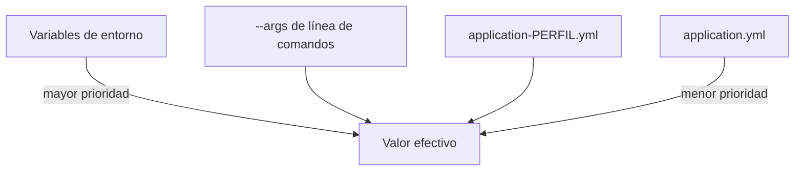
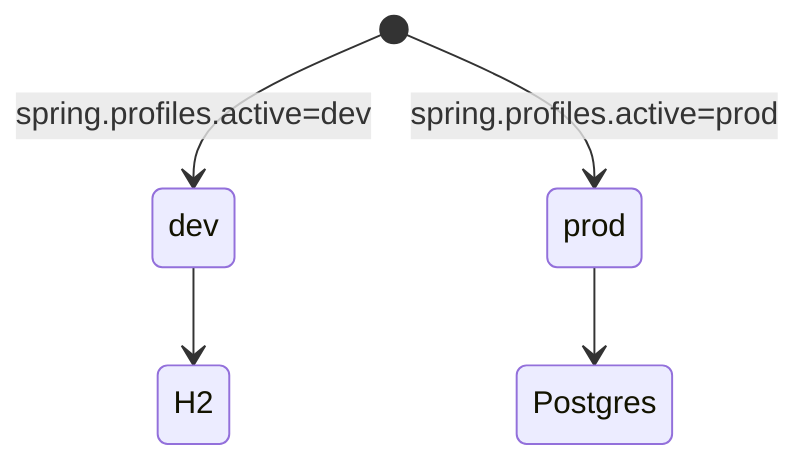

# Bloque IV · Spring Boot: configuración y perfiles

> Una API se despliega en dev, test y prod con la MISMA imagen pero distinta
> configuración. Spring Boot externaliza la config para que el código no cambie.

---

## 4.1 Jerarquía de configuración



Lo más específico gana: una variable de entorno pisa al `application.yml`.

---

## 4.2 `@Value` vs `@ConfigurationProperties`

```java
@Value("${app.timeout:30}") int timeout;          // valor suelto, con default

@ConfigurationProperties("app")                    // bloque tipado
record AppProps(int timeout, String region) {}
```

`@ConfigurationProperties` agrupa y valida; `@Value` es para un valor puntual.

---

## 4.3 Perfiles



Un bean `@Profile("prod")` solo existe si ese perfil está activo.

---

### Qué practicarás

Resolver propiedades con valor por defecto, enlazar un bloque tipado, elegir
fuente de datos por perfil, leer de "entorno" simulado y 12-factor.
