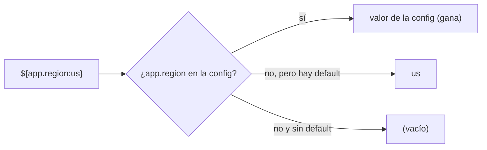
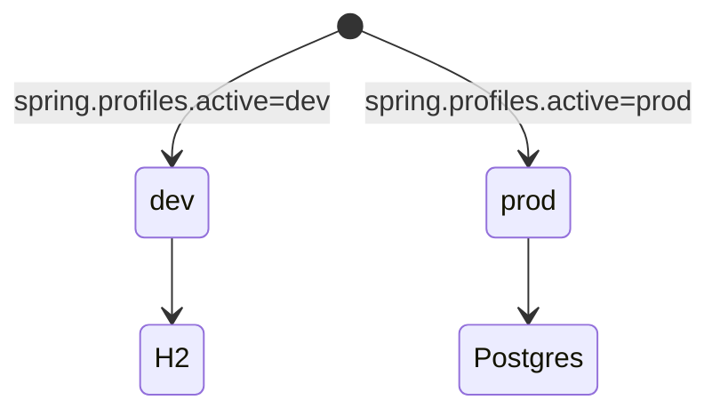
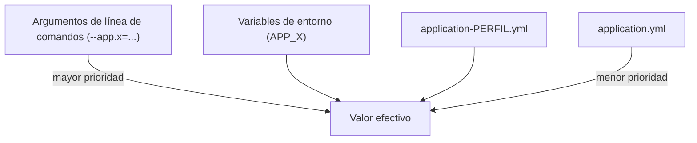
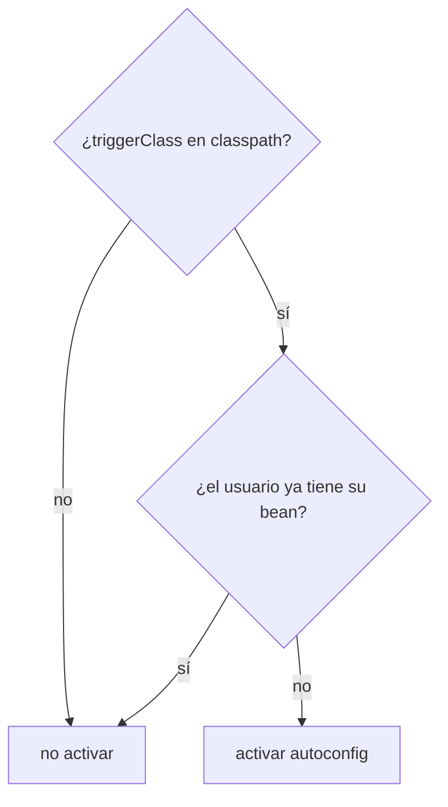

# Bloque IV · Spring Boot: configuración, perfiles y arranque

> Una API se despliega en dev, test y prod con la MISMA imagen pero distinta
> configuración. Spring Boot externaliza la config para que el código no cambie
> jamás entre entornos: solo cambian las propiedades que le das desde fuera.

## Cómo usar este documento

Igual que en los bloques anteriores: lee UNA sección → haz SU ejercicio →
vuelve. En este bloque casi todo se practica DOS veces: primero "a mano"
(simulando con un `Map` lo que Spring hace por dentro, para que entiendas la
mecánica) y luego con la API REAL de Spring (`Environment`, `@Value`,
`@ConfigurationProperties`) en los retos extra. Esa es la clave del bloque:
ver que la magia de Spring es lógica que tú mismo podrías escribir.

| Sección | Tema | Ejercicio |
|---|---|---|
| 4.1 | Propiedades y la sintaxis `${clave:default}` (`@Value`) | `Ej039ApplicationProperties` |
| 4.2 | `@ConfigurationProperties`: configuración tipada | `Ej040ConfigurationProperties` |
| 4.3 | Perfiles (`@Profile`) | `Ej041Profiles` |
| 4.4 | Externalización y precedencia (12-factor) | `Ej042ExternalizedConfig` |
| 4.5 | Autoconfiguración condicional | `Ej043AutoConfigurationInsight` |
| 4.6 | Arranque: `CommandLineRunner` / `ApplicationRunner` | `Ej044CommandLineRunner` |

---

## 4.1 Propiedades y la sintaxis `${clave:default}`

Spring carga tu `application.yml`/`application.properties` en un almacén
clave→valor. Para LEER una propiedad suelta dentro de un bean usas `@Value` con
una expresión entre `${...}`:

```java
@Value("${app.timeout:30}") int timeout;   // "lee app.timeout; si no está, 30"
```

La expresión tiene tres partes que debes saber descomponer:

```
${  app.timeout  :  30  }
└┬┘ └────┬─────┘ │ └┬┘ └┬┘
delim    clave  sep default delim
```

- **Delimitadores** `${` … `}`: si la cadena no empieza por `${` y termina por
  `}`, NO es una expresión válida (es texto literal) → no se resuelve.
- **Clave**: lo que va antes del primer `:`.
- **Default** (opcional): lo que va tras el primer `:`. Si la clave no existe en
  la config, se usa este valor en lugar de fallar.

La regla de oro: **la configuración externa GANA al default**. Si `app.region`
está definida, vale lo definido; el `:us` solo entra en juego cuando falta.



En el mundo real no manipularás esa cadena tú: Spring te da el objeto
`Environment`, que es el almacén de propiedades vivo del contexto. Sus métodos
clave:

| Método de `Environment` | Qué hace |
|---|---|
| `getProperty("clave")` | valor o `null` si no existe |
| `getProperty("clave", "default")` | valor o el default que le pasas |
| `getProperty("clave", Integer.class)` | valor convertido al tipo pedido |
| `containsProperty("clave")` | `true`/`false` sin devolver el valor |
| `getProperty("clave", List.class)` | una propiedad `a,b,c` la parte en lista |

`@Value` es azúcar sobre esto: por debajo resuelve la expresión contra el
`Environment`. Incluso admite anidación (`${app.env:${app.default-env:prod}}`):
si `app.env` falta, intenta `app.default-env`, y si esa también falta, `prod`.

> **Lo practicas en `Ej039ApplicationProperties`**: primero implementas a mano
> el parser de `${clave:default}` sobre un `Map`; luego lees del `Environment`
> real de Spring con conversión de tipos, defaults y comprobación de presencia.

---

## 4.2 `@ConfigurationProperties`: configuración tipada

Inyectar con `@Value("${app.token}")` cincuenta veces es frágil: un typo en la
clave es un bug en runtime, no en compilación. La alternativa de producción es
agrupar un bloque de propiedades en un objeto tipado:

```java
@ConfigurationProperties(prefix = "app.seguridad")
public record SeguridadProps(
        String jwtSecret,
        long expiracionHoras,
        List<String> dominiosPermitidos) {}
```

```yaml
app:
  seguridad:
    jwt-secret: "super-secreto-muy-largo-12345"
    expiracion-horas: 24
    dominios-permitidos:
      - "localhost"
      - "mi-app.com"
```

Fíjate en `jwt-secret` (yaml) → `jwtSecret` (campo): es el **relaxed binding**.
Spring acepta `kebab-case`, `camelCase`, `UPPER_SNAKE`… y los normaliza al
nombre del campo. `external-service-url`, `externalServiceUrl` y
`EXTERNAL_SERVICE_URL` enlazan al mismo sitio.

`@Value` vs `@ConfigurationProperties`, cuándo cada uno:

| | `@Value` | `@ConfigurationProperties` |
|---|---|---|
| Granularidad | un valor suelto | un bloque entero con prefijo |
| Tipado | String (conviertes a mano) | tipos reales (int, List, Duration, anidados) |
| Validación | manual | con `@Validated` + JSR-380 |
| Relaxed binding | no | sí |
| Uso típico | un flag puntual | la config de un módulo |

Spring Boot convierte tipos por ti: `"5s"` → `Duration.ofSeconds(5)`,
`"a,b,c"` → `List<String>`, `"8080"` → `int`. Esa conversión la pide
`@EnableConfigurationProperties(MisProps.class)` (o `@ConfigurationPropertiesScan`)
para registrar la clase como bean enlazable. A bajo nivel, la herramienta que
hace el enlace programático es el `Binder`:

```java
Binder.get(environment)
      .bind("app.seguridad", SeguridadProps.class)
      .orElseThrow();
```

> **Lo practicas en `Ej040ConfigurationProperties`**: enlazas un `Map` plano a
> un `record`/POJO validando y dando defaults; en los retos subes a binding
> jerárquico, listas/mapas, `Duration`, relaxed binding y el `Binder` real.

---

## 4.3 Perfiles (`@Profile`)

Un **perfil** es una etiqueta de entorno (`dev`, `test`, `prod`, `cloud`…). Lo
activas con `spring.profiles.active=dev`. Sirve para dos cosas:

1. **Cargar propiedades distintas**: `application-dev.yml` se superpone a
   `application.yml` cuando `dev` está activo.
2. **Activar beans distintos**: un bean `@Profile("prod")` solo existe si ese
   perfil está activo.



```java
@Configuration
@Profile("dev")
class DevConfig { /* solo en dev */ }

@Service
@Profile("!prod")          // en TODO menos prod
class NonProdService { }

@Component
@Profile("dev & cloud")    // expresión: dev Y cloud a la vez
class CloudDevService { }
```

La sintaxis de expresión: `!x` (no x), `x & y` (ambos), `x | y` (alguno).

Para consultar perfiles en runtime tienes el `Environment`:

| Método | Devuelve |
|---|---|
| `env.getActiveProfiles()` | `String[]` con los perfiles activos |
| `env.getDefaultProfiles()` | los que se usan si NO hay activos (por defecto `["default"]`) |
| `env.acceptsProfiles(Profiles.of("dev"))` | `true` si el perfil/expresión casa |
| `env.setActiveProfiles("dev","cloud")` | activa perfiles programáticamente (`ConfigurableEnvironment`) |

Idea clave para un reto: si `getActiveProfiles()` viene VACÍO, el entorno está
usando los perfiles por defecto. Es como Spring decide qué cargar cuando nadie
configuró nada.

> **Lo practicas en `Ej041Profiles`**: primero resuelves la URL de BD y el modo
> verbose por perfil con lógica pura; luego usas la API real para comprobar,
> activar y listar perfiles, y seleccionar el bean adecuado por su tipo.

---

## 4.4 Externalización y precedencia (12-factor)

El principio **12-factor** manda: la configuración vive en el ENTORNO, no en el
código ni en la imagen. La misma imagen Docker corre en dev y prod; lo único que
cambia son las variables de entorno. Por eso Spring define un orden de
precedencia: lo más específico/externo gana.



La regla que implementarás: **env > yml > default**. Y un detalle que confunde a
todo el mundo: la MISMA propiedad se escribe distinto según la fuente.

| Fuente | Formato de la clave | Ejemplo |
|---|---|---|
| `application.yml` | minúsculas con puntos | `app.region` |
| variable de entorno | MAYÚSCULAS con guion bajo | `APP_REGION` |
| kebab en yml | guiones | `connection-timeout` |

La traducción yml→entorno es mecánica: puntos y guiones → `_`, todo a
mayúsculas. `spring.datasource.connection-timeout` → `SPRING_DATASOURCE_CONNECTION_TIMEOUT`.
Spring hace esto para poder leer config de entornos donde solo existen variables
de entorno (contenedores, Kubernetes, Heroku…).

Por dentro, el `Environment` mantiene una lista ordenada de `PropertySource`
(cada fichero, las env vars, los args… son una fuente). El primero que tenga la
clave gana. Puedes manipular esa lista:

```java
var sources = env.getPropertySources();
sources.addFirst(new MapPropertySource("override", mapa));  // máxima prioridad
sources.addLast(new MapPropertySource("fallback", mapa));   // mínima prioridad
sources.remove("nombre");                                   // quitar una fuente
```

> **Lo practicas en `Ej042ExternalizedConfig`**: implementas la precedencia
> env>yml>default a mano (con la traducción de claves); en los retos manejas
> `PropertySource` reales: añadir con prioridad, detectar qué fuente sirve un
> valor, quitar fuentes y leer del sistema operativo.

---

## 4.5 Autoconfiguración condicional

La "magia" de Spring Boot: añades `spring-boot-starter-data-jpa` al `pom` y de
repente tienes un `DataSource`, un `EntityManager`, etc., sin configurarlos. Eso
es **autoconfiguración**: clases marcadas con condiciones que se activan SOLO si
se cumplen. Las condiciones más usadas:

| Anotación | Se activa si… |
|---|---|
| `@ConditionalOnClass(X.class)` | la clase X está en el classpath |
| `@ConditionalOnMissingBean(X.class)` | el usuario NO definió ya un bean X |
| `@ConditionalOnProperty(name="x", havingValue="true")` | la propiedad x vale true |
| `@ConditionalOnWebApplication` | el contexto es web (hay servlet) |
| `@ConditionalOnNotWebApplication` | el contexto NO es web |

La decisión típica es la combinación de las dos primeras: "activa esta config si
la librería está presente Y el usuario no ha puesto la suya". Ese es el patrón
que replicarás: **clase presente Y bean de usuario ausente → activar**.



El orden importa: primero la clase (más barato de descartar), luego el bean.
`@ConditionalOnMissingBean` es lo que te deja "sobrescribir" cualquier
autoconfig simplemente declarando tu propio bean: el tuyo gana y la autoconfig
se aparta. Las autoconfiguraciones se registran en
`META-INF/spring/...AutoConfiguration.imports` y se pueden excluir con
`@SpringBootApplication(exclude = X.class)`.

> **Lo practicas en `Ej043AutoConfigurationInsight`**: implementas la decisión
> `shouldActivate` (clase + missing bean); en los retos lees exclusiones de
> `@SpringBootApplication`, eliges bean de usuario vs autoconfigurado, ordenas
> autoconfiguraciones y lees el `ConditionEvaluationReport`.

---

## 4.6 Arranque: `CommandLineRunner` / `ApplicationRunner`

Tras levantar el contexto, a veces quieres ejecutar algo UNA vez al arrancar:
sembrar datos, verificar conexiones, imprimir un banner. Spring ofrece dos
interfaces funcionales que se ejecutan justo después del arranque:

```java
@Component
class Seeder implements CommandLineRunner {
    public void run(String... args) {        // args crudos, como en main()
        // sembrar datos...
    }
}

@Component
class Inspector implements ApplicationRunner {
    public void run(ApplicationArguments args) {   // args YA parseados
        args.getOptionNames();                     // nombres de --opciones
        args.getOptionValues("region");            // valores de una opción
        args.getNonOptionArgs();                   // los que no empiezan por --
    }
}
```

Diferencia esencial:

| | `CommandLineRunner` | `ApplicationRunner` |
|---|---|---|
| Firma | `run(String... args)` | `run(ApplicationArguments args)` |
| Args | crudos (`"--region=eu"`) | parseados (opciones vs no-opciones) |
| Cuándo | parseo simple a mano | cuando quieres la API de argumentos |

Patrones del bloque:

- **Idempotencia**: un runner de seed debe ejecutarse una sola vez; guarda un
  flag `ejecutado` y haz `return` temprano si ya corrió.
- **Orden**: varios runners se ordenan con `@Order(1)`, `@Order(2)`… (menor =
  antes). Se lee por reflexión con `AnnotationUtils.findAnnotation`.
- **`ExitCodeGenerator`**: un bean que devuelve `getExitCode()` para que la app
  termine con un código de salida concreto (útil en jobs/batch).
- **Parseo `--clave=valor`**: quita el `--`, parte por el PRIMER `=`
  (`split("=", 2)`); sin `=`, el valor es `""`.

> **Lo practicas en `Ej044CommandLineRunner`**: implementas un runner idempotente
> que parsea `--clave=valor`; en los retos creas `CommandLineRunner`/
> `ApplicationRunner`/`ExitCodeGenerator` reales, lees `@Order` por reflexión y
> explotas la API de `ApplicationArguments`.

---

## Errores comunes del bloque

| # | Error | Antídoto |
|---|---|---|
| 1 | Tratar `app.region` como expresión sin `${...}` | Solo es expresión si empieza por `${` y acaba en `}`; si no, formato inválido → "" |
| 2 | Que el default pise al valor de la config | La config externa SIEMPRE gana; el default solo si la clave falta |
| 3 | Buscar `APP_REGION` en el yml o `app.region` en env | Cada fuente su formato: env=MAYÚS_, yml=minus.con.puntos |
| 4 | Usar `getProperty` esperando excepción si falta | Devuelve `null`; usa la sobrecarga con default o `containsProperty` |
| 5 | `@Profile("dev,cloud")` creyendo que es "y" | La coma es OR implícito; para "y" usa `@Profile("dev & cloud")` |
| 6 | Olvidar que sin perfiles activos manda `getDefaultProfiles()` | `getActiveProfiles()` vacío ⇒ se usan los default |
| 7 | Activar autoconfig sin comprobar `@ConditionalOnMissingBean` | Si el usuario ya tiene su bean, la autoconfig se aparta |
| 8 | Runner de seed que corre en cada `run()` | Idempotencia: flag + `return` temprano |
| 9 | `split("=")` en `--k=v=x` parte de más | `split("=", 2)`: clave y resto íntegro |
| 10 | `Integer.parseInt` sin envolver el `NumberFormatException` | Captúralo y relánzalo como `IllegalArgumentException` con causa |

## Chuleta final del bloque

```
${clave:default}  = config externa GANA · default solo si falta · sin ${} → inválido
@Value            = un valor suelto · azúcar sobre Environment.getProperty
Environment       = getProperty(k) | getProperty(k,def) | getProperty(k,T.class) | containsProperty
@ConfigurationProperties(prefix) = bloque tipado · relaxed binding (kebab=camel=SNAKE)
Binder.get(env).bind(prefix, Tipo.class) = enlace programático
@Profile          = "dev" · "!prod" · "dev & cloud" · coma = OR
perfiles          = getActiveProfiles() vacío ⇒ getDefaultProfiles()
precedencia       = args > env(APP_X) > application-perfil.yml > application.yml
PropertySource    = addFirst (gana) · addLast (fallback) · remove(nombre)
autoconfig        = OnClass(presente) & OnMissingBean(ausente) → activar
runners           = CommandLineRunner(String...) · ApplicationRunner(ApplicationArguments) · @Order
arranque          = idempotente (flag) · split("=",2) · ExitCodeGenerator.getExitCode()
```

## Autoevaluación (responde sin mirar; si fallas 2+, relee la sección)

1. ¿Qué condiciones debe cumplir una cadena para ser una expresión `${...}`
   válida, y quién gana entre el valor de la config y el default? *(4.1)*
2. ¿Qué ventajas concretas da `@ConfigurationProperties` frente a repetir
   `@Value`? ¿Qué es el relaxed binding? *(4.2)*
3. Escribe la anotación para un bean que exista en `dev` y `cloud` a la vez, y
   otra para "en todo menos prod". ¿Qué hace la coma en `@Profile`? *(4.3)*
4. Una propiedad `spring.datasource.connection-timeout` del yml, ¿cómo se
   llamaría como variable de entorno? ¿Cuál de las dos gana? *(4.4)*
5. ¿Qué dos condiciones evalúa el patrón clásico de autoconfiguración y en qué
   orden conviene comprobarlas? *(4.5)*
6. ¿Para qué sirve `@ConditionalOnMissingBean` desde el punto de vista del que
   usa la librería? *(4.5)*
7. ¿Qué diferencia hay entre `CommandLineRunner` y `ApplicationRunner`? ¿Cómo
   garantizas que un runner de seed corra una sola vez? *(4.6)*
8. ¿Por qué `split("=")` es peligroso al parsear `--clave=valor` y qué usarías?
   *(4.6)*
