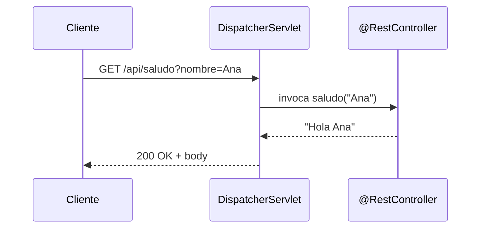
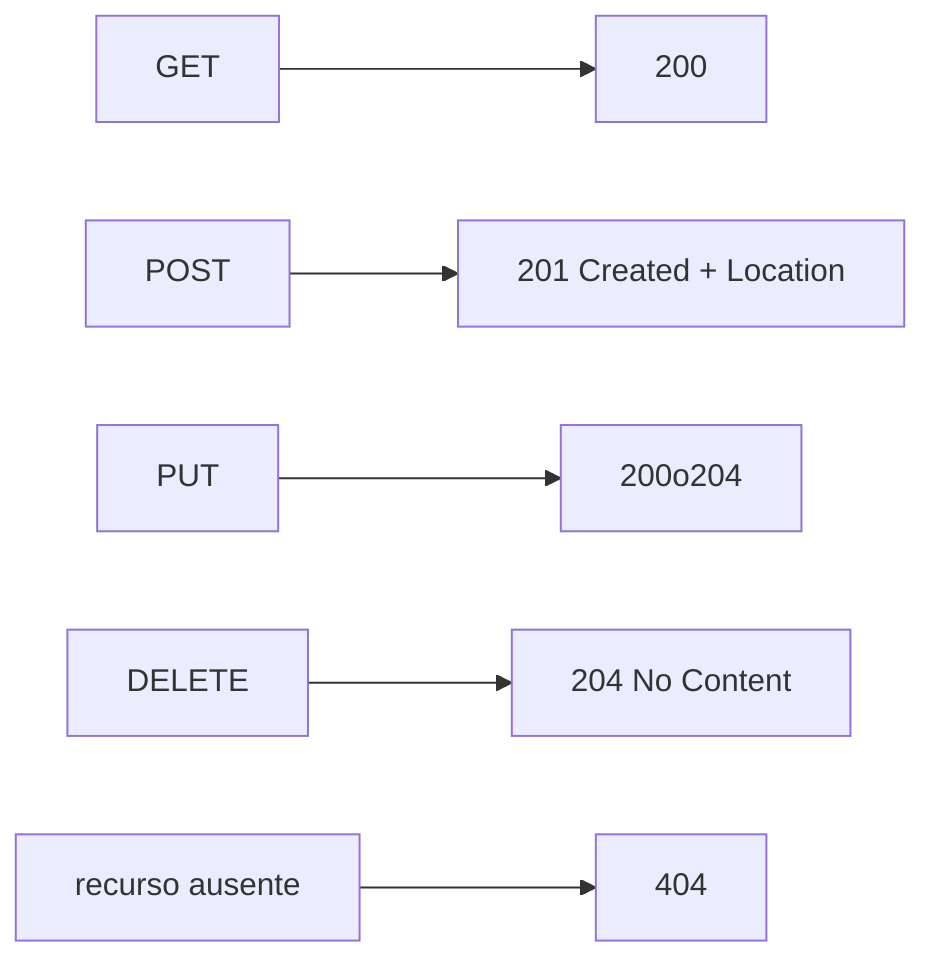

# Bloque V · Controllers REST básicos

> Aquí Spring deja de ser teoría. Un `@RestController` mapea peticiones HTTP a
> métodos Java. Es el corazón de la API.

---

## 5.1 El flujo de una petición

---

## 5.2 Anotaciones de mapeo

| Anotación | HTTP |
|---|---|
| `@GetMapping` | GET |
| `@PostMapping` | POST |
| `@PutMapping` | PUT |
| `@PatchMapping` | PATCH |
| `@DeleteMapping` | DELETE |
| `@PathVariable` | parte de la ruta `/x/{id}` |
| `@RequestParam` | query `?clave=valor` |
| `@RequestBody` | cuerpo JSON |

---

## 5.3 Códigos correctos por verbo

`ResponseEntity` da control total sobre status, headers y body.

---

### Qué practicarás

Controllers con todos los verbos, path/query params, `@RequestBody`,
`ResponseEntity`, CRUD en memoria y negociación. Los tests usan `MockMvc`
en modo standalone (sin levantar servidor).
