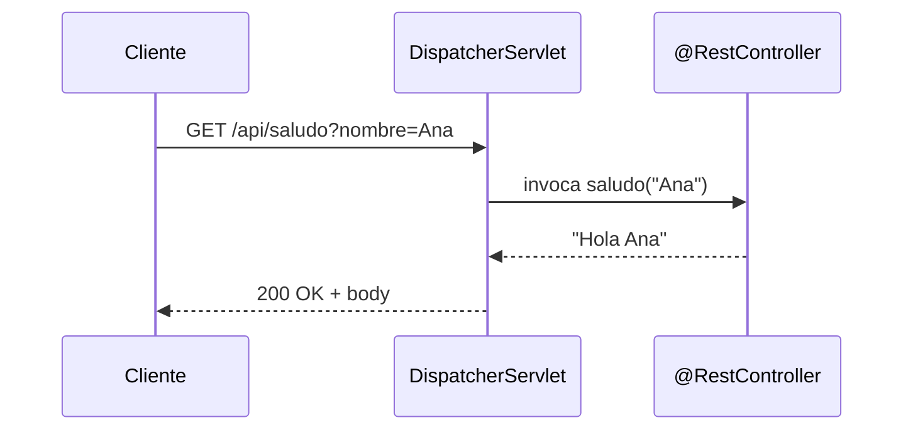
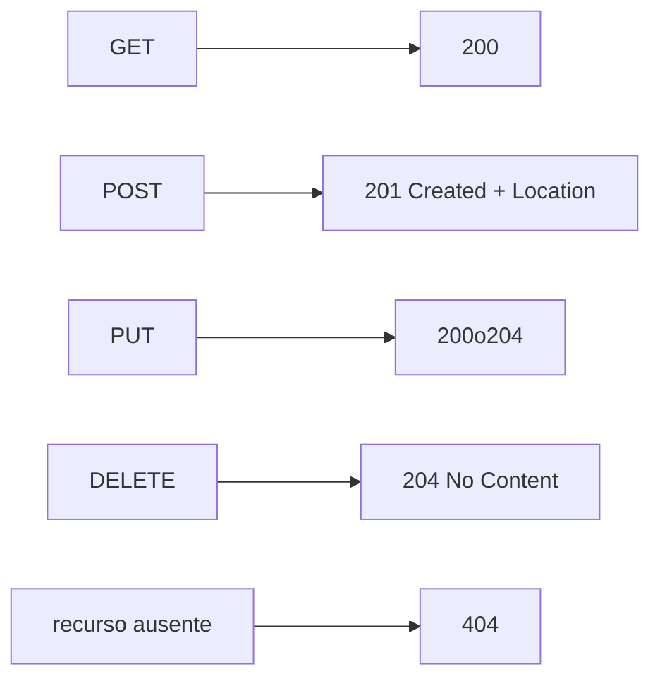

# Bloque V · Controllers REST básicos

> Aquí Spring deja de ser teoría. Un `@RestController` mapea peticiones HTTP a
> métodos Java. Es el corazón de la API.

---

## 5.1 El flujo de una petición



---

## 5.2 Anotaciones de mapeo

| Anotación | HTTP |
|---|---|
| `@GetMapping` | GET |
| `@PostMapping` | POST |
| `@PutMapping` | PUT |
| `@PatchMapping` | PATCH |
| `@DeleteMapping` | DELETE |
| `@PathVariable` | parte de la ruta `/x/{id}` |
| `@RequestParam` | query `?clave=valor` |
| `@RequestBody` | cuerpo JSON |

---

## 5.3 Códigos correctos por verbo



`ResponseEntity` da control total sobre status, headers y body.

---

### Qué practicarás

Controllers con todos los verbos, path/query params, `@RequestBody`,
`ResponseEntity`, CRUD en memoria y negociación. Los tests usan `MockMvc`
en modo standalone (sin levantar servidor).


## Teoría Extendida y Ejemplos de Código

### 1. Estructura de un Controller Canónico
```java
@RestController
@RequestMapping("/api/v1/usuarios")
public class UsuarioController {

    private final UsuarioService service;
    
    public UsuarioController(UsuarioService service) {
        this.service = service;
    }

    // GET /api/v1/usuarios?estado=ACTIVO
    @GetMapping
    public List<UsuarioDto> listar(@RequestParam(defaultValue = "ACTIVO") String estado) {
        return service.buscarPorEstado(estado);
    }

    // GET /api/v1/usuarios/42
    @GetMapping("/{id}")
    public ResponseEntity<UsuarioDto> detalle(@PathVariable Long id) {
        return service.buscar(id)
            .map(ResponseEntity::ok)
            .orElseThrow(() -> new RecursoNoEncontradoException(id));
    }

    // POST /api/v1/usuarios
    @PostMapping
    public ResponseEntity<UsuarioDto> crear(@RequestBody @Valid UsuarioCreateDto dto) {
        UsuarioDto creado = service.crear(dto);
        URI location = ServletUriComponentsBuilder.fromCurrentRequest()
            .path("/{id}").buildAndExpand(creado.id()).toUri();
        return ResponseEntity.created(location).body(creado); // 201 Created
    }
}
```
