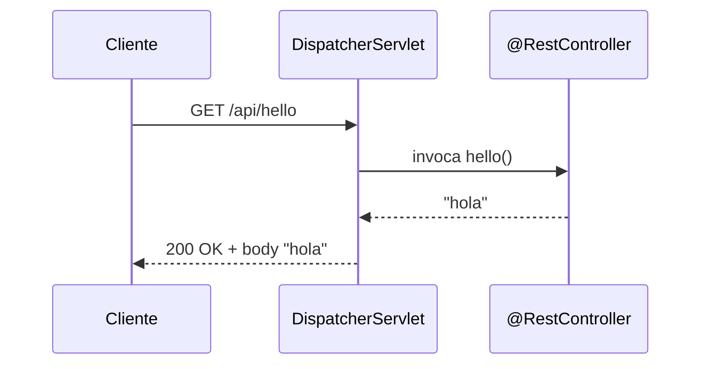
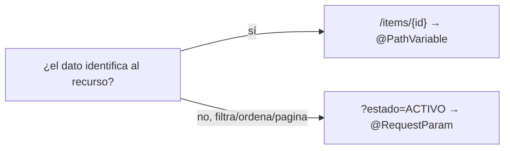
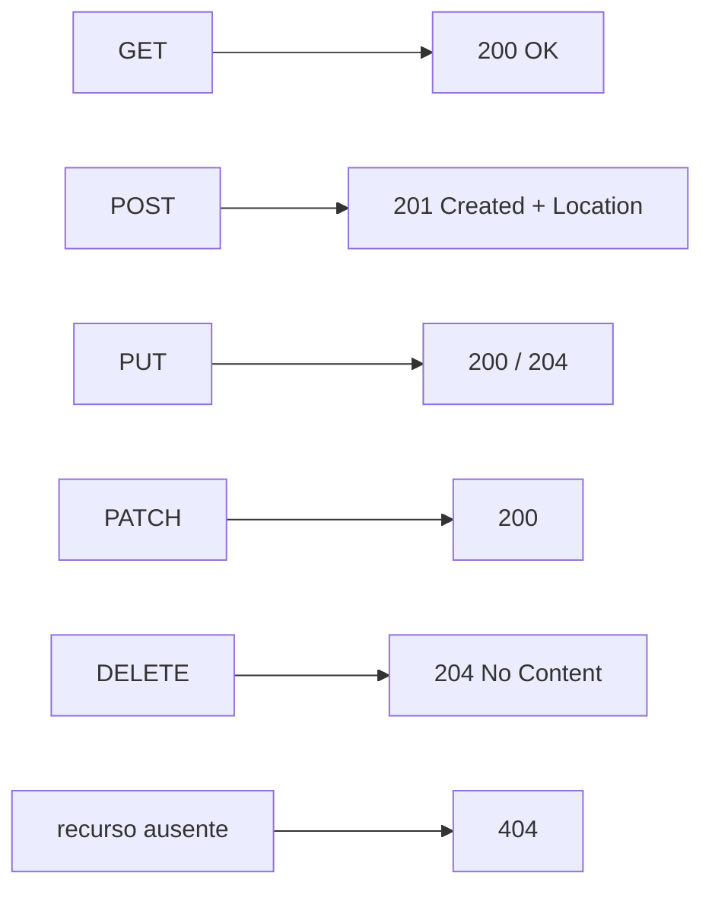
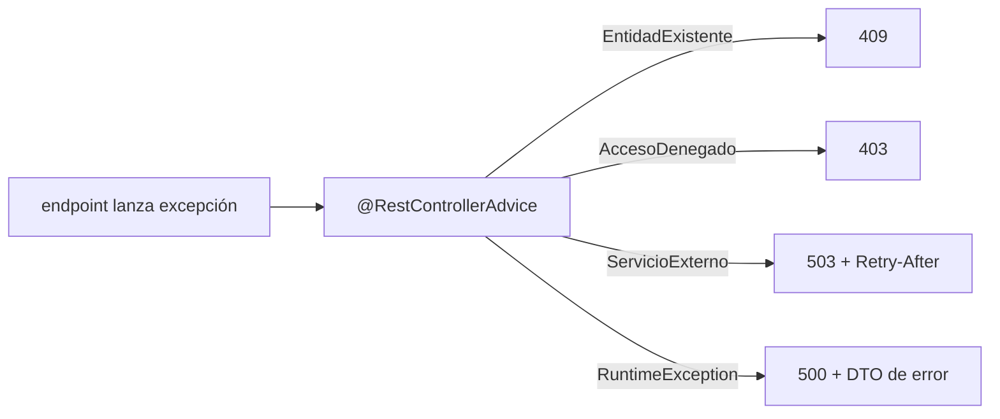

# Bloque V · Controllers REST básicos

> Aquí Spring deja de ser teoría. Un `@RestController` traduce peticiones HTTP a
> métodos Java y métodos Java a respuestas HTTP. Todo lo de los bloques 0-4
> (HTTP, JSON, IoC, Boot) confluye en este punto: es el corazón de la API.

## Cómo usar este documento

Lee UNA sección → haz SU ejercicio → vuelve. Cada sección cierra con el recuadro
**"Lo practicas en…"**. Los tests usan **MockMvc en modo standalone** (sin
levantar servidor ni Tomcat): instancian tu controlador, simulan la petición y
comprueban status, cabeceras y cuerpo. Eso significa que cada pista de los
ejercicios cuadra con un valor EXACTO que el test verifica.

| Sección | Tema | Ejercicio |
|---|---|---|
| 5.1 | El primer `@RestController` y el flujo de una petición | `Ej045HelloController` |
| 5.2 | `@PathVariable`: datos en la ruta | `Ej046PathVariables` |
| 5.3 | `@RequestParam`: la query string | `Ej047QueryParams` |
| 5.4 | `@RequestBody` y 201 Created | `Ej048RequestBodyPost` |
| 5.5 | `ResponseEntity`: control total de la respuesta | `Ej049ResponseEntity` |
| 5.6 | PUT: reemplazo total e idempotencia | `Ej050PutFullUpdate` |
| 5.7 | PATCH: modificación parcial | `Ej051PatchPartialUpdate` |
| 5.8 | DELETE y 204 No Content | `Ej052DeleteResource` |
| 5.9 | CRUD completo en memoria | `Ej053CrudInMemory` |
| 5.10 | Manejo central de errores con `@RestControllerAdvice` | `Ej054RestControllerAdviceIntro` |

---

## 5.1 El primer `@RestController` y el flujo de una petición

Un `@RestController` es un bean de Spring (bloque 3) cuyos métodos están mapeados
a rutas HTTP. Cuando llega una petición, el `DispatcherServlet` (el "recepcionista"
de Spring MVC) decide qué método invocar, le pasa los datos ya convertidos y
serializa lo que devuelvas como cuerpo de la respuesta.



Estructura mínima:

```java
@RestController
@RequestMapping("/api")          // prefijo común a todos los métodos
public class HelloController {

    @GetMapping("/hello")        // ruta final = /api/hello
    public String hello() {
        return "hola";           // el return ES el cuerpo de la respuesta
    }
}
```

Las dos claves de un `@RestController`:

1. **El valor RETORNADO es la respuesta.** Nada de `System.out.println`: lo que
   devuelves se convierte en el cuerpo HTTP. Un `String` sale como `text/plain`;
   un objeto (record, Map…) lo serializa Jackson a JSON automáticamente (bloque 2).
2. **`@RestController` = `@Controller` + `@ResponseBody`.** Sin `@RestController`,
   un `@Controller` interpretaría el return como el nombre de una vista (eso es
   el bloque 25, Thymeleaf). Aquí siempre devolvemos DATOS, no vistas.

La anotación `@RequestMapping("/api")` a nivel de clase prefija TODAS las rutas;
las anotaciones por método (`@GetMapping`, `@PostMapping`, …) añaden el resto.

Tres herramientas que ya asoman en este ejercicio y verás todo el bloque:

- **`@RequestHeader("X-User-Name")`** lee una cabecera de la petición (metadatos:
  auth, idioma, trazas). Los datos de negocio van en ruta/query/cuerpo; las
  cabeceras, lo "meta".
- **`@ResponseStatus(HttpStatus.CREATED)`** fija el código de forma declarativa
  (cuando es SIEMPRE el mismo). Para un código que depende de la lógica, usa
  `ResponseEntity` (5.5).
- **`produces` / `consumes`** restringen el `Content-Type` de salida y de entrada
  respectivamente (negociación de contenido).

> **Lo practicas en `Ej045HelloController`**: primer endpoint GET, lectura de
> cabeceras, serialización JSON, `@ResponseStatus`, rutas múltiples, `produces`/
> `consumes` y un contador en memoria thread-safe.

---

## 5.2 `@PathVariable`: datos en la ruta

Cuando el dato es **parte de la identidad del recurso** va en la ruta:
`/api/items/42`. Se captura con `@PathVariable` enlazando un `{token}` de la URL
a un parámetro del método.

```java
@GetMapping("/items/{id}")
public ItemDto detalle(@PathVariable Long id) { ... }   // /items/42 → id = 42
```

| Situación | Cómo se resuelve |
|---|---|
| El parámetro se llama igual que el `{token}` | `@PathVariable Long id` (sin nombre) |
| Se llaman distinto | `@PathVariable("id") Long otroNombre` |
| Varias variables | `/multi/{p1}/sub/{p2}` → dos `@PathVariable` |
| Capturar todas en bloque | `@PathVariable Map<String,String> vars` |
| Variable "opcional" | mapea dos rutas: `{"/x", "/x/{extra}"}` + `Optional<String>` |

**Conversión automática de tipos.** Spring convierte el segmento de texto al tipo
del parámetro: `Integer`, `Long`, `UUID`, `LocalDate` (con `@DateTimeFormat`),
enums, incluso `List<Long>` desde `10,20,30`. Si la conversión falla (`/buscar/abc`
para un `int`), Spring lanza `MethodArgumentTypeMismatchException` → 400 (la
gestionarás en 5.10).

**Restricción con regex.** Un `{token}` admite una expresión regular con la
sintaxis `{nombre:regex}`. Si la URL no casa, ni siquiera entra al método → 404:

```java
@GetMapping("/codigo/{codigo:[A-Z]+-[0-9]+}")   // ABC-1234 entra; abc-1234 → 404
```

**Matrix variables** (avanzado): pares `clave=valor` dentro de un segmento con
`;` (`/coches/renault;color=rojo;anio=2020`), capturados con `@MatrixVariable`.
En Spring 6 el `PathPatternParser` por defecto ya las conserva.

> **Lo practicas en `Ej046PathVariables`**: eco de segmentos, nombres explícitos,
> conversión a Integer/UUID/LocalDate, regex de ruta, variable opcional, captura
> en Map, listas y matrix variables.

---

## 5.3 `@RequestParam`: la query string

Cuando el dato **filtra, pagina u ordena** (no identifica al recurso) va en la
query string: `/api/sum?a=2&b=3`. Se captura con `@RequestParam`.

```java
@GetMapping("/sum")
public String sum(@RequestParam int a,
                  @RequestParam(defaultValue = "0") int b) {   // b opcional
    return String.valueOf(a + b);
}
```

Reglas que castigan los tests:

| Forma | Significado |
|---|---|
| `@RequestParam int a` | **obligatorio**: si falta → 400 automático |
| `@RequestParam(defaultValue = "0")` | opcional con valor base |
| `@RequestParam(required = false) Optional<String> q` | opcional sin default (vacío si no viene) |
| `@RequestParam(name = "username") String user` | desacopla nombre del param y de la variable |
| `@RequestParam List<String> nombres` | multi-valor (`?n=a&n=b` o `a,b`) |
| `@RequestParam Map<String,String> params` | TODOS los params en un mapa |

`@PathVariable` vs `@RequestParam` — la regla de diseño REST:



La conversión de tipos es la misma que en 5.2: `Integer`, `Boolean`, `LocalDate`
(con `@DateTimeFormat`), enums (por nombre: `?dia=LUNES` → `DiaSemana.LUNES`)…

> **Lo practicas en `Ej047QueryParams`**: parámetros obligatorios y con default,
> multi-valor, Map, Optional, Boolean, LocalDate, enums, nombre explícito y
> validación manual.

---

## 5.4 `@RequestBody` y 201 Created

Para crear o enviar estructuras complejas, el cliente manda un **cuerpo JSON** que
`@RequestBody` deserializa a un objeto Java (Jackson, bloque 2):

```java
@PostMapping
public ResponseEntity<ItemOut> crear(@RequestBody ItemIn entrada) {
    ItemOut creado = new ItemOut(1L, entrada.nombre());
    URI location = URI.create("/api/items/" + creado.id());
    return ResponseEntity.created(location).body(creado);   // 201 + Location
}
```

El contrato de un POST de creación bien hecho:

- **201 Created**, no 200. La operación creó algo nuevo.
- **Cabecera `Location`** apuntando al recurso recién creado (`/api/items/1`).
  `ResponseEntity.created(uri)` pone el 201 y la cabecera de golpe.
- **El cuerpo** suele devolver el recurso creado (con su id asignado).



Variantes que practica el ejercicio:

- **Validación manual** → 400 (cuerpo malformado) o **422 Unprocessable Entity**
  (sintaxis válida pero regla de negocio incumplida).
- **`consumes`** restringe el `Content-Type` aceptado (XML → 415).
- **Tipos anidados**: Jackson deserializa `Map` y records dentro de records.
- **`@RequestBody(required = false)`**: el cuerpo puede faltar (validas a mano).
- Combinar `@RequestBody` con `@RequestHeader`.
- Construir el `Location` absoluto con `ServletUriComponentsBuilder`.

> **Lo practicas en `Ej048RequestBodyPost`**: creación 201 con Location, listas,
> 422, tipos anidados, `consumes`, cuerpo opcional, conflicto 409, Location
> absoluta, respuesta minimal y `LocalDate` en el cuerpo.

---

## 5.5 `ResponseEntity`: control total de la respuesta

Devolver un objeto te da 200 + JSON automático. Cuando necesitas decidir **status,
cabeceras y cuerpo** a mano, devuelves un `ResponseEntity<T>`:

```java
return ResponseEntity.status(HttpStatus.I_AM_A_TEAPOT)   // 418
        .header("X-Powered-By", "masterclass")
        .body("no coffee");
```

Los atajos del builder que más usarás:

| Atajo | Status | Uso |
|---|---|---|
| `ResponseEntity.ok(body)` | 200 | respuesta normal con cuerpo |
| `ResponseEntity.status(s).body(b)` | s | cualquier código + cuerpo |
| `ResponseEntity.created(uri).body(b)` | 201 | creación con Location |
| `ResponseEntity.noContent().build()` | 204 | éxito sin cuerpo (`<Void>`) |
| `ResponseEntity.notFound().build()` | 404 | recurso ausente |
| `ResponseEntity.badRequest().body(b)` | 400 | entrada inválida |

`build()` cierra el builder SIN cuerpo; `body(x)` lo cierra CON cuerpo. El genérico
`ResponseEntity<?>` permite que distintas ramas devuelvan tipos distintos (un DTO
de error o un String). Con `ResponseEntity` controlas también `Cache-Control`,
`Content-Disposition` (descargas), `ETag`/`If-None-Match` (caché condicional →
304), `Location` (redirección 302), `Set-Cookie`, etc.

> **Lo practicas en `Ej049ResponseEntity`**: 204, Cache-Control, descarga CSV,
> ETag/304, cookies, errores estructurados, redirección 302, 201 sin Location,
> status custom y HTML explícito.

---

## 5.6 PUT: reemplazo total e idempotencia

`PUT /api/items/{id}` **reemplaza por completo** el recurso: el cliente manda la
representación entera, no campos sueltos.

```java
@PutMapping("/{id}")
public ItemDto reemplazar(@PathVariable long id, @RequestBody ItemBody cuerpo) {
    return new ItemDto(id, cuerpo.nombre());   // id de la ruta, datos del cuerpo
}
```

La propiedad clave: **PUT es idempotente**. Repetir la misma petición N veces deja
el sistema en el mismo estado (a diferencia de POST, que crearía N recursos). De
ahí nacen patrones de robustez que practica el ejercicio:

- **Bloqueo optimista** (`version`): si la versión del cliente ≠ la actual →
  **412 Precondition Failed** (alguien la cambió antes). Es lo que automatiza
  `@Version` de JPA en el bloque 14.
- **`If-Match`** (ETag de escritura): si falta la cabecera → **428 Precondition
  Required**; si no coincide → 412.
- **Upsert**: crea (201) si no existe, actualiza (200) si existe.
- **Validación cruzada** id-de-ruta vs id-de-cuerpo → 400 si no coinciden.
- Lanzar una excepción `@ResponseStatus(NOT_FOUND)` para el 404 sin escribir
  `ResponseEntity` (anticipo del bloque 9).

> **Lo practicas en `Ej050PutFullUpdate`**: reemplazo total, bloqueo optimista
> (412), upsert (200/201), If-Match (428/412), validación de formato, historial,
> 404 por excepción, 204 con cabeceras, conflicto 409 y validación cruzada.

---

## 5.7 PATCH: modificación parcial

`PATCH /api/items/{id}` cambia **solo los campos enviados**; el resto se conserva.
Es la diferencia esencial con PUT.

```java
@PatchMapping("/{id}")
public ItemDto patch(@PathVariable long id, @RequestBody Map<String,Object> cambios) {
    String nombre = "viejo"; boolean activo = true;          // estado base
    if (cambios.containsKey("nombre")) nombre = (String) cambios.get("nombre");
    if (cambios.containsKey("activo")) activo = (Boolean) cambios.get("activo");
    return new ItemDto(id, nombre, activo);
}
```

Dos formas de modelar "campo no enviado":

| Técnica | "Ausente" se detecta como |
|---|---|
| `Map<String,Object>` | `!cambios.containsKey("campo")` |
| DTO con wrappers (`String`, `Boolean`) | el campo llega `null` |

> ⚠ Con un DTO usa tipos **wrapper** (`Boolean`, no `boolean`): un `boolean`
> primitivo siempre vale `false` y no puedes distinguir "envió false" de "no envió".

Al recibir un `Map<String,Object>` te toca **validar los tipos a mano** (Jackson
no sabe que `"activo"` debe ser boolean) y proteger campos de solo lectura (el id).
El ejercicio también simula JSON Patch (RFC 6902): una lista de operaciones
`{op, path, value}` que aplicas en orden.

> **Lo practicas en `Ej051PatchPartialUpdate`**: PATCH con DTO parcial, colecciones
> anidadas, contador, JSON Patch, validación de tipos (400), campos de solo
> lectura, auditoría por cabecera, validación cruzada (422), conflicto (409) y
> If-Match (428/412).

---

## 5.8 DELETE y 204 No Content

`DELETE /api/items/{id}` borra el recurso. El éxito típico es **204 No Content**
(borrado, nada que devolver), y **404** si no existía.

```java
@DeleteMapping("/{id}")
public ResponseEntity<Void> borrar(@PathVariable long id) {
    if (id <= 0) return ResponseEntity.notFound().build();   // 404
    return ResponseEntity.noContent().build();               // 204
}
```

Como PUT, **DELETE es idempotente**: borrar dos veces deja el mismo estado.
Variantes del ejercicio:

- **Físico** (204) vs **lógico** (200 con `activo=false`: marcar en vez de borrar,
  para conservar histórico).
- Borrado por filtro (query param) o en lote (lista de ids en el cuerpo).
- Autorización por cabecera → **403**; dependencias sin cascada → **409**;
  recurso bloqueado → **423 Locked**; precondición fallida → **412**.

> **Lo practicas en `Ej052DeleteResource`**: 204/404, borrado físico y lógico,
> filtro por query, protección 403, dependencias 409, backup, bloqueo 423,
> precondición 412, borrado en lote e idempotencia con ETag.

---

## 5.9 CRUD completo en memoria

Aquí se integra todo: GET (listar/detalle), POST (crear), PUT/PATCH (actualizar)
y DELETE sobre un **almacén en memoria** thread-safe.

```java
private final Map<Long, Tarea> db = new ConcurrentHashMap<>();
private final AtomicLong seq = new AtomicLong(0);

@PostMapping
public ResponseEntity<Tarea> crear(@RequestBody Tarea nueva) {
    long id = seq.incrementAndGet();              // id atómico
    Tarea creada = new Tarea(id, nueva.titulo());
    db.put(id, creada);
    return ResponseEntity.status(HttpStatus.CREATED).body(creada);
}
```

Por qué `ConcurrentHashMap` + `AtomicLong` y no `HashMap` + `long++`: un controlador
es un **singleton** que atiende muchas peticiones a la vez (bloque 1.11). Con
estructuras no concurrentes perderías datos bajo carga. El patrón
`map(ResponseEntity::ok).orElseGet(() -> ResponseEntity.notFound().build())`
(Optional, bloque 1.2) traduce "existe/no existe" a 200/404 sin `if` anidados.

Este es el esqueleto que en el bloque 12 sustituirás por un `JpaRepository`: la
firma `JpaRepository<Tarea, Long>` es exactamente este `Map<Long, Tarea>` con
persistencia real detrás.

> **Lo practicas en `Ej053CrudInMemory`**: ciclo de vida completo, PUT/PATCH con
> 404, filtrado, vaciado, conteo, alta masiva, duplicado, toggle, paginación
> manual (skip/limit) y "primer elemento" con Optional.

---

## 5.10 Manejo central de errores con `@RestControllerAdvice`

Repetir `try/catch` en cada endpoint es ruido. Spring permite **centralizar** la
traducción excepción → HTTP. Empieza por el handler LOCAL (`@ExceptionHandler` en
el propio controlador):

```java
@GetMapping("/div")
public String dividir(@RequestParam int a, @RequestParam int b) {
    if (b == 0) throw new DivisionInvalidaException("division por cero");
    return String.valueOf(a / b);     // NO captures aquí: deja volar la excepción
}

@ExceptionHandler(DivisionInvalidaException.class)
public ResponseEntity<String> manejar(DivisionInvalidaException ex) {
    return ResponseEntity.badRequest().body(ex.getMessage());   // 400
}
```

Y el handler GLOBAL: una clase `@RestControllerAdvice` recoge los `@ExceptionHandler`
de TODOS los controladores en un sitio.



Tres ideas que castiga el ejercicio:

1. **El más específico gana.** Si tienes handlers para `EntidadExistenteException`
   y para `RuntimeException` (su superclase), una `EntidadExistenteException` va al
   primero; el genérico solo recoge lo no cubierto.
2. **Excepciones del propio framework** también se manejan:
   `MethodArgumentTypeMismatchException` (400), `MissingServletRequestParameterException`
   (400), `HttpRequestMethodNotSupportedException` (405),
   `HttpMediaTypeNotSupportedException` (415).
3. **Cuerpo de error estructurado**: en vez de un texto suelto, un DTO
   (`timestamp, status, mensaje, ruta`). Es la base del bloque 9 (errores) y de
   `ProblemDetail` (RFC 7807).

> **Lo practicas en `Ej054RestControllerAdviceIntro`**: handler local (400),
> `@RestControllerAdvice` global y handlers para type mismatch, param ausente,
> conflicto (409), runtime genérica (500 + DTO), método no soportado (405),
> acceso denegado (403) y servicio externo (503 + Retry-After).

---

## Errores comunes del bloque

| # | Error | Antídoto |
|---|---|---|
| 1 | Usar `@Controller` en vez de `@RestController` | Sin `@ResponseBody` el return se trata como vista, no como datos |
| 2 | `System.out.println` en el endpoint | El valor RETORNADO es la respuesta; imprimir no manda nada al cliente |
| 3 | Nombre del `@PathVariable` distinto del `{token}` | Coincídelos o usa `@PathVariable("token")` |
| 4 | Olvidar `@RequestBody` en un POST | El cuerpo JSON no se deserializa; el objeto llega null/vacío |
| 5 | POST de creación devolviendo 200 | Debe ser 201 + cabecera `Location` |
| 6 | 204 con cuerpo | Un 204 NO lleva body: usa `ResponseEntity<Void>` + `build()` |
| 7 | PATCH con DTO de campos `boolean` primitivos | Usa wrappers (`Boolean`): null = "no enviado" |
| 8 | Capturar la excepción en el endpoint y devolver 200 | Déjala volar al `@ExceptionHandler`/`@RestControllerAdvice` |
| 9 | Handler genérico `RuntimeException` "se come" los específicos | Spring elige el más concreto; ordénalos por especificidad mental |
| 10 | Estado de controlador en `HashMap`/`int++` | Singleton concurrente: `ConcurrentHashMap` + `AtomicLong`/`AtomicInteger` |

## Chuleta final del bloque

```
@RestController + @RequestMapping("/api")   clase = grupo de endpoints bajo prefijo
@GetMapping/@PostMapping/@PutMapping/@PatchMapping/@DeleteMapping  verbo + ruta
@PathVariable     dato en la ruta /items/{id}     (identifica el recurso)
@RequestParam     dato en la query ?clave=valor   (filtra/ordena/pagina)
@RequestBody      cuerpo JSON → objeto Java (Jackson)
@RequestHeader    una cabecera de la petición
@ResponseStatus   código fijo y declarativo
produces/consumes Content-Type de salida / de entrada
ResponseEntity    status + headers + body a medida   .ok .created .noContent .notFound .badRequest
Códigos           GET 200 · POST 201+Location · PUT 200/204 · DELETE 204 · ausente 404
                  400 malformado · 409 conflicto · 412 precondición · 415 media · 422 negocio
@ExceptionHandler local · @RestControllerAdvice global (el más específico gana)
Estado            ConcurrentHashMap + AtomicLong (el controller es singleton)
```

## Autoevaluación (responde sin mirar; si fallas 2+, relee la sección)

1. ¿Qué diferencia hay entre `@RestController` y `@Controller`? ¿Por qué importa
   para lo que devuelve un método? *(5.1)*
2. ¿Cuándo usarías `@PathVariable` y cuándo `@RequestParam`? Da un ejemplo de
   cada uno. *(5.2, 5.3)*
3. Un POST de creación correcto, ¿qué código y qué cabecera devuelve? *(5.4)*
4. ¿Qué hace `build()` frente a `body(x)` en un `ResponseEntity`? ¿Y por qué un
   204 usa `<Void>`? *(5.5)*
5. ¿Por qué se dice que PUT y DELETE son idempotentes y POST no? *(5.6, 5.8)*
6. En un PATCH con DTO, ¿por qué `Boolean` y no `boolean`? *(5.7)*
7. ¿Qué diferencia un 400 de un 422? ¿Y cuándo darías un 409? *(5.4, 5.6)*
8. Si tienes un `@ExceptionHandler` para `RuntimeException` y otro para una
   subclase suya, ¿cuál se ejecuta ante esa subclase? *(5.10)*
