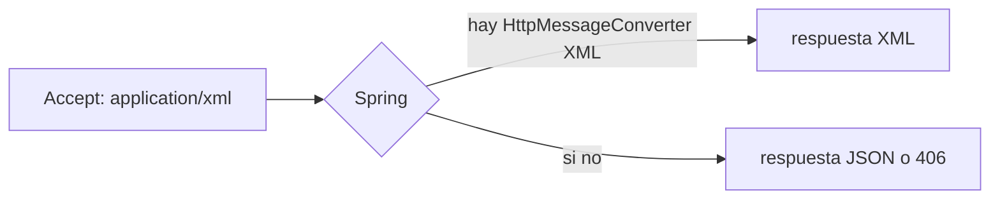
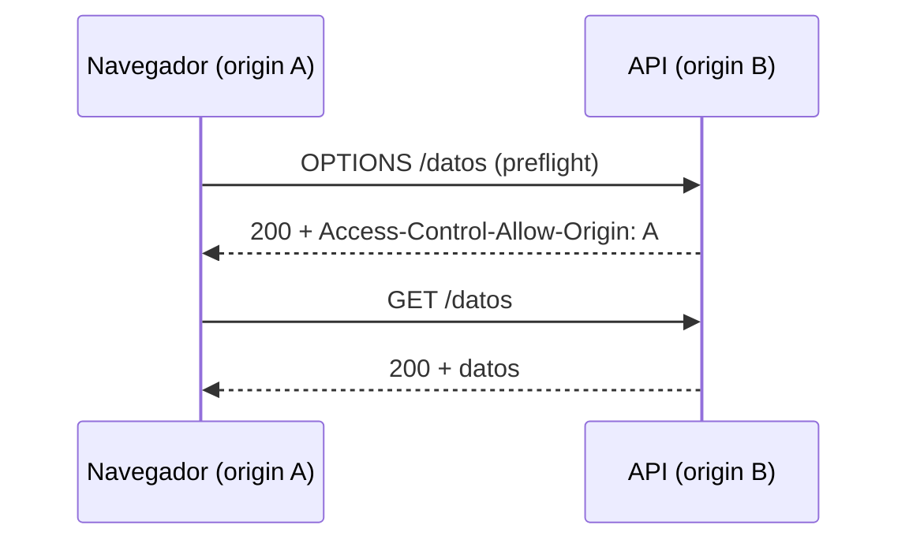
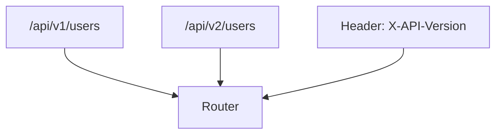
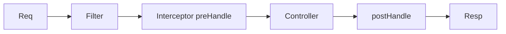

# Bloque VI · Request/Response avanzado

> El día a día de una API real: subir ficheros, CORS, cabeceras de caché,
> versionado, interceptores. Lo que separa un "hola mundo" de un servicio serio.

---

## 6.1 Negociación de contenido



## 6.2 CORS

El navegador bloquea peticiones cross-origin salvo que el servidor responda
con `Access-Control-Allow-Origin`.



## 6.3 Subida y descarga

`MultipartFile` para subir; `Resource`/bytes + `Content-Disposition` para bajar.

## 6.4 Versionado



## 6.5 Filtros e interceptores



---

### Qué practicarás

Negociación JSON/XML, CORS, upload/download, lectura de headers, ETag/caché,
estrategia de versionado y un interceptor que mide tiempos.


## Teoría Extendida y Ejemplos de Código

### 1. Subida de Ficheros (MultipartFile)
```java
@PostMapping(value = "/{id}/avatar", consumes = MediaType.MULTIPART_FORM_DATA_VALUE)
public ResponseEntity<String> subirAvatar(
        @PathVariable Long id, 
        @RequestParam("archivo") MultipartFile file) {
    
    if (file.isEmpty()) return ResponseEntity.badRequest().body("Archivo vacío");
    
    almacenamientoService.guardar(id, file.getBytes());
    return ResponseEntity.ok("Subido correctamente");
}
```

### 2. CORS (Cross-Origin Resource Sharing)
Para permitir que un Front-End en React (puerto 3000) llame a la API (puerto 8080).
```java
@Configuration
public class CorsConfig implements WebMvcConfigurer {
    @Override
    public void addCorsMappings(CorsRegistry registry) {
        registry.addMapping("/api/**")
                .allowedOrigins("http://localhost:3000")
                .allowedMethods("GET", "POST", "PUT", "DELETE")
                .allowCredentials(true);
    }
}
```

### 3. Filtros HTTP vs Interceptores
- **Filtros (Servlet Filter)**: Actúan antes de que Spring sepa qué Controller va a procesarlo. Útiles para logging global, CORS, o seguridad básica.
- **Interceptores (HandlerInterceptor)**: Actúan justo antes/después del método del Controller. Tienen acceso al método java (`HandlerMethod`) que se ejecutó.
