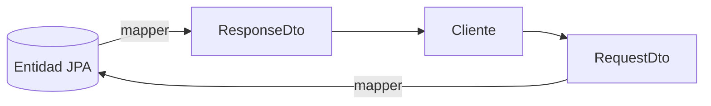
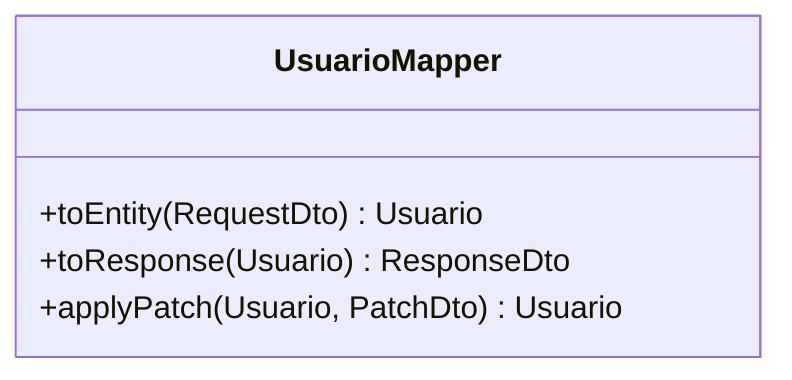

# Bloque VII · DTOs y mapeo

> Nunca expongas tu entidad de base de datos directamente en la API. El DTO es
> el contrato público; la entidad es interna. El mapeo los conecta.

---

## 7.1 Por qué separar entidad y DTO

- La entidad cambia con el esquema; el DTO no debe romper a los clientes.
- El DTO oculta campos sensibles (password, flags internos).
- El RequestDto valida; el ResponseDto formatea.

## 7.2 Tipos de DTO

| DTO | Uso |
|---|---|
| RequestDto | lo que entra (POST/PUT) |
| ResponseDto | lo que sale (GET) |
| PatchDto | campos opcionales (PATCH) |

## 7.3 Mapper

---

### Qué practicarás

Separar request/response, mapper manual, mapper "declarativo", patrón Assembler,
DTO de patch parcial y grafos anidados.
