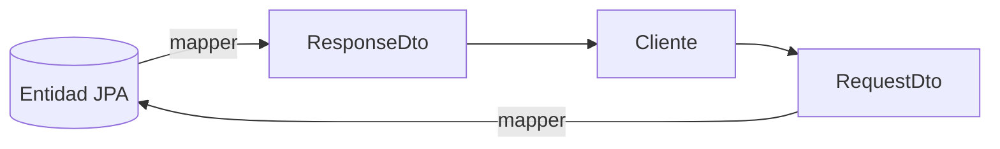
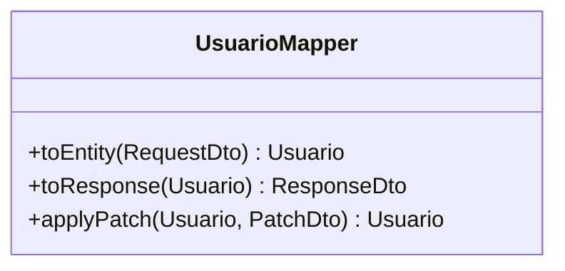

# Bloque VII · DTOs y mapeo

> Nunca expongas tu entidad de base de datos directamente en la API. El DTO es
> el contrato público; la entidad es interna. El mapeo los conecta.

---

## 7.1 Por qué separar entidad y DTO



- La entidad cambia con el esquema; el DTO no debe romper a los clientes.
- El DTO oculta campos sensibles (password, flags internos).
- El RequestDto valida; el ResponseDto formatea.

## 7.2 Tipos de DTO

| DTO | Uso |
|---|---|
| RequestDto | lo que entra (POST/PUT) |
| ResponseDto | lo que sale (GET) |
| PatchDto | campos opcionales (PATCH) |

## 7.3 Mapper



---

### Qué practicarás

Separar request/response, mapper manual, mapper "declarativo", patrón Assembler,
DTO de patch parcial y grafos anidados.


## Teoría Extendida y Ejemplos de Código

### 1. Por qué usar DTOs (Data Transfer Objects)
Nunca expongas tus Entidades de Base de Datos (`@Entity`) directamente al exterior. 
- Te arriesgas a publicar contraseñas.
- Acoplas tu Base de Datos a los clientes móviles/web.
- Provocas bucles infinitos en relaciones Bidireccionales JPA.

### 2. Mapeo Manual (Assembler Pattern)
```java
@Component
public class UsuarioMapper {
    public UsuarioDto toDto(Usuario entity) {
        return new UsuarioDto(
            entity.getId(),
            entity.getNombre(),
            entity.getRoles().stream().map(Role::getName).toList()
        );
    }
}
```

### 3. Mapeo Automático (MapStruct)
En proyectos grandes, MapStruct genera el código en tiempo de compilación (super rápido y type-safe).
```java
@Mapper(componentModel = "spring")
public interface ClienteMapper {
    @Mapping(target = "nombreCompleto", source = "nombre")
    ClienteDto toDto(Cliente entity);
}
```
