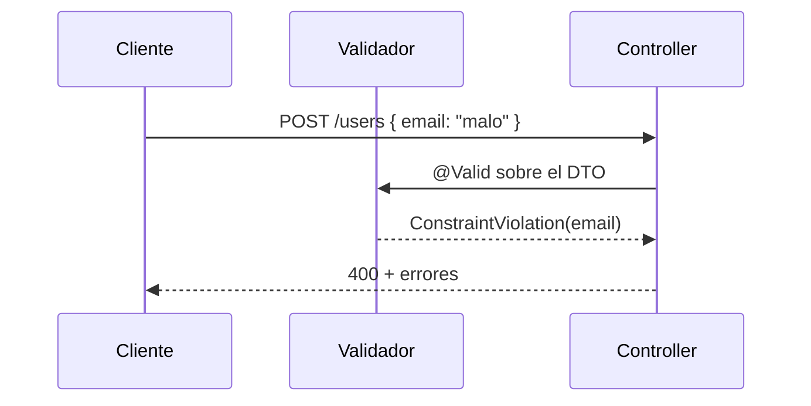
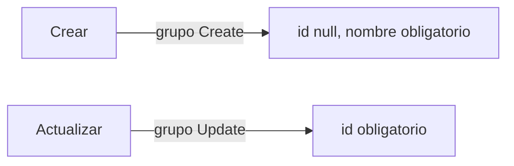

# Bloque VIII · Bean Validation

> Validar en el borde de la API evita basura en la BD. Jakarta Validation declara
> las reglas con anotaciones; Spring las aplica con `@Valid`.

---

## 8.1 Flujo de validación



## 8.2 Constraints habituales

| Anotación | Regla |
|---|---|
| `@NotNull` / `@NotBlank` | obligatorio |
| `@Size(min,max)` | longitud |
| `@Min` / `@Max` | rango numérico |
| `@Email` | formato email |
| `@Pattern(regexp)` | regex |
| `@Valid` (anidado) | valida el objeto hijo |

## 8.3 Grupos



---

### Qué practicarás

Constraints básicas y numéricas, validación anidada, grupos create/update,
constraint personalizada, validación entre campos, de parámetros y programática
con `Validator`.


## Teoría Extendida y Ejemplos de Código

### 1. Restricciones Básicas y Regex
Aplica las reglas en el DTO (Capa de entrada), no solo en la base de datos.
```java
public record RegistroDto(
    @NotBlank(message = "El nombre es obligatorio")
    @Size(min = 2, max = 50)
    String nombre,
    
    @Email(message = "Formato de email inválido")
    String email,
    
    @Pattern(regexp = "^(?=.*[0-9])(?=.*[a-z])(?=.*[A-Z]).{8,}$", 
             message = "La contraseña debe ser fuerte")
    String password,
    
    @Min(18)
    int edad
) {}
```

### 2. Validación Cross-Field (Validación Personalizada)
A veces un campo depende del otro.
```java
@Target({ElementType.TYPE})
@Retention(RetentionPolicy.RUNTIME)
@Constraint(validatedBy = FechasCoherentesValidator.class)
public @interface FechasCoherentes {
    String message() default "La fecha fin debe ser mayor a la inicio";
    Class<?>[] groups() default {};
    Class<? extends Payload>[] payload() default {};
}

public class FechasCoherentesValidator implements ConstraintValidator<FechasCoherentes, ReservaDto> {
    @Override
    public boolean isValid(ReservaDto dto, ConstraintValidatorContext context) {
        if (dto.inicio() == null || dto.fin() == null) return true;
        return dto.fin().isAfter(dto.inicio());
    }
}
```
