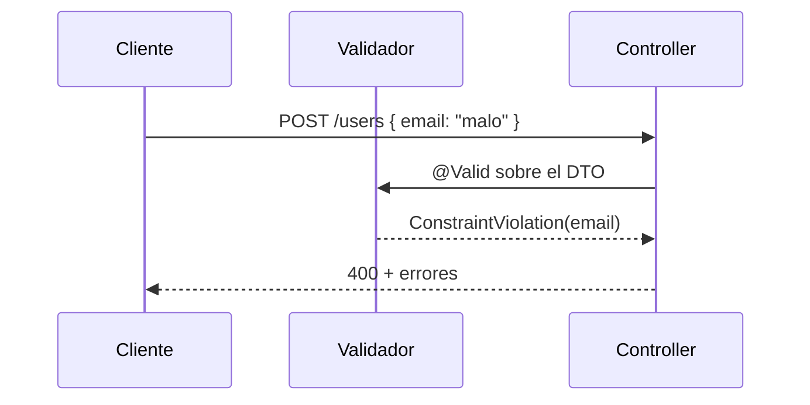
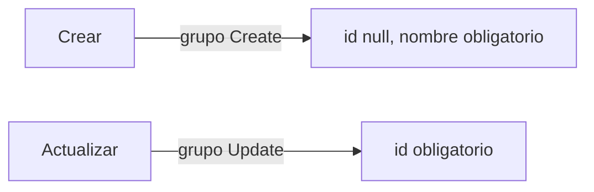

# Bloque VIII · Bean Validation

> Validar en el borde de la API evita basura en la BD. Jakarta Validation declara
> las reglas con anotaciones; Spring las aplica con `@Valid`.

---

## 8.1 Flujo de validación

## 8.2 Constraints habituales

| Anotación | Regla |
|---|---|
| `@NotNull` / `@NotBlank` | obligatorio |
| `@Size(min,max)` | longitud |
| `@Min` / `@Max` | rango numérico |
| `@Email` | formato email |
| `@Pattern(regexp)` | regex |
| `@Valid` (anidado) | valida el objeto hijo |

## 8.3 Grupos

---

### Qué practicarás

Constraints básicas y numéricas, validación anidada, grupos create/update,
constraint personalizada, validación entre campos, de parámetros y programática
con `Validator`.
