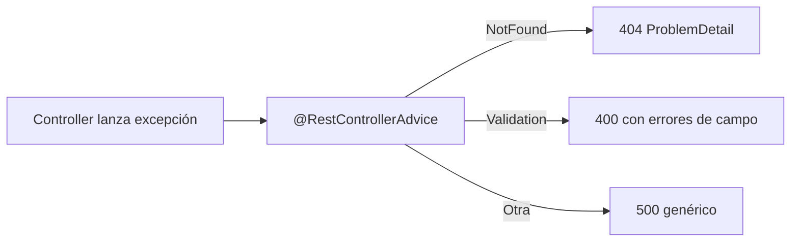
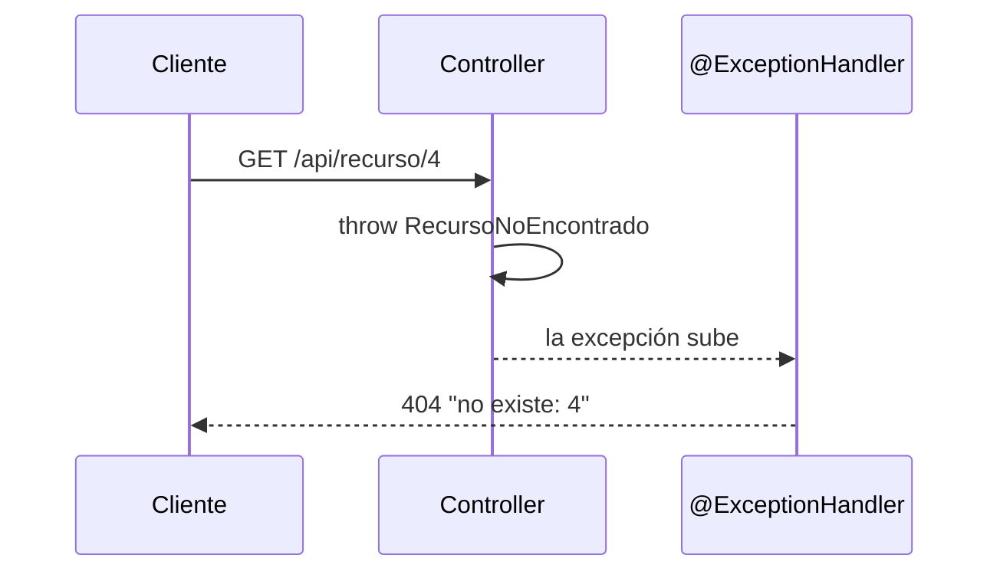
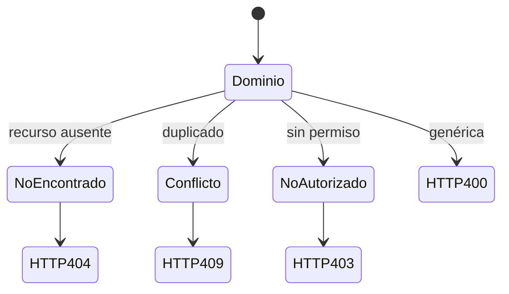
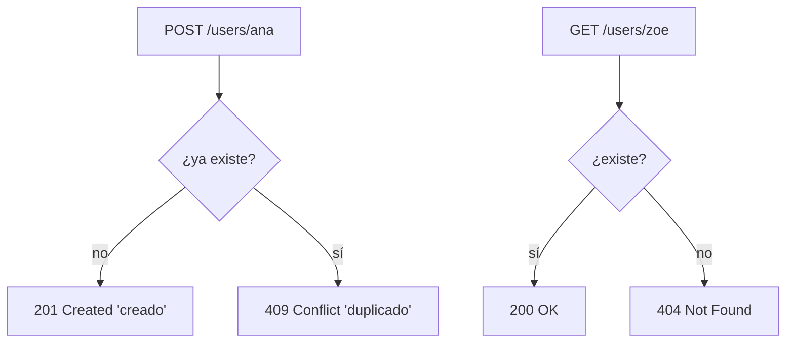
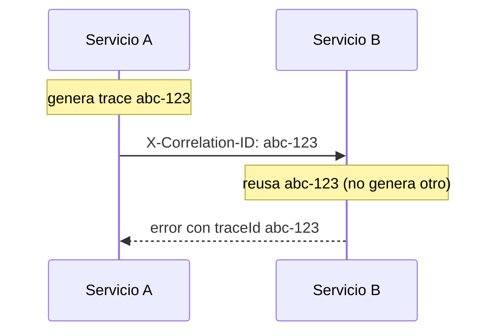
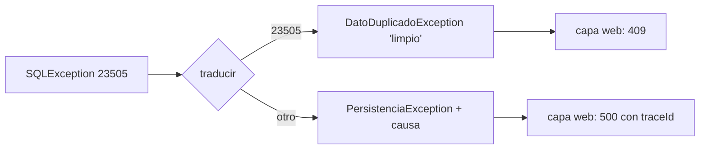
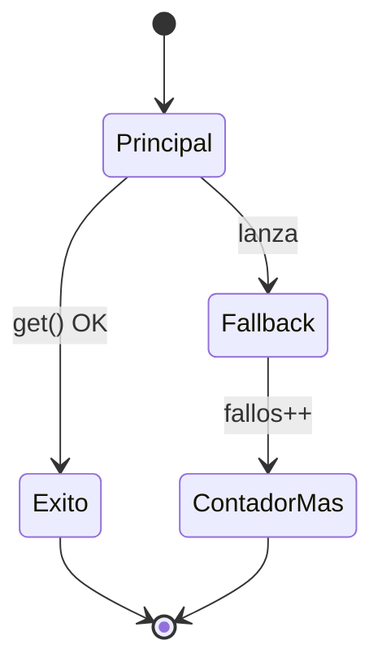

# Bloque IX · Manejo de errores (RFC 7807)

> Una API profesional nunca devuelve un stacktrace. Devuelve un error
> estructurado, con el status correcto y un cuerpo predecible. El cliente sabrá
> qué pasó (404 vs 409 vs 400), tú sabrás dónde buscar (traceId), y el atacante
> no verá tus entrañas (nada de SQL ni rutas de clase filtradas).

## Cómo usar este documento

Igual que en los bloques anteriores: lee UNA sección → haz SU ejercicio →
vuelve. Cada sección cierra con el recuadro **"Lo practicas en…"**. Los tests
son la especificación: cuando una pista dice "el mensaje debe ser EXACTO", es
porque el test lo compara con `equals`.

| Sección | Tema | Ejercicio |
|---|---|---|
| 9.1 | `@RestControllerAdvice`: el manejo centralizado | `Ej077GlobalExceptionHandler` |
| 9.2 | `ProblemDetail` (RFC 7807) | `Ej078ProblemDetail` |
| 9.3 | Jerarquía de excepciones de dominio → status | `Ej079DomainExceptionHierarchy` |
| 9.4 | Payload de errores de validación agrupados | `Ej080ValidationErrorPayload` |
| 9.5 | 404 vs 409: semántica de los conflictos | `Ej081NotFoundAndConflict` |
| 9.6 | Traza y correlación (`traceId`) | `Ej082ErrorTraceAndCorrelation` |
| 9.7 | Traducción de excepciones de infraestructura | `Ej083ExceptionTranslation` |
| 9.8 | Degradación controlada (graceful fallback) | `Ej084GracefulFallbacks` |

---

## 9.1 `@RestControllerAdvice`: el manejo centralizado

El error de principiante es capturar excepciones dentro de cada método de
controller con `try/catch`. Eso disemina la lógica de errores por toda la
aplicación: el mismo 404 se construye de diez formas distintas. La solución de
Spring es **invertir el control**: el controller solo **lanza**; una clase
aparte, anotada con `@RestControllerAdvice`, **traduce** cada tipo de excepción
a su respuesta HTTP.



`@RestControllerAdvice` = `@ControllerAdvice` + `@ResponseBody`: lo que devuelva
un `@ExceptionHandler` se serializa al cuerpo de la respuesta (JSON), igual que
en un `@RestController`.

```java
@RestControllerAdvice
public class GlobalExceptionHandler {

    @ExceptionHandler(RecursoNoEncontrado.class)
    public ResponseEntity<String> handleNotFound(RecursoNoEncontrado ex) {
        return ResponseEntity.status(HttpStatus.NOT_FOUND).body(ex.getMessage());
    }
}
```

Las claves que vas a tocar en el ejercicio:

- El controller lanza la excepción y **no la captura**: si la capturas dentro
  del método, el advice nunca la ve.
- `@ExceptionHandler(Tipo.class)` dice "yo manejo este tipo de excepción y sus
  subtipos". El método recibe la excepción ya capturada como parámetro.
- En el ejercicio el handler vive en la **misma clase** del controller (no en
  un `@RestControllerAdvice` aparte). Eso también es válido: un
  `@ExceptionHandler` dentro de un `@Controller` aplica a TODOS los métodos de
  ese controller. La versión global (clase aparte) es solo el siguiente paso.



> **Lo practicas en `Ej077GlobalExceptionHandler`**: un controller que lanza una
> excepción de negocio y un `@ExceptionHandler` que la convierte en 404 en vez
> de dejar que Spring devuelva un 500.

---

## 9.2 `ProblemDetail` (RFC 7807)

Devolver `body(ex.getMessage())` es un texto plano: el cliente no sabe si es un
error, de qué tipo, ni dónde ocurrió. El estándar **RFC 7807** ("Problem Details
for HTTP APIs") define un JSON común para todos los errores, y Spring Boot 3 lo
trae nativo con la clase `ProblemDetail`:

```json
{ "type":"about:blank", "title":"Not Found",
  "status":404, "detail":"Usuario 7 no existe", "instance":"/api/users/7" }
```

Los cinco campos del estándar:

| Campo | Qué es | Ejemplo |
|---|---|---|
| `type` | URI que identifica el TIPO de problema | `about:blank` (por defecto) |
| `title` | resumen legible del tipo, fijo por status | `"Not Found"` |
| `status` | el código HTTP, repetido en el cuerpo | `404` |
| `detail` | explicación concreta de ESTA ocurrencia | `"Usuario 7 no existe"` |
| `instance` | URI del recurso donde pasó | `"/api/users/7"` |

Construcción canónica (lo que harás en el ejercicio base):

```java
ProblemDetail pd = ProblemDetail.forStatus(status);          // fija status
pd.setDetail(detail);                                        // el qué concreto
pd.setTitle(HttpStatus.valueOf(status).getReasonPhrase());   // "Not Found"
pd.setInstance(URI.create(instance));                        // dónde
pd.setProperty("timestamp", Instant.now());                  // campo extra
```

Dos matices que evalúan los tests:

- `title` NO te lo inventas: lo derivas de `HttpStatus.valueOf(404)
  .getReasonPhrase()` → `"Not Found"`. Es la frase oficial del status.
- `setProperty(clave, valor)` añade campos **fuera del estándar** (timestamp,
  traceId, errores de validación) sin romper el formato. Van a un mapa que
  recuperas con `getProperties()`.
- Un `ProblemDetail` describe un **error**: si te pasan un status < 400 (un 200),
  es un uso incorrecto → `IllegalArgumentException`.

`type: about:blank` es el valor por defecto del RFC y significa "no hay más
documentación que el `title`". En producción lo sustituyes por una URL real a tu
catálogo de errores (`https://api.tuapp.com/errors/not-found`).

> **Lo practicas en `Ej078ProblemDetail`**: poblar un `ProblemDetail` conforme al
> RFC 7807, derivar el title del status y añadir propiedades extra.

---

## 9.3 Jerarquía de excepciones de dominio → status

El handler necesita saber **qué status** corresponde a cada error. La técnica
profesional es modelar los errores de negocio como una **jerarquía de
excepciones** con una raíz común, y mapear cada subtipo a su código:

```java
public class DominioException extends RuntimeException { ... }   // raíz, → 400
public class NoEncontradoException extends DominioException { }   // → 404
public class ConflictoException     extends DominioException { }   // → 409
public class NoAutorizadoException  extends DominioException { }   // → 403
```



El mapa de referencia de todo el bloque:

| Excepción | Status | Significa |
|---|---|---|
| `NoEncontradoException` | 404 | el recurso no existe |
| `ConflictoException` | 409 | choca con el estado actual (duplicado) |
| `NoAutorizadoException` | 403 | autenticado pero sin permiso |
| Validación | 400 | los datos enviados son inválidos |
| `DominioException` (base) | 400 | error de negocio genérico |
| Cualquier otra (técnica) | 500 | fallo del servidor, no del cliente |

El mapeo con pattern matching de Java 21:

```java
return switch (ex) {
    case NoEncontradoException e -> 404;
    case ConflictoException e    -> 409;
    case NoAutorizadoException e -> 403;
    default                      -> 400;   // cualquier DominioException
};
```

Dos reglas que castigan los tests:

- **Orden**: comprueba los subtipos ANTES que la clase base. Como
  `NoEncontradoException` ES una `DominioException`, si preguntas primero por la
  base te tragarías todos los subtipos. (El `switch` de patrones ya lo resuelve
  por especificidad, pero con `if/instanceof` el orden es tuyo.)
- Un error de **dominio** nunca es 500. El 500 está reservado para fallos del
  servidor (un NPE, una conexión caída): cosas que el cliente no puede arreglar.

> **Lo practicas en `Ej079DomainExceptionHierarchy`**: una jerarquía sellada de
> errores de negocio y el `switch` exhaustivo que la traduce a status HTTP.

---

## 9.4 Payload de errores de validación agrupados

Cuando fallan varias reglas a la vez (`email` vacío Y `edad < 18`), el cliente no
quiere un texto plano: quiere un **mapa campo → [mensajes]** para pintar cada
error junto a su input. Un mismo campo puede acumular varios fallos (`NotBlank` +
`Size`), así que el valor es una **lista**:

```json
{ "email": ["obligatorio", "formato inválido"], "edad": ["min 18"] }
```

La técnica clave es agrupar conservando el orden de aparición, con
`computeIfAbsent` sobre un `LinkedHashMap`:

```java
Map<String, List<String>> out = new LinkedHashMap<>();   // orden estable
for (FieldError e : errores) {
    out.computeIfAbsent(e.campo(), k -> new ArrayList<>())  // lista si no existe
       .add(e.mensaje());                                   // acumula
}
```

`computeIfAbsent(clave, k -> new ArrayList<>())` hace dos cosas en una: si la
clave no está, crea la lista y la mete; en ambos casos devuelve la lista, lista
para hacer `.add()`. Es el patrón "multimapa" del JDK.

Por qué `LinkedHashMap` y no `HashMap`: el test compara
`List.of("obligatorio", "formato")` en ese orden exacto. Con `HashMap` el orden
de las claves sería impredecible y el test sería frágil. `LinkedHashMap` preserva
el orden de primera inserción.

> **Lo practicas en `Ej080ValidationErrorPayload`**: agrupar errores de campo en
> un multimapa estable con `computeIfAbsent`, conservando duplicados y orden.

---

## 9.5 404 vs 409: la semántica de los conflictos

Dos códigos que los principiantes confunden, y que tienen significados opuestos:

- **404 Not Found**: el recurso **no existe**. Pides `GET /users/zoe` y no hay
  ninguna `zoe`.
- **409 Conflict**: el recurso **ya existe** (o el estado actual no permite la
  operación). Haces `POST /users/ana` y `ana` ya estaba creada.



El truco idiomático del ejercicio es un `Set` concurrente: `Set.add()` devuelve
`false` si el elemento **ya estaba**, lo que distingue creación de conflicto en
una sola operación atómica:

```java
if (usuarios.add(nombre))                                 // true = se añadió
    return ResponseEntity.status(HttpStatus.CREATED).body("creado");   // 201
return ResponseEntity.status(HttpStatus.CONFLICT).body("duplicado");   // 409
```

| Código | Constante Spring | Atajo |
|---|---|---|
| 201 | `HttpStatus.CREATED` | — |
| 404 | `HttpStatus.NOT_FOUND` | `ResponseEntity.notFound().build()` |
| 409 | `HttpStatus.CONFLICT` | — |

`ConcurrentHashMap.newKeySet()` da un `Set` thread-safe: importa porque una API
atiende peticiones simultáneas (lo viste en el bloque 1.11).

> **Lo practicas en `Ej081NotFoundAndConflict`**: distinguir 201/409 al crear y
> 200/404 al leer usando el valor de retorno de `Set.add`.

---

## 9.6 Traza y correlación (`traceId`)

Cuando un error cruza tres microservicios, ¿cómo encuentras en los logs las tres
piezas de la MISMA petición? Con un **traceId**: un identificador que viaja con
la petición y aparece en cada log y en cada respuesta de error.

La política del ejercicio:

1. Si la petición **trae** un traceId (cabecera `X-Correlation-ID`), reúsalo →
   así la traza es continua de extremo a extremo.
2. Si **no** trae, genera uno nuevo con `UUID.randomUUID().toString()`.
3. El traceId **nunca** es null en la respuesta.

```java
String traceId = (incoming != null && !incoming.isBlank())
        ? incoming                          // correlación end-to-end
        : UUID.randomUUID().toString();     // primero de la cadena
Map<String, Object> body = new LinkedHashMap<>();
body.put("status", status);
body.put("error", mensaje);
body.put("traceId", traceId);
```



`LinkedHashMap` otra vez, por la misma razón que en 9.4: orden de claves estable
y predecible. La idea de fondo conecta con observabilidad (bloque 20): el
traceId es la columna por la que filtras millones de líneas de log.

> **Lo practicas en `Ej082ErrorTraceAndCorrelation`**: construir el cuerpo de
> error reusando el trace entrante o generando uno con `UUID`.

---

## 9.7 Traducción de excepciones de infraestructura

Una `SQLException` **nunca** debe llegar a la capa web: filtra detalles internos
(nombres de tabla, SQLState, dialecto) y acopla tu API a la base de datos. La
regla es **traducir** las excepciones técnicas a excepciones de dominio limpias
en la frontera de la capa de persistencia:

```java
public static RuntimeException traducir(SQLException ex) {
    if (ex == null) throw new IllegalArgumentException("ex requerida");
    if ("23505".equals(ex.getSQLState()))                  // clave única duplicada
        return new DatoDuplicadoException("registro duplicado");
    return new PersistenciaException("error de persistencia", ex);  // conserva causa
}
```

Tres ideas que evalúan los tests:

- **SQLState `23505`** = violación de clave única (estándar SQL, lo usa
  Postgres) → traduce a un `DatoDuplicadoException` con mensaje **limpio** (nada
  de SQL).
- Para cualquier otro SQLState → `PersistenciaException` genérica, pero
  **conservando `ex` como causa** (`super(msg, ex)`). El test hace
  `assertSame(ex, r.getCause())`: si pierdes la causa, depurar a las 3 AM es
  imposible (conecta con 1.9, encadenamiento de causas).
- El método **devuelve** la excepción (no la lanza): así el llamador decide
  cuándo lanzarla.



> **Lo practicas en `Ej083ExceptionTranslation`**: mapear SQLState a excepciones
> de dominio sin filtrar detalles técnicos y preservando la causa.

---

## 9.8 Degradación controlada (graceful fallback)

A veces un 500 es la peor respuesta posible. Si el servicio de recomendaciones
cae, es mejor devolver una lista vacía (o la caché) que tumbar toda la página.
Eso es **degradación controlada**: intentar la operación principal y, si falla,
devolver un valor seguro registrando el fallo.

```java
public <T> T conFallback(Supplier<T> principal, T fallback) {
    if (principal == null) throw new IllegalArgumentException(...);
    try {
        return principal.get();          // camino feliz: NO toca el contador
    } catch (RuntimeException e) {
        fallos++;                        // registra la degradación
        return fallback;                 // valor seguro, no relances
    }
}
```

Las reglas que comprueba el test:

- Éxito → devuelve el resultado y `fallos()` sigue en 0.
- Fallo → captura `RuntimeException`, incrementa `fallos`, devuelve el fallback.
- **Nunca** propaga la excepción original: el método siempre devuelve algo.
- El fallback puede ser null si así se decidió (no fuerces no-null).

Esto es el germen del patrón **Circuit Breaker** (Resilience4j en producción):
si los fallos se acumulan, el circuito se "abre" y deja de intentar la operación
principal durante un tiempo. En este bloque solo cuentas los fallos; los retos
extra exploran el vocabulario (estado OPEN, backoff exponencial, estrategias).



> **Lo practicas en `Ej084GracefulFallbacks`**: envolver una operación que puede
> fallar, devolver un fallback y contar las degradaciones sin propagar la
> excepción.

---

## Errores comunes del bloque

| # | Error | Antídoto |
|---|---|---|
| 1 | Capturar la excepción dentro del controller | Lánzala; deja que el `@ExceptionHandler` la traduzca |
| 2 | Devolver `getMessage()` plano en vez de estructura | `ProblemDetail` (RFC 7807) con status, title, detail |
| 3 | Inventar el `title` del ProblemDetail | Derívalo: `HttpStatus.valueOf(status).getReasonPhrase()` |
| 4 | Construir un ProblemDetail con status < 400 | Valida `status >= 400` → `IllegalArgumentException` |
| 5 | Preguntar por la clase base antes que los subtipos | Subtipos primero; la base (400) es el `default` |
| 6 | Devolver 500 para un error de negocio | Negocio = 4xx (404/409/403/400); 500 = fallo del servidor |
| 7 | `HashMap` donde el test exige orden | `LinkedHashMap` para claves estables |
| 8 | Confundir 404 (no existe) con 409 (ya existe) | `Set.add` false = duplicado → 409; ausencia → 404 |
| 9 | Filtrar `SQLException`/SQLState a la capa web | Tradúcela a excepción de dominio con mensaje limpio |
| 10 | Relanzar y perder la causa | `new PersistenciaException(msg, ex)` conserva `getCause()` |

## Chuleta final del bloque

```
@RestControllerAdvice = @ControllerAdvice + @ResponseBody (errores → JSON)
@ExceptionHandler(T)   = "yo manejo T y subtipos"; recibe la excepción
ProblemDetail          = RFC 7807 · forStatus → setDetail/setTitle/setProperty
title                  = HttpStatus.valueOf(s).getReasonPhrase() (NO inventado)
Jerarquía dominio      = NoEncontrado→404 · Conflicto→409 · NoAutorizado→403 · base→400
Validación payload     = LinkedHashMap + computeIfAbsent(k -> new ArrayList<>())
404 vs 409             = no existe (404) · ya existe/choca (409) · Set.add==false
traceId                = reusa X-Correlation-ID o UUID.randomUUID(); nunca null
Traducir excepción     = SQLState 23505→duplicado · resto→Persistencia + causa
Fallback               = try principal.get() / catch RuntimeException → fallback, fallos++
```

## Autoevaluación (responde sin mirar; si fallas 2+, relee la sección)

1. ¿Qué ventaja tiene un `@ExceptionHandler` frente a un `try/catch` dentro de
   cada método de controller? *(9.1)*
2. ¿De dónde sacas el `title` de un `ProblemDetail` y por qué no lo escribes a
   mano? *(9.2)*
3. ¿Por qué hay que comprobar los subtipos de excepción ANTES que la clase base
   al mapear a status? *(9.3)*
4. ¿Por qué `LinkedHashMap` y no `HashMap` para agrupar errores de validación? *(9.4)*
5. Misma operación, dos resultados: ¿cuándo devuelves 404 y cuándo 409? ¿Cómo lo
   distingue `Set.add`? *(9.5)*
6. ¿Cuándo reusas el traceId entrante y cuándo generas uno nuevo? ¿Puede ser
   null en la respuesta? *(9.6)*
7. ¿Por qué no debe una `SQLException` llegar a la capa web, y qué debes
   conservar al traducirla? *(9.7)*
8. En `conFallback`, ¿qué excepción capturas, qué devuelves y qué NUNCA haces? *(9.8)*
```