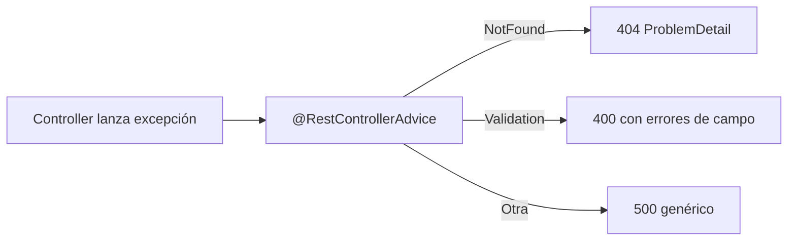
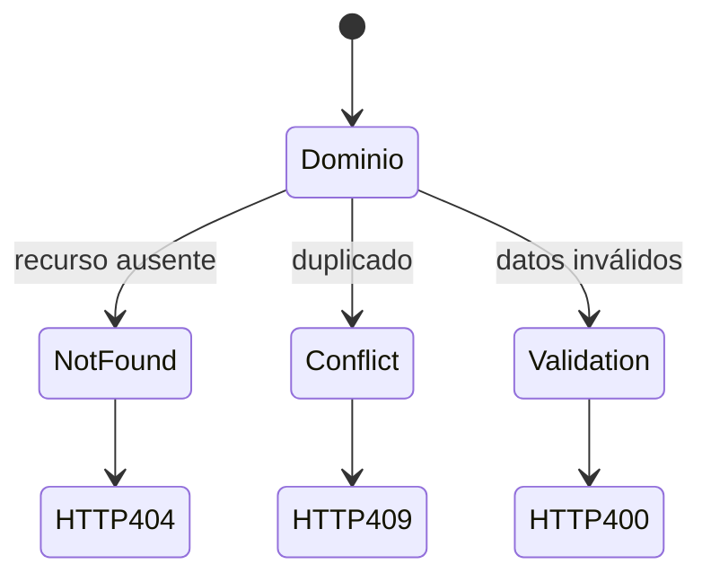

# Bloque IX · Manejo de errores (RFC 7807)

> Una API profesional nunca devuelve un stacktrace. Devuelve un error
> estructurado, con el status correcto y un cuerpo predecible.

---

## 9.1 @RestControllerAdvice



Centraliza el manejo: el controller lanza, el advice traduce a HTTP.

## 9.2 ProblemDetail (RFC 7807)

```json
{ "type":"about:blank", "title":"Not Found",
  "status":404, "detail":"Usuario 7 no existe", "instance":"/api/users/7" }
```

## 9.3 Mapa de excepción → status

| Excepción | Status |
|---|---|
| NotFound | 404 |
| Validación | 400 |
| Conflicto (duplicado) | 409 |
| No autorizado | 401/403 |
| Otra | 500 |



---

### Qué practicarás

Advice global, ProblemDetail, jerarquía de excepciones de dominio, payload de
errores de validación, 404/409, traza/correlación, traducción de excepciones de
infraestructura y degradación controlada.


## Teoría Extendida y Ejemplos de Código

### 1. El estándar RFC 7807 (Problem Details)
Spring Boot 3 lo soporta nativamente. En vez de enviar un JSON inventado, envías un JSON estándar comprensible universalmente.
```java
@RestControllerAdvice
public class GlobalExceptionHandler {

    @ExceptionHandler(RecursoNoEncontradoException.class)
    public ProblemDetail handleNotFound(RecursoNoEncontradoException ex) {
        ProblemDetail pd = ProblemDetail.forStatusAndDetail(HttpStatus.NOT_FOUND, ex.getMessage());
        pd.setTitle("Recurso no existe");
        pd.setProperty("timestamp", Instant.now());
        return pd;
    }

    // Capturar errores de validación de Bean Validation
    @ExceptionHandler(MethodArgumentNotValidException.class)
    public ProblemDetail handleValidation(MethodArgumentNotValidException ex) {
        ProblemDetail pd = ProblemDetail.forStatusAndDetail(HttpStatus.BAD_REQUEST, "Error en los datos enviados");
        List<String> errores = ex.getBindingResult().getFieldErrors().stream()
                .map(err -> err.getField() + ": " + err.getDefaultMessage())
                .toList();
        pd.setProperty("errores_detalle", errores);
        return pd;
    }
}
```
