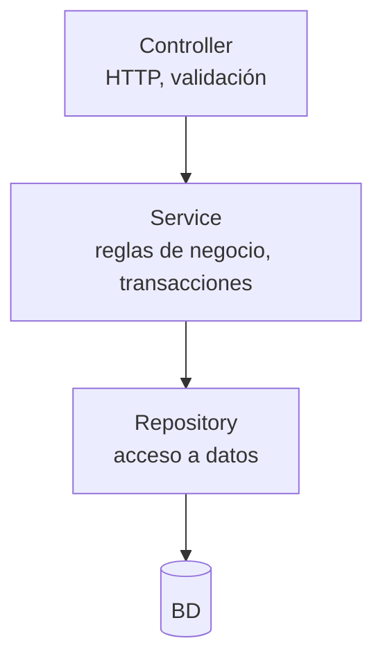
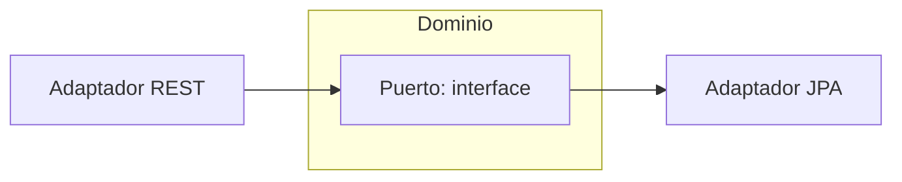

# Bloque X · Arquitectura y patrones

> Una API que crece sin capas se convierte en barro. Controller delgado,
> servicio con la lógica, repositorio con el acceso a datos.

---

## 10.1 Capas



Regla: el Controller NO habla con el Repository directamente. Cada capa solo
conoce a la de debajo.

## 10.2 Patrones

| Patrón | Para qué |
|---|---|
| Repository | abstraer la persistencia |
| DAO | acceso a datos clásico (AD) |
| Factory/Builder | construir objetos complejos |
| Strategy | algoritmos intercambiables |
| Hexagonal | puertos (interfaces) y adaptadores |

## 10.3 Hexagonal



El dominio define el PUERTO; los adaptadores lo implementan. El dominio no
depende de Spring ni de JPA.

---

### Qué practicarás

Capas, Repository, DAO, servicio transaccional (simulado), puerto hexagonal,
modelo rico vs anémico, Factory/Builder y Strategy.


## Teoría Extendida y Ejemplos de Código

### 1. Arquitectura de Capas Estricta
- **Controller**: Convierte HTTP en llamadas Java. No tiene lógica de negocio. Mapea DTOs.
- **Service**: El cerebro. Transaccionalidad `@Transactional`. Toma decisiones, lanza excepciones de dominio.
- **Repository**: Persistencia pura. Habla con la BD y devuelve entidades.

### 2. Modelo Anémico vs Rico
**Anémico (Malo)**: Objetos con solo Getters/Setters.
**Rico (Bueno)**: El objeto valida su propio estado.

```java
@Entity
public class CuentaBancaria {
    private BigDecimal saldo;
    
    // Método Rico
    public void retirar(BigDecimal cantidad) {
        if (cantidad.compareTo(BigDecimal.ZERO) <= 0) throw new IllegalArgumentException("...");
        if (this.saldo.compareTo(cantidad) < 0) throw new SaldoInsuficienteException();
        this.saldo = this.saldo.subtract(cantidad);
    }
}
```

### 3. Patrón Factory y Strategy en Servicios
```java
@Service
public class ProcesadorPagosFactory {
    private final Map<TipoPago, EstrategiaPago> estrategias;
    
    public ProcesadorPagosFactory(List<EstrategiaPago> list) {
        // Carga dinámicamente todas las estrategias inyectadas por Spring
        this.estrategias = list.stream().collect(Collectors.toMap(EstrategiaPago::getTipo, e -> e));
    }
    
    public void procesar(Pago pago) {
        estrategias.get(pago.getTipo()).ejecutar(pago);
    }
}
```
