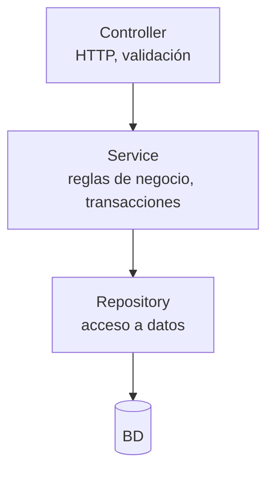
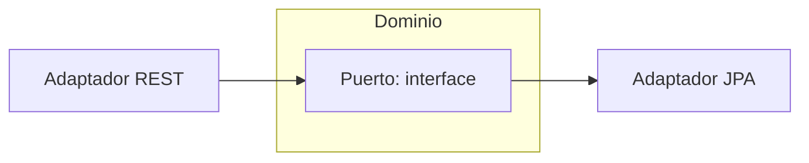

# Bloque X · Arquitectura y patrones

> Una API que crece sin capas se convierte en barro. Controller delgado,
> servicio con la lógica, repositorio con el acceso a datos.

---

## 10.1 Capas

Regla: el Controller NO habla con el Repository directamente. Cada capa solo
conoce a la de debajo.

## 10.2 Patrones

| Patrón | Para qué |
|---|---|
| Repository | abstraer la persistencia |
| DAO | acceso a datos clásico (AD) |
| Factory/Builder | construir objetos complejos |
| Strategy | algoritmos intercambiables |
| Hexagonal | puertos (interfaces) y adaptadores |

## 10.3 Hexagonal

El dominio define el PUERTO; los adaptadores lo implementan. El dominio no
depende de Spring ni de JPA.

---

### Qué practicarás

Capas, Repository, DAO, servicio transaccional (simulado), puerto hexagonal,
modelo rico vs anémico, Factory/Builder y Strategy.
