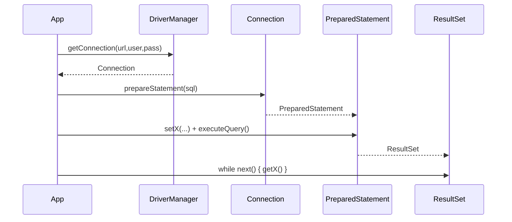
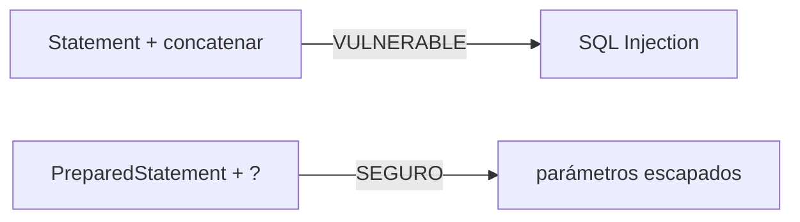
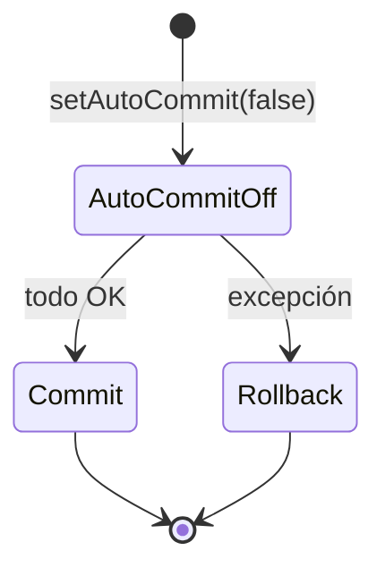

# Bloque XI · JDBC profundo

> Antes de JPA hay que entender qué hace JPA por debajo: JDBC. Acceso a Datos
> (DAM2) empieza aquí (RA2).

---

## 11.1 El flujo JDBC



## 11.2 PreparedStatement vs inyección SQL



## 11.3 Transacciones



## 11.4 Pool y JdbcTemplate

Un pool (HikariCP) reutiliza conexiones. `JdbcTemplate` elimina el boilerplate
de abrir/cerrar y mapear.

---

### Qué practicarás

Connection, PreparedStatement, ResultSet→objeto, DAO CRUD, transacciones,
batch, pool, JdbcTemplate, RowMapper y parámetros con nombre. Los tests usan
**H2 en memoria** (sin ficheros .db en disco).


## Teoría Extendida y Ejemplos de Código

### 1. Prevención de SQL Injection (PreparedStatement)
Nunca concatenes strings en JDBC.
```java
// MAL (Vulnerable):
String sql = "SELECT * FROM users WHERE nombre = '" + input + "'";

// BIEN (Seguro):
String sql = "SELECT * FROM users WHERE nombre = ?";
try (PreparedStatement pstmt = connection.prepareStatement(sql)) {
    pstmt.setString(1, input); // Sanitiza automáticamente
    ResultSet rs = pstmt.executeQuery();
}
```

### 2. Transacciones Manuales (ACID)
```java
try {
    connection.setAutoCommit(false); // Inicia Tx
    
    // Operacion 1
    pstmt1.executeUpdate();
    // Operacion 2
    pstmt2.executeUpdate();
    
    connection.commit(); // Si llega aquí, es exitoso
} catch (SQLException e) {
    connection.rollback(); // Falla -> deshace todo
    throw e;
} finally {
    connection.setAutoCommit(true);
}
```

### 3. JdbcTemplate de Spring (La alternativa moderna)
Oculta todo el boilerplate de los `ResultSet` y `Connection`.
```java
@Repository
public class UserDao {
    private final JdbcTemplate jdbc;
    
    public Optional<User> buscar(Long id) {
        String sql = "SELECT * FROM users WHERE id = ?";
        return jdbc.query(sql, (rs, rowNum) -> 
            new User(rs.getLong("id"), rs.getString("name")), 
            id).stream().findFirst();
    }
}
```
