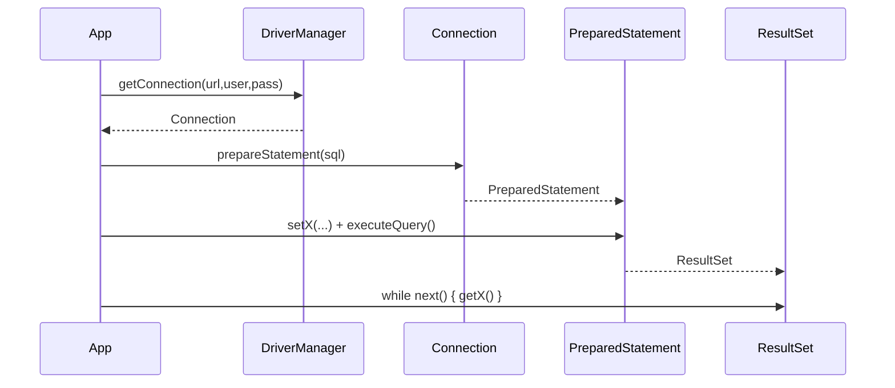
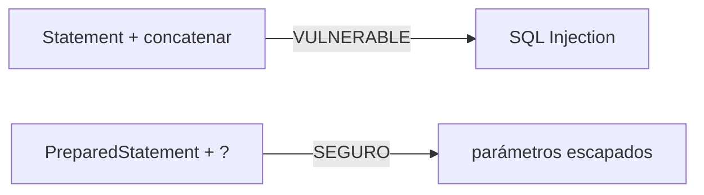
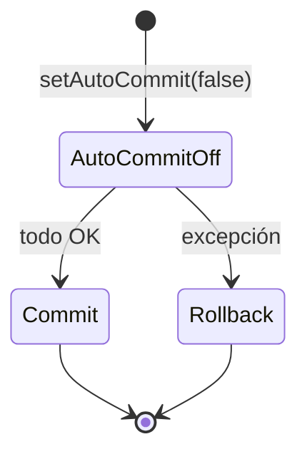

# Bloque XI · JDBC profundo

> Antes de JPA hay que entender qué hace JPA por debajo: JDBC. Acceso a Datos
> (DAM2) empieza aquí (RA2).

---

## 11.1 El flujo JDBC

## 11.2 PreparedStatement vs inyección SQL

## 11.3 Transacciones

## 11.4 Pool y JdbcTemplate

Un pool (HikariCP) reutiliza conexiones. `JdbcTemplate` elimina el boilerplate
de abrir/cerrar y mapear.

---

### Qué practicarás

Connection, PreparedStatement, ResultSet→objeto, DAO CRUD, transacciones,
batch, pool, JdbcTemplate, RowMapper y parámetros con nombre. Los tests usan
**H2 en memoria** (sin ficheros .db en disco).
