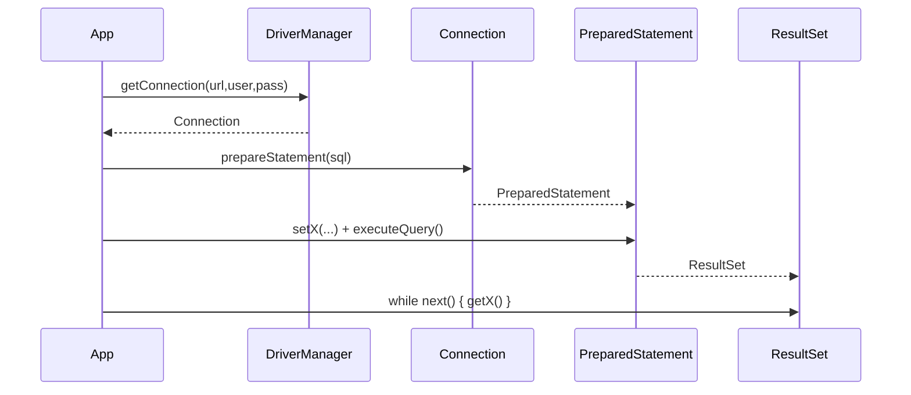
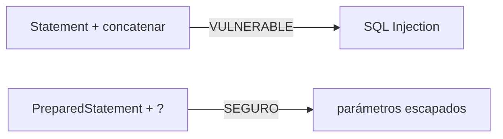
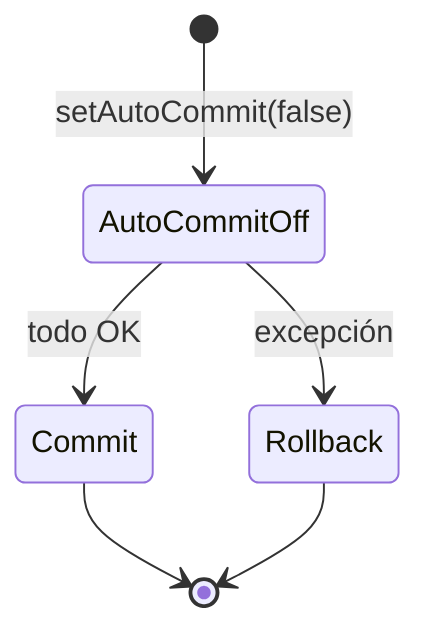

# Bloque XI · JDBC profundo

> Antes de que JPA te haga la vida fácil, conviene ver qué hace JPA por debajo:
> **JDBC**, la API de Java para hablar con bases de datos relacionales. Es el
> punto de partida de Acceso a Datos (DAM2, RA2). Cuando en el bloque 12 escribas
> `repository.save(usuario)` y "funcione solo", reconocerás cada pieza: la
> conexión, el `PreparedStatement`, el `ResultSet`, la transacción. La magia
> dejará de ser magia.

## Cómo usar este documento

Lee UNA sección → haz SU ejercicio → vuelve. Cada sección cierra con el recuadro
**"Lo practicas en…"**. Todos los tests usan **H2 en memoria** (`jdbc:h2:mem:…`):
una base de datos que vive en RAM, se crea al conectar y desaparece al cerrar.
Sin ficheros, sin instalar nada.

| Sección | Tema | Ejercicio |
|---|---|---|
| 11.1 | `Connection` vía `DriverManager` | `Ej093ConnectionDriverManager` |
| 11.2 | `PreparedStatement` vs inyección SQL | `Ej094StatementVsPrepared` |
| 11.3 | Mapear `ResultSet` a objetos | `Ej095ResultSetMapping` |
| 11.4 | DAO CRUD con JDBC puro | `Ej096CrudDao` |
| 11.5 | Transacciones: commit y rollback | `Ej097TransactionsCommitRollback` |
| 11.6 | Inserción por lotes (batch) | `Ej098BatchOperations` |
| 11.7 | Pool de conexiones (HikariCP) | `Ej099ConnectionPooling` |
| 11.8 | `JdbcTemplate` (adiós al boilerplate) | `Ej100JdbcTemplate` |
| 11.9 | `RowMapper` y `ResultSetExtractor` | `Ej101RowMapperAndExtractor` |
| 11.10 | `NamedParameterJdbcTemplate` | `Ej102NamedParameterJdbc` |

---

## 11.1 `Connection` vía `DriverManager`

Todo en JDBC empieza con una **conexión**. Una `Connection` es un canal abierto
contra la base de datos: caro de crear (handshake de red, autenticación) y
**limitado** (la BD aguanta un número finito). Por eso la regla de oro es:
ábrela lo más tarde posible, ciérrala lo antes posible.



`DriverManager.getConnection(url, user, pass)` te da la conexión. La **URL JDBC**
tiene la forma `jdbc:<motor>:<detalles>`:

| URL | Significado |
|---|---|
| `jdbc:h2:mem:demo` | H2 en memoria, base llamada `demo` |
| `jdbc:h2:mem:demo;DB_CLOSE_DELAY=-1` | …que NO se borra al cerrar la última conexión |
| `jdbc:postgresql://host:5432/midb` | PostgreSQL real |
| `jdbc:mysql://localhost/tienda` | MySQL real |

El patrón canónico, con cierre garantizado, es **try-with-resources**: como
`Connection` implementa `AutoCloseable`, se cierra sola al salir del bloque,
incluso si salta una excepción (repasa la teoría 1.9).

```java
public static boolean conectaYValida(String url, String user, String pass) throws SQLException {
    try (Connection conn = DriverManager.getConnection(url, user, pass)) {
        return conn.isValid(2);   // ¿responde en <= 2 segundos?
    }   // close() automático: NO lo llames a mano
}
```

`isValid(timeout)` comprueba que la conexión sigue viva (la BD responde) dentro
de un timeout en segundos. Una conexión **ya cerrada** devuelve `false`: por eso
se valida DENTRO del try, antes de que `close()` actúe.

Dos detalles que separan al que entiende de JDBC del que lo copia:

1. **No silencies `SQLException`.** Si declaras `throws SQLException`, deja que
   se propague; un `catch` vacío te oculta exactamente el error que necesitas a
   las 3 AM. (Más sobre relanzar con causa en 11.5.)
2. **No cierres a mano dentro de un try-with-resources.** El recurso lo hace; un
   doble `close()` es ruido en el mejor caso y un bug en el peor.

> **Lo practicas en `Ej093ConnectionDriverManager`**: abrir, validar (`isValid`)
> y cerrar con try-with-resources, dejando que `SQLException` se propague.

---

## 11.2 `PreparedStatement` vs inyección SQL

Hay dos formas de enviar SQL en JDBC, y una de ellas es un agujero de seguridad.



**`Statement` concatenando** mete el dato del usuario directamente en el texto
del SQL. Si el dato es `'; DROP TABLE USUARIO; --`, acabas ejecutando lo que el
atacante quiera. Es la vulnerabilidad nº 1 histórica de las aplicaciones web.

```java
// MAL — inyectable. NUNCA hagas esto:
String sql = "SELECT * FROM USUARIO WHERE nombre = '" + input + "'";
stmt.executeQuery(sql);
```

**`PreparedStatement` con marcadores `?`** envía el SQL y los datos por
**canales separados**: el motor compila la plantilla con `?` y luego "rellena"
los valores tratándolos SIEMPRE como datos, nunca como código. Un nombre con
comilla como `O'Brien` se guarda tal cual, sin romper nada.

```java
String sql = "INSERT INTO USUARIO(id,nombre) VALUES (?,?)";
try (PreparedStatement ps = conn.prepareStatement(sql)) {
    ps.setInt(1, id);            // parámetro 1 (los índices empiezan en 1, no en 0)
    ps.setString(2, nombre);     // el driver escapa el valor por ti
    ps.executeUpdate();
}
```

Reglas clave del `PreparedStatement`:

- Los **índices de parámetro empiezan en 1**. `setInt(1, …)`, `setString(2, …)`.
- `executeUpdate()` para INSERT/UPDATE/DELETE → devuelve **nº de filas afectadas**.
- `executeQuery()` para SELECT → devuelve un **`ResultSet`** (ver 11.3).
- Para leer un agregado (`COUNT`, `SUM`) haces `executeQuery()`, `rs.next()` y
  `rs.getInt(1)`: un `COUNT(*)` siempre devuelve **una fila** (aunque valga 0).

```java
String sql = "SELECT COUNT(*) FROM USUARIO WHERE nombre = ?";
try (PreparedStatement ps = conn.prepareStatement(sql)) {
    ps.setString(1, nombre);
    try (ResultSet rs = ps.executeQuery()) {
        rs.next();               // hay exactamente una fila
        return rs.getInt(1);     // el conteo
    }
}
```

Además del valor, `PreparedStatement` **precompila** la sentencia: si la
ejecutas muchas veces (un bucle de inserciones), reusa el plan. Seguridad y
rendimiento en el mismo gesto.

> **Lo practicas en `Ej094StatementVsPrepared`**: insertar de forma segura un
> nombre con comilla (`O'Brien`) y contar con consulta parametrizada.

---

## 11.3 Mapear `ResultSet` a objetos

`executeQuery()` no te da una lista: te da un **`ResultSet`**, un **cursor** que
apunta a una posición entre filas. Avanza fila a fila con `next()`, que devuelve
`true` si hay fila y mueve el cursor a ella, o `false` cuando se acaban.

```java
List<Producto> out = new ArrayList<>();
String sql = "SELECT id,nombre,precio FROM PRODUCTO ORDER BY id";
try (PreparedStatement ps = conn.prepareStatement(sql);
     ResultSet rs = ps.executeQuery()) {
    while (rs.next()) {                       // avanza; sale cuando no hay más
        int id = rs.getInt("id");             // por nombre de columna…
        String nombre = rs.getString("nombre");
        double precio = rs.getDouble("precio");
        out.add(new Producto(id, nombre, precio));   // fila → objeto
    }
}
return out;
```

Lo esencial:

- Puedes leer columnas **por nombre** (`getString("nombre")`) o **por índice**
  (`getString(2)`). Por nombre es más legible y resistente a cambios de orden.
- El **`ORDER BY` lo hace la BD**, no tu código Java. Si necesitas orden, pídelo
  en el SQL; no reordenes la lista después.
- Los `getXxx` de tipos primitivos tienen una trampa con NULL: `getDouble` sobre
  una columna `NULL` devuelve **`0.0`**, no null. Para saber si era NULL de
  verdad, llamas a **`rs.wasNull()`** justo después del `getXxx`.

| Método | Devuelve |
|---|---|
| `getInt(col)` / `getLong(col)` | entero (0 si era NULL) |
| `getDouble(col)` | double (0.0 si era NULL) |
| `getString(col)` | String (null si era NULL) |
| `getBoolean(col)` | boolean (false si era NULL) |
| `wasNull()` | ¿la ÚLTIMA columna leída era NULL en BD? |

Mapear "fila → objeto" a mano es justo lo que automatizarán `RowMapper` (11.9) y,
más arriba aún, JPA en el bloque 12. Hacerlo una vez a mano es lo que hace que
luego entiendas qué te ahorran.

> **Lo practicas en `Ej095ResultSetMapping`**: recorrer un `ResultSet` con
> `while (next())` y construir una `List<Producto>` ordenada por id.

---

## 11.4 DAO CRUD con JDBC puro

Un **DAO** (Data Access Object) es la clase que encapsula el acceso a una tabla:
expone métodos de negocio (`crear`, `leer`, `actualizar`, `borrar` → **CRUD**) y
esconde el SQL. El resto de la app no sabe que por debajo hay JDBC.

```java
public final class ClienteDao {
    private final Connection conn;
    public ClienteDao(Connection conn) { this.conn = conn; }

    public void crear(int id, String nombre) throws SQLException {
        try (var ps = conn.prepareStatement("INSERT INTO CLIENTE(id,nombre) VALUES (?,?)")) {
            ps.setInt(1, id);
            ps.setString(2, nombre);
            ps.executeUpdate();
        }
    }

    public String leerNombre(int id) throws SQLException {
        try (var ps = conn.prepareStatement("SELECT nombre FROM CLIENTE WHERE id=?")) {
            ps.setInt(1, id);
            try (var rs = ps.executeQuery()) {
                return rs.next() ? rs.getString("nombre") : null;   // null = no existe
            }
        }
    }
    // actualizar / borrar: executeUpdate() devuelve nº de filas → true si > 0
}
```

Patrones del CRUD que los tests vigilan:

- **Leer algo que no existe → `null`** (más adelante esto será un `Optional` y un
  404; aquí, el contrato del método es devolver `null`).
- **`actualizar`/`borrar` devuelven `boolean`**: `executeUpdate()` da el nº de
  filas afectadas; `borrar(99)` de un id inexistente afecta 0 filas → `false`.
- **Cada método abre y cierra SU `PreparedStatement`** con try-with-resources.
  Una fuga de `Statement`/`ResultSet` agota los recursos del driver: es el bug
  silencioso que tumba apps en producción.

> **Lo practicas en `Ej096CrudDao`**: el ciclo completo crear → leer → actualizar
> → borrar, devolviendo `null`/`false` cuando no hay fila.

---

## 11.5 Transacciones: commit y rollback

Una **transacción** agrupa varias operaciones en una unidad **atómica**: o se
aplican TODAS, o NINGUNA. El ejemplo clásico es una transferencia: restar de una
cuenta y sumar en otra. Si el sistema cae justo en medio, no puede quedar el
dinero "evaporado".



Por defecto JDBC está en **auto-commit**: cada sentencia se confirma sola. Para
agrupar, lo desactivas, ejecutas, y al final confirmas (`commit`) o deshaces
(`rollback`):

```java
boolean original = conn.getAutoCommit();    // 1. recuerda el estado previo
conn.setAutoCommit(false);                   // 2. empieza la transacción
try {
    // 3. UPDATE: resta al origen
    // 4. si el saldo quedó negativo → lanza FondosException
    // 5. UPDATE: suma al destino
    conn.commit();                           // 6. todo OK → confirma
} catch (Exception e) {
    conn.rollback();                         // 7. algo falló → deshaz TODO
    throw e;                                 //    y relanza (no te lo tragues)
} finally {
    conn.setAutoCommit(original);            // 8. restaura el estado original
}
```

Las cuatro propiedades que garantiza una transacción se resumen en **ACID**:

| Letra | Propiedad | Significado |
|---|---|---|
| **A** | Atomicidad | todo o nada |
| **C** | Consistencia | la BD pasa de un estado válido a otro válido |
| **I** | Aislamiento | las transacciones concurrentes no se pisan |
| **D** | Durabilidad | tras el commit, el cambio sobrevive a un apagón |

Herramientas finas que verás en el ejercicio: `setTransactionIsolation(...)`
ajusta el nivel de **aislamiento** (p.ej. `TRANSACTION_READ_COMMITTED`), y un
**`Savepoint`** marca un punto intermedio al que hacer `rollback(savepoint)` sin
deshacer toda la transacción. En el bloque 12, `@Transactional` de Spring hará
todo este baile por ti — pero hará exactamente esto.

> **Lo practicas en `Ej097TransactionsCommitRollback`**: una transferencia
> atómica que hace `commit` si hay fondos y `rollback` (dejando los saldos
> intactos) si no.

---

## 11.6 Inserción por lotes (batch)

Insertar 1.000 filas con 1.000 `executeUpdate()` son 1.000 viajes de ida y
vuelta a la BD. El **batch** acumula las operaciones y las envía **de una sola
vez**: muchísimo menos latencia de red.

```java
String sql = "INSERT INTO LOG(id,msg) VALUES (?,?)";
try (PreparedStatement ps = conn.prepareStatement(sql)) {
    for (int i = 0; i < mensajes.size(); i++) {
        ps.setInt(1, i);
        ps.setString(2, mensajes.get(i));
        ps.addBatch();              // acumula; NO ejecuta todavía
    }
    int[] filas = ps.executeBatch();   // envía TODO de golpe
    return Arrays.stream(filas).sum(); // total de filas insertadas
}
```

`executeBatch()` devuelve un `int[]` con el resultado de **cada** sentencia.
Cuidado al interpretarlo:

| Valor en el array | Significado |
|---|---|
| `>= 0` | nº de filas afectadas por esa sentencia |
| `Statement.SUCCESS_NO_INFO` (`-2`) | éxito, pero el driver no sabe cuántas filas |
| `Statement.EXECUTE_FAILED` (`-3`) | esa sentencia falló |

Por eso "sumar el array" solo cuenta los valores `>= 0`. Otros gestos del batch:
`clearBatch()` vacía el lote acumulado, y en cargas enormes se hace
**flush periódico** (ejecutar cada N filas, p.ej. cuando `i % 100 == 0`) para no
acumular un lote gigante en memoria.

> **Lo practicas en `Ej098BatchOperations`**: acumular con `addBatch()`,
> ejecutar con `executeBatch()` y devolver el total (0 si la lista viene vacía).

---

## 11.7 Pool de conexiones (HikariCP)

Vimos en 11.1 que abrir una conexión es caro. Un **pool** mantiene un puñado de
conexiones ya abiertas y te las **presta**: pides una, la usas, y al "cerrarla"
NO se destruye — **vuelve al pool** para el siguiente. Es la diferencia entre
alquilar un coche cada vez y tener una flota lista.

```java
HikariConfig config = new HikariConfig();
config.setJdbcUrl(url);
config.setUsername("sa");
config.setPassword("");
config.setMaximumPoolSize(maxPool);     // tope de conexiones simultáneas
DataSource ds = new HikariDataSource(config);

// usar y devolver:
try (Connection c = ds.getConnection()) {   // toma una del pool
    ...
}   // close() la DEVUELVE al pool, no la cierra de verdad
```

**HikariCP** es el pool por defecto de Spring Boot: el más rápido y el que tendrás
sin configurar nada en el bloque 12. La pieza clave de la abstracción es
**`javax.sql.DataSource`**: una "fábrica de conexiones". A partir de ahora casi
todo (JdbcTemplate, JPA) recibe un `DataSource`, no una `Connection` suelta.

Parámetros típicos de un pool y por qué importan:

| Parámetro | Qué controla |
|---|---|
| `maximumPoolSize` | nº máximo de conexiones (protege a la BD de saturarse) |
| `minimumIdle` | conexiones mínimas listas en reposo |
| `connectionTimeout` | cuánto esperar por una conexión libre antes de fallar |

Que pedir 10 conexiones de un pool de 3 funcione demuestra la **reutilización**:
las 3 se reciclan entre las 10 peticiones en serie.

> **Lo practicas en `Ej099ConnectionPooling`**: construir un `HikariDataSource`
> acotado (validando `maxPool > 0`) y comprobar que pedir/cerrar N conexiones las
> reutiliza.

---

## 11.8 `JdbcTemplate` (adiós al boilerplate)

Habrás notado que cada método repite lo mismo: prepara, setea, ejecuta, recorre,
cierra, captura `SQLException`. Spring lo encapsula en **`JdbcTemplate`**: tú
pones el SQL y los parámetros; él abre, cierra y convierte la `SQLException`
(checked) en una `DataAccessException` (unchecked).

```java
public class TareaDao {
    private final JdbcTemplate jdbc;
    public TareaDao(DataSource ds) { this.jdbc = new JdbcTemplate(ds); }

    public int insertar(int id, String titulo) {
        return jdbc.update("INSERT INTO TAREA(id,titulo) VALUES (?,?)", id, titulo);
    }
    public int contar() {
        return jdbc.queryForObject("SELECT COUNT(*) FROM TAREA", Integer.class);
    }
}
```

El kit básico de `JdbcTemplate`:

| Método | Para qué | Devuelve |
|---|---|---|
| `update(sql, args...)` | INSERT/UPDATE/DELETE | nº de filas |
| `queryForObject(sql, Tipo.class, args...)` | una sola fila/valor (un `COUNT`) | el objeto |
| `query(sql, rowMapper, args...)` | varias filas | `List<T>` |

La trampa clásica: `queryForObject` para una fila que **no existe** lanza
`EmptyResultDataAccessException`, NO devuelve null. Si tu contrato es "null si no
está", captúrala:

```java
public String tituloDe(int id) {
    try {
        return jdbc.queryForObject("SELECT titulo FROM TAREA WHERE id=?", String.class, id);
    } catch (EmptyResultDataAccessException e) {
        return null;
    }
}
```

> **Lo practicas en `Ej100JdbcTemplate`**: crear el `JdbcTemplate` desde un
> `DataSource` y resolver insertar / contar / leer (devolviendo null si no hay fila).

---

## 11.9 `RowMapper` y `ResultSetExtractor`

`query(sql, rowMapper)` necesita que le digas **cómo** convertir una fila en
objeto. Esa función es un **`RowMapper<T>`**: una interfaz funcional con un único
método `mapRow(ResultSet rs, int rowNum)` que se llama una vez por fila.

```java
public static RowMapper<Libro> libroMapper() {
    return (rs, rowNum) -> new Libro(
            rs.getInt("id"),
            rs.getString("titulo"),
            rs.getInt("paginas"));
}

public List<Libro> listar() {
    return jdbc.query("SELECT id,titulo,paginas FROM LIBRO ORDER BY id", libroMapper());
}
```

Diferencia clave con su primo:

- **`RowMapper<T>`**: "dame UNA fila, te devuelvo UN objeto". Spring lo invoca por
  cada fila y junta los resultados en la lista. Es lo que usas el 95 % del tiempo.
- **`ResultSetExtractor<T>`**: "te doy el `ResultSet` ENTERO, extrae lo que
  quieras". Útil cuando el resultado no es "una fila = un objeto": p.ej. agrupar
  filas en un `Map`, o juntar un padre con sus hijos en un solo objeto.

Para **agregados** ni siquiera necesitas mapper: `queryForObject` con un
`SUM`/`COUNT`. El truco `COALESCE(SUM(x),0)` evita que una tabla vacía devuelva
NULL en vez de 0:

```java
public int totalPaginas() {
    return jdbc.queryForObject("SELECT COALESCE(SUM(paginas),0) FROM LIBRO", Integer.class);
}
```

`RowMapper` es, conceptualmente, lo que JPA hace por ti en el bloque 12: mapear
columnas a campos. Aquí lo escribes; allí lo declaras con anotaciones.

> **Lo practicas en `Ej101RowMapperAndExtractor`**: un `RowMapper<Libro>`,
> listar con él, y un agregado `SUM` con `COALESCE` para el total de páginas.

---

## 11.10 `NamedParameterJdbcTemplate`

Con muchos `?` pierdes la cuenta de qué parámetro es cuál
(`...VALUES (?,?,?,?,?)` — ¿el cuarto era el email o el teléfono?). El
**`NamedParameterJdbcTemplate`** sustituye los `?` posicionales por **parámetros
con nombre** `:clave`, mucho más legibles y mantenibles.

```java
NamedParameterJdbcTemplate npjt = new NamedParameterJdbcTemplate(ds);

public int insertar(int id, String tipo) {
    String sql = "INSERT INTO EVENTO(id,tipo) VALUES (:id, :tipo)";
    var params = new MapSqlParameterSource()
            .addValue("id", id)
            .addValue("tipo", tipo);
    return npjt.update(sql, params);
}

public int contarPorTipo(String tipo) {
    String sql = "SELECT COUNT(*) FROM EVENTO WHERE tipo = :tipo";
    var params = new MapSqlParameterSource("tipo", tipo);
    return npjt.queryForObject(sql, params, Integer.class);
}
```

- **`MapSqlParameterSource`** es el contenedor de parámetros. `addValue("clave",
  valor)` los añade y **devuelve el propio source** (encadenable, estilo builder).
- Da igual el orden en que añadas los parámetros: se enlazan por **nombre**, no
  por posición.
- Misma trampa que en 11.8: `queryForObject` lanza si no hay fila (pero un
  `COUNT` siempre devuelve fila, así que ahí estás a salvo).

> **Lo practicas en `Ej102NamedParameterJdbc`**: insertar y contar con
> parámetros `:nombre` y un `MapSqlParameterSource`.

---

## Errores comunes del bloque

| # | Error | Antídoto |
|---|---|---|
| 1 | Concatenar el dato en el SQL (`"... = '" + x + "'"`) | `PreparedStatement` con `?` y `setString` (11.2) |
| 2 | Índices de parámetro desde 0 | Empiezan en **1**: `setInt(1, …)` (11.2) |
| 3 | No cerrar `Statement`/`ResultSet`/`Connection` | try-with-resources SIEMPRE (11.1, 11.4) |
| 4 | Tragarse `SQLException` con un `catch` vacío | Propágala o relánzala con causa (11.1, 11.5) |
| 5 | Olvidar `setAutoCommit(false)` antes de la transacción | Sin eso, cada UPDATE se confirma solo (11.5) |
| 6 | No hacer `rollback` en el `catch` | Deja la BD a medias; deshaz y relanza (11.5) |
| 7 | `getDouble` sobre NULL y creerlo 0.0 real | Comprueba `rs.wasNull()` tras el `getXxx` (11.3) |
| 8 | Sumar el `int[]` del batch incluyendo `-2`/`-3` | Suma solo valores `>= 0` (11.6) |
| 9 | `queryForObject` esperando null si no hay fila | Lanza `EmptyResultDataAccessException`: captúrala (11.8) |
| 10 | Ordenar en Java lo que debía ordenar el SQL | Pon el `ORDER BY` en la consulta (11.3) |

## Chuleta final del bloque

```
Connection      = DriverManager.getConnection(url,user,pass) · try-with-resources · isValid(t)
PreparedStatement = SQL con ? · setInt(1,..)/setString(2,..) · índices DESDE 1
ejecutar        = executeUpdate() → nº filas · executeQuery() → ResultSet
ResultSet       = cursor · while(rs.next()){ rs.getInt("col") } · wasNull() para NULL
DAO CRUD        = crear/leer/actualizar/borrar · null si no existe · cada uno su PreparedStatement
transacción     = setAutoCommit(false) → ...  → commit() | catch→rollback() | finally→restaurar
batch           = addBatch() en bucle → executeBatch() → int[] (suma los >= 0)
pool (Hikari)   = DataSource · getConnection() presta · close() devuelve al pool
JdbcTemplate    = update(sql,args) · queryForObject(sql,Tipo.class,args) · query(sql,rowMapper)
RowMapper<T>    = (rs,rowNum) -> new T(...) · ResultSetExtractor = todo el ResultSet
NamedParameter  = :clave en vez de ? · MapSqlParameterSource.addValue("clave",v)
```

## Autoevaluación (responde sin mirar; si fallas 2+, relee la sección)

1. ¿Por qué un `PreparedStatement` con `?` es seguro frente a inyección y un
   `Statement` que concatena no lo es? *(11.2)*
2. ¿Desde qué número empiezan los índices de parámetro? ¿Y los de columna en un
   `ResultSet`? *(11.2, 11.3)*
3. Si haces `getDouble` sobre una columna que en BD vale NULL, ¿qué obtienes y
   cómo distingues ese caso de un 0.0 real? *(11.3)*
4. Describe los cuatro pasos de una transacción manual (auto-commit, commit,
   rollback, finally). ¿Qué pasa si olvidas `setAutoCommit(false)`? *(11.5)*
5. ¿Qué devuelve `executeBatch()` y por qué no puedes sumar el array a ciegas?
   *(11.6)*
6. ¿Qué hace `close()` sobre una conexión obtenida de un pool? *(11.7)*
7. ¿Qué excepción lanza `queryForObject` si la consulta no devuelve filas, y cómo
   lo gestionas si tu contrato es "null si no existe"? *(11.8)*
8. ¿Cuándo usarías un `ResultSetExtractor` en vez de un `RowMapper`? *(11.9)*
