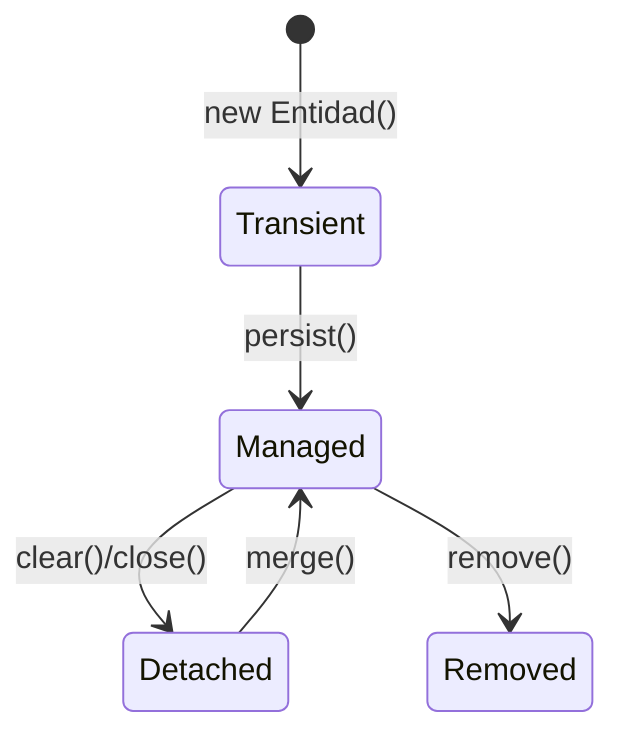
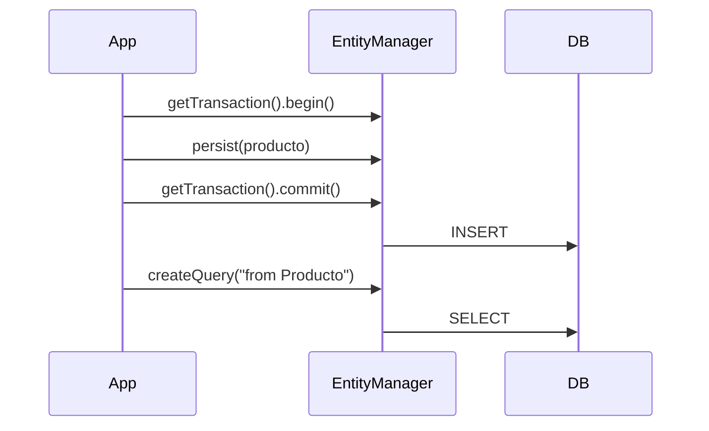

# Bloque XII · Spring Data JPA / Hibernate (core)

> JPA mapea objetos ↔ tablas. Hibernate es la implementación. Acceso a Datos
> (DAM2) RA3 vive aquí. Aprendes el núcleo con `EntityManager` (lo que Spring
> Data usa por debajo).

---

## 12.1 Entidad ↔ tabla

```mermaid
classDiagram
    class Producto {
        <<@Entity>>
        +@Id Long id
        +@Column String nombre
        +double precio
    }
    Producto --> "tabla PRODUCTO" : mapea
```

## 12.2 El EntityManager y el ciclo



## 12.3 Persistir y consultar



## 12.4 JPQL vs SQL nativo

JPQL trabaja con **entidades** (`SELECT p FROM Producto p`), no con tablas.
El SQL nativo va directo a la base.

---

### Qué practicarás

Mapeo de entidad, generación de id, CRUD estilo repositorio, query methods,
JPQL, SQL nativo, modificaciones masivas, callbacks de ciclo de vida, enums y
embeddables, contexto de persistencia, identidad de entidades y proyección a DTO.
Los tests usan un EntityManagerFactory **aislado con H2 en memoria**.


## Teoría Extendida y Ejemplos de Código

### 1. Anotaciones Base
```java
@Entity
@Table(name = "productos")
public class Producto {
    
    @Id
    @GeneratedValue(strategy = GenerationType.IDENTITY)
    private Long id;
    
    @Column(nullable = false, length = 100, unique = true)
    private String sku;
    
    // Hibernate se encarga de llamar a este método
    @PrePersist
    public void onCreate() {
        this.fechaCreacion = LocalDateTime.now();
    }
}
```

### 2. Repositorios Mágicos (Derived Queries)
JPA parsea el nombre del método para generar SQL automáticamente.
```java
public interface ProductoRepository extends JpaRepository<Producto, Long> {
    
    // Genera: SELECT * FROM productos WHERE precio > ? AND stock > 0
    List<Producto> findByPrecioGreaterThanAndStockGreaterThan(BigDecimal precio, int stock);
    
    // Query personalizada en JPQL (orientada a objetos, no tablas)
    @Query("SELECT p FROM Producto p WHERE p.categoria.nombre = :catName")
    List<Producto> buscarPorCategoria(String catName);
}
```

### 3. Contexto de Persistencia (Persistence Context)
Spring guarda en memoria (L1 Cache) los objetos modificados. Si cambias un objeto dentro de una transacción, se hace `UPDATE` automático al acabar, ¡sin llamar a `save()`!
```java
@Transactional
public void subirPrecio(Long id, BigDecimal subida) {
    Producto p = repository.findById(id).orElseThrow();
    p.setPrecio(p.getPrecio().add(subida));
    // No hace falta repository.save(p). Al acabar el método, Hibernate hace el UPDATE.
}
```
