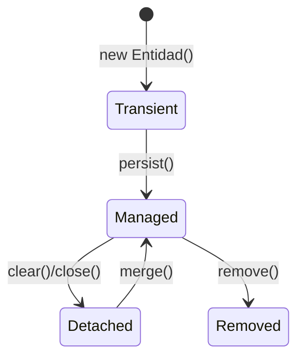
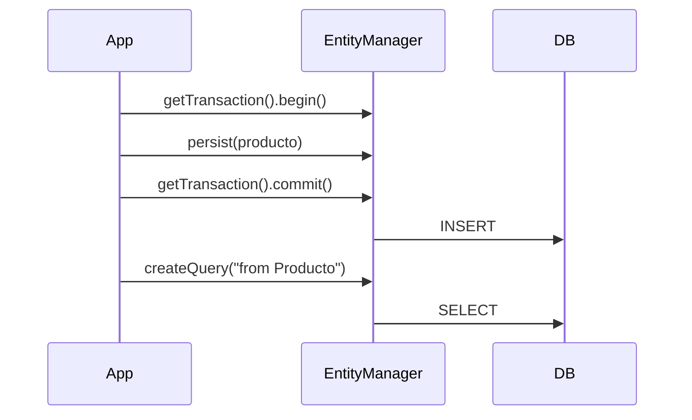

# Bloque XII · Spring Data JPA / Hibernate (core)

> JPA mapea objetos ↔ tablas. Hibernate es la implementación. Acceso a Datos
> (DAM2) RA3 vive aquí. Aprendes el núcleo con `EntityManager` (lo que Spring
> Data usa por debajo).

---

## 12.1 Entidad ↔ tabla

```mermaid
classDiagram
    class Producto {
        <<@Entity>>
        +@Id Long id
        +@Column String nombre
        +double precio
    }
    Producto --> "tabla PRODUCTO" : mapea
```

## 12.2 El EntityManager y el ciclo



## 12.3 Persistir y consultar



## 12.4 JPQL vs SQL nativo

JPQL trabaja con **entidades** (`SELECT p FROM Producto p`), no con tablas.
El SQL nativo va directo a la base.

---

### Qué practicarás

Mapeo de entidad, generación de id, CRUD estilo repositorio, query methods,
JPQL, SQL nativo, modificaciones masivas, callbacks de ciclo de vida, enums y
embeddables, contexto de persistencia, identidad de entidades y proyección a DTO.
Los tests usan un EntityManagerFactory **aislado con H2 en memoria**.
