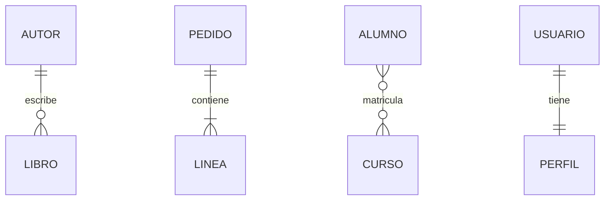
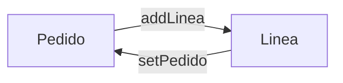
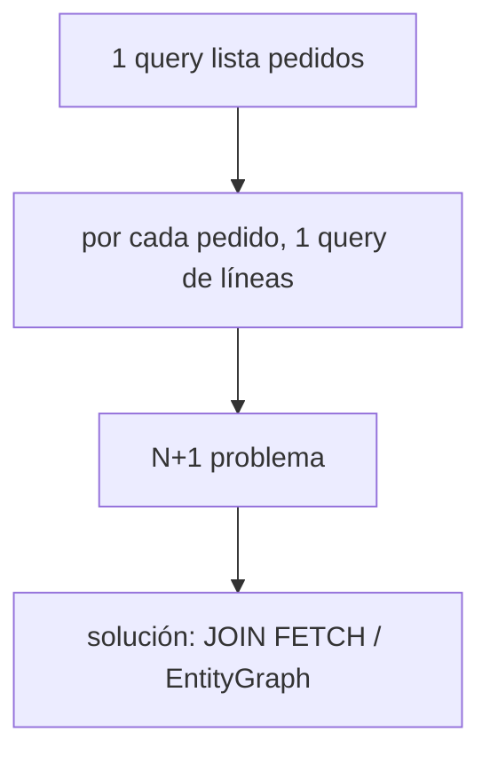

# Bloque XIII · Relaciones JPA

> Las tablas se relacionan con FKs; las entidades, con referencias. JPA traduce
> entre ambos mundos. Aquí está el 80 % de los bugs de persistencia reales.

---

## 13.1 Cardinalidades

| Anotación | Relación |
|---|---|
| `@OneToOne` | 1–1 |
| `@OneToMany` / `@ManyToOne` | 1–N |
| `@ManyToMany` | N–N (tabla intermedia) |

## 13.2 Dueño de la relación

El lado con la FK es el **dueño**. `mappedBy` marca el lado inverso. Hay que
sincronizar AMBOS lados en memoria.

## 13.3 LAZY vs EAGER y N+1

---

### Qué practicarás

@OneToOne, @OneToMany/@ManyToOne, @ManyToMany, sincronización bidireccional,
cascada y orfandad, LAZY/EAGER, diagnóstico N+1 y JOIN FETCH/EntityGraph.
