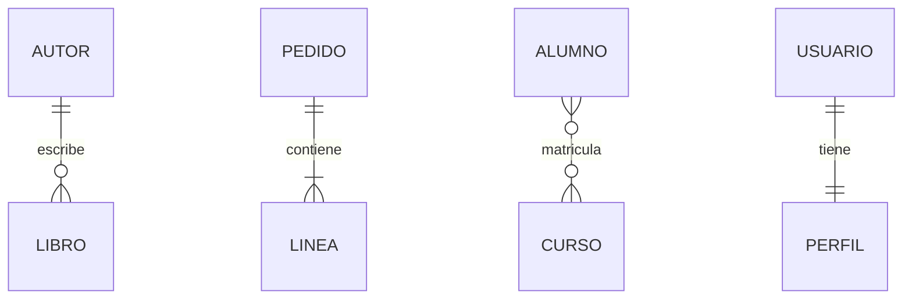
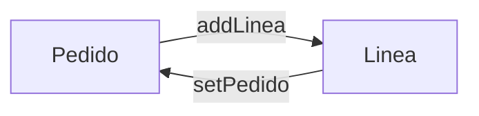
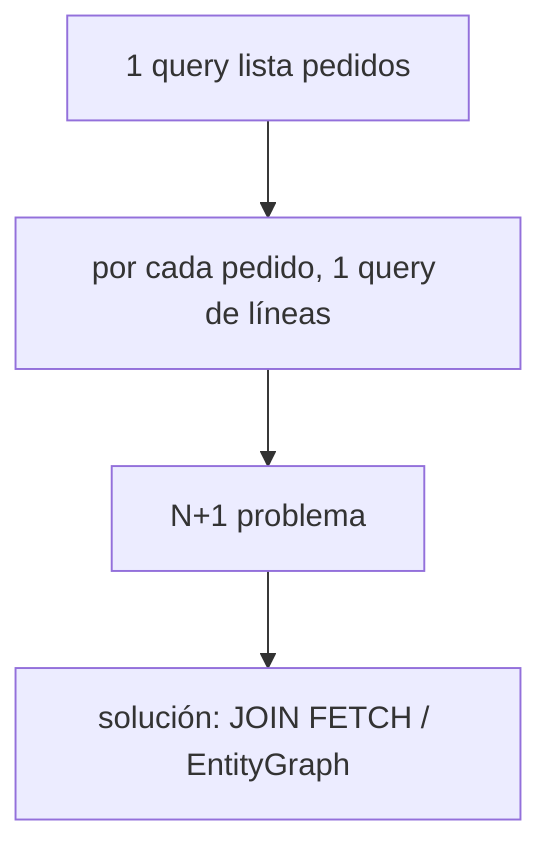

# Bloque XIII · Relaciones JPA

> Las tablas se relacionan con FKs; las entidades, con referencias. JPA traduce
> entre ambos mundos. Aquí está el 80 % de los bugs de persistencia reales.

---

## 13.1 Cardinalidades



| Anotación | Relación |
|---|---|
| `@OneToOne` | 1–1 |
| `@OneToMany` / `@ManyToOne` | 1–N |
| `@ManyToMany` | N–N (tabla intermedia) |

## 13.2 Dueño de la relación

El lado con la FK es el **dueño**. `mappedBy` marca el lado inverso. Hay que
sincronizar AMBOS lados en memoria.



## 13.3 LAZY vs EAGER y N+1



---

### Qué practicarás

@OneToOne, @OneToMany/@ManyToOne, @ManyToMany, sincronización bidireccional,
cascada y orfandad, LAZY/EAGER, diagnóstico N+1 y JOIN FETCH/EntityGraph.


## Teoría Extendida y Ejemplos de Código

### 1. Relación 1-N / N-1 (La más común)
Un Padre (Post) tiene muchos Hijos (Comentarios).
```java
@Entity
public class Post {
    // mappedBy dice que la FK está en Comentario (campo 'post')
    @OneToMany(mappedBy = "post", cascade = CascadeType.ALL, orphanRemoval = true)
    private List<Comentario> comentarios = new ArrayList<>();
    
    // Método utilitario vital para mantener la sincronización bidireccional
    public void addComentario(Comentario c) {
        comentarios.add(c);
        c.setPost(this);
    }
}

@Entity
public class Comentario {
    @ManyToOne(fetch = FetchType.LAZY) // SIEMPRE LAZY!
    @JoinColumn(name = "post_id") // Nombre de la columna FK en BD
    private Post post;
}
```

### 2. LAZY vs EAGER y el problema N+1
- **EAGER**: Carga la relación automáticamente (Haciendo joins o cientos de queries secundarias). Es un anti-patrón. **Evítalo siempre**.
- **LAZY**: Carga la relación solo cuando haces `.getComentarios()`.

**El problema N+1**: Tienes 10 posts. Haces `SELECT * FROM Post`. (1 Query). Luego en Java iteras haciendo `post.getComentarios()`. Hibernate lanzará 10 queries extras (1 por cada post) para cargar los comentarios. Total = 11 queries.
**Solución**: `JOIN FETCH`.
```java
// Trae el Post y sus Comentarios en UNA sola query masiva
@Query("SELECT p FROM Post p JOIN FETCH p.comentarios WHERE p.id = :id")
Optional<Post> buscarConComentarios(Long id);
```
