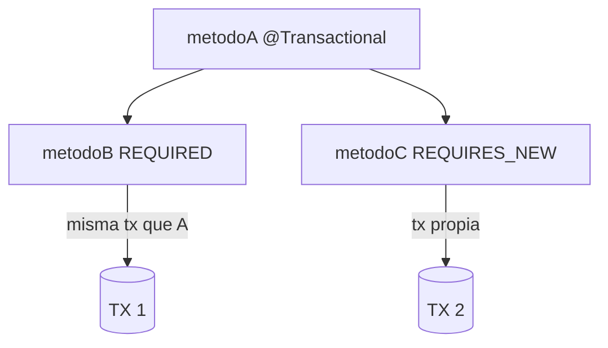
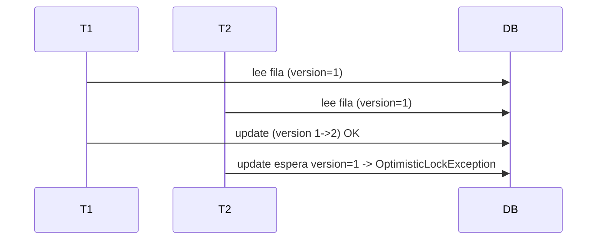
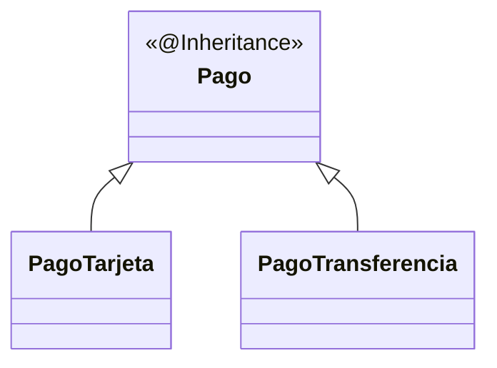

# Bloque XIV · JPA avanzado

> Lo que separa "sé JPA" de "sé JPA en producción": transacciones, bloqueos,
> caché, auditoría, herencia y migraciones de esquema.

---

## 14.1 Propagación de transacciones

## 14.2 Bloqueo optimista vs pesimista

- **Optimista** (`@Version`): no bloquea; falla al confirmar si cambió.
- **Pesimista** (`LockModeType`): bloquea la fila al leer.

## 14.3 Auditoría, soft delete, herencia

## 14.4 Migraciones (Flyway)

`V1__init.sql`, `V2__add_col.sql` versionan el esquema. El código no crea tablas
en producción: lo hacen las migraciones.

---

### Qué practicarás

Propagación, aislamiento, lock optimista/pesimista, caché L2, auditoría,
soft delete, herencia y migraciones (concepto).
