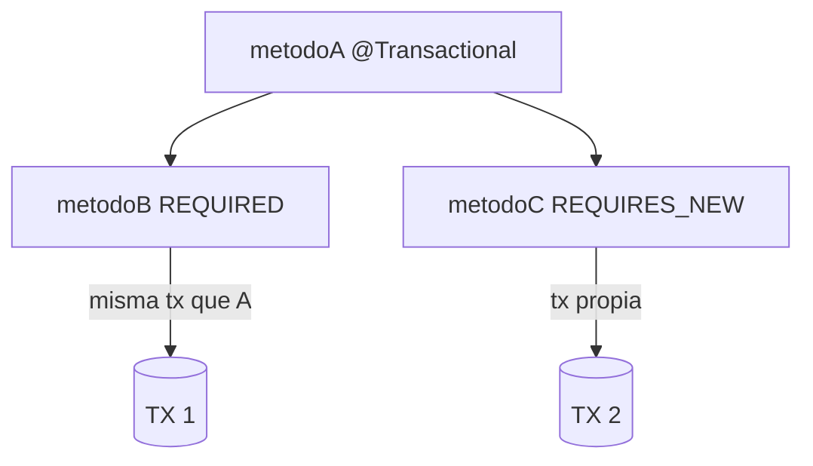
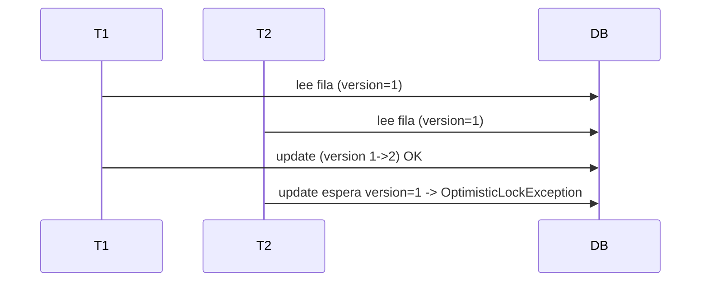
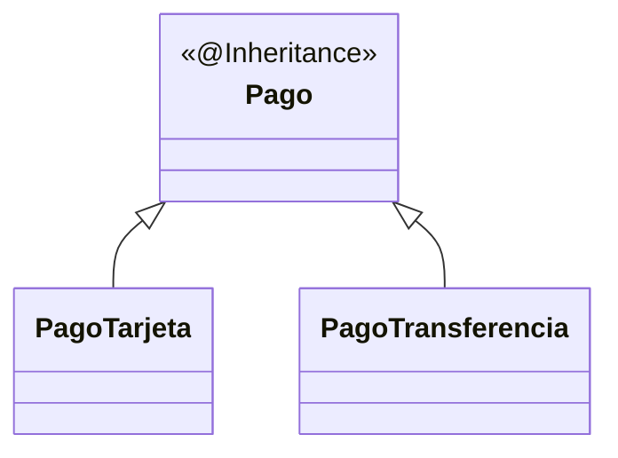

# Bloque XIV · JPA avanzado

> Lo que separa "sé JPA" de "sé JPA en producción": transacciones, bloqueos,
> caché, auditoría, herencia y migraciones de esquema.

---

## 14.1 Propagación de transacciones



## 14.2 Bloqueo optimista vs pesimista



- **Optimista** (`@Version`): no bloquea; falla al confirmar si cambió.
- **Pesimista** (`LockModeType`): bloquea la fila al leer.

## 14.3 Auditoría, soft delete, herencia



## 14.4 Migraciones (Flyway)

`V1__init.sql`, `V2__add_col.sql` versionan el esquema. El código no crea tablas
en producción: lo hacen las migraciones.

---

### Qué practicarás

Propagación, aislamiento, lock optimista/pesimista, caché L2, auditoría,
soft delete, herencia y migraciones (concepto).


## Teoría Extendida y Ejemplos de Código

### 1. Auditoría Automática
No insertes la fecha a mano en todas partes. Usa `@EnableJpaAuditing`.
```java
@Entity
@EntityListeners(AuditingEntityListener.class)
public class Factura {
    @CreatedDate
    @Column(updatable = false)
    private Instant createdAt;

    @LastModifiedDate
    private Instant updatedAt;
    
    @CreatedBy // Inyectado desde el contexto de Spring Security
    private String creador;
}
```

### 2. Bloqueo Optimista (@Version)
Previene que 2 usuarios sobreescriban el mismo registro a la vez (Lost Update).
```java
@Entity
public class AsientoVuelo {
    @Id private Long id;
    private boolean ocupado;
    
    @Version
    private Integer version; // Hibernate lo incrementa en cada UPDATE
}
```
Si Usuario A y B cargan la versión 1, e intentan actualizar a la vez, el primero pasa a versión 2. El segundo fallará con `OptimisticLockException` porque en la BD ya no hay versión 1.

### 3. Borrado Lógico (Soft Delete)
En lugar de borrar de la BD, lo ocultamos.
```java
@Entity
@SQLDelete(sql = "UPDATE usuario SET borrado = true WHERE id=?")
@Where(clause = "borrado = false") // Filtra los queries automáticamente
public class Usuario {
    private boolean borrado = false;
}
```
