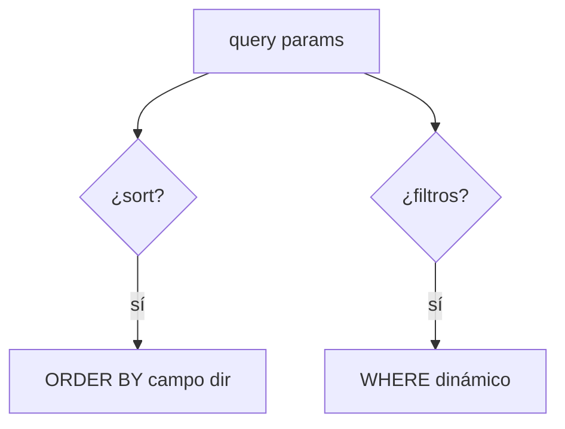

# Bloque XV · Consultas avanzadas

> Una API que devuelve 1M de filas es una API rota. Paginación, filtrado,
> ordenación y proyección son obligatorios en producción.

---

## 15.1 Paginación


`Page` lleva contenido + metadatos (total, nº páginas). `Slice` solo sabe si
hay siguiente (más barato, sin COUNT).

## 15.2 Ordenación y filtrado dinámico



## 15.3 Specifications / Criteria

Construir el WHERE programáticamente y de forma tipada (CriteriaBuilder), en vez
de concatenar JPQL.

## 15.4 Keyset pagination


---

### Qué practicarás

Paginación, ordenación multinivel, Slice vs Page, filtrado dinámico,
Specifications, Criteria API, Query by Example, proyecciones por interfaz,
agregaciones GROUP BY y keyset pagination.


## Teoría Extendida y Ejemplos de Código

### 1. Paginación y Ordenación
No te bajes 100.000 registros a la RAM.
```java
// Controller
@GetMapping
public Page<UsuarioDto> listar(Pageable pageable) {
    // /usuarios?page=0&size=20&sort=nombre,desc
    return repository.findAll(pageable).map(mapper::toDto);
}

// Repository
Page<Usuario> findByEstado(String estado, Pageable pageable);
```

### 2. Filtrado Dinámico (Specifications)
¿Qué pasa si el usuario quiere filtrar por nombre, O por edad, O por ambas, o por nada? Hacer 15 métodos en el Repository es imposible.
```java
public static Specification<Usuario> tieneNombre(String nombre) {
    return (root, query, criteriaBuilder) -> {
        if (nombre == null) return criteriaBuilder.conjunction();
        return criteriaBuilder.like(root.get("nombre"), "%" + nombre + "%");
    };
}

// En el Service
Specification<Usuario> spec = Specification.where(tieneNombre(filtroNombre))
                                           .and(mayorDeEdad(filtroEdad));
List<Usuario> resultados = repository.findAll(spec);
```

### 3. Proyecciones (Solo pedir las columnas necesarias)
Si solo necesitas el nombre, no pidas la entidad entera.
```java
// Interface Projection (Magia de Spring)
public interface UsuarioResumen {
    Long getId();
    String getNombre();
}

// Repository
List<UsuarioResumen> findByEstado(String estado);
```
