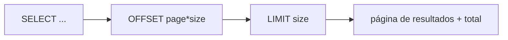
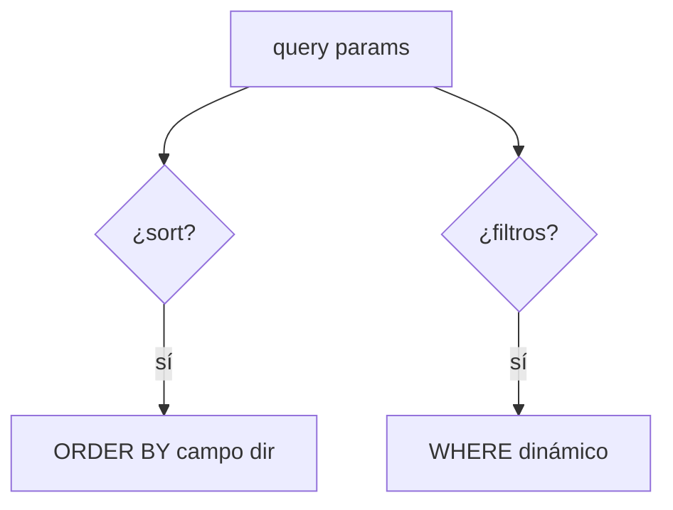
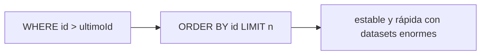

# Bloque XV · Consultas avanzadas

> Una API que devuelve 1M de filas es una API rota. Paginación, filtrado,
> ordenación y proyección son obligatorios en producción.

---

## 15.1 Paginación

`Page` lleva contenido + metadatos (total, nº páginas). `Slice` solo sabe si
hay siguiente (más barato, sin COUNT).

## 15.2 Ordenación y filtrado dinámico

## 15.3 Specifications / Criteria

Construir el WHERE programáticamente y de forma tipada (CriteriaBuilder), en vez
de concatenar JPQL.

## 15.4 Keyset pagination

---

### Qué practicarás

Paginación, ordenación multinivel, Slice vs Page, filtrado dinámico,
Specifications, Criteria API, Query by Example, proyecciones por interfaz,
agregaciones GROUP BY y keyset pagination.
