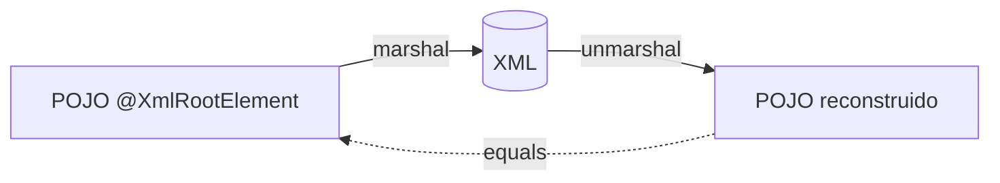
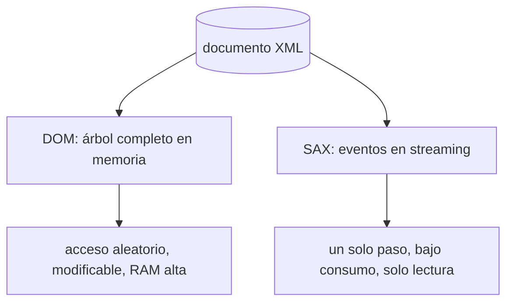
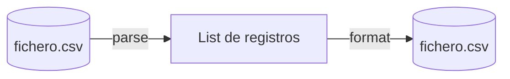

# Bloque XVI · XML y ficheros (AD RA1)

> JSON ganó la web, pero el XML sigue mandando en bancos, sanidad y SOAP.
> Y antes de tener base de datos, el primer "almacén" siempre es un fichero.

---

## 16.1 JAXB: objeto ↔ XML por anotaciones

JAXB (`jakarta.xml.bind`) hace *binding* declarativo: anotas el POJO y un
`Marshaller` lo serializa, un `Unmarshaller` lo reconstruye.

`@XmlRootElement`, `@XmlElement`, `@XmlAttribute`, `@XmlAccessorType` controlan
el mapeo. El *round-trip* (objeto → xml → objeto) debe preservar el estado.

## 16.2 Jackson XML

`XmlMapper` reutiliza las mismas anotaciones que el JSON (`@JsonProperty`) más
las propias (`@JacksonXmlProperty`, `@JacksonXmlElementWrapper`). API idéntica a
`ObjectMapper`: `writeValueAsString` / `readValue`.

## 16.3 DOM vs SAX

DOM carga todo el árbol (consultas con XPath, modificación). SAX dispara
*callbacks* (`startElement`, `characters`, `endElement`): ideal para ficheros
gigantes que no caben en memoria.

## 16.4 Endpoint que produce XML

Un controlador puede negociar contenido: `produces = APPLICATION_XML_VALUE`. La
lógica de serialización se puede aislar en un método puro y testear sin
levantar Spring.

## 16.5 Repositorio respaldado por fichero

Persistir entidades en disco con `java.nio.file`: `Files.write`,
`Files.readAllLines`. Atomicidad básica: escribir a temporal y `move` con
`ATOMIC_MOVE`.

## 16.6 Import / Export CSV (solo JDK)

CSV = líneas + separador. Cuidado con: cabecera, campos con comas/comillas,
líneas vacías, fin de línea. `BufferedReader` para leer, `StringBuilder` o
`Files.write` para exportar.

---

### Qué practicarás

Binding JAXB con marshal/unmarshal y round-trip, serialización con Jackson
`XmlMapper`, parseo DOM vs SAX, exposición de XML desde un endpoint como
función pura, un repositorio CRUD persistido en fichero de texto e
importación/exportación CSV usando solo el JDK.
