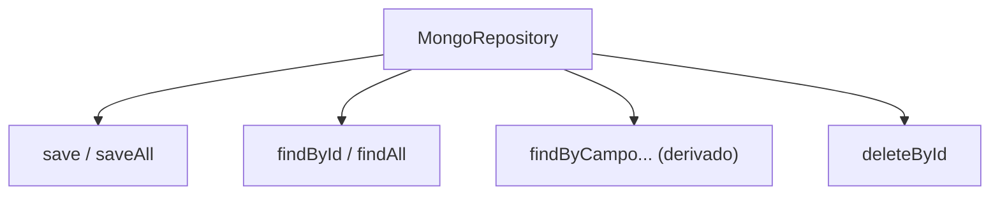
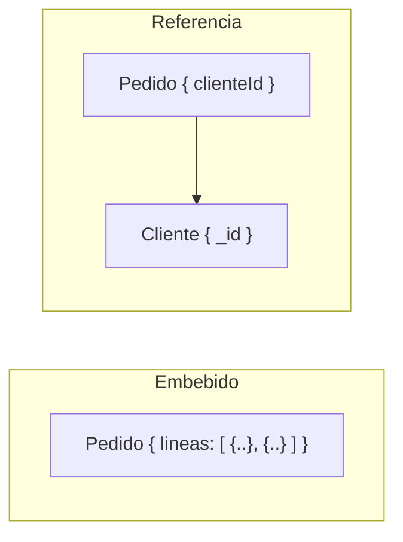

# Bloque XVII · NoSQL / MongoDB

> No todo dato es una tabla. A veces el documento ES el agregado: guárdalo
> entero, léelo de un golpe y deja que la forma de los datos siga a las
> preguntas que les harás.

---

## 17.1 Documentos y mapeo objeto↔documento

En Mongo no hay filas ni columnas: hay **colecciones** de **documentos**
JSON/BSON. Spring Data mapea una clase Java a un documento con `@Document`
(nombre de colección) y `@Id` (clave `_id`).

```mermaid
flowchart LR
    O["objeto Java\n(Pedido)"] -->|@Document / @Id| D["documento BSON\n{ _id, cliente, total }"]
    D -->|deserialización| O
```

El `_id` puede ser un `ObjectId`, un `String` o cualquier valor único. Si no lo
das, Mongo genera un `ObjectId` de 12 bytes (timestamp + máquina + contador).

## 17.2 MongoRepository (CRUD declarativo)

`MongoRepository<T, ID>` da `save`, `findById`, `findAll`, `deleteById` gratis,
y **query methods derivados** del nombre: `findByClienteAndTotalGreaterThan`.



## 17.3 MongoTemplate y Query/Criteria

Cuando el query method no basta, `MongoTemplate` ejecuta `Query` construidas con
`Criteria`: `Criteria.where("total").gte(100)`. Es el equivalente NoSQL a
Criteria API de JPA.

## 17.4 Embebido vs referencias

Decisión de modelado clave:

- **Embebido**: subdocumentos dentro del padre. Una sola lectura, ideal si los
  hijos no se consultan solos y no crecen sin límite.
- **Referencia**: guardas el `id` del otro documento (`@DBRef` o manual). Evita
  duplicación y documentos gigantes, pero exige una segunda consulta o `$lookup`.



## 17.5 Aggregation pipeline

Una tubería de etapas (`$match`, `$group`, `$sort`, `$project`, `$limit`) donde
la salida de una etapa alimenta la siguiente. Es el `GROUP BY` de Mongo, mucho
más potente.

## 17.6 API REST sobre Mongo

El controller no cambia: recibe DTOs, delega en un servicio que usa el
repositorio/template y devuelve `ResponseEntity`. Mongo es solo el almacén.

---

### Qué practicarás

Mapeo `@Document`/`@Id`, CRUD con `MongoRepository`, consultas con
`MongoTemplate` y `Criteria`, decisión embebido vs referencias, pipelines de
agregación (`$match`/`$group`/`$sort`) y exponer documentos por una API REST.
